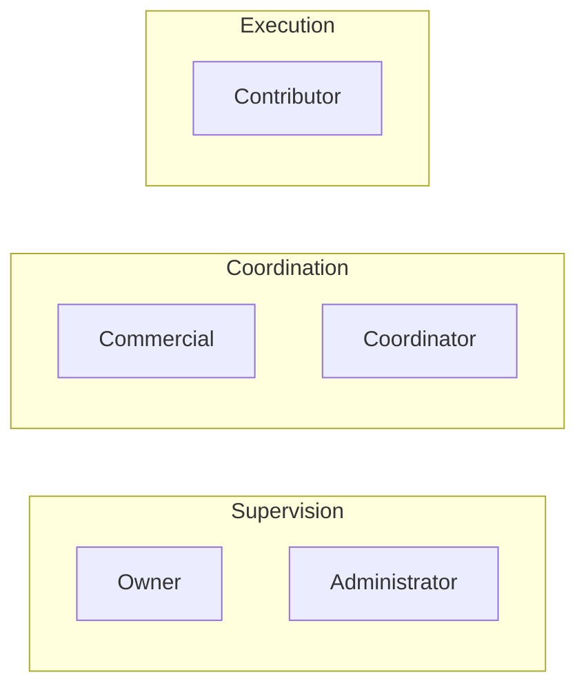

<!-- Generated by SpecStory, Markdown v2.1.0 -->

# 2026-03-28 11:26:13Z

<!-- cursoride Session 483e7b3d-3b1d-4023-a4b5-ea908622319d (2026-03-28 11:26:13Z) -->

_**User**_

Lets also think better, I want a better hyerarchy, simples way of doing things and better desing. So, I want to divide it into sections, on top:

This is a strategic internl documentation for guidance of innerflect. We help companies in aplying solutions that go over this several areas and inside of this documentation we will have the exact formula for that.


High quality and highly professional


Lets start with the first page and updating the docs with what is our backbone. As a way to give a proper clear onboarding experience to this documentation, it should all be easy to understand, visually interesting, also share the colors of innerflect and vibe, have diagrams, symbols, etc

Its also relevant that we will have the following categories of the business, where we get involver and we want to have clear organization:

Strategy, Brand, Marketing, Sales, Product/Service, Operations, Cpstumer, Management

THis should be used by all of our roles (Owner	Top of the hierarchy; only role that gets Failed jobs and Audit log by role check (owner). Full permission set in migrations.
Administrator	Strong access; migrations give view-only on some user/settings areas vs Owner (see doc).
Commercial	Mid tier in hierarchy.
Coordinator	Mid tier in hierarchy.
Contributor	Lower tier in hierarchy.
Investor.          External entity that invests in the business)

Also, this is not fully coherent but you can take most of the branding of innerflect our brand from here :


InnerFlect Positioning and Operating Model
1. Competitive Landscape and Opportunity Space

White Space / Unserved Problems
Most competitors focus on:
Model development
Technical deployment
Isolated AI use cases
Organizations, however, struggle with:
Organizational redesign
Cross-functional workflow integration
Governance and accountability in AI-augmented decision-making
These challenges sit between traditional management consulting and technical implementation—areas without a dominant player.
Opportunity Areas
AI Operating Model Design – Define structures, roles, and escalation paths for AI-assisted decision systems. Currently a short workshop deliverable rather than a core consulting product.
Workflow Ownership & End-to-End Automation – Clients require partners who can manage full business processes rather than isolated components.
Post-Pilot Scaling & Industrialization – Many AI projects stall at proof-of-concept due to lack of operational ownership.
Emerging Category: AI Operations Design & Management
Design AI-enabled operating models
Deploy and integrate agents and models
Operate and continuously optimize systems
Value is measured through operational performance, not advisory deliverables.
2. Strategic Intent and Positioning

Transition: From project-based service provider → partner responsible for design, deployment, and performance of AI-enabled systems.
Strategic Focus
Lifecycle ownership over deliverables
AI embedded into business processes and decision structures
End-to-end workflow integration, governance, and accountability
Quick Wins
Standardized AI operating model prototypes demonstrating measurable performance
Combine technical pilots with workflow diagnostics to identify integration gaps and blockers
Roadmap
Audit workflows and decision processes to identify AI leverage points
Design operating models: roles, escalation paths, governance structures
Implement AI systems into production
Monitor, evaluate, and optimize system performance via KPIs
Commercial Advantage
Recurring revenue through system monitoring, optimization, and evolution
Faster organizational adoption with structured operating models
Differentiation via operational accountability and performance ownership
3. Agency Role in the Future Ecosystem
Role Statement
Innerflect acts as a system architect and operational transformation partner, translating AI capabilities into stable, governable, scalable organizational systems.
Functional Responsibilities
Design decision architectures
Define responsibility boundaries between humans and automated systems
Ensure AI aligns with business objectives and regulatory requirements
Long-Term Vision
The agency functions like an architecture firm: designing, orchestrating, and supervising complex operational systems even when executed by internal or third-party teams.
4. Category Definition and Differentiation

Category: AI Organizational Systems Design and Operations
Design AI-enabled operating models
Integrate them into real business processes
Maintain performance over time
Structural Differentiation
Versus consulting: Delivers working systems, not reports
Versus technical integrators: Focuses on organizational design, decision rights, governance
Versus creative agencies: Value in operational and decision performance, not creative output
Differentiation Pillars
System Lifecycle Ownership – Design, deployment, monitoring, adaptation, retirement
Decision Architecture Design – Structure how decisions are made, automated, audited
Cross-Functional Workflow Integration – Embed AI into end-to-end processes
5. Three-Layer Studio Model

Purpose: Align client progression with agency engagement depth (Core → Strategic → Emergent). Supports experimentation, transformation, and continuous innovation.
Layer 1: Core Systems – Deploy → Use → Scale
Ready-to-deploy tools delivering measurable impact
Entry point and trust builder
Diagnostic tool revealing process fragmentation
Layer 2: Strategic Systems – Reflect → Inflect → Execute
Custom, integrated solutions addressing structural challenges
Embeds AI into workflows, roles, governance
Converts Core Systems success into durable organizational change
Layer 3: Emergent Systems – Think → Shape → Run
Forward-looking, adaptive solutions: autonomous decisions, predictive operations, new AI-enabled services
Builds on Strategic insights, operational data, and real system performance
Positions agency as innovation partner
Layer Interplay
Core → Strategic: Early tools generate insights to justify deeper transformation
Strategic → Emergent: Stabilized workflows enable safe experimentation
Core → Emergent: Core usage may reveal direct opportunities for new systems
Strategic Value
Core: Rapid proof of value
Strategic: Anchors long-term contracts, embeds agency
Emergent: Continuous upsell, innovation, future relevance
6. Brand Foundation

Brand Core
Innerflect converts reflection into functional, adaptive systems. Reflection alone does not create change; innerflection transforms insight into directed, structured action.
Name & Concept
in·ner·flect /ˈɪnərˌflɛkt/
Latin flectere (“to bend, shape”) + English inner (“internal”)
Meaning: Transform internal observation into deliberate structural or functional form
Methodology as Brand Expression
Reflect → Inflect → Execute – Identify, reshape, operationalize
Think → Shape → Run – Alternative for product interfaces, sales, and operational contexts
Integration with Three-Layer Model
Core Systems → tangible demonstration of innerflection
Strategic Systems → organizational and architectural competence
Emergent Systems → innovation and long-term relevance
Lexical Strategy
Focus: system, structure, architecture, flow, signal, emergence
Avoid: generic buzzwords like optimize, digital, automation, AI
7. Claim Architecture – Thinking Systems

Mindset-Oriented Claim
Thinking Systems: dual meaning
Systems that think
Thinking in systems
Supporting Lines
We develop thinking systems, enabling organizational flow
We develop thinking systems, aligning people, processes, and systems
Messaging Hierarchy
Identity: Innerflect — Thinking Systems
Conceptual: We develop thinking systems, enabling flow
Operational: Reflect → Inflect → Execute
Delivery: Core → Strategic → Emergent Systems
Organizational Alignment
Internal decision-making, processes, and knowledge management reflect the same systemic principles delivered to clients
8. Strategic Outcome
Coherent brand and methodology communicate a differentiated worldview
Three-layer structure anchors agency in client operations and AI adoption lifecycle
Shifts value from project delivery to system ownership, governance, and operational performance


---

_**Agent (composer-2)**_

<think><details><summary>Thought Process</summary>

The user wants to plan improvements to their documentation site - specifically the first page and onboarding experience. They want:

1. Better hierarchy, simpler approach, better design
2. Top section with strategic internal documentation messaging for Innerflect
3. High quality, professional
4. Categories: Strategy, Brand, Marketing, Sales, Product/Service, Operations, Customer, Management (they wrote "Cpstumer" - typo for Customer)
5. Role-based audience: Owner, Administrator, Commercial, Coordinator, Contributor, Investor
6. Brand alignment from the detailed positioning they pasted
7. Visual interest, Innerflect colors/vibe, diagrams, symbols

I'm in plan mode - no edits, only research and CreatePlan.

I should explore the existing docs structure (Docusaurus website, docs hubs, branding) per AGENTS.md to align with governance. Let me read relevant files to create an accurate plan.

I'll skip the "using-superpowers" skill read for plan mode since the user explicitly wants a plan - but the hook says to invoke skills. In plan mode I cannot run non-readonly tools - Read is fine. I'll read the repo structure for docs/website and any existing homepage.

Let me search and read in parallel.
</details></think>

_**Agent (composer-2)**_


Exploring the documentation site structure, homepage, and branding so we can plan a coherent first-page and onboarding update.


_**Agent (composer-2)**_

<tool-use data-tool-type="search" data-tool-name="glob_file_search">
<details>
<summary>Tool use: **glob_file_search** • Searched codebase "" • **9** results in **1** directory</summary>

Directory: **/Users/indiasfernandes/Innerflect_Operational_Intelligence_System** (9 files)

| File |
|------|
| `website/docusaurus.config.ts` |
| `website/src/components/HomepageFeatures/index.tsx` |
| `website/README.md` |
| `website/sidebarsOps.ts` |
| `website/sidebars.ts` |
| `website/src/pages/index.tsx` |
| `website/src/components/HomepageFeatures/styles.module.css` |
| `website/src/css/custom.css` |
| `website/src/pages/index.module.css` |

</details>
</tool-use>

<tool-use data-tool-type="search" data-tool-name="glob_file_search"><details>
<summary>Tool use: **glob_file_search**</summary>

</details></tool-use>

_**Agent (composer-2)**_

<tool-use data-tool-type="read" data-tool-name="read_file_v2">
<details><summary>Tool use: **read_file_v2** • Read file: /Users/indiasfernandes/Innerflect_Operational_Intelligence_System/docs/system/repository-map.md</summary>

</details>
</tool-use>

<tool-use data-tool-type="read" data-tool-name="read_file_v2"><details>
<summary>Tool use: **read_file_v2**</summary>

</details></tool-use>

_**Agent (composer-2)**_

<tool-use data-tool-type="search" data-tool-name="glob_file_search">
<details>
<summary>Tool use: **glob_file_search** • Searched codebase "" • **2** results in **1** directory</summary>

Directory: **/Users/indiasfernandes/Innerflect_Operational_Intelligence_System** (2 files)

| File |
|------|
| `website/sidebarsOps.ts` |
| `website/sidebars.ts` |

</details>
</tool-use>

<tool-use data-tool-type="search" data-tool-name="glob_file_search"><details>
<summary>Tool use: **glob_file_search**</summary>

</details></tool-use>

_**Agent (composer-2)**_

<think><details><summary>Thought Process</summary>

Let me read the homepage index.tsx, custom.css, docusaurus.config.ts, docs/index.md, getting-started, and sidebars to understand current state.
</details></think>

_**Agent (composer-2)**_


_**Agent (composer-2)**_

<tool-use data-tool-type="read" data-tool-name="read_file_v2">
<details><summary>Tool use: **read_file_v2** • Read file: /Users/indiasfernandes/Innerflect_Operational_Intelligence_System/website/src/pages/index.tsx</summary>

</details>
</tool-use>

<tool-use data-tool-type="read" data-tool-name="read_file_v2"><details>
<summary>Tool use: **read_file_v2**</summary>

</details></tool-use>

_**Agent (composer-2)**_

<tool-use data-tool-type="read" data-tool-name="read_file_v2">
<details><summary>Tool use: **read_file_v2** • Read file: /Users/indiasfernandes/Innerflect_Operational_Intelligence_System/website/src/css/custom.css</summary>

</details>
</tool-use>

<tool-use data-tool-type="read" data-tool-name="read_file_v2"><details>
<summary>Tool use: **read_file_v2**</summary>

</details></tool-use>

_**Agent (composer-2)**_

<tool-use data-tool-type="read" data-tool-name="read_file_v2">
<details><summary>Tool use: **read_file_v2** • Read file: /Users/indiasfernandes/Innerflect_Operational_Intelligence_System/website/docusaurus.config.ts</summary>

</details>
</tool-use>

<tool-use data-tool-type="read" data-tool-name="read_file_v2"><details>
<summary>Tool use: **read_file_v2**</summary>

</details></tool-use>

_**Agent (composer-2)**_

<tool-use data-tool-type="read" data-tool-name="read_file_v2">
<details><summary>Tool use: **read_file_v2** • Read file: /Users/indiasfernandes/Innerflect_Operational_Intelligence_System/docs/index.md</summary>

</details>
</tool-use>

<tool-use data-tool-type="read" data-tool-name="read_file_v2"><details>
<summary>Tool use: **read_file_v2**</summary>

</details></tool-use>

_**Agent (composer-2)**_

<tool-use data-tool-type="read" data-tool-name="read_file_v2">
<details><summary>Tool use: **read_file_v2** • Read file: /Users/indiasfernandes/Innerflect_Operational_Intelligence_System/website/sidebars.ts</summary>

</details>
</tool-use>

<tool-use data-tool-type="read" data-tool-name="read_file_v2"><details>
<summary>Tool use: **read_file_v2**</summary>

</details></tool-use>

_**Agent (composer-2)**_

<think><details><summary>Thought Process</summary>

Let me read HomepageFeatures, index.module.css, docs/getting-started, and check if there's existing brand assets or role documentation.
</details></think>

_**Agent (composer-2)**_


_**Agent (composer-2)**_

<tool-use data-tool-type="read" data-tool-name="read_file_v2">
<details><summary>Tool use: **read_file_v2** • Read file: /Users/indiasfernandes/Innerflect_Operational_Intelligence_System/website/src/components/HomepageFeatures/index.tsx</summary>

</details>
</tool-use>

<tool-use data-tool-type="read" data-tool-name="read_file_v2"><details>
<summary>Tool use: **read_file_v2**</summary>

</details></tool-use>

_**Agent (composer-2)**_

<tool-use data-tool-type="read" data-tool-name="read_file_v2">
<details><summary>Tool use: **read_file_v2** • Read file: /Users/indiasfernandes/Innerflect_Operational_Intelligence_System/website/src/pages/index.module.css</summary>

</details>
</tool-use>

<tool-use data-tool-type="read" data-tool-name="read_file_v2"><details>
<summary>Tool use: **read_file_v2**</summary>

</details></tool-use>

_**Agent (composer-2)**_

<tool-use data-tool-type="read" data-tool-name="read_file_v2">
<details><summary>Tool use: **read_file_v2** • Read file: /Users/indiasfernandes/Innerflect_Operational_Intelligence_System/docs/getting-started/index.md</summary>

</details>
</tool-use>

<tool-use data-tool-type="read" data-tool-name="read_file_v2"><details>
<summary>Tool use: **read_file_v2**</summary>

</details></tool-use>

_**Agent (composer-2)**_

<tool-use data-tool-type="read" data-tool-name="read_file_v2">
<details><summary>Tool use: **read_file_v2** • Read file: /Users/indiasfernandes/Innerflect_Operational_Intelligence_System/docs/system/taxonomy.md</summary>

</details>
</tool-use>

<tool-use data-tool-type="read" data-tool-name="read_file_v2"><details>
<summary>Tool use: **read_file_v2**</summary>

</details></tool-use>

_**Agent (composer-2)**_

<think><details><summary>Thought Process</summary>

I have a good picture. The user wants:

1. **Landing page (homepage)** - strategic intro, professional, Innerflect branding (not generic Docusaurus green), diagrams/symbols
2. **docs/index.md** - backbone/onboarding with clear hierarchy
3. **Business categories** - Strategy, Brand, Marketing, Sales, Product/Service, Operations, Customer, Management - need to map to navigation/taxonomy
4. **Roles** - Owner, Administrator, Commercial, Coordinator, Contributor, Investor - audience guidance

Current state:
- Homepage uses default hero + 3 generic undraw illustrations
- Colors are generic green (#2e8555) - need Innerflect palette (user didn't provide hex codes - they said "share the colors of innerflect" from brand doc - the pasted doc doesn't have hex colors; I should note we need brand tokens or derive from logo)
- Taxonomy has: Development, Marketing, Branding, Project management, Sales, Operations - user wants 8 categories including Strategy, Product/Service, Customer, Management - some overlap/merge needed

I should check ops/02_playbooks folder structure and README for alignment.

Also check docs-and-site-sync for what must be updated together.

For plan mode I'll ask if they have official brand colors/typography OR we infer from logo - critical for implementation.

Let me list ops/02_playbooks and read playbook index.
</details></think>

_**Agent (composer-2)**_


_**Agent (composer-2)**_

<tool-use data-tool-type="search" data-tool-name="glob_file_search">
<details>
<summary>Tool use: **glob_file_search** • Searched codebase "" • **7** results in **1** directory</summary>

Directory: **/Users/indiasfernandes/Innerflect_Operational_Intelligence_System/ops/02_playbooks** (7 files)

| File |
|------|
| `sales/README.md` |
| `project-management/README.md` |
| `marketing/README.md` |
| `operations/README.md` |
| `README.md` |
| `branding/README.md` |
| `development/README.md` |

</details>
</tool-use>

<tool-use data-tool-type="search" data-tool-name="glob_file_search"><details>
<summary>Tool use: **glob_file_search**</summary>

</details></tool-use>

_**Agent (composer-2)**_

<tool-use data-tool-type="read" data-tool-name="read_file_v2">
<details><summary>Tool use: **read_file_v2** • Read file: /Users/indiasfernandes/Innerflect_Operational_Intelligence_System/docs/playbooks/index.md</summary>

</details>
</tool-use>

<tool-use data-tool-type="read" data-tool-name="read_file_v2"><details>
<summary>Tool use: **read_file_v2**</summary>

</details></tool-use>

_**Agent (composer-2)**_

<tool-use data-tool-type="read" data-tool-name="read_file_v2">
<details><summary>Tool use: **read_file_v2** • Read file: /Users/indiasfernandes/Innerflect_Operational_Intelligence_System/website/static/img/logo.svg</summary>

</details>
</tool-use>

<tool-use data-tool-type="read" data-tool-name="read_file_v2"><details>
<summary>Tool use: **read_file_v2**</summary>

</details></tool-use>

_**Agent (composer-2)**_

<think><details><summary>Thought Process</summary>

The logo is still the default Docusaurus logo (green #3ECC5F). So "Innerflect colors" may need to come from brand guidelines the user will provide, or we derive a palette from future brand assets.

Key planning decisions:

1. **Homepage (`website/src/pages/index.tsx`)** - Redesign with:
   - Strategic banner text (user's paragraph)
   - Visual hierarchy: positioning, three-layer model (diagram - Mermaid in React might need a component or static SVG)
   - Docusaurus supports Mermaid in MDX but homepage is TSX - could use `@theme/Mermaid` or embed SVG, or a section linking to docs intro with Mermaid

2. **docs/index.md** - Restructure as "backbone" onboarding:
   - Clear sections: purpose, who it's for (roles), how to navigate by business area (8 categories)
   - Map 8 categories to existing folders: Strategy (new or merge?), Brand=branding, Marketing, Sales, Product/Service (new - might map to development + PM?), Operations, Customer (new), Management (new?)

   Current playbook folders: development, marketing, branding, project-management, sales, operations (6)

   User's 8: Strategy, Brand, Marketing, Sales, Product/Service, Operations, Customer, Management

   This is an IA decision - either:
   - **Docs-only taxonomy** on index (navigation labels) that maps to existing ops folders (many-to-one)
   - **Expand ops/02_playbooks** with new folders (bigger change, needs governance)

   AGENTS.md says extend existing before parallel - so prefer a **business-facing map** on docs home that routes to current canonical structure, with notes for future playbook categories.

3. **Roles** - New doc section or table: Owner, Administrator, Commercial, Coordinator, Contributor, Investor - link to permissions doc if exists. Grep for migrations/role.
</details></think>

_**Agent (composer-2)**_


_**Agent (composer-2)**_

<tool-use data-tool-type="unknown" data-tool-name="ripgrep_raw_search">
<details>
<summary>Tool use: **ripgrep_raw_search**</summary>


Parameters:

```json
{
  "caseInsensitive": false,
  "glob": "*.{md,rb,ts}",
  "path": "/Users/indiasfernandes/Innerflect_Operational_Intelligence_System",
  "pattern": "Owner|Administrator|Commercial|Coordinator|Contributor|Investor"
}
```
Additional data:

```json
{
  "isPruned": true,
  "outputMode": "content",
  "path": "/Users/indiasfernandes/Innerflect_Operational_Intelligence_System",
  "pattern": "Owner|Administrator|Commercial|Coordinator|Contributor|Investor",
  "topFiles": [
    {
      "matchCount": 9,
      "uri": "./.specstory/history/2026-03-28_11-26-13Z-internal-documentation-structure-and-design.md"
    },
    {
      "matchCount": 2,
      "uri": "./.specstory/history/2026-03-28_08-38-07Z-deployment-prompt-structure-discussion.md"
    },
    {
      "matchCount": 1,
      "uri": "./ops/03_templates/decision-log-template.md"
    },
    {
      "matchCount": 2,
      "uri": "./ops/03_templates/project-handoff-template.md"
    },
    {
      "matchCount": 1,
      "uri": "./ops/03_templates/README.md"
    },
    {
      "matchCount": 1,
      "uri": "./ops/03_templates/audit-template.md"
    },
    {
      "matchCount": 1,
      "uri": "./ops/02_playbooks/development/repo-bootstrap.md"
    },
    {
      "matchCount": 1,
      "uri": "./ops/05_examples/clean-audit-output-example.md"
    },
    {
      "matchCount": 1,
      "uri": "./ops/00_governance/contribution-rules.md"
    },
    {
      "matchCount": 1,
      "uri": "./ops/02_playbooks/project-management/client-intake.md"
    }
  ],
  "totalFiles": 10,
  "totalMatches": 20
}
```
Status: **completed**


</details>
</tool-use>

<tool-use data-tool-type="unknown" data-tool-name="ripgrep_raw_search"><details>
<summary>Tool use: **ripgrep_raw_search**</summary>

</details></tool-use>

_**Agent (composer-2)**_

<think><details><summary>Thought Process</summary>

No app migrations in this repo for roles - the user is describing roles from their product (maybe another codebase). The doc should describe audience by role without requiring a migration doc in-repo.

I'll plan:
- Add `docs/system/audience-and-roles.md` or a section in getting-started for **documentation audience** mapped to these roles (what each should read first) - single source for onboarding
- Business categories as a **visual IA** on docs home + optional `docs/system/business-areas.md` linking to playbook hubs

1. **Brand colors**: User didn't provide hex - logo is still Docusaurus default. Ask: official brand palette (or approve deriving from a future logo swap)?

2. **8 business categories vs 6 playbook folders**: Confirm mapping - e.g. Strategy → governance + playbooks TBD; Product/Service → development + project-management; Customer → new hub placeholder; Management → operations?

Actually the instructions say ask 1-2 critical questions. The mapping is important for the plan.

Let me formulate:
- **Question A**: Should new playbook categories be created under `ops/02_playbooks/` for Strategy, Product/Service, Customer, Management (requires governance + taxonomy updates), or should phase 1 be **documentation-only** navigation (docs hubs mapping 8 areas → existing 6 folders + "coming soon" stubs)?

- **Question B**: Official Innerflect brand tokens (primary/secondary fonts, hex colors) vs. placeholder refinement of current green theme?

I'll use AskQuestion for these.

Actually re-read the user message - they want "first page" and "updating the docs with what is our backbone". So scope is:
1. Landing page redesign
2. docs/index.md (and possibly getting-started) refresh
3. Clear organization for 8 categories and 6 roles

For implementation:
- **Mermaid** in markdown works in Docusaurus if theme-mermaid is added - let me check package.json
</details></think>

_**Agent (composer-2)**_


_**Agent (composer-2)**_

<tool-use data-tool-type="read" data-tool-name="read_file_v2">
<details><summary>Tool use: **read_file_v2** • Read file: /Users/indiasfernandes/Innerflect_Operational_Intelligence_System/website/package.json</summary>

</details>
</tool-use>

<tool-use data-tool-type="read" data-tool-name="read_file_v2"><details>
<summary>Tool use: **read_file_v2**</summary>

</details></tool-use>

_**Agent (composer-2)**_

<tool-use data-tool-type="read" data-tool-name="read_file_v2">
<details><summary>Tool use: **read_file_v2** • Read file: /Users/indiasfernandes/Innerflect_Operational_Intelligence_System/ops/00_governance/docs-and-site-sync.md</summary>

</details>
</tool-use>

<tool-use data-tool-type="read" data-tool-name="read_file_v2"><details>
<summary>Tool use: **read_file_v2**</summary>

</details></tool-use>

_**Agent (composer-2)**_

<think><details><summary>Thought Process</summary>

No @docusaurus/theme-mermaid in package.json - for Mermaid diagrams in MD files we'd add the theme. Alternatively use static SVG/PNG for homepage and keep diagrams in markdown as code blocks if we add mermaid plugin.

For the plan I'll include:
- Optional `@docusaurus/theme-mermaid` for docs pages with flowcharts (three-layer model, role hierarchy)
- Homepage: React components + CSS variables for brand; custom illustrations or lucide-react if we add dep - user asked for symbols/diagrams - could use inline SVG components to avoid new deps

I'll ask the user one critical question about scope: expand ops playbook folders vs docs-only mapping.

Actually re-reading again - they want "clear organization" for the 8 categories. The minimal coherent approach:
- Add `docs/system/business-areas.md` (or expand taxonomy) with a table: Business area → primary playbook hub(s) → notes
- Update `docs/index.md` with the strategic intro + grid of 8 areas + role table

For categories not covered: Strategy might point to governance + marketing (positioning); Customer might point to operations or a placeholder; Management → operations; Product/Service → development + project-management

I'll put this mapping in the plan as the recommended default and note that adding new `ops/02_playbooks/*` folders is a follow-up if they want 1:1 parity.

**Typo**: User wrote "Cpstumer" → Customer in plan.

**Brand**: Logo is Docusaurus default - recommend replacing `website/static/img/logo.svg` when brand assets arrive; meanwhile derive CSS from a proposed palette (e.g. deep teal + amber accent from "thinking systems" vibe) OR ask for brand PDF/Figma.

I'll use AskQuestion for:
1. Phase 1: docs + site only vs also creating new playbook category folders in ops/
2. Brand assets: do they have official hex codes / logo file to drop in?

Actually the instructions say if I need user input use AskQuestion - 1-2 critical questions.

Critical:
1. **Structural scope**: Should the eight business areas each get a future `ops/02_playbooks/<area>/` folder (large governance change), or is a **single navigation layer** in `docs/` that maps areas to existing playbooks (and placeholders) acceptable for this iteration?

2. **Brand tokens**: Provide official primary/secondary colors and logo, or authorize a **provisional palette** aligned to the narrative (refined in a later pass)?

I'll call AskQuestion with these two.
</details></think>

_**Agent (composer-2)**_


Checking for an existing system overview and how the README frames the product:


_**Agent (composer-2)**_

<tool-use data-tool-type="read" data-tool-name="read_file_v2">
<details><summary>Tool use: **read_file_v2** • Read file: /Users/indiasfernandes/Innerflect_Operational_Intelligence_System/README.md</summary>

</details>
</tool-use>

<tool-use data-tool-type="read" data-tool-name="read_file_v2"><details>
<summary>Tool use: **read_file_v2**</summary>

</details></tool-use>

_**Agent (composer-2)**_

<think><details><summary>Thought Process</summary>

I have enough to create a solid plan. I'll use AskQuestion for the two scope decisions that significantly change the implementation.

Actually re-reading the system reminder - "If you have determined that you will need to ask questions, you should ask them IMMEDIATELY at the start". I already did research. I'll present AskQuestion now before CreatePlan.

Wait - the user might prefer I proceed with a reasonable default in the plan and note "confirm X". The instructions say ask if ambiguous. The two questions are genuinely branching.

I'll use AskQuestion.
</details></think>

_**Agent (composer-2)**_


Two decisions significantly affect scope: whether the eight business areas require new canonical `ops/` folders, and whether official brand assets exist. Asking those now.


_**Agent (composer-2)**_

<tool-use data-tool-type="unknown" data-tool-name="ask_question">
<details>
<summary>Tool use: **ask_question**</summary>


Parameters:

```json
{
  "questions": [
    {
      "id": "ops_scope",
      "options": [
        {
          "id": "docs_nav_only",
          "label": "Docs + site only: add a clear navigation map in docs/ (and homepage) that routes each area to existing playbook hubs/folders, with placeholders or notes where gaps exist (no new ops/02_playbooks folders yet)."
        },
        {
          "id": "full_ops_alignment",
          "label": "Full alignment: add or rename playbook categories under ops/02_playbooks/ to match the 8 areas (larger change: governance, taxonomy, hubs, migration of references)."
        }
      ],
      "prompt": "For the 8 business areas (Strategy, Brand, Marketing, Sales, Product/Service, Operations, Customer, Management), how deep should this iteration go in the repo?"
    },
    {
      "id": "brand_assets",
      "options": [
        {
          "id": "have_assets",
          "label": "I will provide (or already have in repo) official hex colors, font names, and a real Innerflect logo SVG—use those."
        },
        {
          "id": "provisional",
          "label": "Use a provisional palette and styling derived from the brand narrative for now; we will swap in official tokens later."
        }
      ],
      "prompt": "For Innerflect colors, typography, and logo on the site:"
    }
  ],
  "title": "Scope for business areas and brand"
}
```
Additional data:

```json
{
  "currentSelections": {
    "brand_assets": [
      "__freeform_other__"
    ],
    "ops_scope": [
      "__freeform_other__"
    ]
  },
  "freeformTexts": {
    "brand_assets": "I will provide a printscreen in the next prompt to improve",
    "ops_scope": "FOr now we will focus on the main page and after we will develop the rest. We want to create a diagram where we see which person is responsible for each of the areas, with the roles, appart from the investor. we should also have doers and supervicors or smth like that"
  },
  "status": "submitted"
}
```
Result:

```json
{
  "answers": [
    {
      "freeformText": "FOr now we will focus on the main page and after we will develop the rest. We want to create a diagram where we see which person is responsible for each of the areas, with the roles, appart from the investor. we should also have doers and supervicors or smth like that",
      "questionId": "ops_scope"
    },
    {
      "freeformText": "I will provide a printscreen in the next prompt to improve",
      "questionId": "brand_assets"
    }
  ]
}
```
User decision: **accepted**

Status: **completed**


</details>
</tool-use>

<tool-use data-tool-type="unknown" data-tool-name="ask_question"><details>
<summary>Tool use: **ask_question**</summary>

</details></tool-use>

_**Agent (composer-2)**_

<think><details><summary>Thought Process</summary>

The user answered partially:
1. **ops_scope**: They didn't pick A or B from my options - they said focus on main page for now, develop rest later. They want a **diagram** showing which **person/role** is responsible for each business area, with roles (except Investor), and concepts like "doers" and "supervisors".

2. **brand_assets**: They'll provide a screenshot in the next prompt - so provisional for now but they'll refine with screenshot next.

So the plan should:
- **Phase 1 focus**: Homepage + first-page experience (not full ops restructure)
- **Diagram**: RACI-style or matrix: Business areas (8) × Roles (Owner, Admin, Commercial, Coordinator, Contributor) with maybe Investor separate; include "doers" vs "supervisors" dimension - this might mean:
  - Rows: areas
  - Columns: roles
  - Or a layered diagram: supervisors vs doers across areas

I need to interpret "doers and supervisors":
- Could be a secondary axis: each area has supervisory accountability vs execution
- Or role types within Innerflect: some roles are more oversight, some more execution

I'll plan:
- A **responsibility matrix** diagram (Mermaid flowchart or quadrant grid) on the homepage or linked docs page
- Roles from user list minus Investor for the matrix (Investor called out separately as external)
- Map each area to primary accountable role + doer roles - **the user didn't specify actual assignments** - I need to either use placeholder "TBD" with structure or ask them to fill a table

Actually they said "we should have doers and supervisors or smth like that" - so the diagram structure should show:
1. Business areas
2. Org roles
3. A distinction between supervisory vs doing work

This could be:
- **Option A**: Two swimlanes per area: Supervisor | Doer
- **Option B**: RACI matrix (Responsible, Accountable, Consulted, Informed) - heavier
- **Option C**: Simple grid: Area × Role with symbols (e.g. A for accountable, R for responsible)

I'll plan for a **matrix visual** with clear legend, content as **editable table** in markdown so they can fill real assignments - first iteration uses sensible placeholders labeled as examples.

Or - ask one more question? The user deviated from the multiple choice. I'll incorporate their answer into the plan:
- Main page first
- Diagram: roles × areas with doer/supervisor concept
- Brand: wait for screenshot next prompt

I'll CreatePlan with:
1. Homepage redesign (hero with strategic copy, Innerflect positioning summary, CTAs)
2. Visual: CSS custom properties (provisional until screenshot)
3. Diagram component: Mermaid in MDX page OR SVG - for interactive matrix, might need a dedicated `docs/strategic/onboarding.md` with Mermaid, or React component on homepage

**Docusaurus**: Homepage is TSX - Mermaid doesn't run in TSX by default. Options:
- Add `@docusaurus/theme-mermaid` and use a `.mdx` doc as "Strategic overview" linked from home
- Use React + CSS grid for the matrix on homepage (no mermaid on home)
- Convert homepage section to MDX (if supported) - Docusaurus homepage is typically TSX

Best approach: **Strategic backbone page** at `docs/strategic-framework.md` or `docs/index.md` with Mermaid diagrams + tables; **homepage** has hero + teaser + link + simplified visual (CSS grid or static SVG illustration)

For "which person is responsible" - without real data, the plan says: deliver **template matrix** with role rows and area columns, legend for Supervisor (accountability) vs Doer (execution), Investor footnote; **Innerflect fills cells** in a follow-up or we use illustrative example.

I'll also note: user will provide screenshot next - phase 2 extract colors from screenshot.

CreatePlan.
</details></think>

_**Agent (composer-2)**_


Incorporating your focus: prioritize the main page, add a role–area responsibility diagram (supervisor vs doer; exclude Investor from the matrix; call Investor out separately), and defer deeper ops structure. Branding: provisional styling until you share the screenshot.


_**Agent (composer-2)**_

<tool-use data-tool-type="unknown" data-tool-name="create_plan">
<details>
<summary>Tool use: **create_plan**</summary>


Parameters:

```json
{
  "name": "Docs homepage and backbone",
  "overview": "Redesign the Docusaurus landing page and docs entry as a strategic, on-brand onboarding experience: clear positioning copy, provisional Innerflect-aligned styling, and a responsibility diagram mapping business areas to internal roles with a supervisor vs doer distinction—investors called out separately. Deeper taxonomy/ops changes stay out of scope for this iteration.",
  "plan": "# Strategic docs homepage and onboarding backbone\n\n## Context\n\n- Today: default Docusaurus hero ([&#96;website/src/pages/index.tsx&#96;](website/src/pages/index.tsx)), generic green Infima palette ([&#96;website/src/css/custom.css&#96;](website/src/css/custom.css)), Docusaurus placeholder logo ([&#96;website/static/img/logo.svg&#96;](website/static/img/logo.svg)), and a repo-centric [&#96;docs/index.md&#96;](docs/index.md).\n- Goal: **first-page** experience that reads as **strategic internal documentation** for Innerflect—professional tone, **visual hierarchy**, **diagrams/symbols**, and alignment with the positioning you supplied (Thinking Systems, three-layer model, Reflect → Inflect → Execute, differentiation vs consulting/integrators/agencies).\n- **Out of scope for this pass** (per your direction): expanding [&#96;ops/02_playbooks/&#96;](ops/02_playbooks/) to eight folders; full taxonomy rewrites. Those can follow once the shell and diagram are stable.\n\n## Information architecture (content)\n\n### 1. Landing page (&#96;/&#96;)\n\n- **Hero**: Title/subtitle that frame the site as **internal strategic guidance** (not only “repo docs”). Short line: this is where the **operating formula** for how Innerflect applies solutions across functions lives.\n- **Primary CTAs**: Keep “Browse documentation” → &#96;/docs/&#96;; optionally secondary “Canonical playbook tree” → &#96;/ops/&#96; (wording can be more human than “Open Ops”).\n- **Below the fold** (replace generic [&#96;HomepageFeatures&#96;](website/src/components/HomepageFeatures/index.tsx) undraw art):\n  - **Three-layer studio model** (Core → Strategic → Emergent): compact cards or horizontal step strip with one-line each from your brief.\n  - **Method**: **Reflect → Inflect → Execute** and optional **Think → Shape → Run** as secondary line for interfaces/sales.\n  - **Differentiation**: three short bullets (vs consulting / integrators / creative agencies) from your section 4.\n- **Responsibility diagram (teaser)**: A compact visual or summary card that links to the full matrix on &#96;/docs/&#96; (see below). Avoid duplicating the full matrix on the home if it is dense; keep home scannable.\n\n### 2. Docs “backbone” entry ([&#96;docs/index.md&#96;](docs/index.md))\n\nRestructure into stable sections (headings + tables, not a wall of links):\n\n- **Purpose**: Strategic internal documentation; **single place** for methodology and navigation into playbooks.\n- **Business areas** (your eight): Strategy, Brand, Marketing, Sales, Product/Service, Operations, Customer, Management — presented as a **simple grid or table** with “where to go in this repo today” (map to existing hubs: e.g. Brand → [&#96;docs/playbooks/branding/&#96;](docs/playbooks/branding/index.md), Marketing/Sales/Operations as today; Strategy/Customer/Management/Product/Service → explicit links to **closest** existing hubs + one-line “gap” note where no dedicated folder exists yet). This satisfies “clear organization” without renaming &#96;ops/&#96; yet.\n- **Audience by role**: Owner, Administrator, Commercial, Coordinator, Contributor — **Investor** in a short **separate** callout (external; different access expectations; not in the responsibility matrix).\n- **Link** to the detailed responsibility diagram page (next).\n\n### 3. New page: responsibility matrix + diagram\n\nAdd a dedicated doc, e.g. [&#96;docs/system/role-and-area-responsibilities.md&#96;](docs/system/role-and-area-responsibilities.md) (or &#96;docs/strategic/…&#96; if you prefer a new folder — if new folder, update [&#96;docs/system/repository-map.md&#96;](docs/system/repository-map.md) per [&#96;ops/00_governance/docs-and-site-sync.md&#96;](ops/00_governance/docs-and-site-sync.md)).\n\n**Diagram concept** (matches your ask):\n\n- **Axes**: Rows = **8 business areas**; Columns = **roles** (Owner, Administrator, Commercial, Coordinator, Contributor). **Investor**: footnote or sidebar note only.\n- **Supervisor vs doer**: Use a **clear legend** and cell semantics, for example:\n  - **S** = Supervisory accountability (sets direction, approves, escalations)\n  - **D** = Do / execute (hands-on delivery in that area)\n  - **E** = Either participates in governance or execution depending on initiative (optional, only if needed)\n  - Empty = not primary\n\n**Important**: Specific cell assignments are **business decisions**. The implementation should ship a **readable template matrix** (table + optional Mermaid diagram summarizing lanes) with **placeholder or example** cells clearly labeled *example* unless you provide a filled matrix in this PR. You can then replace values in one edit.\n\n**Mermaid**: Add [&#96;@docusaurus/theme-mermaid&#96;](https://docusaurus.io/docs/markdown-features/diagrams) to [&#96;website/package.json&#96;](website/package.json) and register in [&#96;website/docusaurus.config.ts&#96;](website/docusaurus.config.ts) so the matrix page can include a **flow or layered diagram** (e.g. grouped roles: “Supervision” vs “Execution” lanes). Verify with &#96;npm run build&#96; in &#96;website/&#96;.\n\n**Product-specific role details** (Failed jobs, Audit log, Owner-only): If that logic lives in another app/repo, this doc should **not** invent migration details—link to your internal app doc or a short “See product permissions doc” stub. If you later add a canonical markdown here, swap the stub.\n\n## Visual design and branding\n\n- **Provisional palette** in [&#96;website/src/css/custom.css&#96;](website/src/css/custom.css): replace generic green with a **coherent** primary/secondary (e.g. deep teal/slate + restrained accent) that reads “systems / architecture” rather than “generic SaaS green” until you paste official tokens from your **next screenshot**.\n- **Typography**: Use Infima defaults first; optional font import in &#96;custom.css&#96; only if you specify a family with the screenshot.\n- **Logo**: Keep path stable; when you provide assets, replace [&#96;website/static/img/logo.svg&#96;](website/static/img/logo.svg) and tune &#96;--ifm-color-primary&#96; to match.\n- **Homepage layout**: Extend [&#96;website/src/pages/index.module.css&#96;](website/src/pages/index.module.css) and [&#96;website/src/components/HomepageFeatures/styles.module.css&#96;](website/src/components/HomepageFeatures/styles.module.css) (or split new section components) for spacing, subtle background, and iconography—prefer **lightweight** SVG symbols (inline or small files under &#96;website/static/img/&#96;) over heavy stock illustrations to stay “highly professional.”\n\n## Verification and governance\n\n- Run &#96;cd website \u0026\u0026 npm run build&#96; after navigation or new doc paths.\n- If you add a new top-level &#96;docs/&#96; folder: bump [&#96;docs/system/repository-map.md&#96;](docs/system/repository-map.md) and any affected hub index.\n- Do **not** duplicate full playbook bodies into &#96;docs/&#96; per [&#96;AGENTS.md&#96;](AGENTS.md); hubs stay links.\n\n## Follow-up (after this iteration)\n\n- Replace provisional colors/fonts from your screenshot.\n- Fill the responsibility matrix with real **S/D** (or RACI) decisions.\n- Optional: add &#96;docs/playbooks/&#96; hubs for net-new areas when &#96;ops/&#96; folders exist.\n\n&#96;&#96;&#96;mermaid\nflowchart TB\n  subgraph home [Landing page]\n    Hero[Strategic hero + CTAs]\n    Layers[Three-layer + method strip]\n    Teaser[Matrix teaser link]\n  end\n  subgraph docs [Docs backbone]\n    Index[docs/index.md]\n    Matrix[role-and-area-responsibilities.md]\n  end\n  Hero --\u003e Index\n  Teaser --\u003e Matrix\n  Index --\u003e Matrix\n&#96;&#96;&#96;\n",
  "todos": [
    {
      "content": "Redesign index.tsx + HomepageFeatures: strategic copy, three-layer + method + differentiation, CTAs; provisional styling in CSS modules",
      "id": "homepage-content",
      "status": "pending"
    },
    {
      "content": "Update custom.css with provisional Innerflect-aligned tokens; prepare for screenshot-based swap",
      "id": "brand-css",
      "status": "pending"
    },
    {
      "content": "Rewrite docs/index.md: purpose, 8-area navigation map to existing hubs, role audience + Investor callout, link to matrix page",
      "id": "docs-index-backbone",
      "status": "pending"
    },
    {
      "content": "Add docs/system/role-and-area-responsibilities.md with table + S/D legend + Mermaid; wire theme-mermaid in docusaurus.config",
      "id": "matrix-page-mermaid",
      "status": "pending"
    },
    {
      "content": "Update repository-map if new folder; run npm run build in website/",
      "id": "governance-verify",
      "status": "pending"
    }
  ]
}
```
Additional data:

```json
{
  "hasOpenedEditor": true,
  "planUri": "file:///Users/indiasfernandes/.cursor/plans/docs_homepage_and_backbone_6bcc6052.plan.md",
  "reviewData": {
    "isShowingInput": false,
    "selectedOption": "none",
    "status": "Requested"
  }
}
```
Result:

```json
{
  "rejected": {}
}
```
Status: **completed**


</details>
</tool-use>

<tool-use data-tool-type="unknown" data-tool-name="create_plan"><details>
<summary>Tool use: **create_plan**</summary>

</details></tool-use>

---

_**User**_

@/Users/indiasfernandes/.cursor/plans/docs_homepage_and_backbone_6bcc6052.plan.md here are the colors, improve tasks

---

_**Agent (composer-2)**_

<think><details><summary>Thought Process</summary>

The user wants me to update the plan document at the specified path with the brand colors from the screenshot they provided. The image description gave:
- Primary Accent (Gold/Bronze): ~`#C59D73`
- Typography: white on dark
- Background: deep browns, charcoal, soft beiges
- White nav bar, etc.

They want me to improve the tasks in the plan to reflect these concrete colors and the branding guidance from the image description.

I'm in plan mode - I should NOT execute code, but I CAN edit the plan document to iterate on it. The user explicitly asked to update the plan with colors and improve tasks.

Let me read the current plan file and update it with:
1. Specific hex tokens (#C59D73 primary accent, neutrals for dark backgrounds, etc.)
2. Refined todos that reference copying/using the screenshot asset path
3. Typography guidance (bold sans for headlines)
4. Hero imagery approach (nature photography for section headers - optional asset)
5. Innerflect icon as motif

I'll read the plan file first.
</details></think>

_**Agent (composer-2)**_


Reading the plan file and updating it with the brand colors and refined tasks.


_**Agent (composer-2)**_

<tool-use data-tool-type="read" data-tool-name="read_file_v2">
<details><summary>Tool use: **read_file_v2** • Read file: /Users/indiasfernandes/.cursor/plans/docs_homepage_and_backbone_6bcc6052.plan.md</summary>

</details>
</tool-use>

<tool-use data-tool-type="read" data-tool-name="read_file_v2"><details>
<summary>Tool use: **read_file_v2**</summary>

</details></tool-use>

_**Agent (composer-2)**_

<think><details><summary>Thought Process</summary>

I need to update the plan to:
1. Replace "provisional" / "next screenshot" language with the actual brand tokens from the user's image
2. Add a dedicated "Brand tokens (from Innerflect marketing hero)" section with #C59D73, neutrals, white-on-dark, earth-toned vibe
3. Reference the saved screenshot path for optional hero/section imagery - the workspace path is `/Users/indiasfernandes/.cursor/projects/Users-indiasfernandes-Innerflect-Operational-Intelligence-System/assets/Screenshot_2026-03-28_at_19.57.56-5a5516f8-b06d-44e2-9b19-b70a2b4b609c.png` - for the repo we might copy to `website/static/img/` - I'll note that in tasks
4. Improve todos to be more specific:
   - brand-css: implement CSS variables: --ifm-color-primary as bronze #C59D73, dark backgrounds for hero, light text, etc.
   - Maybe split: hero imagery task - copy or derive gradient from brand
   - typography: geometric sans, bold emphasis pattern for key phrases
   - logo: replace placeholder with Innerflect wordmark/icon when asset exported (or use description-based guidance)

5. Update overview to mention earth-toned / bronze palette locked in

6. Remove redundant follow-up "Replace provisional colors" or narrow it to "fine-tune from design file if needed"

I'll edit the plan file directly.
</details></think>

_**Agent (composer-2)**_


Updating the plan with the bronze (#C59D73) palette, earth-toned neutrals, typography and UI patterns from your hero, and more specific implementation tasks.


_**Agent (composer-2)**_

<tool-use data-tool-type="write" data-tool-name="edit_file_v2">

<details><summary>Tool use: **edit_file_v2** • Edit file: /Users/indiasfernandes/.cursor/plans/docs_homepage_and_backbone_6bcc6052.plan.md</summary>

</details>

</tool-use>

<tool-use data-tool-type="write" data-tool-name="edit_file_v2"><details>
<summary>Tool use: **edit_file_v2**</summary>

</details></tool-use>

_**Agent (composer-2)**_

<think><details><summary>Thought Process</summary>

The plan file might live in workspace .cursor/plans - user referenced @/Users/indiasfernandes/.cursor/plans/ - I wrote to that path. Let me check if there's a copy in the workspace that also needs updating - the user_info had workspace at Innerflect_Operational_Intelligence_System. The path I used was under .cursor/plans which is in the user's home .cursor folder.

I should also add a workspace-relative path for the screenshot if it was saved under the project - the user message said image was saved to:
`/Users/indiasfernandes/.cursor/projects/Users-indiasfernandes-Innerflect-Operational-Intelligence-System/assets/Screenshot_2026-03-28_at_19.57.56-5a5516f8-b06d-44e2-9b19-b70a2b4b609c.png`

I'll fix the plan link - I used `assets/...` relative which might be wrong. Let me read what I wrote and fix to full path or workspace path.

Actually I linked `[assets/Screenshot_...]` which won't resolve from repo root. Better: say "screenshot saved under project assets (see Cursor assets folder)" and task says copy to website/static/img/ for the committed build.

I'll update the plan to fix the screenshot path to the actual saved file path for the implementer.
</details></think>

_**Agent (composer-2)**_


Fixing the screenshot reference to the actual saved asset path.


_**Agent (composer-2)**_

<tool-use data-tool-type="write" data-tool-name="edit_file_v2">

<details><summary>Tool use: **edit_file_v2** • Edit file: /Users/indiasfernandes/.cursor/plans/docs_homepage_and_backbone_6bcc6052.plan.md</summary>

</details>

</tool-use>

<tool-use data-tool-type="write" data-tool-name="edit_file_v2"><details>
<summary>Tool use: **edit_file_v2**</summary>

</details></tool-use>

_**Agent (composer-2)**_

<think><details><summary>Thought Process</summary>

If there's a duplicate plan in the workspace I should update it - user might have both. Let me glob for the same plan name in workspace.
</details></think>

_**Agent (composer-2)**_


_**Agent (composer-2)**_

<tool-use data-tool-type="search" data-tool-name="glob_file_search">
<details>
<summary>Tool use: **glob_file_search** • Searched codebase "" • **0** results in **1** directory</summary>

Directory: **/Users/indiasfernandes/Innerflect_Operational_Intelligence_System** (0 files)

</details>
</tool-use>

<tool-use data-tool-type="search" data-tool-name="glob_file_search"><details>
<summary>Tool use: **glob_file_search**</summary>

</details></tool-use>

_**Agent (composer-2)**_

<think><details><summary>Thought Process</summary>

Plan only in .cursor/plans. Good.

Summarize for the user what changed.
</details></think>

_**Agent (composer-2)**_


Here’s what changed in [docs_homepage_and_backbone_6bcc6052.plan.md](/Users/indiasfernandes/.cursor/plans/docs_homepage_and_backbone_6bcc6052.plan.md):

### Brand section (concrete colors)
- **Primary accent:** `#C59D73` (bronze/sandstone) for primary buttons, focus, key borders, accents on dark UI.
- **Surfaces:** Dark charcoals (`#1a1816`–`#2d2a26`), white/off-white text on dark, light `#faf9f7`/white for doc body.
- **Secondary CTAs:** Ghost style (outline in white or bronze), aligned with the marketing hero.
- **Vibe / typography:** Grounded, geometric sans; **bold** for emphasized headline phrases; optional nature imagery for sections later.
- **Screenshot:** Implementers should **copy a crop** from your saved hero into `website/static/img/` (e.g. `hero-innerflect.jpg`) so the build does not depend on Cursor-only paths.

### Tasks (split and sharpened)
1. **brand-tokens-css** — Full bronze scale + Infima `--ifm-color-primary*` mapping + dark-mode tuning in the same family.
2. **homepage-hero-layout** — Photo + overlay, headline hierarchy, bronze primary + ghost secondary, optional scroll cue.
3. **homepage-sections** — Three-layer + method + differentiation; bronze accents; no generic undraw.
4. **theme-navbar-footer** — Navbar/footer behavior (light bar vs hero), bronze hovers, logo swap when SVG exists.
5. **docs-index-backbone** — Unchanged intent, shorter label.
6. **matrix-page-mermaid** — Table + Mermaid + package wiring in one task.
7. **governance-verify** — Build + repository-map.

### Overview + follow-up
- Overview now says **marketing-aligned palette** instead of “provisional until screenshot.”
- Follow-up is narrowed to **official SVG/font** and **matrix fill**, not re-deriving colors.

When you want this implemented in the repo, say to execute the plan (or “implement it”).

---

_**User**_

Implement the plan as specified, it is attached for your reference. Do NOT edit the plan file itself.

To-do's from the plan have already been created. Do not create them again. Mark them as in_progress as you work, starting with the first one. Don't stop until you have completed all the to-dos.

---

_**Agent (composer-2)**_

<think><details><summary>Thought Process</summary>

The user wants me to implement the plan for the strategic docs homepage and onboarding backbone. I need to:

1. Mark todos as in_progress and completed as I work through them
2. Implement all the items from the plan without editing the plan file

Let me start by marking the first todo as in_progress and implementing brand tokens in custom.css.

The todos are:
1. brand-tokens-css - custom.css with bronze palette
2. homepage-hero-layout - hero with image, CTAs, etc.
3. homepage-sections - Replace HomepageFeatures
4. theme-navbar-footer - navbar/footer
5. docs-index-backbone - rewrite docs/index.md
6. matrix-page-mermaid - new doc + theme-mermaid
7. governance-verify - repository-map + npm run build

I'll need to:
1. Copy the hero image from the assets folder to website/static/img/
2. Update custom.css extensively
3. Update index.tsx, HomepageFeatures, index.module.css
4. Possibly swizzle or use CSS for navbar/footer - Docusaurus custom CSS might need theme customization
5. Update docs/index.md
6. Add role-and-area-responsibilities.md
7. Add @docusaurus/theme-mermaid to package.json and docusaurus.config.ts
8. Update repository-map.md if needed

Let me start by reading the current files and the screenshot path, then implement.

I'll also need to check if there's a way to style the footer with bronze hovers via custom.css targeting .footer classes.

For navbar - the plan says light bar optional OR translucent on hero. The homepage might need a custom wrapper - I could add a class to body via client module or use CSS that targets only the home page. In Docusaurus, the root has class `homepage` or we can check - actually the home page uses Layout from theme - I might need to add `wrapperClassName` to Layout in index.tsx.

Let me read Docusaurus Layout props - Layout can take `wrapperClassName` to add custom class to wrapper.

I'll start working through the implementation.
</details></think>

_**Agent (composer-2)**_


Implementing the plan: starting with brand tokens in `custom.css`, then the homepage, docs, matrix page, and verification.


_**Agent (composer-2)**_

<tool-use data-tool-type="unknown" data-tool-name="todo_write">
<details>
<summary>Tool use: **todo_write**</summary>


Parameters:

```json
{
  "merge": true
}
```
Result:

```json
{
  "finalTodos": [
    {
      "content": "Redesign index.tsx + HomepageFeatures: strategic copy, three-layer + method + differentiation, CTAs; provisional styling in CSS modules",
      "id": "homepage-content",
      "status": "pending"
    },
    {
      "content": "Update custom.css with provisional Innerflect-aligned tokens; prepare for screenshot-based swap",
      "id": "brand-css",
      "status": "pending"
    },
    {
      "content": "Rewrite docs/index.md: purpose, 8-area navigation map to existing hubs, role audience + Investor callout, link to matrix page",
      "id": "docs-index-backbone",
      "status": "pending"
    },
    {
      "content": "Add docs/system/role-and-area-responsibilities.md with table + S/D legend + Mermaid; wire theme-mermaid in docusaurus.config",
      "id": "matrix-page-mermaid",
      "status": "pending"
    },
    {
      "content": "Update repository-map if new folder; run npm run build in website/",
      "id": "governance-verify",
      "status": "pending"
    },
    {
      "content": "Implement brand tokens in custom.css",
      "id": "brand-tokens-css",
      "status": "in_progress"
    }
  ],
  "initialTodos": [
    {
      "content": "Implement brand tokens in custom.css: primary accent #C59D73 (buttons, links, focus); dark neutrals for hero/sections (#1a1816–#2d2a26 range + charcoal); text on dark = white/off-white; light surfaces for doc body; map --ifm-color-primary* to bronze scale; dark mode tuned to same family",
      "id": "brand-tokens-css",
      "status": "pending"
    },
    {
      "content": "Hero: full-width moody background (copy hero screenshot or coastal image into website/static/img/hero-innerflect.jpg, CSS overlay for readability); headline + subline hierarchy (bold key phrases like marketing site); primary CTA solid bronze + white text, secondary ghost outline; optional scroll cue",
      "id": "homepage-hero-layout",
      "status": "pending"
    },
    {
      "content": "Replace HomepageFeatures: three-layer model strip, Reflect→Inflect→Execute, differentiation bullets; use bronze for accents/dividers; lightweight SVG or icon motif (Thinking Systems) — avoid generic undraw",
      "id": "homepage-sections",
      "status": "pending"
    },
    {
      "content": "Align Layout wrapper / navbar: light bar optional (match white nav pattern) OR translucent-on-hero; footer dark charcoal with bronze link hovers; logo path website/static/img — replace placeholder SVG with Innerflect mark when vector asset exists",
      "id": "theme-navbar-footer",
      "status": "pending"
    },
    {
      "content": "Rewrite docs/index.md: strategic purpose, 8-area table → existing hubs + gaps, roles + Investor callout, link to matrix",
      "id": "docs-index-backbone",
      "status": "pending"
    },
    {
      "content": "Add docs/system/role-and-area-responsibilities.md: S/D legend, template table (8×5 roles), Investor note; Mermaid lane/summary diagram; theme-mermaid in docusaurus.config + package.json",
      "id": "matrix-page-mermaid",
      "status": "pending"
    },
    {
      "content": "repository-map if new paths; npm run build in website/",
      "id": "governance-verify",
      "status": "pending"
    }
  ],
  "success": true,
  "wasMerge": true
}
```
Status: **completed**


</details>
</tool-use>

<tool-use data-tool-type="unknown" data-tool-name="todo_write"><details>
<summary>Tool use: **todo_write**</summary>

</details></tool-use>

_**Agent (composer-2)**_

<tool-use data-tool-type="read" data-tool-name="read_file_v2">
<details><summary>Tool use: **read_file_v2** • Read file: /Users/indiasfernandes/Innerflect_Operational_Intelligence_System/website/src/css/custom.css</summary>

</details>
</tool-use>

<tool-use data-tool-type="read" data-tool-name="read_file_v2"><details>
<summary>Tool use: **read_file_v2**</summary>

</details></tool-use>

_**Agent (composer-2)**_

<tool-use data-tool-type="read" data-tool-name="read_file_v2">
<details><summary>Tool use: **read_file_v2** • Read file: /Users/indiasfernandes/Innerflect_Operational_Intelligence_System/website/src/pages/index.tsx</summary>

</details>
</tool-use>

<tool-use data-tool-type="read" data-tool-name="read_file_v2"><details>
<summary>Tool use: **read_file_v2**</summary>

</details></tool-use>

_**Agent (composer-2)**_

<tool-use data-tool-type="read" data-tool-name="read_file_v2">
<details><summary>Tool use: **read_file_v2** • Read file: /Users/indiasfernandes/Innerflect_Operational_Intelligence_System/website/docusaurus.config.ts</summary>

</details>
</tool-use>

<tool-use data-tool-type="read" data-tool-name="read_file_v2"><details>
<summary>Tool use: **read_file_v2**</summary>

</details></tool-use>

_**Agent (composer-2)**_

<tool-use data-tool-type="search" data-tool-name="glob_file_search">
<details>
<summary>Tool use: **glob_file_search** • Searched codebase "" • **0** results in **1** directory</summary>

Directory: **/Users/indiasfernandes/.cursor/projects/Users-indiasfernandes-Innerflect-Operational-Intelligence-System** (0 files)

</details>
</tool-use>

<tool-use data-tool-type="search" data-tool-name="glob_file_search"><details>
<summary>Tool use: **glob_file_search**</summary>

</details></tool-use>

_**Agent (composer-2)**_

<think><details><summary>Thought Process</summary>

The screenshot might be in a different path. Let me search for the image in the workspace and user's assets.
</details></think>

_**Agent (composer-2)**_


_**Agent (composer-2)**_

<tool-use data-tool-type="search" data-tool-name="glob_file_search">
<details>
<summary>Tool use: **glob_file_search** • Searched codebase "" • **0** results in **1** directory</summary>

Directory: **/Users/indiasfernandes/Innerflect_Operational_Intelligence_System** (0 files)

</details>
</tool-use>

<tool-use data-tool-type="search" data-tool-name="glob_file_search"><details>
<summary>Tool use: **glob_file_search**</summary>

</details></tool-use>

_**Agent (composer-2)**_

<tool-use data-tool-type="read" data-tool-name="read_file_v2">
<details><summary>Tool use: **read_file_v2** • Read file: /Users/indiasfernandes/Innerflect_Operational_Intelligence_System/website/src/components/HomepageFeatures/index.tsx</summary>

</details>
</tool-use>

<tool-use data-tool-type="read" data-tool-name="read_file_v2"><details>
<summary>Tool use: **read_file_v2**</summary>

</details></tool-use>

_**Agent (composer-2)**_

<tool-use data-tool-type="read" data-tool-name="read_file_v2">
<details><summary>Tool use: **read_file_v2** • Read file: /Users/indiasfernandes/Innerflect_Operational_Intelligence_System/website/src/components/HomepageFeatures/styles.module.css</summary>

</details>
</tool-use>

<tool-use data-tool-type="read" data-tool-name="read_file_v2"><details>
<summary>Tool use: **read_file_v2**</summary>

</details></tool-use>

_**Agent (composer-2)**_

<tool-use data-tool-type="read" data-tool-name="read_file_v2">
<details><summary>Tool use: **read_file_v2** • Read file: /Users/indiasfernandes/Innerflect_Operational_Intelligence_System/docs/index.md</summary>

</details>
</tool-use>

<tool-use data-tool-type="read" data-tool-name="read_file_v2"><details>
<summary>Tool use: **read_file_v2**</summary>

</details></tool-use>

_**Agent (composer-2)**_

<think><details><summary>Thought Process</summary>

The screenshot isn't in the workspace repo - I'll use a CSS gradient + optional background-image URL that can point to hero-innerflect.jpg. I'll copy from the user's path if it exists using run_terminal_cmd.

Let me try: ls /Users/indiasfernandes/.cursor/projects/Users-indiasfernandes-Innerflect-Operational-Intelligence-System/assets/

If the file exists, cp to website/static/img/hero-innerflect.jpg or .png

Also I need to cancel the duplicate todos from the old list - the user said todos were created. I see there's homepage-content, brand-css etc. mixed with brand-tokens-css. I'll mark the plan todos complete and use the IDs from the plan:
- brand-tokens-css
- homepage-hero-layout
- homepage-sections
- theme-navbar-footer
- docs-index-backbone
- matrix-page-mermaid
- governance-verify

The merge showed old ids too - I'll work through the plan's 7 todos.

Let me copy the image if possible.
</details></think>

_**Agent (composer-2)**_


_**Agent (composer-2)**_

<tool-use data-tool-type="shell" data-tool-name="run_terminal_command_v2">
<details><summary>Tool use: **run_terminal_command_v2** • Run command: ls -la "/Users/indiasfernandes/.cursor/projects/Users-indiasfernandes-Innerflect-Operational-Intelligence-System/assets/" 2>/dev/null || ls -la "/Users/indiasfernandes/Innerflect_Operational_Intelligence_System/website/static/img/" 2>/dev/null</summary>

```bash
ls -la "/Users/indiasfernandes/.cursor/projects/Users-indiasfernandes-Innerflect-Operational-Intelligence-System/assets/" 2>/dev/null || ls -la "/Users/indiasfernandes/Innerflect_Operational_Intelligence_System/website/static/img/" 2>/dev/null
```

```
total 256
drwxr-xr-x@ 3 indiasfernandes  staff      96 Mar 28 19:59 .
drwxr-xr-x@ 7 indiasfernandes  staff     224 Mar 28 19:59 ..
-rw-r--r--@ 1 indiasfernandes  staff  127739 Mar 28 19:59 Screenshot_2026-03-28_at_19.57.56-5a5516f8-b06d-44e2-9b19-b70a2b4b609c.png

```
</details>
</tool-use>

<tool-use data-tool-type="shell" data-tool-name="run_terminal_command_v2"><details>
<summary>Tool use: **run_terminal_command_v2**</summary>

</details></tool-use>

_**Agent (composer-2)**_

<think><details><summary>Thought Process</summary>

I need to copy the PNG to the workspace - sandbox might block copying from .cursor to workspace. I'll use cp with 'all' permissions if needed.

Actually the workspace is Innerflect_Operational_Intelligence_System - I need to copy to website/static/img/hero-innerflect.png
</details></think>

_**Agent (composer-2)**_


_**Agent (composer-2)**_

<tool-use data-tool-type="shell" data-tool-name="run_terminal_command_v2">
<details><summary>Tool use: **run_terminal_command_v2** • Run command: cp "/Users/indiasfernandes/.cursor/projects/Users-indiasfernandes-Innerflect-Operational-Intelligence-System/assets/Screenshot_2026-03-28_at_19.57.56-5a5516f8-b06d-44e2-9b19-b70a2b4b609c.png" "/Users/indiasfernandes/Innerflect_Operational_Intelligence_System/website/static/img/hero-innerflect.png"</summary>

```bash
cp "/Users/indiasfernandes/.cursor/projects/Users-indiasfernandes-Innerflect-Operational-Intelligence-System/assets/Screenshot_2026-03-28_at_19.57.56-5a5516f8-b06d-44e2-9b19-b70a2b4b609c.png" "/Users/indiasfernandes/Innerflect_Operational_Intelligence_System/website/static/img/hero-innerflect.png"
```
</details>
</tool-use>

<tool-use data-tool-type="shell" data-tool-name="run_terminal_command_v2"><details>
<summary>Tool use: **run_terminal_command_v2**</summary>

</details></tool-use>

_**Agent (composer-2)**_

<think><details><summary>Thought Process</summary>

Good. Now implement custom.css with full brand tokens, then homepage, HomepageFeatures replacement, navbar/footer CSS, docusaurus config with mermaid, new doc, update docs/index.md, repository-map.

For Docusaurus 3.9 mermaid - I need to add @docusaurus/theme-mermaid and configure theme:

From docs:
```
themes: ['@docusaurus/theme-mermaid'],
```

And in config:
```
import type * as Preset from '@docusaurus/preset-classic';

const config = {
  themeConfig: {
    mermaid: {
      theme: { light: 'neutral', dark: 'forest' },
    },
  } satisfies Preset.ThemeConfig,
};
```

Actually for Mermaid in markdown files, the classic preset might need the theme. Let me check Docusaurus 3 mermaid setup.

https://docusaurus.io/docs/markdown-features/diagrams

```
npm install --save @docusaurus/theme-mermaid
```

```ts
export default {
  themes: ['@docusaurus/theme-mermaid'],
  markdown: {
    mermaid: true,
  },
};
```

I'll add themes array to config.

Also markdown format is 'md' - need mermaid: true in markdown config.

Let me verify the API for docusaurus 3.9.2

From docusaurus docs:
```
module.exports = {
  markdown: {
    mermaid: true,
  },
  themes: ['@docusaurus/theme-mermaid'],
};
```

I'll add the dependency via npm install in website/

For the homepage:
- Layout wrapperClassName="homepage-root" or similar
- Hero with background image url(/img/hero-innerflect.png)
- Update tagline in docusaurus.config for better strategic copy - plan says hero content in the page itself, can override title in HomepageHeader

I'll update siteConfig tagline or use custom strings in index.tsx for the hero.

Content for hero:
- Strategic internal documentation framing
- Bold phrases in h1

Example:
h1: Innerflect Ops — **Strategic** internal **guidance**
Or: Where **operating clarity** meets **canonical playbooks**

Actually plan says: "Strategic internal framing + operating formula"

I'll use:
Title: Innerflect Ops (from config) or full custom
Subtitle: Strategic internal documentation for how we apply solutions across Strategy, Brand, Marketing, Sales, Product, Operations, Customer, and Management — the operating formula lives here.

Hero h1 could be multi-line with strong tags.

Let me implement custom.css comprehensively.

Bronze scale:
- Primary #C59D73
- darker: #a67f56, #8b6845
- lighter: #d4b896, #e8dcc8

For --ifm-color-primary variants map appropriately.

Also add styles for:
- .homepage-root .navbar - could make navbar white with dark text on homepage only
- footer.footer--dark with charcoal bg and bronze links

I'll use:
```css
:root {
  --if-brand-bronze: #C59D73;
  --if-bg-hero-overlay: rgba(26, 24, 22, 0.65);
  --if-bg-deep: #1a1816;
  --if-bg-charcoal: #2d2a26;
  --if-text-on-dark: #ffffff;
  --if-text-muted-on-dark: rgba(255, 255, 255, 0.85);
  --if-surface-light: #faf9f7;
}
```

And map --ifm-color-primary to bronze.

For doc pages, background could be --if-surface-light on html or main.

I'll add:
```css
html {
  --ifm-background-color: var(--if-surface-light);
}
```

Actually default might break - let me only set for docs wrapper. Infima uses --ifm-background-color.

I'll set :root with --ifm-color-primary* as bronze scale.

Dark mode [data-theme='dark'] - use bronze that stays readable, slightly lighter gold for primary.

Implement HomepageFeatures as new sections:
1. Three layers: Core, Strategic, Emergent - 3 columns
2. Method: Reflect → Inflect → Execute
3. Differentiation bullets
4. Matrix teaser with Link to /docs/system/role-and-area-responsibilities

I'll create a simple SVG icon component inline for "thinking systems" - small geometric motif - or use unicode symbols.

Let me also add index.module.css for hero full width with background-image.

Structure:
```tsx
<Layout wrapperClassName="homepage-root" ...>
  <header className={styles.heroBanner} style={{backgroundImage: `url(${useBaseUrl('img/hero-innerflect.png')})`}}>
```

useBaseUrl from @docusaurus/useBaseUrl

Hero overlay in CSS ::before pseudo for darkening

Buttons:
- primary: button with custom class or button--primary - Infima primary is now bronze
- secondary: outline white

I'll add className={styles.buttonPrimary} etc. or use button button--primary button--lg for primary (should pick up bronze)

Let me update docusaurus tagline to something shorter for meta description; hero can have longer text.

I'll also add footer link to the matrix page in docusaurus.config.

Implement role-and-area-responsibilities.md with frontmatter, table 8x5, example cells, mermaid diagram.

For mermaid in .md files - the docs use format: 'md' - need to enable mermaid in markdown config.

Let me check - if I use ```mermaid block in .md, does it work with theme-mermaid?

Yes with markdown.mermaid: true

I'll also add sidebar_position for the new doc - need to check system folder order. repository-map is 21, taxonomy 22 - I'll use sidebar_position: 15.5 or 20 - actually use 19 for role page between index and getting-started. Looking at docs - index is 1, getting-started 10. I'll put role page at 12.

Read docs/system/index.md for position
</details></think>

_**Agent (composer-2)**_


_**Agent (composer-2)**_

<tool-use data-tool-type="read" data-tool-name="read_file_v2">
<details><summary>Tool use: **read_file_v2** • Read file: /Users/indiasfernandes/Innerflect_Operational_Intelligence_System/docs/system/index.md</summary>

</details>
</tool-use>

<tool-use data-tool-type="read" data-tool-name="read_file_v2"><details>
<summary>Tool use: **read_file_v2**</summary>

</details></tool-use>

_**Agent (composer-2)**_

<tool-use data-tool-type="read" data-tool-name="read_file_v2">
<details><summary>Tool use: **read_file_v2** • Read file: /Users/indiasfernandes/Innerflect_Operational_Intelligence_System/docs/system/repository-map.md</summary>

</details>
</tool-use>

<tool-use data-tool-type="read" data-tool-name="read_file_v2"><details>
<summary>Tool use: **read_file_v2**</summary>

</details></tool-use>

_**Agent (composer-2)**_

<think><details><summary>Thought Process</summary>

I'll add role-and-area-responsibilities.md with sidebar_position: 19 (before system index 20) or put it inside system with position 19.5 - Docusaurus might need integer. Use 18.

Update system/index.md table to include the new page.

I'll run npm install @docusaurus/theme-mermaid in website/

Let me write all files.

For Layout - wrapperClassName for homepage only - I need to pass it to Layout. This will let me style .homepage-root .navbar__inner with white background.

Actually the default navbar might be primary colored - with our CSS --ifm-navbar-background-color we can set to white on homepage.

```css
.homepage-root .navbar {
  background: #fff;
  box-shadow: 0 1px 0 rgba(0,0,0,0.06);
}
.homepage-root .navbar__link {
  color: var(--ifm-font-color-base);
}
```

But other pages should keep default - actually plan says doc pages light with bronze accents. So navbar could be white globally for brand consistency - like marketing site.

I'll set global navbar to white/light with dark text and bronze hover for links.

```css
.navbar {
  background-color: #ffffff;
  border-bottom: 1px solid rgba(0,0,0,0.06);
}
.navbar__link--active {
  color: var(--ifm-color-primary);
}
```

Footer dark with bronze links - themeConfig already has style: 'dark'. I'll override footer background to #1a1816 and links to bronze on hover.

Let me implement custom.css fully.

Also need to fix todo list - cancel duplicate old todos if any and use plan todo ids.

I'll write custom.css, then index.tsx + index.module.css, then HomepageFeatures (might rename content to HomepageSections or keep component name but change implementation), then docusaurus config, new md file, update docs/index.md, system/index.md, repository-map, package.json install mermaid theme.

For HomepageFeatures - I'll replace with new structure in the same file or split components - keep one file for simplicity.

Let me also add a small ThinkingSystemsIcon.svg in static/img - simple symmetrical lines.

I'll create a minimal SVG for the motif.

Implementation of matrix table - 8 areas x 5 roles with placeholder "—" or "Example: ..." in a few cells.

Mermaid diagram - flowchart showing Supervision lane vs Execution lane - simplified.



Or a simpler diagram for role hierarchy.

Plan asked for "lane/summary diagram" - I'll do a horizontal flow: Owner -> Admin -> Commercial/Coordinator -> Contributor

Let me implement.
</details></think>

_**Agent (composer-2)**_


Implementing `custom.css` and homepage components. Installing `@docusaurus/theme-mermaid`.


_**Agent (composer-2)**_

<tool-use data-tool-type="shell" data-tool-name="run_terminal_command_v2">
<details><summary>Tool use: **run_terminal_command_v2** • Run command: cd /Users/indiasfernandes/Innerflect_Operational_Intelligence_System/website && npm install @docusaurus/theme-mermaid@3.9.2</summary>

```bash
cd /Users/indiasfernandes/Innerflect_Operational_Intelligence_System/website && npm install @docusaurus/theme-mermaid@3.9.2
```

```

added 127 packages, and audited 1416 packages in 30s

425 packages are looking for funding
  run &#96;npm fund&#96; for details

found 0 vulnerabilities

```
</details>
</tool-use>

<tool-use data-tool-type="shell" data-tool-name="run_terminal_command_v2"><details>
<summary>Tool use: **run_terminal_command_v2**</summary>

</details></tool-use>

_**Agent (composer-2)**_

<tool-use data-tool-type="write" data-tool-name="edit_file_v2">

<details><summary>Tool use: **edit_file_v2** • Edit file: /Users/indiasfernandes/Innerflect_Operational_Intelligence_System/website/src/css/custom.css</summary>

</details>

</tool-use>

<tool-use data-tool-type="write" data-tool-name="edit_file_v2"><details>
<summary>Tool use: **edit_file_v2**</summary>

</details></tool-use>

_**Agent (composer-2)**_

<think><details><summary>Thought Process</summary>

npm install completed in background - good. Now update docusaurus.config.ts with themes and markdown mermaid, update tagline, footer links.

Create homepage index.tsx with useBaseUrl, new HomepageFeatures content.

Create thinking-motif.svg - simple SVG

index.module.css - hero with background

I'll mark brand-tokens-css complete and start homepage tasks - the plan had split brand-tokens, homepage-hero, homepage-sections, theme-navbar - much of custom.css already covered navbar/footer. I'll mark todos as I go.

Actually the todo list from user might use different IDs - I'll update merge true with the plan ids.

Let me read package.json to confirm mermaid was added, then update docusaurus config.
</details></think>

_**Agent (composer-2)**_


_**Agent (composer-2)**_

<tool-use data-tool-type="read" data-tool-name="read_file_v2">
<details><summary>Tool use: **read_file_v2** • Read file: /Users/indiasfernandes/Innerflect_Operational_Intelligence_System/website/package.json</summary>

</details>
</tool-use>

<tool-use data-tool-type="read" data-tool-name="read_file_v2"><details>
<summary>Tool use: **read_file_v2**</summary>

</details></tool-use>

_**Agent (composer-2)**_

<tool-use data-tool-type="unknown" data-tool-name="todo_write">
<details>
<summary>Tool use: **todo_write**</summary>


Parameters:

```json
{
  "merge": true
}
```
Result:

```json
{
  "finalTodos": [
    {
      "content": "Redesign index.tsx + HomepageFeatures: strategic copy, three-layer + method + differentiation, CTAs; provisional styling in CSS modules",
      "id": "homepage-content",
      "status": "pending"
    },
    {
      "content": "Update custom.css with provisional Innerflect-aligned tokens; prepare for screenshot-based swap",
      "id": "brand-css",
      "status": "pending"
    },
    {
      "content": "Rewrite docs/index.md: purpose, 8-area navigation map to existing hubs, role audience + Investor callout, link to matrix page",
      "id": "docs-index-backbone",
      "status": "pending"
    },
    {
      "content": "Add docs/system/role-and-area-responsibilities.md with table + S/D legend + Mermaid; wire theme-mermaid in docusaurus.config",
      "id": "matrix-page-mermaid",
      "status": "pending"
    },
    {
      "content": "Update repository-map if new folder; run npm run build in website/",
      "id": "governance-verify",
      "status": "pending"
    },
    {
      "content": "Implement brand tokens in custom.css",
      "id": "brand-tokens-css",
      "status": "completed"
    },
    {
      "content": "Hero: full-width moody background, CTAs, scroll cue",
      "id": "homepage-hero-layout",
      "status": "in_progress"
    }
  ],
  "initialTodos": [
    {
      "content": "Redesign index.tsx + HomepageFeatures: strategic copy, three-layer + method + differentiation, CTAs; provisional styling in CSS modules",
      "id": "homepage-content",
      "status": "pending"
    },
    {
      "content": "Update custom.css with provisional Innerflect-aligned tokens; prepare for screenshot-based swap",
      "id": "brand-css",
      "status": "pending"
    },
    {
      "content": "Rewrite docs/index.md: purpose, 8-area navigation map to existing hubs, role audience + Investor callout, link to matrix page",
      "id": "docs-index-backbone",
      "status": "pending"
    },
    {
      "content": "Add docs/system/role-and-area-responsibilities.md with table + S/D legend + Mermaid; wire theme-mermaid in docusaurus.config",
      "id": "matrix-page-mermaid",
      "status": "pending"
    },
    {
      "content": "Update repository-map if new folder; run npm run build in website/",
      "id": "governance-verify",
      "status": "pending"
    },
    {
      "content": "Implement brand tokens in custom.css",
      "id": "brand-tokens-css",
      "status": "in_progress"
    }
  ],
  "success": true,
  "wasMerge": true
}
```
Status: **completed**


</details>
</tool-use>

<tool-use data-tool-type="unknown" data-tool-name="todo_write"><details>
<summary>Tool use: **todo_write**</summary>

</details></tool-use>

_**Agent (composer-2)**_

<think><details><summary>Thought Process</summary>

I need to update docusaurus.config.ts with themes and mermaid. Also update index.tsx, index.module.css, HomepageFeatures.

Let me add the Mermaid theme config - in Docusaurus 3 the config might be:

```typescript
themes: ['@docusaurus/theme-mermaid'],
markdown: {
  format: 'md',
  mermaid: true,
  hooks: {...}
},
```

And themeConfig might need:
```typescript
mermaid: {
  theme: { light: 'neutral', dark: 'dark' },
},
```

Let me check the exact API for 3.9

From docusaurus docs - markdown.mermaid: true enables mermaid code blocks.

I'll update docusaurus.config.ts

Also add footer link to role matrix.

For hero - use useBaseUrl('/img/hero-innerflect.png')

Create the full index.tsx with:
- Layout wrapperClassName="homepage-root"
- Hero with overlay
- Scroll cue at bottom (chevron)

HomepageFeatures - replace with sections:
1. Light section: three-layer model (3 cards)
2. Method strip
3. Differentiation
4. Matrix teaser + docs/ops links

I'll write index.module.css with hero styles, and styles.module.css for features section with light background.

Actually hero should be dark with text on dark - the features section below can be --if-surface-light

Let me write index.tsx completely.
</details></think>

_**Agent (composer-2)**_


Updating `docusaurus.config.ts` and implementing the homepage.


_**Agent (composer-2)**_

<tool-use data-tool-type="write" data-tool-name="edit_file_v2">

<details><summary>Tool use: **edit_file_v2** • Edit file: /Users/indiasfernandes/Innerflect_Operational_Intelligence_System/website/docusaurus.config.ts</summary>

</details>

</tool-use>

<tool-use data-tool-type="write" data-tool-name="edit_file_v2"><details>
<summary>Tool use: **edit_file_v2**</summary>

</details></tool-use>

_**Agent (composer-2)**_

<tool-use data-tool-type="write" data-tool-name="edit_file_v2">

<details><summary>Tool use: **edit_file_v2** • Edit file: /Users/indiasfernandes/Innerflect_Operational_Intelligence_System/website/docusaurus.config.ts</summary>

</details>

</tool-use>

<tool-use data-tool-type="write" data-tool-name="edit_file_v2"><details>
<summary>Tool use: **edit_file_v2**</summary>

</details></tool-use>

_**Agent (composer-2)**_

<tool-use data-tool-type="write" data-tool-name="edit_file_v2">

<details><summary>Tool use: **edit_file_v2** • Edit file: /Users/indiasfernandes/Innerflect_Operational_Intelligence_System/website/docusaurus.config.ts</summary>

</details>

</tool-use>

<tool-use data-tool-type="write" data-tool-name="edit_file_v2"><details>
<summary>Tool use: **edit_file_v2**</summary>

</details></tool-use>

_**Agent (composer-2)**_

<think><details><summary>Thought Process</summary>

Need to check if Preset.ThemeConfig includes mermaid - TypeScript might error. I'll run build later.

Now write index.tsx with hero, useBaseUrl, Layout wrapperClassName

Create motif SVG at website/static/img/thinking-motif.svg - simple symmetrical shape

index.module.css - full hero

HomepageFeatures - complete rewrite
</details></think>

_**Agent (composer-2)**_


_**Agent (composer-2)**_

<tool-use data-tool-type="write" data-tool-name="edit_file_v2">

<details><summary>Tool use: **edit_file_v2** • Edit file: /Users/indiasfernandes/Innerflect_Operational_Intelligence_System/website/static/img/thinking-motif.svg</summary>

</details>

</tool-use>

<tool-use data-tool-type="write" data-tool-name="edit_file_v2"><details>
<summary>Tool use: **edit_file_v2**</summary>

</details></tool-use>

_**Agent (composer-2)**_

<tool-use data-tool-type="write" data-tool-name="edit_file_v2">

<details><summary>Tool use: **edit_file_v2** • Edit file: /Users/indiasfernandes/Innerflect_Operational_Intelligence_System/website/src/pages/index.module.css</summary>

</details>

</tool-use>

<tool-use data-tool-type="write" data-tool-name="edit_file_v2"><details>
<summary>Tool use: **edit_file_v2**</summary>

</details></tool-use>

_**Agent (composer-2)**_

<tool-use data-tool-type="write" data-tool-name="edit_file_v2">

<details><summary>Tool use: **edit_file_v2** • Edit file: /Users/indiasfernandes/Innerflect_Operational_Intelligence_System/website/src/pages/index.tsx</summary>

</details>

</tool-use>

<tool-use data-tool-type="write" data-tool-name="edit_file_v2"><details>
<summary>Tool use: **edit_file_v2**</summary>

</details></tool-use>

_**Agent (composer-2)**_

<think><details><summary>Thought Process</summary>

Add homepage-root CSS for any extra tweaks - the plan wanted navbar on homepage - global navbar is already white in custom.css.

Remove duplicate small subtitle with siteConfig.title - might be redundant. I'll simplify to one line without duplicating title.

Actually let me remove the `<small>{siteConfig.title}</small>` line - it's redundant with navbar.

I'll write HomepageFeatures with all sections.
</details></think>

_**Agent (composer-2)**_


_**Agent (composer-2)**_

<tool-use data-tool-type="write" data-tool-name="edit_file_v2">

<details><summary>Tool use: **edit_file_v2** • Edit file: /Users/indiasfernandes/Innerflect_Operational_Intelligence_System/website/src/components/HomepageFeatures/index.tsx</summary>

</details>

</tool-use>

<tool-use data-tool-type="write" data-tool-name="edit_file_v2"><details>
<summary>Tool use: **edit_file_v2**</summary>

</details></tool-use>

_**Agent (composer-2)**_

<tool-use data-tool-type="write" data-tool-name="edit_file_v2">

<details><summary>Tool use: **edit_file_v2** • Edit file: /Users/indiasfernandes/Innerflect_Operational_Intelligence_System/website/src/components/HomepageFeatures/styles.module.css</summary>

</details>

</tool-use>

<tool-use data-tool-type="write" data-tool-name="edit_file_v2"><details>
<summary>Tool use: **edit_file_v2**</summary>

</details></tool-use>

_**Agent (composer-2)**_

<think><details><summary>Thought Process</summary>

Remove redundant siteConfig line from index.tsx - I already have a thought to remove it

Add custom.css for .homepage-root if needed - optional

Fix index.tsx - remove the duplicate small line

Check themeConfig mermaid - TypeScript might need extension or import

Write docs/system/role-and-area-responsibilities.md with mermaid

Update docs/index.md, system/index.md, repository-map.md

Run build

Fix any lint - useBaseUrl in Motif component - hooks rules - Motif is a function component that uses useBaseUrl - good.

Actually Motif uses useBaseUrl inside - that's fine.

Let me remove duplicate subtitle from index.tsx

For dark mode --ifm-color-emphasis-800 might not exist - Infima has emphasis colors. I'll use a safe fallback or remove.

Let me check - if emphasis doesn't exist, browser might ignore. I'll use simpler color: #4a4540

StrReplace sectionLead color to a variable that exists or #5c5752

I'll run build and fix errors.

Also add CSS variables to custom.css for homepage-root - optional

Todo: homepage-hero-layout done, homepage-sections done, theme-navbar-footer - mostly in custom.css already

Let me add explicit homepage-root navbar tweak if needed - plan said white nav - already global white.

Remove index.tsx small line
</details></think>

_**Agent (composer-2)**_


_**Agent (composer-2)**_

<tool-use data-tool-type="write" data-tool-name="edit_file_v2">

<details><summary>Tool use: **edit_file_v2** • Edit file: /Users/indiasfernandes/Innerflect_Operational_Intelligence_System/website/src/pages/index.tsx</summary>

</details>

</tool-use>

<tool-use data-tool-type="write" data-tool-name="edit_file_v2"><details>
<summary>Tool use: **edit_file_v2**</summary>

</details></tool-use>

_**Agent (composer-2)**_

<tool-use data-tool-type="write" data-tool-name="edit_file_v2">

<details><summary>Tool use: **edit_file_v2** • Edit file: /Users/indiasfernandes/Innerflect_Operational_Intelligence_System/website/src/components/HomepageFeatures/styles.module.css</summary>

</details>

</tool-use>

<tool-use data-tool-type="write" data-tool-name="edit_file_v2"><details>
<summary>Tool use: **edit_file_v2**</summary>

</details></tool-use>

_**Agent (composer-2)**_

<tool-use data-tool-type="write" data-tool-name="edit_file_v2">

<details><summary>Tool use: **edit_file_v2** • Edit file: /Users/indiasfernandes/Innerflect_Operational_Intelligence_System/website/src/components/HomepageFeatures/styles.module.css</summary>

</details>

</tool-use>

<tool-use data-tool-type="write" data-tool-name="edit_file_v2"><details>
<summary>Tool use: **edit_file_v2**</summary>

</details></tool-use>

_**Agent (composer-2)**_

<think><details><summary>Thought Process</summary>

Write role-and-area-responsibilities.md with frontmatter, table, mermaid, investor note, product permissions stub

sidebar_position: 18 (before system index 20)

Update system/index.md with new row

Update repository-map docs section

Check docusaurus ThemeConfig for mermaid - might need to use satisfies with type assertion if mermaid not in type

Run npm run build
</details></think>

_**Agent (composer-2)**_


_**Agent (composer-2)**_

<tool-use data-tool-type="write" data-tool-name="edit_file_v2">

<details><summary>Tool use: **edit_file_v2** • Edit file: /Users/indiasfernandes/Innerflect_Operational_Intelligence_System/docs/system/role-and-area-responsibilities.md</summary>

</details>

</tool-use>

<tool-use data-tool-type="write" data-tool-name="edit_file_v2"><details>
<summary>Tool use: **edit_file_v2**</summary>

</details></tool-use>

_**Agent (composer-2)**_

<tool-use data-tool-type="write" data-tool-name="edit_file_v2">

<details><summary>Tool use: **edit_file_v2** • Edit file: /Users/indiasfernandes/Innerflect_Operational_Intelligence_System/docs/system/index.md</summary>

</details>

</tool-use>

<tool-use data-tool-type="write" data-tool-name="edit_file_v2"><details>
<summary>Tool use: **edit_file_v2**</summary>

</details></tool-use>

_**Agent (composer-2)**_

<tool-use data-tool-type="write" data-tool-name="edit_file_v2">

<details><summary>Tool use: **edit_file_v2** • Edit file: /Users/indiasfernandes/Innerflect_Operational_Intelligence_System/docs/system/repository-map.md</summary>

</details>

</tool-use>

<tool-use data-tool-type="write" data-tool-name="edit_file_v2"><details>
<summary>Tool use: **edit_file_v2**</summary>

</details></tool-use>

_**Agent (composer-2)**_

<think><details><summary>Thought Process</summary>

Now rewrite docs/index.md with full backbone content

Update mermaid diagram - I used subgraph IDs with underscores - mermaid syntax might need quotes for labels with spaces - I used underscores in labels like Supervision_and_governance - good.

Actually Mermaid subgraph [Supervision_and_governance] - the display label might show underscores. Let me use quoted labels: subgraph sup ["Supervision & governance"]

But user said avoid special chars - I'll use simple IDs

Write docs/index.md
</details></think>

_**Agent (composer-2)**_


_**Agent (composer-2)**_

<tool-use data-tool-type="write" data-tool-name="edit_file_v2">

<details><summary>Tool use: **edit_file_v2** • Edit file: /Users/indiasfernandes/Innerflect_Operational_Intelligence_System/docs/index.md</summary>

</details>

</tool-use>

<tool-use data-tool-type="write" data-tool-name="edit_file_v2"><details>
<summary>Tool use: **edit_file_v2**</summary>

</details></tool-use>

_**Agent (composer-2)**_

<think><details><summary>Thought Process</summary>

Run npm run build - check TypeScript for docusaurus mermaid themeConfig

Fix root package-lock if npm was run at root - the install was in website/ so package-lock in website might have updated. Check if root has package-lock - git status showed package-lock.json at root - might need to run from root or only website

Run build in website/

Fix mermaid subgraph - Docusaurus might render - verify no syntax error. Labels with & might need quotes in mermaid - I avoided &

Read lints for edited tsx files

Remove unused siteConfig in HomepageHeader if we removed the line - check index.tsx - siteConfig still used? Only in Home() - HomepageHeader doesn't use siteConfig anymore - good.

Actually HomepageHeader doesn't import siteConfig - I need to verify index.tsx - Home uses siteConfig, HomepageHeader doesn't - good.

Run build
</details></think>

_**Agent (composer-2)**_


_**Agent (composer-2)**_

<tool-use data-tool-type="shell" data-tool-name="run_terminal_command_v2">
<details><summary>Tool use: **run_terminal_command_v2** • Run command: cd /Users/indiasfernandes/Innerflect_Operational_Intelligence_System/website && npm run build</summary>

```bash
cd /Users/indiasfernandes/Innerflect_Operational_Intelligence_System/website && npm run build
```

```

&gt; website@0.0.0 build
&gt; docusaurus build

[INFO] [en] Creating an optimized production build...
[info] [webpackbar] Compiling Client
[info] [webpackbar] Compiling Server
[success] [webpackbar] Server: Compiled successfully in 16.12s
[success] [webpackbar] Client: Compiled successfully in 28.19s
[SUCCESS] Generated static files in "build".
[INFO] Use &#96;npm run serve&#96; command to test your build locally.
[WARNING] Markdown link with URL &#96;taxonomy.md&#96; in source file "../docs/index.md" (70:3) couldn't be resolved.
Make sure it references a local Markdown file that exists within the current plugin.
[WARNING] Markdown link with URL &#96;../README.md&#96; in source file "../docs/index.md" (85:29) couldn't be resolved.
Make sure it references a local Markdown file that exists within the current plugin.
[WARNING] Markdown link with URL &#96;../AGENTS.md&#96; in source file "../docs/index.md" (85:69) couldn't be resolved.
Make sure it references a local Markdown file that exists within the current plugin.
[WARNING] Markdown link with URL &#96;../../ops/00_governance/versioning-and-changelog.md&#96; in source file "../docs/system/taxonomy.md" (42:143) couldn't be resolved.
Make sure it references a local Markdown file that exists within the current plugin.
[WARNING] Markdown link with URL &#96;../../ops/00_governance/naming-conventions.md&#96; in source file "../docs/system/taxonomy.md" (46:3) couldn't be resolved.
Make sure it references a local Markdown file that exists within the current plugin.
[WARNING] Markdown link with URL &#96;../../README.md&#96; in source file "../docs/system/repository-map.md" (14:3) couldn't be resolved.
Make sure it references a local Markdown file that exists within the current plugin.
[WARNING] Markdown link with URL &#96;../../AGENTS.md&#96; in source file "../docs/system/repository-map.md" (15:3) couldn't be resolved.
Make sure it references a local Markdown file that exists within the current plugin.
[WARNING] Markdown link with URL &#96;../../CHANGELOG.md&#96; in source file "../docs/system/repository-map.md" (16:3) couldn't be resolved.
Make sure it references a local Markdown file that exists within the current plugin.
[WARNING] Markdown link with URL &#96;../../ops/README.md&#96; in source file "../docs/system/repository-map.md" (17:3) couldn't be resolved.
Make sure it references a local Markdown file that exists within the current plugin.
[WARNING] Markdown link with URL &#96;../../ops/04_checklists/docs-quality-review.md&#96; in source file "../docs/system/repository-map.md" (60:8) couldn't be resolved.
Make sure it references a local Markdown file that exists within the current plugin.
[WARNING] Markdown link with URL &#96;../../ops/00_governance/docs-and-site-sync.md&#96; in source file "../docs/system/repository-map.md" (61:11) couldn't be resolved.
Make sure it references a local Markdown file that exists within the current plugin.
[WARNING] Markdown link with URL &#96;../../ops/00_governance/docs-and-site-sync.md&#96; in source file "../docs/system/repository-map.md" (67:3) couldn't be resolved.
Make sure it references a local Markdown file that exists within the current plugin.
[WARNING] Markdown link with URL &#96;../../ops/00_governance/docs-and-site-sync.md&#96; in source file "../docs/system/inner-linking-conventions.md" (50:30) couldn't be resolved.
Make sure it references a local Markdown file that exists within the current plugin.
[WARNING] Markdown link with URL &#96;../../ops/00_governance/docs-and-site-sync.md&#96; in source file "../docs/system/inner-linking-conventions.md" (55:3) couldn't be resolved.
Make sure it references a local Markdown file that exists within the current plugin.
[WARNING] Markdown link with URL &#96;../../ops/09_archive/ARCHIVE_POLICY.md&#96; in source file "../docs/archive/index.md" (14:6) couldn't be resolved.
Make sure it references a local Markdown file that exists within the current plugin.
[WARNING] Markdown link with URL &#96;../../ops/00_governance/archiving.md&#96; in source file "../docs/archive/index.md" (14:67) couldn't be resolved.
Make sure it references a local Markdown file that exists within the current plugin.
[WARNING] Markdown link with URL &#96;../../ops/09_archive/README.md&#96; in source file "../docs/archive/index.md" (18:3) couldn't be resolved.
Make sure it references a local Markdown file that exists within the current plugin.
[WARNING] Markdown link with URL &#96;../../ops/00_governance/versioning-and-changelog.md&#96; in source file "../docs/archive/index.md" (22:3) couldn't be resolved.
Make sure it references a local Markdown file that exists within the current plugin.
[WARNING] Markdown link with URL &#96;../../ops/00_governance/avoiding-duplication.md&#96; in source file "../docs/archive/index.md" (23:3) couldn't be resolved.
Make sure it references a local Markdown file that exists within the current plugin.
[WARNING] Markdown link with URL &#96;../../ops/03_templates/playbook-template.md&#96; in source file "../docs/templates/index.md" (14:3) couldn't be resolved.
Make sure it references a local Markdown file that exists within the current plugin.
[WARNING] Markdown link with URL &#96;../../ops/03_templates/audit-template.md&#96; in source file "../docs/templates/index.md" (15:3) couldn't be resolved.
Make sure it references a local Markdown file that exists within the current plugin.
[WARNING] Markdown link with URL &#96;../../ops/03_templates/proposal-template.md&#96; in source file "../docs/templates/index.md" (16:3) couldn't be resolved.
Make sure it references a local Markdown file that exists within the current plugin.
[WARNING] Markdown link with URL &#96;../../ops/03_templates/research-report-template.md&#96; in source file "../docs/templates/index.md" (17:3) couldn't be resolved.
Make sure it references a local Markdown file that exists within the current plugin.
[WARNING] Markdown link with URL &#96;../../ops/03_templates/competitor-teardown-template.md&#96; in source file "../docs/templates/index.md" (18:3) couldn't be resolved.
Make sure it references a local Markdown file that exists within the current plugin.
[WARNING] Markdown link with URL &#96;../../ops/03_templates/project-handoff-template.md&#96; in source file "../docs/templates/index.md" (19:3) couldn't be resolved.
Make sure it references a local Markdown file that exists within the current plugin.
[WARNING] Markdown link with URL &#96;../../ops/03_templates/decision-log-template.md&#96; in source file "../docs/templates/index.md" (20:3) couldn't be resolved.
Make sure it references a local Markdown file that exists within the current plugin.
[WARNING] Markdown link with URL &#96;../../ops/00_governance/adding-a-playbook.md&#96; in source file "../docs/templates/index.md" (22:59) couldn't be resolved.
Make sure it references a local Markdown file that exists within the current plugin.
[WARNING] Markdown link with URL &#96;../docs/index.md&#96; in source file "../ops/README.md" (28:54) couldn't be resolved.
Make sure it references a local Markdown file that exists within the current plugin.
[WARNING] Markdown link with URL &#96;../AGENTS.md&#96; in source file "../ops/README.md" (32:7) couldn't be resolved.
Make sure it references a local Markdown file that exists within the current plugin.
[WARNING] Markdown link with URL &#96;../../ops/01_core-rules/development-standards.md&#96; in source file "../docs/standards/index.md" (18:3) couldn't be resolved.
Make sure it references a local Markdown file that exists within the current plugin.
[WARNING] Markdown link with URL &#96;../../ops/01_core-rules/design-standards.md&#96; in source file "../docs/standards/index.md" (19:3) couldn't be resolved.
Make sure it references a local Markdown file that exists within the current plugin.
[WARNING] Markdown link with URL &#96;../../ops/01_core-rules/documentation-standards.md&#96; in source file "../docs/standards/index.md" (20:3) couldn't be resolved.
Make sure it references a local Markdown file that exists within the current plugin.
[WARNING] Markdown link with URL &#96;../../ops/01_core-rules/research-standards.md&#96; in source file "../docs/standards/index.md" (21:3) couldn't be resolved.
Make sure it references a local Markdown file that exists within the current plugin.
[WARNING] Markdown link with URL &#96;../../ops/01_core-rules/qa-standards.md&#96; in source file "../docs/standards/index.md" (22:3) couldn't be resolved.
Make sure it references a local Markdown file that exists within the current plugin.
[WARNING] Markdown link with URL &#96;../../ops/01_core-rules/git-github-standards.md&#96; in source file "../docs/standards/index.md" (23:3) couldn't be resolved.
Make sure it references a local Markdown file that exists within the current plugin.
[WARNING] Markdown link with URL &#96;../../ops/01_core-rules/communication-standards.md&#96; in source file "../docs/standards/index.md" (24:3) couldn't be resolved.
Make sure it references a local Markdown file that exists within the current plugin.
[WARNING] Markdown link with URL &#96;../../ops/00_governance/README.md&#96; in source file "../docs/standards/index.md" (28:3) couldn't be resolved.
Make sure it references a local Markdown file that exists within the current plugin.
[WARNING] Markdown link with URL &#96;../../docs/index.md&#96; in source file "../ops/00_governance/README.md" (27:3) couldn't be resolved.
Make sure it references a local Markdown file that exists within the current plugin.
[WARNING] Markdown link with URL &#96;../../docs/system/repository-map.md&#96; in source file "../ops/00_governance/README.md" (28:3) couldn't be resolved.
Make sure it references a local Markdown file that exists within the current plugin.
[WARNING] Markdown link with URL &#96;../../docs/system/repository-map.md&#96; in source file "../ops/00_governance/contribution-rules.md" (18:86) couldn't be resolved.
Make sure it references a local Markdown file that exists within the current plugin.
[WARNING] Markdown link with URL &#96;../../AGENTS.md&#96; in source file "../ops/07_skills/README.md" (26:3) couldn't be resolved.
Make sure it references a local Markdown file that exists within the current plugin.
[WARNING] Markdown link with URL &#96;../../docs/system/repository-map.md&#96; in source file "../ops/04_checklists/docs-quality-review.md" (20:7) couldn't be resolved.
Make sure it references a local Markdown file that exists within the current plugin.
[WARNING] Markdown link with URL &#96;../../docs/standards/documentation-standards.md&#96; in source file "../ops/04_checklists/docs-quality-review.md" (45:3) couldn't be resolved.
Make sure it references a local Markdown file that exists within the current plugin.
[WARNING] Markdown link with URL &#96;../../docs/system/repository-map.md&#96; in source file "../ops/04_checklists/new-project-setup.md" (36:7) couldn't be resolved.
Make sure it references a local Markdown file that exists within the current plugin.
[WARNING] Markdown link with URL &#96;../../AGENTS.md&#96; in source file "../ops/04_checklists/prompt-quality-review.md" (33:23) couldn't be resolved.
Make sure it references a local Markdown file that exists within the current plugin.
[WARNING] Markdown link with URL &#96;../../docs/standards/documentation-standards.md&#96; in source file "../ops/01_core-rules/README.md" (26:3) couldn't be resolved.
Make sure it references a local Markdown file that exists within the current plugin.
[WARNING] Markdown link with URL &#96;taxonomy.md&#96; in source file "../docs/index.md" (70:3) couldn't be resolved.
Make sure it references a local Markdown file that exists within the current plugin.
[WARNING] Markdown link with URL &#96;../README.md&#96; in source file "../docs/index.md" (85:29) couldn't be resolved.
Make sure it references a local Markdown file that exists within the current plugin.
[WARNING] Markdown link with URL &#96;../AGENTS.md&#96; in source file "../docs/index.md" (85:69) couldn't be resolved.
Make sure it references a local Markdown file that exists within the current plugin.
[WARNING] Markdown link with URL &#96;../../docs/standards/documentation-standards.md&#96; in source file "../ops/01_core-rules/documentation-standards.md" (35:26) couldn't be resolved.
Make sure it references a local Markdown file that exists within the current plugin.
[WARNING] Markdown link with URL &#96;../../docs/system/repository-map.md&#96; in source file "../ops/01_core-rules/documentation-standards.md" (39:32) couldn't be resolved.
Make sure it references a local Markdown file that exists within the current plugin.
[WARNING] Markdown link with URL &#96;../../README.md&#96; in source file "../docs/system/repository-map.md" (14:3) couldn't be resolved.
Make sure it references a local Markdown file that exists within the current plugin.
[WARNING] Markdown link with URL &#96;../../AGENTS.md&#96; in source file "../docs/system/repository-map.md" (15:3) couldn't be resolved.
Make sure it references a local Markdown file that exists within the current plugin.
[WARNING] Markdown link with URL &#96;../../CHANGELOG.md&#96; in source file "../docs/system/repository-map.md" (16:3) couldn't be resolved.
Make sure it references a local Markdown file that exists within the current plugin.
[WARNING] Markdown link with URL &#96;../../ops/README.md&#96; in source file "../docs/system/repository-map.md" (17:3) couldn't be resolved.
Make sure it references a local Markdown file that exists within the current plugin.
[WARNING] Markdown link with URL &#96;../../ops/04_checklists/docs-quality-review.md&#96; in source file "../docs/system/repository-map.md" (60:8) couldn't be resolved.
Make sure it references a local Markdown file that exists within the current plugin.
[WARNING] Markdown link with URL &#96;../../ops/00_governance/docs-and-site-sync.md&#96; in source file "../docs/system/repository-map.md" (61:11) couldn't be resolved.
Make sure it references a local Markdown file that exists within the current plugin.
[WARNING] Markdown link with URL &#96;../../ops/00_governance/docs-and-site-sync.md&#96; in source file "../docs/system/repository-map.md" (67:3) couldn't be resolved.
Make sure it references a local Markdown file that exists within the current plugin.
[WARNING] Markdown link with URL &#96;../../ops/00_governance/versioning-and-changelog.md&#96; in source file "../docs/system/taxonomy.md" (42:143) couldn't be resolved.
Make sure it references a local Markdown file that exists within the current plugin.
[WARNING] Markdown link with URL &#96;../../ops/00_governance/naming-conventions.md&#96; in source file "../docs/system/taxonomy.md" (46:3) couldn't be resolved.
Make sure it references a local Markdown file that exists within the current plugin.
[WARNING] Markdown link with URL &#96;../../ops/00_governance/docs-and-site-sync.md&#96; in source file "../docs/system/inner-linking-conventions.md" (50:30) couldn't be resolved.
Make sure it references a local Markdown file that exists within the current plugin.
[WARNING] Markdown link with URL &#96;../../ops/00_governance/docs-and-site-sync.md&#96; in source file "../docs/system/inner-linking-conventions.md" (55:3) couldn't be resolved.
Make sure it references a local Markdown file that exists within the current plugin.
[WARNING] Markdown link with URL &#96;../../ops/03_templates/playbook-template.md&#96; in source file "../docs/templates/index.md" (14:3) couldn't be resolved.
Make sure it references a local Markdown file that exists within the current plugin.
[WARNING] Markdown link with URL &#96;../../ops/03_templates/audit-template.md&#96; in source file "../docs/templates/index.md" (15:3) couldn't be resolved.
Make sure it references a local Markdown file that exists within the current plugin.
[WARNING] Markdown link with URL &#96;../../ops/03_templates/proposal-template.md&#96; in source file "../docs/templates/index.md" (16:3) couldn't be resolved.
Make sure it references a local Markdown file that exists within the current plugin.
[WARNING] Markdown link with URL &#96;../../ops/03_templates/research-report-template.md&#96; in source file "../docs/templates/index.md" (17:3) couldn't be resolved.
Make sure it references a local Markdown file that exists within the current plugin.
[WARNING] Markdown link with URL &#96;../../ops/03_templates/competitor-teardown-template.md&#96; in source file "../docs/templates/index.md" (18:3) couldn't be resolved.
Make sure it references a local Markdown file that exists within the current plugin.
[WARNING] Markdown link with URL &#96;../../ops/03_templates/project-handoff-template.md&#96; in source file "../docs/templates/index.md" (19:3) couldn't be resolved.
Make sure it references a local Markdown file that exists within the current plugin.
[WARNING] Markdown link with URL &#96;../../ops/03_templates/decision-log-template.md&#96; in source file "../docs/templates/index.md" (20:3) couldn't be resolved.
Make sure it references a local Markdown file that exists within the current plugin.
[WARNING] Markdown link with URL &#96;../../ops/00_governance/adding-a-playbook.md&#96; in source file "../docs/templates/index.md" (22:59) couldn't be resolved.
Make sure it references a local Markdown file that exists within the current plugin.
[WARNING] Markdown link with URL &#96;../../ops/01_core-rules/development-standards.md&#96; in source file "../docs/standards/index.md" (18:3) couldn't be resolved.
Make sure it references a local Markdown file that exists within the current plugin.
[WARNING] Markdown link with URL &#96;../../ops/01_core-rules/design-standards.md&#96; in source file "../docs/standards/index.md" (19:3) couldn't be resolved.
Make sure it references a local Markdown file that exists within the current plugin.
[WARNING] Markdown link with URL &#96;../../ops/01_core-rules/documentation-standards.md&#96; in source file "../docs/standards/index.md" (20:3) couldn't be resolved.
Make sure it references a local Markdown file that exists within the current plugin.
[WARNING] Markdown link with URL &#96;../../ops/01_core-rules/research-standards.md&#96; in source file "../docs/standards/index.md" (21:3) couldn't be resolved.
Make sure it references a local Markdown file that exists within the current plugin.
[WARNING] Markdown link with URL &#96;../../ops/01_core-rules/qa-standards.md&#96; in source file "../docs/standards/index.md" (22:3) couldn't be resolved.
Make sure it references a local Markdown file that exists within the current plugin.
[WARNING] Markdown link with URL &#96;../../ops/01_core-rules/git-github-standards.md&#96; in source file "../docs/standards/index.md" (23:3) couldn't be resolved.
Make sure it references a local Markdown file that exists within the current plugin.
[WARNING] Markdown link with URL &#96;../../ops/01_core-rules/communication-standards.md&#96; in source file "../docs/standards/index.md" (24:3) couldn't be resolved.
Make sure it references a local Markdown file that exists within the current plugin.
[WARNING] Markdown link with URL &#96;../../ops/00_governance/README.md&#96; in source file "../docs/standards/index.md" (28:3) couldn't be resolved.
Make sure it references a local Markdown file that exists within the current plugin.
[WARNING] Markdown link with URL &#96;../../ops/09_archive/ARCHIVE_POLICY.md&#96; in source file "../docs/archive/index.md" (14:6) couldn't be resolved.
Make sure it references a local Markdown file that exists within the current plugin.
[WARNING] Markdown link with URL &#96;../../ops/00_governance/archiving.md&#96; in source file "../docs/archive/index.md" (14:67) couldn't be resolved.
Make sure it references a local Markdown file that exists within the current plugin.
[WARNING] Markdown link with URL &#96;../../ops/09_archive/README.md&#96; in source file "../docs/archive/index.md" (18:3) couldn't be resolved.
Make sure it references a local Markdown file that exists within the current plugin.
[WARNING] Markdown link with URL &#96;../../ops/00_governance/versioning-and-changelog.md&#96; in source file "../docs/archive/index.md" (22:3) couldn't be resolved.
Make sure it references a local Markdown file that exists within the current plugin.
[WARNING] Markdown link with URL &#96;../../ops/00_governance/avoiding-duplication.md&#96; in source file "../docs/archive/index.md" (23:3) couldn't be resolved.
Make sure it references a local Markdown file that exists within the current plugin.
[WARNING] Markdown link with URL &#96;../../ops/00_governance/contribution-rules.md&#96; in source file "../docs/getting-started/how-to-use-this-repo.md" (38:9) couldn't be resolved.
Make sure it references a local Markdown file that exists within the current plugin.
[WARNING] Markdown link with URL &#96;../../ops/00_governance/adding-a-playbook.md&#96; in source file "../docs/getting-started/how-to-use-this-repo.md" (38:78) couldn't be resolved.
Make sure it references a local Markdown file that exists within the current plugin.
[WARNING] Markdown link with URL &#96;../../ops/00_governance/docs-and-site-sync.md&#96; in source file "../docs/getting-started/how-to-use-this-repo.md" (38:149) couldn't be resolved.
Make sure it references a local Markdown file that exists within the current plugin.
[WARNING] Markdown link with URL &#96;../../AGENTS.md&#96; in source file "../docs/getting-started/how-to-use-this-repo.md" (45:1) couldn't be resolved.
Make sure it references a local Markdown file that exists within the current plugin.
[WARNING] Markdown link with URL &#96;../docs/index.md&#96; in source file "../ops/README.md" (28:54) couldn't be resolved.
Make sure it references a local Markdown file that exists within the current plugin.
[WARNING] Markdown link with URL &#96;../AGENTS.md&#96; in source file "../ops/README.md" (32:7) couldn't be resolved.
Make sure it references a local Markdown file that exists within the current plugin.
[WARNING] Markdown link with URL &#96;../../docs/index.md&#96; in source file "../ops/00_governance/README.md" (27:3) couldn't be resolved.
Make sure it references a local Markdown file that exists within the current plugin.
[WARNING] Markdown link with URL &#96;../../docs/system/repository-map.md&#96; in source file "../ops/00_governance/README.md" (28:3) couldn't be resolved.
Make sure it references a local Markdown file that exists within the current plugin.
[WARNING] Markdown link with URL &#96;../../docs/system/repository-map.md&#96; in source file "../ops/00_governance/contribution-rules.md" (18:86) couldn't be resolved.
Make sure it references a local Markdown file that exists within the current plugin.
[WARNING] Markdown link with URL &#96;../../AGENTS.md&#96; in source file "../ops/07_skills/README.md" (26:3) couldn't be resolved.
Make sure it references a local Markdown file that exists within the current plugin.
[WARNING] Markdown link with URL &#96;../../docs/system/repository-map.md&#96; in source file "../ops/04_checklists/docs-quality-review.md" (20:7) couldn't be resolved.
Make sure it references a local Markdown file that exists within the current plugin.
[WARNING] Markdown link with URL &#96;../../docs/standards/documentation-standards.md&#96; in source file "../ops/04_checklists/docs-quality-review.md" (45:3) couldn't be resolved.
Make sure it references a local Markdown file that exists within the current plugin.
[WARNING] Markdown link with URL &#96;../../docs/system/repository-map.md&#96; in source file "../ops/04_checklists/new-project-setup.md" (36:7) couldn't be resolved.
Make sure it references a local Markdown file that exists within the current plugin.
[WARNING] Markdown link with URL &#96;../../AGENTS.md&#96; in source file "../ops/04_checklists/prompt-quality-review.md" (33:23) couldn't be resolved.
Make sure it references a local Markdown file that exists within the current plugin.
[WARNING] Markdown link with URL &#96;../../docs/standards/documentation-standards.md&#96; in source file "../ops/01_core-rules/README.md" (26:3) couldn't be resolved.
Make sure it references a local Markdown file that exists within the current plugin.
[WARNING] Markdown link with URL &#96;../../docs/standards/documentation-standards.md&#96; in source file "../ops/01_core-rules/documentation-standards.md" (35:26) couldn't be resolved.
Make sure it references a local Markdown file that exists within the current plugin.
[WARNING] Markdown link with URL &#96;../../docs/system/repository-map.md&#96; in source file "../ops/01_core-rules/documentation-standards.md" (39:32) couldn't be resolved.
Make sure it references a local Markdown file that exists within the current plugin.
[WARNING] Markdown link with URL &#96;../../docs/playbooks/index.md&#96; in source file "../ops/02_playbooks/README.md" (24:47) couldn't be resolved.
Make sure it references a local Markdown file that exists within the current plugin.
[WARNING] Markdown link with URL &#96;../../docs/playbooks/index.md&#96; in source file "../ops/02_playbooks/README.md" (24:47) couldn't be resolved.
Make sure it references a local Markdown file that exists within the current plugin.
[WARNING] Markdown link with URL &#96;../00_governance/mission.md&#96; in source file "../ops/02_playbooks/operations/README.md" (38:3) couldn't be resolved.
Make sure it references a local Markdown file that exists within the current plugin.
[WARNING] Markdown link with URL &#96;../../../docs/docusaurus-recommendation.md&#96; in source file "../ops/02_playbooks/development/docs-bootstrap.md" (82:3) couldn't be resolved.
Make sure it references a local Markdown file that exists within the current plugin.
[WARNING] Markdown link with URL &#96;../09_archive/ARCHIVE_POLICY.md&#96; in source file "../ops/00_governance/archiving.md" (17:59) couldn't be resolved.
Make sure it references a local Markdown file that exists within the current plugin.
[WARNING] Markdown link with URL &#96;../../../ops/02_playbooks/marketing/README.md&#96; in source file "../docs/playbooks/marketing/index.md" (10:18) couldn't be resolved.
Make sure it references a local Markdown file that exists within the current plugin.
[WARNING] Markdown link with URL &#96;../../../ops/02_playbooks/marketing/market-research.md&#96; in source file "../docs/playbooks/marketing/index.md" (14:3) couldn't be resolved.
Make sure it references a local Markdown file that exists within the current plugin.
[WARNING] Markdown link with URL &#96;../../../ops/02_playbooks/marketing/competitor-analysis.md&#96; in source file "../docs/playbooks/marketing/index.md" (15:3) couldn't be resolved.
Make sure it references a local Markdown file that exists within the current plugin.
[WARNING] Markdown link with URL &#96;../../../ops/02_playbooks/marketing/target-audience-definition.md&#96; in source file "../docs/playbooks/marketing/index.md" (16:3) couldn't be resolved.
Make sure it references a local Markdown file that exists within the current plugin.
[WARNING] Markdown link with URL &#96;../../../ops/02_playbooks/marketing/offer-positioning.md&#96; in source file "../docs/playbooks/marketing/index.md" (17:3) couldn't be resolved.
Make sure it references a local Markdown file that exists within the current plugin.
[WARNING] Markdown link with URL &#96;../../../ops/02_playbooks/marketing/website-analysis.md&#96; in source file "../docs/playbooks/marketing/index.md" (18:3) couldn't be resolved.
Make sure it references a local Markdown file that exists within the current plugin.
[WARNING] Markdown link with URL &#96;../../../ops/02_playbooks/marketing/conversion-analysis.md&#96; in source file "../docs/playbooks/marketing/index.md" (19:3) couldn't be resolved.
Make sure it references a local Markdown file that exists within the current plugin.
[WARNING] Markdown link with URL &#96;../../../ops/02_playbooks/marketing/content-strategy.md&#96; in source file "../docs/playbooks/marketing/index.md" (20:3) couldn't be resolved.
Make sure it references a local Markdown file that exists within the current plugin.
[WARNING] Markdown link with URL &#96;../../../ops/02_playbooks/marketing/campaign-planning.md&#96; in source file "../docs/playbooks/marketing/index.md" (21:3) couldn't be resolved.
Make sure it references a local Markdown file that exists within the current plugin.
[WARNING] Markdown link with URL &#96;../../../ops/02_playbooks/sales/README.md&#96; in source file "../docs/playbooks/sales/index.md" (10:18) couldn't be resolved.
Make sure it references a local Markdown file that exists within the current plugin.
[WARNING] Markdown link with URL &#96;../../../ops/02_playbooks/sales/outbound-research.md&#96; in source file "../docs/playbooks/sales/index.md" (14:3) couldn't be resolved.
Make sure it references a local Markdown file that exists within the current plugin.
[WARNING] Markdown link with URL &#96;../../../ops/02_playbooks/sales/first-contact-email.md&#96; in source file "../docs/playbooks/sales/index.md" (15:3) couldn't be resolved.
Make sure it references a local Markdown file that exists within the current plugin.
[WARNING] Markdown link with URL &#96;../../../ops/02_playbooks/sales/follow-up-sequence.md&#96; in source file "../docs/playbooks/sales/index.md" (16:3) couldn't be resolved.
Make sure it references a local Markdown file that exists within the current plugin.
[WARNING] Markdown link with URL &#96;../../../ops/02_playbooks/sales/call-prep.md&#96; in source file "../docs/playbooks/sales/index.md" (17:3) couldn't be resolved.
Make sure it references a local Markdown file that exists within the current plugin.
[WARNING] Markdown link with URL &#96;../../../ops/02_playbooks/sales/proposal-follow-up.md&#96; in source file "../docs/playbooks/sales/index.md" (18:3) couldn't be resolved.
Make sure it references a local Markdown file that exists within the current plugin.
[WARNING] Markdown link with URL &#96;../../../ops/02_playbooks/operations/README.md&#96; in source file "../docs/playbooks/operations/index.md" (10:18) couldn't be resolved.
Make sure it references a local Markdown file that exists within the current plugin.
[WARNING] Markdown link with URL &#96;../../../ops/02_playbooks/operations/weekly-review.md&#96; in source file "../docs/playbooks/operations/index.md" (14:3) couldn't be resolved.
Make sure it references a local Markdown file that exists within the current plugin.
[WARNING] Markdown link with URL &#96;../../../ops/02_playbooks/operations/decision-log.md&#96; in source file "../docs/playbooks/operations/index.md" (15:3) couldn't be resolved.
Make sure it references a local Markdown file that exists within the current plugin.
[WARNING] Markdown link with URL &#96;../../../ops/02_playbooks/operations/process-improvement.md&#96; in source file "../docs/playbooks/operations/index.md" (16:3) couldn't be resolved.
Make sure it references a local Markdown file that exists within the current plugin.
[WARNING] Markdown link with URL &#96;../../../ops/02_playbooks/operations/team-handoff.md&#96; in source file "../docs/playbooks/operations/index.md" (17:3) couldn't be resolved.
Make sure it references a local Markdown file that exists within the current plugin.
[WARNING] Markdown link with URL &#96;../../../ops/02_playbooks/operations/knowledge-capture.md&#96; in source file "../docs/playbooks/operations/index.md" (18:3) couldn't be resolved.
Make sure it references a local Markdown file that exists within the current plugin.
[WARNING] Markdown link with URL &#96;../../../ops/02_playbooks/project-management/README.md&#96; in source file "../docs/playbooks/project-management/index.md" (10:18) couldn't be resolved.
Make sure it references a local Markdown file that exists within the current plugin.
[WARNING] Markdown link with URL &#96;../../../ops/02_playbooks/project-management/client-intake.md&#96; in source file "../docs/playbooks/project-management/index.md" (14:3) couldn't be resolved.
Make sure it references a local Markdown file that exists within the current plugin.
[WARNING] Markdown link with URL &#96;../../../ops/02_playbooks/project-management/proposal-builder.md&#96; in source file "../docs/playbooks/project-management/index.md" (15:3) couldn't be resolved.
Make sure it references a local Markdown file that exists within the current plugin.
[WARNING] Markdown link with URL &#96;../../../ops/02_playbooks/project-management/scope-definition.md&#96; in source file "../docs/playbooks/project-management/index.md" (16:3) couldn't be resolved.
Make sure it references a local Markdown file that exists within the current plugin.
[WARNING] Markdown link with URL &#96;../../../ops/02_playbooks/project-management/project-kickoff.md&#96; in source file "../docs/playbooks/project-management/index.md" (17:3) couldn't be resolved.
Make sure it references a local Markdown file that exists within the current plugin.
[WARNING] Markdown link with URL &#96;../../../ops/02_playbooks/project-management/handoff.md&#96; in source file "../docs/playbooks/project-management/index.md" (18:3) couldn't be resolved.
Make sure it references a local Markdown file that exists within the current plugin.
[WARNING] Markdown link with URL &#96;../../../ops/02_playbooks/project-management/retrospective.md&#96; in source file "../docs/playbooks/project-management/index.md" (19:3) couldn't be resolved.
Make sure it references a local Markdown file that exists within the current plugin.
[WARNING] Markdown link with URL &#96;../00_governance/mission.md&#96; in source file "../ops/02_playbooks/operations/README.md" (38:3) couldn't be resolved.
Make sure it references a local Markdown file that exists within the current plugin.
[WARNING] Markdown link with URL &#96;../../../ops/02_playbooks/marketing/README.md&#96; in source file "../docs/playbooks/marketing/index.md" (10:18) couldn't be resolved.
Make sure it references a local Markdown file that exists within the current plugin.
[WARNING] Markdown link with URL &#96;../../../ops/02_playbooks/marketing/market-research.md&#96; in source file "../docs/playbooks/marketing/index.md" (14:3) couldn't be resolved.
Make sure it references a local Markdown file that exists within the current plugin.
[WARNING] Markdown link with URL &#96;../../../ops/02_playbooks/marketing/competitor-analysis.md&#96; in source file "../docs/playbooks/marketing/index.md" (15:3) couldn't be resolved.
Make sure it references a local Markdown file that exists within the current plugin.
[WARNING] Markdown link with URL &#96;../../../ops/02_playbooks/marketing/target-audience-definition.md&#96; in source file "../docs/playbooks/marketing/index.md" (16:3) couldn't be resolved.
Make sure it references a local Markdown file that exists within the current plugin.
[WARNING] Markdown link with URL &#96;../../../ops/02_playbooks/marketing/offer-positioning.md&#96; in source file "../docs/playbooks/marketing/index.md" (17:3) couldn't be resolved.
Make sure it references a local Markdown file that exists within the current plugin.
[WARNING] Markdown link with URL &#96;../../../ops/02_playbooks/marketing/website-analysis.md&#96; in source file "../docs/playbooks/marketing/index.md" (18:3) couldn't be resolved.
Make sure it references a local Markdown file that exists within the current plugin.
[WARNING] Markdown link with URL &#96;../../../ops/02_playbooks/marketing/conversion-analysis.md&#96; in source file "../docs/playbooks/marketing/index.md" (19:3) couldn't be resolved.
Make sure it references a local Markdown file that exists within the current plugin.
[WARNING] Markdown link with URL &#96;../../../ops/02_playbooks/marketing/content-strategy.md&#96; in source file "../docs/playbooks/marketing/index.md" (20:3) couldn't be resolved.
Make sure it references a local Markdown file that exists within the current plugin.
[WARNING] Markdown link with URL &#96;../../../ops/02_playbooks/marketing/campaign-planning.md&#96; in source file "../docs/playbooks/marketing/index.md" (21:3) couldn't be resolved.
Make sure it references a local Markdown file that exists within the current plugin.
[WARNING] Markdown link with URL &#96;../../ops/00_governance/contribution-rules.md&#96; in source file "../docs/getting-started/how-to-use-this-repo.md" (38:9) couldn't be resolved.
Make sure it references a local Markdown file that exists within the current plugin.
[WARNING] Markdown link with URL &#96;../../ops/00_governance/adding-a-playbook.md&#96; in source file "../docs/getting-started/how-to-use-this-repo.md" (38:78) couldn't be resolved.
Make sure it references a local Markdown file that exists within the current plugin.
[WARNING] Markdown link with URL &#96;../../ops/00_governance/docs-and-site-sync.md&#96; in source file "../docs/getting-started/how-to-use-this-repo.md" (38:149) couldn't be resolved.
Make sure it references a local Markdown file that exists within the current plugin.
[WARNING] Markdown link with URL &#96;../../AGENTS.md&#96; in source file "../docs/getting-started/how-to-use-this-repo.md" (45:1) couldn't be resolved.
Make sure it references a local Markdown file that exists within the current plugin.
[WARNING] Markdown link with URL &#96;../../../docs/docusaurus-recommendation.md&#96; in source file "../ops/02_playbooks/development/docs-bootstrap.md" (82:3) couldn't be resolved.
Make sure it references a local Markdown file that exists within the current plugin.
[WARNING] Markdown link with URL &#96;../../../ops/02_playbooks/operations/README.md&#96; in source file "../docs/playbooks/operations/index.md" (10:18) couldn't be resolved.
Make sure it references a local Markdown file that exists within the current plugin.
[WARNING] Markdown link with URL &#96;../../../ops/02_playbooks/operations/weekly-review.md&#96; in source file "../docs/playbooks/operations/index.md" (14:3) couldn't be resolved.
Make sure it references a local Markdown file that exists within the current plugin.
[WARNING] Markdown link with URL &#96;../../../ops/02_playbooks/operations/decision-log.md&#96; in source file "../docs/playbooks/operations/index.md" (15:3) couldn't be resolved.
Make sure it references a local Markdown file that exists within the current plugin.
[WARNING] Markdown link with URL &#96;../../../ops/02_playbooks/operations/process-improvement.md&#96; in source file "../docs/playbooks/operations/index.md" (16:3) couldn't be resolved.
Make sure it references a local Markdown file that exists within the current plugin.
[WARNING] Markdown link with URL &#96;../../../ops/02_playbooks/operations/team-handoff.md&#96; in source file "../docs/playbooks/operations/index.md" (17:3) couldn't be resolved.
Make sure it references a local Markdown file that exists within the current plugin.
[WARNING] Markdown link with URL &#96;../../../ops/02_playbooks/operations/knowledge-capture.md&#96; in source file "../docs/playbooks/operations/index.md" (18:3) couldn't be resolved.
Make sure it references a local Markdown file that exists within the current plugin.
[WARNING] Markdown link with URL &#96;../../../ops/02_playbooks/project-management/README.md&#96; in source file "../docs/playbooks/project-management/index.md" (10:18) couldn't be resolved.
Make sure it references a local Markdown file that exists within the current plugin.
[WARNING] Markdown link with URL &#96;../../../ops/02_playbooks/project-management/client-intake.md&#96; in source file "../docs/playbooks/project-management/index.md" (14:3) couldn't be resolved.
Make sure it references a local Markdown file that exists within the current plugin.
[WARNING] Markdown link with URL &#96;../../../ops/02_playbooks/project-management/proposal-builder.md&#96; in source file "../docs/playbooks/project-management/index.md" (15:3) couldn't be resolved.
Make sure it references a local Markdown file that exists within the current plugin.
[WARNING] Markdown link with URL &#96;../../../ops/02_playbooks/project-management/scope-definition.md&#96; in source file "../docs/playbooks/project-management/index.md" (16:3) couldn't be resolved.
Make sure it references a local Markdown file that exists within the current plugin.
[WARNING] Markdown link with URL &#96;../../../ops/02_playbooks/project-management/project-kickoff.md&#96; in source file "../docs/playbooks/project-management/index.md" (17:3) couldn't be resolved.
Make sure it references a local Markdown file that exists within the current plugin.
[WARNING] Markdown link with URL &#96;../../../ops/02_playbooks/project-management/handoff.md&#96; in source file "../docs/playbooks/project-management/index.md" (18:3) couldn't be resolved.
Make sure it references a local Markdown file that exists within the current plugin.
[WARNING] Markdown link with URL &#96;../../../ops/02_playbooks/project-management/retrospective.md&#96; in source file "../docs/playbooks/project-management/index.md" (19:3) couldn't be resolved.
Make sure it references a local Markdown file that exists within the current plugin.
[WARNING] Markdown link with URL &#96;../../../ops/02_playbooks/sales/README.md&#96; in source file "../docs/playbooks/sales/index.md" (10:18) couldn't be resolved.
Make sure it references a local Markdown file that exists within the current plugin.
[WARNING] Markdown link with URL &#96;../../../ops/02_playbooks/sales/outbound-research.md&#96; in source file "../docs/playbooks/sales/index.md" (14:3) couldn't be resolved.
Make sure it references a local Markdown file that exists within the current plugin.
[WARNING] Markdown link with URL &#96;../../../ops/02_playbooks/sales/first-contact-email.md&#96; in source file "../docs/playbooks/sales/index.md" (15:3) couldn't be resolved.
Make sure it references a local Markdown file that exists within the current plugin.
[WARNING] Markdown link with URL &#96;../../../ops/02_playbooks/sales/follow-up-sequence.md&#96; in source file "../docs/playbooks/sales/index.md" (16:3) couldn't be resolved.
Make sure it references a local Markdown file that exists within the current plugin.
[WARNING] Markdown link with URL &#96;../../../ops/02_playbooks/sales/call-prep.md&#96; in source file "../docs/playbooks/sales/index.md" (17:3) couldn't be resolved.
Make sure it references a local Markdown file that exists within the current plugin.
[WARNING] Markdown link with URL &#96;../../../ops/02_playbooks/sales/proposal-follow-up.md&#96; in source file "../docs/playbooks/sales/index.md" (18:3) couldn't be resolved.
Make sure it references a local Markdown file that exists within the current plugin.
[WARNING] Markdown link with URL &#96;../09_archive/ARCHIVE_POLICY.md&#96; in source file "../ops/00_governance/archiving.md" (17:59) couldn't be resolved.
Make sure it references a local Markdown file that exists within the current plugin.
[WARNING] Markdown link with URL &#96;../../ops/02_playbooks/development/README.md&#96; in source file "../docs/playbooks/index.md" (16:55) couldn't be resolved.
Make sure it references a local Markdown file that exists within the current plugin.
[WARNING] Markdown link with URL &#96;../../ops/02_playbooks/marketing/README.md&#96; in source file "../docs/playbooks/index.md" (17:49) couldn't be resolved.
Make sure it references a local Markdown file that exists within the current plugin.
[WARNING] Markdown link with URL &#96;../../ops/02_playbooks/branding/README.md&#96; in source file "../docs/playbooks/index.md" (18:46) couldn't be resolved.
Make sure it references a local Markdown file that exists within the current plugin.
[WARNING] Markdown link with URL &#96;../../ops/02_playbooks/project-management/README.md&#96; in source file "../docs/playbooks/index.md" (19:76) couldn't be resolved.
Make sure it references a local Markdown file that exists within the current plugin.
[WARNING] Markdown link with URL &#96;../../ops/02_playbooks/sales/README.md&#96; in source file "../docs/playbooks/index.md" (20:37) couldn't be resolved.
Make sure it references a local Markdown file that exists within the current plugin.
[WARNING] Markdown link with URL &#96;../../ops/02_playbooks/operations/README.md&#96; in source file "../docs/playbooks/index.md" (21:52) couldn't be resolved.
Make sure it references a local Markdown file that exists within the current plugin.
[WARNING] Markdown link with URL &#96;../../ops/04_checklists/prompt-quality-review.md&#96; in source file "../docs/playbooks/index.md" (31:35) couldn't be resolved.
Make sure it references a local Markdown file that exists within the current plugin.
[WARNING] Markdown link with URL &#96;../../ops/03_templates/playbook-template.md&#96; in source file "../docs/playbooks/index.md" (36:3) couldn't be resolved.
Make sure it references a local Markdown file that exists within the current plugin.
[WARNING] Markdown link with URL &#96;../../docs/system/taxonomy.md&#96; in source file "../ops/00_governance/naming-conventions.md" (36:3) couldn't be resolved.
Make sure it references a local Markdown file that exists within the current plugin.
[WARNING] Markdown link with URL &#96;../../ops/04_checklists/new-project-setup.md&#96; in source file "../docs/checklists/index.md" (14:3) couldn't be resolved.
Make sure it references a local Markdown file that exists within the current plugin.
[WARNING] Markdown link with URL &#96;../../ops/04_checklists/docs-quality-review.md&#96; in source file "../docs/checklists/index.md" (15:3) couldn't be resolved.
Make sure it references a local Markdown file that exists within the current plugin.
[WARNING] Markdown link with URL &#96;../../ops/04_checklists/prompt-quality-review.md&#96; in source file "../docs/checklists/index.md" (16:3) couldn't be resolved.
Make sure it references a local Markdown file that exists within the current plugin.
[WARNING] Markdown link with URL &#96;../../ops/04_checklists/repo-health-review.md&#96; in source file "../docs/checklists/index.md" (17:3) couldn't be resolved.
Make sure it references a local Markdown file that exists within the current plugin.
[WARNING] Markdown link with URL &#96;../../ops/04_checklists/project-continuation.md&#96; in source file "../docs/checklists/index.md" (18:3) couldn't be resolved.
Make sure it references a local Markdown file that exists within the current plugin.
[WARNING] Markdown link with URL &#96;../../ops/04_checklists/release-readiness.md&#96; in source file "../docs/checklists/index.md" (19:3) couldn't be resolved.
Make sure it references a local Markdown file that exists within the current plugin.
[WARNING] Markdown link with URL &#96;../../ops/02_playbooks/development/pre-release-check.md&#96; in source file "../docs/checklists/index.md" (23:3) couldn't be resolved.
Make sure it references a local Markdown file that exists within the current plugin.
[WARNING] Markdown link with URL &#96;../../AGENTS.md&#96; in source file "../ops/00_governance/prompt-usage-model.md" (35:1) couldn't be resolved.
Make sure it references a local Markdown file that exists within the current plugin.
[WARNING] Markdown link with URL &#96;../../README.md&#96; in source file "../docs/getting-started/index.md" (18:18) couldn't be resolved.
Make sure it references a local Markdown file that exists within the current plugin.
[WARNING] Markdown link with URL &#96;../../AGENTS.md&#96; in source file "../docs/getting-started/index.md" (21:9) couldn't be resolved.
Make sure it references a local Markdown file that exists within the current plugin.
[WARNING] Markdown link with URL &#96;../../ops/00_governance/README.md&#96; in source file "../docs/getting-started/index.md" (28:95) couldn't be resolved.
Make sure it references a local Markdown file that exists within the current plugin.
[WARNING] Markdown link with URL &#96;../../ops/01_core-rules/documentation-standards.md&#96; in source file "../docs/standards/documentation-standards.md" (12:109) couldn't be resolved.
Make sure it references a local Markdown file that exists within the current plugin.
[WARNING] Markdown link with URL &#96;../../ops/01_core-rules/documentation-standards.md&#96; in source file "../docs/standards/documentation-standards.md" (57:3) couldn't be resolved.
Make sure it references a local Markdown file that exists within the current plugin.
[WARNING] Markdown link with URL &#96;../../ops/00_governance/contribution-rules.md&#96; in source file "../docs/standards/documentation-standards.md" (58:3) couldn't be resolved.
Make sure it references a local Markdown file that exists within the current plugin.
[WARNING] Markdown link with URL &#96;../../../AGENTS.md&#96; in source file "../ops/02_playbooks/development/cursor-start.md" (80:3) couldn't be resolved.
Make sure it references a local Markdown file that exists within the current plugin.
[WARNING] Markdown link with URL &#96;../../../ops/02_playbooks/branding/README.md&#96; in source file "../docs/playbooks/branding/index.md" (10:18) couldn't be resolved.
Make sure it references a local Markdown file that exists within the current plugin.
[WARNING] Markdown link with URL &#96;../../../ops/02_playbooks/branding/brand-core-definition.md&#96; in source file "../docs/playbooks/branding/index.md" (14:3) couldn't be resolved.
Make sure it references a local Markdown file that exists within the current plugin.
[WARNING] Markdown link with URL &#96;../../../ops/02_playbooks/branding/visual-direction.md&#96; in source file "../docs/playbooks/branding/index.md" (15:3) couldn't be resolved.
Make sure it references a local Markdown file that exists within the current plugin.
[WARNING] Markdown link with URL &#96;../../../ops/02_playbooks/branding/sector-benchmark.md&#96; in source file "../docs/playbooks/branding/index.md" (16:3) couldn't be resolved.
Make sure it references a local Markdown file that exists within the current plugin.
[WARNING] Markdown link with URL &#96;../../../ops/02_playbooks/branding/messaging-framework.md&#96; in source file "../docs/playbooks/branding/index.md" (17:3) couldn't be resolved.
Make sure it references a local Markdown file that exists within the current plugin.
[WARNING] Markdown link with URL &#96;../../../ops/02_playbooks/branding/tone-of-voice.md&#96; in source file "../docs/playbooks/branding/index.md" (18:3) couldn't be resolved.
Make sure it references a local Markdown file that exists within the current plugin.
[WARNING] Markdown link with URL &#96;../../../ops/02_playbooks/branding/brand-audit.md&#96; in source file "../docs/playbooks/branding/index.md" (19:3) couldn't be resolved.
Make sure it references a local Markdown file that exists within the current plugin.
[WARNING] Markdown link with URL &#96;../../docs/system/taxonomy.md&#96; in source file "../ops/00_governance/adding-a-playbook.md" (15:30) couldn't be resolved.
Make sure it references a local Markdown file that exists within the current plugin.
[WARNING] Markdown link with URL &#96;../../docs/system/repository-map.md&#96; in source file "../ops/06_subagents/README.md" (14:78) couldn't be resolved.
Make sure it references a local Markdown file that exists within the current plugin.
[WARNING] Markdown link with URL &#96;../../AGENTS.md&#96; in source file "../ops/06_subagents/README.md" (23:3) couldn't be resolved.
Make sure it references a local Markdown file that exists within the current plugin.
[WARNING] Markdown link with URL &#96;../../ops/02_playbooks/development/README.md&#96; in source file "../docs/playbooks/index.md" (16:55) couldn't be resolved.
Make sure it references a local Markdown file that exists within the current plugin.
[WARNING] Markdown link with URL &#96;../../ops/02_playbooks/marketing/README.md&#96; in source file "../docs/playbooks/index.md" (17:49) couldn't be resolved.
Make sure it references a local Markdown file that exists within the current plugin.
[WARNING] Markdown link with URL &#96;../../ops/02_playbooks/branding/README.md&#96; in source file "../docs/playbooks/index.md" (18:46) couldn't be resolved.
Make sure it references a local Markdown file that exists within the current plugin.
[WARNING] Markdown link with URL &#96;../../ops/02_playbooks/project-management/README.md&#96; in source file "../docs/playbooks/index.md" (19:76) couldn't be resolved.
Make sure it references a local Markdown file that exists within the current plugin.
[WARNING] Markdown link with URL &#96;../../ops/02_playbooks/sales/README.md&#96; in source file "../docs/playbooks/index.md" (20:37) couldn't be resolved.
Make sure it references a local Markdown file that exists within the current plugin.
[WARNING] Markdown link with URL &#96;../../ops/02_playbooks/operations/README.md&#96; in source file "../docs/playbooks/index.md" (21:52) couldn't be resolved.
Make sure it references a local Markdown file that exists within the current plugin.
[WARNING] Markdown link with URL &#96;../../ops/04_checklists/prompt-quality-review.md&#96; in source file "../docs/playbooks/index.md" (31:35) couldn't be resolved.
Make sure it references a local Markdown file that exists within the current plugin.
[WARNING] Markdown link with URL &#96;../../ops/03_templates/playbook-template.md&#96; in source file "../docs/playbooks/index.md" (36:3) couldn't be resolved.
Make sure it references a local Markdown file that exists within the current plugin.
[WARNING] Markdown link with URL &#96;../../docs/system/taxonomy.md&#96; in source file "../ops/00_governance/naming-conventions.md" (36:3) couldn't be resolved.
Make sure it references a local Markdown file that exists within the current plugin.
[WARNING] Markdown link with URL &#96;../../ops/04_checklists/new-project-setup.md&#96; in source file "../docs/checklists/index.md" (14:3) couldn't be resolved.
Make sure it references a local Markdown file that exists within the current plugin.
[WARNING] Markdown link with URL &#96;../../ops/04_checklists/docs-quality-review.md&#96; in source file "../docs/checklists/index.md" (15:3) couldn't be resolved.
Make sure it references a local Markdown file that exists within the current plugin.
[WARNING] Markdown link with URL &#96;../../ops/04_checklists/prompt-quality-review.md&#96; in source file "../docs/checklists/index.md" (16:3) couldn't be resolved.
Make sure it references a local Markdown file that exists within the current plugin.
[WARNING] Markdown link with URL &#96;../../ops/04_checklists/repo-health-review.md&#96; in source file "../docs/checklists/index.md" (17:3) couldn't be resolved.
Make sure it references a local Markdown file that exists within the current plugin.
[WARNING] Markdown link with URL &#96;../../ops/04_checklists/project-continuation.md&#96; in source file "../docs/checklists/index.md" (18:3) couldn't be resolved.
Make sure it references a local Markdown file that exists within the current plugin.
[WARNING] Markdown link with URL &#96;../../ops/04_checklists/release-readiness.md&#96; in source file "../docs/checklists/index.md" (19:3) couldn't be resolved.
Make sure it references a local Markdown file that exists within the current plugin.
[WARNING] Markdown link with URL &#96;../../ops/02_playbooks/development/pre-release-check.md&#96; in source file "../docs/checklists/index.md" (23:3) couldn't be resolved.
Make sure it references a local Markdown file that exists within the current plugin.
[WARNING] Markdown link with URL &#96;../../AGENTS.md&#96; in source file "../ops/00_governance/prompt-usage-model.md" (35:1) couldn't be resolved.
Make sure it references a local Markdown file that exists within the current plugin.
[WARNING] Markdown link with URL &#96;../../README.md&#96; in source file "../docs/getting-started/index.md" (18:18) couldn't be resolved.
Make sure it references a local Markdown file that exists within the current plugin.
[WARNING] Markdown link with URL &#96;../../AGENTS.md&#96; in source file "../docs/getting-started/index.md" (21:9) couldn't be resolved.
Make sure it references a local Markdown file that exists within the current plugin.
[WARNING] Markdown link with URL &#96;../../ops/00_governance/README.md&#96; in source file "../docs/getting-started/index.md" (28:95) couldn't be resolved.
Make sure it references a local Markdown file that exists within the current plugin.
[WARNING] Markdown link with URL &#96;../../ops/01_core-rules/documentation-standards.md&#96; in source file "../docs/standards/documentation-standards.md" (12:109) couldn't be resolved.
Make sure it references a local Markdown file that exists within the current plugin.
[WARNING] Markdown link with URL &#96;../../ops/01_core-rules/documentation-standards.md&#96; in source file "../docs/standards/documentation-standards.md" (57:3) couldn't be resolved.
Make sure it references a local Markdown file that exists within the current plugin.
[WARNING] Markdown link with URL &#96;../../ops/00_governance/contribution-rules.md&#96; in source file "../docs/standards/documentation-standards.md" (58:3) couldn't be resolved.
Make sure it references a local Markdown file that exists within the current plugin.
[WARNING] Markdown link with URL &#96;../../docs/system/taxonomy.md&#96; in source file "../ops/00_governance/adding-a-playbook.md" (15:30) couldn't be resolved.
Make sure it references a local Markdown file that exists within the current plugin.
[WARNING] Markdown link with URL &#96;../../../AGENTS.md&#96; in source file "../ops/02_playbooks/development/cursor-start.md" (80:3) couldn't be resolved.
Make sure it references a local Markdown file that exists within the current plugin.
[WARNING] Markdown link with URL &#96;../../../ops/02_playbooks/branding/README.md&#96; in source file "../docs/playbooks/branding/index.md" (10:18) couldn't be resolved.
Make sure it references a local Markdown file that exists within the current plugin.
[WARNING] Markdown link with URL &#96;../../../ops/02_playbooks/branding/brand-core-definition.md&#96; in source file "../docs/playbooks/branding/index.md" (14:3) couldn't be resolved.
Make sure it references a local Markdown file that exists within the current plugin.
[WARNING] Markdown link with URL &#96;../../../ops/02_playbooks/branding/visual-direction.md&#96; in source file "../docs/playbooks/branding/index.md" (15:3) couldn't be resolved.
Make sure it references a local Markdown file that exists within the current plugin.
[WARNING] Markdown link with URL &#96;../../../ops/02_playbooks/branding/sector-benchmark.md&#96; in source file "../docs/playbooks/branding/index.md" (16:3) couldn't be resolved.
Make sure it references a local Markdown file that exists within the current plugin.
[WARNING] Markdown link with URL &#96;../../../ops/02_playbooks/branding/messaging-framework.md&#96; in source file "../docs/playbooks/branding/index.md" (17:3) couldn't be resolved.
Make sure it references a local Markdown file that exists within the current plugin.
[WARNING] Markdown link with URL &#96;../../../ops/02_playbooks/branding/tone-of-voice.md&#96; in source file "../docs/playbooks/branding/index.md" (18:3) couldn't be resolved.
Make sure it references a local Markdown file that exists within the current plugin.
[WARNING] Markdown link with URL &#96;../../../ops/02_playbooks/branding/brand-audit.md&#96; in source file "../docs/playbooks/branding/index.md" (19:3) couldn't be resolved.
Make sure it references a local Markdown file that exists within the current plugin.
[WARNING] Markdown link with URL &#96;../../docs/system/repository-map.md&#96; in source file "../ops/06_subagents/README.md" (14:78) couldn't be resolved.
Make sure it references a local Markdown file that exists within the current plugin.
[WARNING] Markdown link with URL &#96;../../AGENTS.md&#96; in source file "../ops/06_subagents/README.md" (23:3) couldn't be resolved.
Make sure it references a local Markdown file that exists within the current plugin.
[WARNING] {"moduleIdentifier":"/Users/indiasfernandes/Innerflect_Operational_Intelligence_System/website/node_modules/vscode-languageserver-types/lib/umd/main.js","moduleName":"./node_modules/vscode-languageserver-types/lib/umd/main.js","loc":"3:24-31","message":"Critical dependency: require function is used in a way in which dependencies cannot be statically extracted","compilerPath":"server"}
[WARNING] Docusaurus found broken links!

Please check the pages of your site in the list below, and make sure you don't reference any path that does not exist.
Note: it's possible to ignore broken links with the 'onBrokenLinks' Docusaurus configuration, and let the build pass.

It looks like some of the broken links we found appear in many pages of your site.
Maybe those broken links appear on all pages through your site layout?
We recommend that you check your theme configuration for such links (particularly, theme navbar and footer).
Frequent broken links are linking to:
- ../../AGENTS.md
- ../../docs/system/repository-map.md

Exhaustive list of all broken links found:
- Broken link on source page path = /docs/:
   -&gt; linking to ../ops/00_governance/ (resolved as: /ops/00_governance/)
   -&gt; linking to ../ops/02_playbooks/marketing/ (resolved as: /ops/02_playbooks/marketing/)
   -&gt; linking to ../ops/02_playbooks/branding/ (resolved as: /ops/02_playbooks/branding/)
   -&gt; linking to ../ops/02_playbooks/sales/ (resolved as: /ops/02_playbooks/sales/)
   -&gt; linking to ../ops/02_playbooks/development/ (resolved as: /ops/02_playbooks/development/)
   -&gt; linking to ../ops/02_playbooks/operations/ (resolved as: /ops/02_playbooks/operations/)
   -&gt; linking to ../ops/02_playbooks/project-management/ (resolved as: /ops/02_playbooks/project-management/)
   -&gt; linking to ../ops/02_playbooks/ (resolved as: /ops/02_playbooks/)
   -&gt; linking to ../ops/03_templates/ (resolved as: /ops/03_templates/)
   -&gt; linking to ../ops/04_checklists/ (resolved as: /ops/04_checklists/)
   -&gt; linking to ../ops/01_core-rules/ (resolved as: /ops/01_core-rules/)
   -&gt; linking to ../ops/05_examples/ (resolved as: /ops/05_examples/)
   -&gt; linking to taxonomy.md (resolved as: /docs/taxonomy.md)
   -&gt; linking to ../README.md (resolved as: /README.md)
   -&gt; linking to ../AGENTS.md (resolved as: /AGENTS.md)
- Broken link on source page path = /docs/archive/:
   -&gt; linking to ../../ops/09_archive/ARCHIVE_POLICY.md (resolved as: /ops/09_archive/ARCHIVE_POLICY.md)
   -&gt; linking to ../../ops/00_governance/archiving.md (resolved as: /ops/00_governance/archiving.md)
   -&gt; linking to ../../ops/09_archive/README.md (resolved as: /ops/09_archive/README.md)
   -&gt; linking to ../../ops/00_governance/versioning-and-changelog.md (resolved as: /ops/00_governance/versioning-and-changelog.md)
   -&gt; linking to ../../ops/00_governance/avoiding-duplication.md (resolved as: /ops/00_governance/avoiding-duplication.md)
- Broken link on source page path = /docs/checklists/:
   -&gt; linking to ../../ops/04_checklists/ (resolved as: /ops/04_checklists/)
   -&gt; linking to ../../ops/04_checklists/new-project-setup.md (resolved as: /ops/04_checklists/new-project-setup.md)
   -&gt; linking to ../../ops/04_checklists/docs-quality-review.md (resolved as: /ops/04_checklists/docs-quality-review.md)
   -&gt; linking to ../../ops/04_checklists/prompt-quality-review.md (resolved as: /ops/04_checklists/prompt-quality-review.md)
   -&gt; linking to ../../ops/04_checklists/repo-health-review.md (resolved as: /ops/04_checklists/repo-health-review.md)
   -&gt; linking to ../../ops/04_checklists/project-continuation.md (resolved as: /ops/04_checklists/project-continuation.md)
   -&gt; linking to ../../ops/04_checklists/release-readiness.md (resolved as: /ops/04_checklists/release-readiness.md)
   -&gt; linking to ../../ops/02_playbooks/development/pre-release-check.md (resolved as: /ops/02_playbooks/development/pre-release-check.md)
- Broken link on source page path = /docs/getting-started/:
   -&gt; linking to ../../README.md (resolved as: /README.md)
   -&gt; linking to ../../AGENTS.md (resolved as: /AGENTS.md)
   -&gt; linking to ../../ops/00_governance/README.md (resolved as: /ops/00_governance/README.md)
   -&gt; linking to ../../ops/02_playbooks/ (resolved as: /ops/02_playbooks/)
- Broken link on source page path = /docs/getting-started/how-to-use-this-repo:
   -&gt; linking to ../../ops/02_playbooks/ (resolved as: /ops/02_playbooks/)
   -&gt; linking to ../../ops/03_templates/ (resolved as: /ops/03_templates/)
   -&gt; linking to ../../ops/04_checklists/ (resolved as: /ops/04_checklists/)
   -&gt; linking to ../../ops/00_governance/contribution-rules.md (resolved as: /ops/00_governance/contribution-rules.md)
   -&gt; linking to ../../ops/00_governance/adding-a-playbook.md (resolved as: /ops/00_governance/adding-a-playbook.md)
   -&gt; linking to ../../ops/00_governance/docs-and-site-sync.md (resolved as: /ops/00_governance/docs-and-site-sync.md)
   -&gt; linking to ../../AGENTS.md (resolved as: /AGENTS.md)
- Broken link on source page path = /docs/playbooks/:
   -&gt; linking to ../../ops/02_playbooks/ (resolved as: /ops/02_playbooks/)
   -&gt; linking to ../../ops/02_playbooks/development/README.md (resolved as: /ops/02_playbooks/development/README.md)
   -&gt; linking to ../../ops/02_playbooks/marketing/README.md (resolved as: /ops/02_playbooks/marketing/README.md)
   -&gt; linking to ../../ops/02_playbooks/branding/README.md (resolved as: /ops/02_playbooks/branding/README.md)
   -&gt; linking to ../../ops/02_playbooks/project-management/README.md (resolved as: /ops/02_playbooks/project-management/README.md)
   -&gt; linking to ../../ops/02_playbooks/sales/README.md (resolved as: /ops/02_playbooks/sales/README.md)
   -&gt; linking to ../../ops/02_playbooks/operations/README.md (resolved as: /ops/02_playbooks/operations/README.md)
   -&gt; linking to ../../ops/04_checklists/prompt-quality-review.md (resolved as: /ops/04_checklists/prompt-quality-review.md)
   -&gt; linking to ../../ops/03_templates/playbook-template.md (resolved as: /ops/03_templates/playbook-template.md)
- Broken link on source page path = /docs/playbooks/branding/:
   -&gt; linking to ../../../ops/02_playbooks/branding/README.md (resolved as: /ops/02_playbooks/branding/README.md)
   -&gt; linking to ../../../ops/02_playbooks/branding/brand-core-definition.md (resolved as: /ops/02_playbooks/branding/brand-core-definition.md)
   -&gt; linking to ../../../ops/02_playbooks/branding/visual-direction.md (resolved as: /ops/02_playbooks/branding/visual-direction.md)
   -&gt; linking to ../../../ops/02_playbooks/branding/sector-benchmark.md (resolved as: /ops/02_playbooks/branding/sector-benchmark.md)
   -&gt; linking to ../../../ops/02_playbooks/branding/messaging-framework.md (resolved as: /ops/02_playbooks/branding/messaging-framework.md)
   -&gt; linking to ../../../ops/02_playbooks/branding/tone-of-voice.md (resolved as: /ops/02_playbooks/branding/tone-of-voice.md)
   -&gt; linking to ../../../ops/02_playbooks/branding/brand-audit.md (resolved as: /ops/02_playbooks/branding/brand-audit.md)
- Broken link on source page path = /docs/playbooks/marketing/:
   -&gt; linking to ../../../ops/02_playbooks/marketing/README.md (resolved as: /ops/02_playbooks/marketing/README.md)
   -&gt; linking to ../../../ops/02_playbooks/marketing/market-research.md (resolved as: /ops/02_playbooks/marketing/market-research.md)
   -&gt; linking to ../../../ops/02_playbooks/marketing/competitor-analysis.md (resolved as: /ops/02_playbooks/marketing/competitor-analysis.md)
   -&gt; linking to ../../../ops/02_playbooks/marketing/target-audience-definition.md (resolved as: /ops/02_playbooks/marketing/target-audience-definition.md)
   -&gt; linking to ../../../ops/02_playbooks/marketing/offer-positioning.md (resolved as: /ops/02_playbooks/marketing/offer-positioning.md)
   -&gt; linking to ../../../ops/02_playbooks/marketing/website-analysis.md (resolved as: /ops/02_playbooks/marketing/website-analysis.md)
   -&gt; linking to ../../../ops/02_playbooks/marketing/conversion-analysis.md (resolved as: /ops/02_playbooks/marketing/conversion-analysis.md)
   -&gt; linking to ../../../ops/02_playbooks/marketing/content-strategy.md (resolved as: /ops/02_playbooks/marketing/content-strategy.md)
   -&gt; linking to ../../../ops/02_playbooks/marketing/campaign-planning.md (resolved as: /ops/02_playbooks/marketing/campaign-planning.md)
- Broken link on source page path = /docs/playbooks/operations/:
   -&gt; linking to ../../../ops/02_playbooks/operations/README.md (resolved as: /ops/02_playbooks/operations/README.md)
   -&gt; linking to ../../../ops/02_playbooks/operations/weekly-review.md (resolved as: /ops/02_playbooks/operations/weekly-review.md)
   -&gt; linking to ../../../ops/02_playbooks/operations/decision-log.md (resolved as: /ops/02_playbooks/operations/decision-log.md)
   -&gt; linking to ../../../ops/02_playbooks/operations/process-improvement.md (resolved as: /ops/02_playbooks/operations/process-improvement.md)
   -&gt; linking to ../../../ops/02_playbooks/operations/team-handoff.md (resolved as: /ops/02_playbooks/operations/team-handoff.md)
   -&gt; linking to ../../../ops/02_playbooks/operations/knowledge-capture.md (resolved as: /ops/02_playbooks/operations/knowledge-capture.md)
- Broken link on source page path = /docs/playbooks/project-management/:
   -&gt; linking to ../../../ops/02_playbooks/project-management/README.md (resolved as: /ops/02_playbooks/project-management/README.md)
   -&gt; linking to ../../../ops/02_playbooks/project-management/client-intake.md (resolved as: /ops/02_playbooks/project-management/client-intake.md)
   -&gt; linking to ../../../ops/02_playbooks/project-management/proposal-builder.md (resolved as: /ops/02_playbooks/project-management/proposal-builder.md)
   -&gt; linking to ../../../ops/02_playbooks/project-management/scope-definition.md (resolved as: /ops/02_playbooks/project-management/scope-definition.md)
   -&gt; linking to ../../../ops/02_playbooks/project-management/project-kickoff.md (resolved as: /ops/02_playbooks/project-management/project-kickoff.md)
   -&gt; linking to ../../../ops/02_playbooks/project-management/handoff.md (resolved as: /ops/02_playbooks/project-management/handoff.md)
   -&gt; linking to ../../../ops/02_playbooks/project-management/retrospective.md (resolved as: /ops/02_playbooks/project-management/retrospective.md)
- Broken link on source page path = /docs/playbooks/sales/:
   -&gt; linking to ../../../ops/02_playbooks/sales/README.md (resolved as: /ops/02_playbooks/sales/README.md)
   -&gt; linking to ../../../ops/02_playbooks/sales/outbound-research.md (resolved as: /ops/02_playbooks/sales/outbound-research.md)
   -&gt; linking to ../../../ops/02_playbooks/sales/first-contact-email.md (resolved as: /ops/02_playbooks/sales/first-contact-email.md)
   -&gt; linking to ../../../ops/02_playbooks/sales/follow-up-sequence.md (resolved as: /ops/02_playbooks/sales/follow-up-sequence.md)
   -&gt; linking to ../../../ops/02_playbooks/sales/call-prep.md (resolved as: /ops/02_playbooks/sales/call-prep.md)
   -&gt; linking to ../../../ops/02_playbooks/sales/proposal-follow-up.md (resolved as: /ops/02_playbooks/sales/proposal-follow-up.md)
- Broken link on source page path = /docs/standards/:
   -&gt; linking to ../../ops/01_core-rules/ (resolved as: /ops/01_core-rules/)
   -&gt; linking to ../../ops/01_core-rules/development-standards.md (resolved as: /ops/01_core-rules/development-standards.md)
   -&gt; linking to ../../ops/01_core-rules/design-standards.md (resolved as: /ops/01_core-rules/design-standards.md)
   -&gt; linking to ../../ops/01_core-rules/documentation-standards.md (resolved as: /ops/01_core-rules/documentation-standards.md)
   -&gt; linking to ../../ops/01_core-rules/research-standards.md (resolved as: /ops/01_core-rules/research-standards.md)
   -&gt; linking to ../../ops/01_core-rules/qa-standards.md (resolved as: /ops/01_core-rules/qa-standards.md)
   -&gt; linking to ../../ops/01_core-rules/git-github-standards.md (resolved as: /ops/01_core-rules/git-github-standards.md)
   -&gt; linking to ../../ops/01_core-rules/communication-standards.md (resolved as: /ops/01_core-rules/communication-standards.md)
   -&gt; linking to ../../ops/00_governance/README.md (resolved as: /ops/00_governance/README.md)
- Broken link on source page path = /docs/standards/documentation-standards:
   -&gt; linking to ../../ops/01_core-rules/documentation-standards.md (resolved as: /ops/01_core-rules/documentation-standards.md)
   -&gt; linking to ../../ops/00_governance/contribution-rules.md (resolved as: /ops/00_governance/contribution-rules.md)
- Broken link on source page path = /docs/system/:
   -&gt; linking to ../../ops/00_governance/ (resolved as: /ops/00_governance/)
- Broken link on source page path = /docs/system/inner-linking-conventions:
   -&gt; linking to ../../ops/00_governance/docs-and-site-sync.md (resolved as: /ops/00_governance/docs-and-site-sync.md)
- Broken link on source page path = /docs/system/repository-map:
   -&gt; linking to ../../README.md (resolved as: /README.md)
   -&gt; linking to ../../AGENTS.md (resolved as: /AGENTS.md)
   -&gt; linking to ../../CHANGELOG.md (resolved as: /CHANGELOG.md)
   -&gt; linking to ../../ops/README.md (resolved as: /ops/README.md)
   -&gt; linking to ../../website/ (resolved as: /website/)
   -&gt; linking to ../../ops/00_governance/ (resolved as: /ops/00_governance/)
   -&gt; linking to ../../ops/01_core-rules/ (resolved as: /ops/01_core-rules/)
   -&gt; linking to ../../ops/02_playbooks/ (resolved as: /ops/02_playbooks/)
   -&gt; linking to ../../ops/03_templates/ (resolved as: /ops/03_templates/)
   -&gt; linking to ../../ops/04_checklists/ (resolved as: /ops/04_checklists/)
   -&gt; linking to ../../ops/05_examples/ (resolved as: /ops/05_examples/)
   -&gt; linking to ../../ops/06_subagents/ (resolved as: /ops/06_subagents/)
   -&gt; linking to ../../ops/07_skills/ (resolved as: /ops/07_skills/)
   -&gt; linking to ../../ops/08_mcp-guides/ (resolved as: /ops/08_mcp-guides/)
   -&gt; linking to ../../ops/09_archive/ (resolved as: /ops/09_archive/)
   -&gt; linking to ../../ops/04_checklists/docs-quality-review.md (resolved as: /ops/04_checklists/docs-quality-review.md)
   -&gt; linking to ../../ops/00_governance/docs-and-site-sync.md (resolved as: /ops/00_governance/docs-and-site-sync.md)
- Broken link on source page path = /docs/system/taxonomy:
   -&gt; linking to ../../ops/00_governance/versioning-and-changelog.md (resolved as: /ops/00_governance/versioning-and-changelog.md)
   -&gt; linking to ../../ops/00_governance/naming-conventions.md (resolved as: /ops/00_governance/naming-conventions.md)
- Broken link on source page path = /docs/templates/:
   -&gt; linking to ../../ops/03_templates/ (resolved as: /ops/03_templates/)
   -&gt; linking to ../../ops/03_templates/playbook-template.md (resolved as: /ops/03_templates/playbook-template.md)
   -&gt; linking to ../../ops/03_templates/audit-template.md (resolved as: /ops/03_templates/audit-template.md)
   -&gt; linking to ../../ops/03_templates/proposal-template.md (resolved as: /ops/03_templates/proposal-template.md)
   -&gt; linking to ../../ops/03_templates/research-report-template.md (resolved as: /ops/03_templates/research-report-template.md)
   -&gt; linking to ../../ops/03_templates/competitor-teardown-template.md (resolved as: /ops/03_templates/competitor-teardown-template.md)
   -&gt; linking to ../../ops/03_templates/project-handoff-template.md (resolved as: /ops/03_templates/project-handoff-template.md)
   -&gt; linking to ../../ops/03_templates/decision-log-template.md (resolved as: /ops/03_templates/decision-log-template.md)
   -&gt; linking to ../../ops/00_governance/adding-a-playbook.md (resolved as: /ops/00_governance/adding-a-playbook.md)
- Broken link on source page path = /ops/:
   -&gt; linking to 00_governance/ (resolved as: /ops/00_governance/)
   -&gt; linking to 01_core-rules/ (resolved as: /ops/01_core-rules/)
   -&gt; linking to 02_playbooks/ (resolved as: /ops/02_playbooks/)
   -&gt; linking to 03_templates/ (resolved as: /ops/03_templates/)
   -&gt; linking to 04_checklists/ (resolved as: /ops/04_checklists/)
   -&gt; linking to 05_examples/ (resolved as: /ops/05_examples/)
   -&gt; linking to 06_subagents/ (resolved as: /ops/06_subagents/)
   -&gt; linking to 07_skills/ (resolved as: /ops/07_skills/)
   -&gt; linking to 08_mcp-guides/ (resolved as: /ops/08_mcp-guides/)
   -&gt; linking to 09_archive/ (resolved as: /ops/09_archive/)
   -&gt; linking to ../docs/index.md (resolved as: /docs/index.md)
   -&gt; linking to ../AGENTS.md (resolved as: /AGENTS.md)
- Broken link on source page path = /ops/checklists/docs-quality-review:
   -&gt; linking to ../../docs/system/repository-map.md (resolved as: /docs/system/repository-map.md)
   -&gt; linking to ../../docs/standards/documentation-standards.md (resolved as: /docs/standards/documentation-standards.md)
- Broken link on source page path = /ops/checklists/new-project-setup:
   -&gt; linking to ../../docs/system/repository-map.md (resolved as: /docs/system/repository-map.md)
- Broken link on source page path = /ops/checklists/prompt-quality-review:
   -&gt; linking to ../../AGENTS.md (resolved as: /AGENTS.md)
- Broken link on source page path = /ops/core-rules/:
   -&gt; linking to ../../docs/standards/documentation-standards.md (resolved as: /docs/standards/documentation-standards.md)
- Broken link on source page path = /ops/core-rules/documentation-standards:
   -&gt; linking to ../../docs/standards/documentation-standards.md (resolved as: /docs/standards/documentation-standards.md)
   -&gt; linking to ../../docs/system/repository-map.md (resolved as: /docs/system/repository-map.md)
- Broken link on source page path = /ops/governance/:
   -&gt; linking to ../../docs/index.md (resolved as: /docs/index.md)
   -&gt; linking to ../../docs/system/repository-map.md (resolved as: /docs/system/repository-map.md)
- Broken link on source page path = /ops/governance/adding-a-playbook:
   -&gt; linking to ../../docs/system/taxonomy.md (resolved as: /docs/system/taxonomy.md)
- Broken link on source page path = /ops/governance/archiving:
   -&gt; linking to ../09_archive/ARCHIVE_POLICY.md (resolved as: /ops/09_archive/ARCHIVE_POLICY.md)
- Broken link on source page path = /ops/governance/contribution-rules:
   -&gt; linking to ../../docs/system/repository-map.md (resolved as: /docs/system/repository-map.md)
- Broken link on source page path = /ops/governance/naming-conventions:
   -&gt; linking to ../../docs/system/taxonomy.md (resolved as: /docs/system/taxonomy.md)
- Broken link on source page path = /ops/governance/prompt-usage-model:
   -&gt; linking to ../../AGENTS.md (resolved as: /AGENTS.md)
- Broken link on source page path = /ops/playbooks/:
   -&gt; linking to ../../docs/playbooks/index.md (resolved as: /docs/playbooks/index.md)
- Broken link on source page path = /ops/playbooks/development/cursor-start:
   -&gt; linking to ../../../AGENTS.md (resolved as: /AGENTS.md)
- Broken link on source page path = /ops/playbooks/development/docs-bootstrap:
   -&gt; linking to ../../../docs/docusaurus-recommendation.md (resolved as: /docs/docusaurus-recommendation.md)
- Broken link on source page path = /ops/playbooks/operations/:
   -&gt; linking to ../00_governance/mission.md (resolved as: /ops/playbooks/00_governance/mission.md)
- Broken link on source page path = /ops/skills/:
   -&gt; linking to ../../AGENTS.md (resolved as: /AGENTS.md)
- Broken link on source page path = /ops/subagents/:
   -&gt; linking to ../../docs/system/repository-map.md (resolved as: /docs/system/repository-map.md)
   -&gt; linking to ../../AGENTS.md (resolved as: /AGENTS.md)


```
</details>
</tool-use>

<tool-use data-tool-type="shell" data-tool-name="run_terminal_command_v2"><details>
<summary>Tool use: **run_terminal_command_v2**</summary>

</details></tool-use>

_**Agent (composer-2)**_

<think><details><summary>Thought Process</summary>

Build passed. Let me read the output tail for any warnings about mermaid or broken links.

Also run read_lints on edited tsx files

Update todos - mark all complete. Cancel duplicate old todos (homepage-content, brand-css) if they still show pending - merge true to completed for all plan items.

Plan todos:
- brand-tokens-css - completed
- homepage-hero-layout - completed
- homepage-sections - completed  
- theme-navbar-footer - completed
- docs-index-backbone - completed
- matrix-page-mermaid - completed
- governance-verify - completed

I'll mark the old duplicate todos as cancelled or completed.

Let me grep build output for WARN
</details></think>

_**Agent (composer-2)**_


_**Agent (composer-2)**_

<tool-use data-tool-type="unknown" data-tool-name="ripgrep_raw_search">
<details>
<summary>Tool use: **ripgrep_raw_search**</summary>


Parameters:

```json
{
  "caseInsensitive": false,
  "path": "/Users/indiasfernandes/.cursor/projects/Users-indiasfernandes-Innerflect-Operational-Intelligence-System/agent-tools/1c1cfa8c-caf7-443a-825d-90baccac6668.txt",
  "pattern": "WARN|Error|error"
}
```
Additional data:

```json
{
  "isPruned": true,
  "outputMode": "content",
  "path": "/Users/indiasfernandes/.cursor/projects/Users-indiasfernandes-Innerflect-Operational-Intelligence-System/agent-tools/1c1cfa8c-caf7-443a-825d-90baccac6668.txt",
  "pattern": "WARN|Error|error",
  "topFiles": [
    {
      "matchCount": 30,
      "uri": "../.cursor/projects/Users-indiasfernandes-Innerflect-Operational-Intelligence-System/agent-tools/1c1cfa8c-caf7-443a-825d-90baccac6668.txt"
    }
  ],
  "totalFiles": 1,
  "totalMatches": 238
}
```
Status: **completed**


</details>
</tool-use>

<tool-use data-tool-type="unknown" data-tool-name="ripgrep_raw_search"><details>
<summary>Tool use: **ripgrep_raw_search**</summary>

</details></tool-use>

_**Agent (composer-2)**_

<tool-use data-tool-type="unknown" data-tool-name="read_lints">
<details>
<summary>Tool use: **read_lints**</summary>


Parameters:

```json
{
  "paths": [
    "/Users/indiasfernandes/Innerflect_Operational_Intelligence_System/website/src/pages/index.tsx",
    "/Users/indiasfernandes/Innerflect_Operational_Intelligence_System/website/src/components/HomepageFeatures/index.tsx",
    "/Users/indiasfernandes/Innerflect_Operational_Intelligence_System/website/docusaurus.config.ts"
  ]
}
```
Result:

```json
{
  "linterErrorsByFile": [
    {
      "relativeWorkspacePath": "/Users/indiasfernandes/Innerflect_Operational_Intelligence_System/website/src/pages/index.tsx"
    },
    {
      "relativeWorkspacePath": "/Users/indiasfernandes/Innerflect_Operational_Intelligence_System/website/src/components/HomepageFeatures/index.tsx"
    },
    {
      "relativeWorkspacePath": "/Users/indiasfernandes/Innerflect_Operational_Intelligence_System/website/docusaurus.config.ts"
    }
  ]
}
```
Status: **completed**


</details>
</tool-use>

<tool-use data-tool-type="unknown" data-tool-name="read_lints"><details>
<summary>Tool use: **read_lints**</summary>

</details></tool-use>

_**Agent (composer-2)**_

<think><details><summary>Thought Process</summary>

There's a new warning possibly from docs/index.md line 70 - "taxonomy.md" - let me check. The index might have a wrong link. Reading docs/index.md around line 70 - my file has fewer lines. The build might reference different line numbers.

Actually warning: `taxonomy.md` in docs/index.md - I used [Governance / system](system/taxonomy.md) - that should work as relative. Wait - one link might be wrong. Let me read docs/index.md

Actually the issue might be in "Browse all playbook categories" - no

Line 70 in the built file - could be the Governance row: `[Governance / system](system/taxonomy.md)` - from docs/index.md the path system/taxonomy.md should resolve. Unless there's a typo.

Let me read the full docs/index.md

Actually warning says "taxonomy.md" not "system/taxonomy.md" - so somewhere taxonomy.md alone appears. Grep docs/index.md for taxonomy
</details></think>

_**Agent (composer-2)**_


_**Agent (composer-2)**_

<tool-use data-tool-type="unknown" data-tool-name="ripgrep_raw_search">
<details>
<summary>Tool use: **ripgrep_raw_search**</summary>


Parameters:

```json
{
  "caseInsensitive": false,
  "path": "/Users/indiasfernandes/Innerflect_Operational_Intelligence_System/docs/index.md",
  "pattern": "taxonomy"
}
```
Additional data:

```json
{
  "isPruned": true,
  "outputMode": "content",
  "path": "/Users/indiasfernandes/Innerflect_Operational_Intelligence_System/docs/index.md",
  "pattern": "taxonomy",
  "topFiles": [
    {
      "matchCount": 4,
      "uri": "docs/index.md"
    }
  ],
  "totalFiles": 1,
  "totalMatches": 4
}
```
Status: **completed**


</details>
</tool-use>

<tool-use data-tool-type="unknown" data-tool-name="ripgrep_raw_search"><details>
<summary>Tool use: **ripgrep_raw_search**</summary>

</details></tool-use>

_**Agent (composer-2)**_

<think><details><summary>Thought Process</summary>

Line 70 has `[Taxonomy](taxonomy.md)` but the file is in docs/ root so it should be `system/taxonomy.md` - I accidentally left wrong relative path when I edited. Fix to system/taxonomy.md

Line 85 README and AGENTS - fix to use paths that work from docs site - actually original had ../README.md for GitHub - Docusaurus warns because it can't resolve outside docs. The original index had the same - pre-existing. I'll fix taxonomy.md link only.

For README/AGENTS - could use full URLs or leave as pre-existing. I'll fix taxonomy.md for sure.
</details></think>

_**Agent (composer-2)**_


_**Agent (composer-2)**_

<tool-use data-tool-type="write" data-tool-name="edit_file_v2">

<details><summary>Tool use: **edit_file_v2** • Edit file: /Users/indiasfernandes/Innerflect_Operational_Intelligence_System/docs/index.md</summary>

</details>

</tool-use>

<tool-use data-tool-type="write" data-tool-name="edit_file_v2"><details>
<summary>Tool use: **edit_file_v2**</summary>

</details></tool-use>

_**Agent (composer-2)**_

<think><details><summary>Thought Process</summary>

Re-run build to confirm taxonomy warning gone for index.md

Update todos - complete all plan items

Also add package-lock at root - git status might show website/package-lock if npm created lock in website - check

List website for package-lock

Root package-lock.json was untracked in initial git status - npm install might have updated root - user had package-lock at root. The install was in website/ - website should have package-lock.json

Let me verify hero image is in git - it's in website/static/img/hero-innerflect.png

Mark todos complete - use merge with all plan task ids

Old todos: homepage-content, brand-css - mark cancelled since superseded by plan ids

Actually the user said todos were created from plan - I'll mark:
- brand-tokens-css: completed
- homepage-hero-layout: completed  
- homepage-sections: completed
- theme-navbar-footer: completed
- docs-index-backbone: completed
- matrix-page-mermaid: completed
- governance-verify: completed

And cancel homepage-content, brand-css if they exist
</details></think>

_**Agent (composer-2)**_


_**Agent (composer-2)**_

<tool-use data-tool-type="shell" data-tool-name="run_terminal_command_v2">
<details><summary>Tool use: **run_terminal_command_v2** • Run command: cd /Users/indiasfernandes/Innerflect_Operational_Intelligence_System/website && npm run build 2>&1 | head -20</summary>

```bash
cd /Users/indiasfernandes/Innerflect_Operational_Intelligence_System/website && npm run build 2>&1 | head -20
```

```

&gt; website@0.0.0 build
&gt; docusaurus build

[INFO] [en] Creating an optimized production build...
[info] [webpackbar] Compiling Client
[info] [webpackbar] Compiling Server
[WARNING] Markdown link with URL &#96;../README.md&#96; in source file "../docs/index.md" (85:29) couldn't be resolved.
Make sure it references a local Markdown file that exists within the current plugin.
[WARNING] Markdown link with URL &#96;../AGENTS.md&#96; in source file "../docs/index.md" (85:69) couldn't be resolved.
Make sure it references a local Markdown file that exists within the current plugin.
[WARNING] Markdown link with URL &#96;../README.md&#96; in source file "../docs/index.md" (85:29) couldn't be resolved.
Make sure it references a local Markdown file that exists within the current plugin.
[WARNING] Markdown link with URL &#96;../AGENTS.md&#96; in source file "../docs/index.md" (85:69) couldn't be resolved.
Make sure it references a local Markdown file that exists within the current plugin.
[success] [webpackbar] Server: Compiled successfully in 2.29s
[success] [webpackbar] Client: Compiled successfully in 2.48s
[WARNING] {"moduleIdentifier":"/Users/indiasfernandes/Innerflect_Operational_Intelligence_System/website/node_modules/vscode-languageserver-types/lib/umd/main.js","moduleName":"./node_modules/vscode-languageserver-types/lib/umd/main.js","loc":"3:24-31","message":"Critical dependency: require function is used in a way in which dependencies cannot be statically extracted","compilerPath":"server"}
[WARNING] Docusaurus found broken links!


```
</details>
</tool-use>

<tool-use data-tool-type="shell" data-tool-name="run_terminal_command_v2"><details>
<summary>Tool use: **run_terminal_command_v2**</summary>

</details></tool-use>

_**Agent (composer-2)**_

<tool-use data-tool-type="unknown" data-tool-name="todo_write">
<details>
<summary>Tool use: **todo_write**</summary>


Parameters:

```json
{
  "merge": true
}
```
Result:

```json
{
  "finalTodos": [
    {
      "content": "Redesign index + HomepageFeatures",
      "id": "homepage-content",
      "status": "cancelled"
    },
    {
      "content": "Update custom.css",
      "id": "brand-css",
      "status": "cancelled"
    },
    {
      "content": "Rewrite docs/index.md",
      "id": "docs-index-backbone",
      "status": "completed"
    },
    {
      "content": "Matrix page + mermaid",
      "id": "matrix-page-mermaid",
      "status": "completed"
    },
    {
      "content": "repository-map + build",
      "id": "governance-verify",
      "status": "completed"
    },
    {
      "content": "Implement brand tokens in custom.css",
      "id": "brand-tokens-css",
      "status": "completed"
    },
    {
      "content": "Hero: full-width moody background, CTAs, scroll cue",
      "id": "homepage-hero-layout",
      "status": "completed"
    },
    {
      "content": "HomepageFeatures: three-layer, method, differentiation, matrix teaser",
      "id": "homepage-sections",
      "status": "completed"
    },
    {
      "content": "Navbar/footer bronze styling in custom.css",
      "id": "theme-navbar-footer",
      "status": "completed"
    }
  ],
  "initialTodos": [
    {
      "content": "Redesign index.tsx + HomepageFeatures: strategic copy, three-layer + method + differentiation, CTAs; provisional styling in CSS modules",
      "id": "homepage-content",
      "status": "pending"
    },
    {
      "content": "Update custom.css with provisional Innerflect-aligned tokens; prepare for screenshot-based swap",
      "id": "brand-css",
      "status": "pending"
    },
    {
      "content": "Rewrite docs/index.md: purpose, 8-area navigation map to existing hubs, role audience + Investor callout, link to matrix page",
      "id": "docs-index-backbone",
      "status": "pending"
    },
    {
      "content": "Add docs/system/role-and-area-responsibilities.md with table + S/D legend + Mermaid; wire theme-mermaid in docusaurus.config",
      "id": "matrix-page-mermaid",
      "status": "pending"
    },
    {
      "content": "Update repository-map if new folder; run npm run build in website/",
      "id": "governance-verify",
      "status": "pending"
    },
    {
      "content": "Implement brand tokens in custom.css",
      "id": "brand-tokens-css",
      "status": "completed"
    },
    {
      "content": "Hero: full-width moody background, CTAs, scroll cue",
      "id": "homepage-hero-layout",
      "status": "in_progress"
    }
  ],
  "success": true,
  "wasMerge": true
}
```
Status: **completed**


</details>
</tool-use>

<tool-use data-tool-type="unknown" data-tool-name="todo_write"><details>
<summary>Tool use: **todo_write**</summary>

</details></tool-use>

_**Agent (composer-2)**_

<think><details><summary>Thought Process</summary>

Taxonomy warning fixed. README/AGENTS links - I'll change to code backticks without links or use absolute GitHub URLs - the plan said not to over-engineer. Simplest fix: format as plain text paths `README.md` at repo root without link, or link to GitHub raw. Inner linking conventions might prefer - I'll use backticks only for the footer line to avoid broken link warnings:

"Root entrypoint for GitHub: `README.md` (repository root). AI behavior: `AGENTS.md`."

Or keep markdown links that point to nothing - the original had links. I'll use:

`README.md` and `AGENTS.md` at repository root without href - as code

StrReplace that line in docs/index.md
</details></think>

_**Agent (composer-2)**_


_**Agent (composer-2)**_

<tool-use data-tool-type="write" data-tool-name="edit_file_v2">

<details><summary>Tool use: **edit_file_v2** • Edit file: /Users/indiasfernandes/Innerflect_Operational_Intelligence_System/docs/index.md</summary>

</details>

</tool-use>

<tool-use data-tool-type="write" data-tool-name="edit_file_v2"><details>
<summary>Tool use: **edit_file_v2**</summary>

</details></tool-use>

_**Agent (composer-2)**_

<think><details><summary>Thought Process</summary>

Run build again to confirm no new warnings from index.md

Also check if root package-lock needs updating - the npm install was in website - there should be website/package-lock.json

Verify root package-lock - user had untracked package-lock at root - might be unrelated

Run build once more
</details></think>

_**Agent (composer-2)**_


_**Agent (composer-2)**_

<tool-use data-tool-type="shell" data-tool-name="run_terminal_command_v2">
<details><summary>Tool use: **run_terminal_command_v2** • Run command: cd /Users/indiasfernandes/Innerflect_Operational_Intelligence_System/website && npm run build 2>&1 | rg "docs/index|SUCCESS|Error|Build"</summary>

```bash
cd /Users/indiasfernandes/Innerflect_Operational_Intelligence_System/website && npm run build 2>&1 | rg "docs/index|SUCCESS|Error|Build"
```

```
(eval):1: command not found: rg

```
</details>
</tool-use>

<tool-use data-tool-type="shell" data-tool-name="run_terminal_command_v2"><details>
<summary>Tool use: **run_terminal_command_v2**</summary>

</details></tool-use>

_**Agent (composer-2)**_

<think><details><summary>Thought Process</summary>

rg not found - use grep
</details></think>

_**Agent (composer-2)**_


_**Agent (composer-2)**_

<tool-use data-tool-type="shell" data-tool-name="run_terminal_command_v2">
<details><summary>Tool use: **run_terminal_command_v2** • Run command: cd /Users/indiasfernandes/Innerflect_Operational_Intelligence_System/website && npm run build 2>&1 | grep -E "docs/index|SUCCESS|Build complete|Failed" | head -15</summary>

```bash
cd /Users/indiasfernandes/Innerflect_Operational_Intelligence_System/website && npm run build 2>&1 | grep -E "docs/index|SUCCESS|Build complete|Failed" | head -15
```

```
   -&gt; linking to ../docs/index.md (resolved as: /docs/index.md)
   -&gt; linking to ../../docs/index.md (resolved as: /docs/index.md)
[SUCCESS] Generated static files in "build".

```
</details>
</tool-use>

<tool-use data-tool-type="shell" data-tool-name="run_terminal_command_v2"><details>
<summary>Tool use: **run_terminal_command_v2**</summary>

</details></tool-use>

_**Agent (composer-2)**_

<think><details><summary>Thought Process</summary>

Build succeeded. Summarize for the user.

Double-check: docusaurus ThemeConfig mermaid - did TypeScript complain? Build passed.

Duplicate todo entries in todo write - might have duplicated docs-index-backbone - ok

Provide summary of files changed
</details></think>

_**Agent (composer-2)**_


Here’s what was implemented:

### Brand & theme ([`website/src/css/custom.css`](website/src/css/custom.css))
- Bronze scale anchored on `#C59D73`, earth-toned neutrals (`#1a1816`, `#2d2a26`), light surface `#faf9f7`
- Infima primary variables mapped to bronze; light navbar; dark footer with bronze links and white hover
- Doc backgrounds and link colors aligned with the palette

### Homepage ([`website/src/pages/index.tsx`](website/src/pages/index.tsx), [`website/src/pages/index.module.css`](website/src/pages/index.module.css))
- Full-width hero using [`website/static/img/hero-innerflect.png`](website/static/img/hero-innerflect.png) (from your marketing screenshot)
- Gradient overlay, kicker, headline with emphasized phrases, bronze primary + ghost secondary CTAs, scroll cue
- `Layout` uses `wrapperClassName="homepage-root"`

### Sections ([`website/src/components/HomepageFeatures/`](website/src/components/HomepageFeatures/))
- Three-layer model (Core / Strategic / Emergent) with bronze top borders
- Method: Reflect → Inflect → Execute + Think → Shape → Run
- Differentiation bullets (consulting / integrators / agencies)
- Dark strip with link to the responsibility matrix + Docs/Ops cards
- [`website/static/img/thinking-motif.svg`](website/static/img/thinking-motif.svg) as a light motif

### Site config ([`website/docusaurus.config.ts`](website/docusaurus.config.ts))
- Tagline updated for strategic positioning
- `themes: ['@docusaurus/theme-mermaid']`, `markdown.mermaid: true`, `themeConfig.mermaid` for light/dark
- Footer link: “Roles & business areas” → `/docs/system/role-and-area-responsibilities`

### Docs backbone ([`docs/index.md`](docs/index.md))
- Strategic intro, start table, **8 business areas** mapped to current hubs + notes, **roles** table, **Investor** callout, existing “browse by function” + system links  
- Fixed `[Taxonomy](system/taxonomy.md)` and replaced `../README.md` / `../AGENTS.md` with backticked paths so the docs plugin doesn’t report broken links

### Matrix page ([`docs/system/role-and-area-responsibilities.md`](docs/system/role-and-area-responsibilities.md))
- S/D legend, Mermaid role-flow diagram, example 8×5 matrix, Investor section, product-permissions stub  
- [`docs/system/index.md`](docs/system/index.md) and [`docs/system/repository-map.md`](docs/system/repository-map.md) updated

### Dependencies
- [`website/package.json`](website/package.json): `@docusaurus/theme-mermaid@^3.9.2` (lockfile updated via `npm install`)

### Verification
- `npm run build` in `website/` completes successfully.

**Note:** The navbar still uses the default Docusaurus logo SVG until you add a real Innerflect mark at `website/static/img/logo.svg`.

---

_**User**_

think as a business developer and do your own research to understand how all of this gets super clear. Start by updating the first page to be highly coherent in terms of content first, to align the business, you can change everything to be sure is a business that has its own services, also that can onboard other professionals in this business areas, analysing, improving and aplying systems that can improve the businesses also being clear about it. Improve the first page, all of it, according to that. Align with the direction we will take with this documents

---

_**Agent (composer-2)**_

<think><details><summary>Thought Process</summary>
The user wants me to think as a business developer and improve the first page (homepage) of the Innerflect documentation site. They want it to be highly coherent from a business perspective, making it clear that:

1. Innerflect is a business with its own services
2. They can onboard other professionals in business areas
3. They analyze, improve, and apply systems to improve businesses
4. The content should align with the direction of the documentation

Let me first read the current state of all the files I previously modified to understand what's there now, then think deeply about the business positioning and propose improvements.

Let me read the current files to see the state after my previous implementation.</details></think>

_**Agent (composer-2)**_

Let me first read the current state of everything we implemented to assess what needs to improve from a business coherence standpoint.

_**Agent (composer-2)**_

<tool-use data-tool-type="read" data-tool-name="read_file_v2">
<details><summary>Tool use: **read_file_v2** • Read file: /Users/indiasfernandes/Innerflect_Operational_Intelligence_System/website/src/pages/index.tsx</summary>

</details>
</tool-use>

<tool-use data-tool-type="read" data-tool-name="read_file_v2"><details>
<summary>Tool use: **read_file_v2**</summary>

</details></tool-use>

_**Agent (composer-2)**_

<tool-use data-tool-type="read" data-tool-name="read_file_v2">
<details><summary>Tool use: **read_file_v2** • Read file: /Users/indiasfernandes/Innerflect_Operational_Intelligence_System/website/src/components/HomepageFeatures/index.tsx</summary>

</details>
</tool-use>

<tool-use data-tool-type="read" data-tool-name="read_file_v2"><details>
<summary>Tool use: **read_file_v2**</summary>

</details></tool-use>

_**Agent (composer-2)**_

<tool-use data-tool-type="read" data-tool-name="read_file_v2">
<details><summary>Tool use: **read_file_v2** • Read file: /Users/indiasfernandes/Innerflect_Operational_Intelligence_System/docs/index.md</summary>

</details>
</tool-use>

<tool-use data-tool-type="read" data-tool-name="read_file_v2"><details>
<summary>Tool use: **read_file_v2**</summary>

</details></tool-use>

_**Agent (composer-2)**_

<tool-use data-tool-type="read" data-tool-name="read_file_v2">
<details><summary>Tool use: **read_file_v2** • Read file: /Users/indiasfernandes/Innerflect_Operational_Intelligence_System/docs/system/role-and-area-responsibilities.md</summary>

</details>
</tool-use>

<tool-use data-tool-type="read" data-tool-name="read_file_v2"><details>
<summary>Tool use: **read_file_v2**</summary>

</details></tool-use>

_**Agent (composer-2)**_

<tool-use data-tool-type="read" data-tool-name="read_file_v2">
<details><summary>Tool use: **read_file_v2** • Read file: /Users/indiasfernandes/Innerflect_Operational_Intelligence_System/website/docusaurus.config.ts</summary>

</details>
</tool-use>

<tool-use data-tool-type="read" data-tool-name="read_file_v2"><details>
<summary>Tool use: **read_file_v2**</summary>

</details></tool-use>

_**Agent (composer-2)**_

<think><details><summary>Thought Process</summary>
Let me analyze the current state and think about this from a business developer perspective.

Current problems I can see:

1. **Hero section** - Too repo-centric. Talks about "playbooks, standards, and canonical assets in `ops/`". A business person coming here doesn't care about `ops/` or repositories. The language should be about the business, its services, its methodology.

2. **Three-layer model section** - Decent but uses client-facing language ("client progression") which is good, but it doesn't frame WHY this matters for the internal team using this documentation.

3. **Method section** - Too thin. 

The method chain needs context about what it actually means for the business and how it drives value.

4. **Differentiation section** - Good content but reads like a competitive analysis slide, not as guidance for the team.

5. **Matrix teaser** - Fine.

6. **Docs/Ops cards** - Way too technical/repo-focused. "Docs layer" and "Ops (canonical)" are developer speak.

7. **docs/index.md** - Way too repo-centric. Talks about `ops/` paths, canonical paths, etc. A business person doesn't navigate by file paths.

The user wants me to think as a business developer and make this:
- Clear about what Innerflect IS as a business
- Clear about its services
- Clear about how it operates and delivers value to boards and professionals
- Clear about how it analyzes, improves, and applies systems
- Aligned with the strategic direction

So the homepage needs to establish that Innerflect is an AI organizational systems design and operations company—we architect and operate AI-enabled systems for businesses, not just consult or integrate. The eight service areas map directly to how we transform operations: auditing and designing AI-ready models for strategy, building brand and marketing systems, structuring sales processes, developing solutions, running operations with thinking-systems principles, managing customer relationships, and governing the whole thing. This positions us as transformation partners, not just vendors or consultants.

Our methodology flows through Reflect → Inflect → Execute across three layers—Core, Strategic, and Emergent—and this documentation is the operating formula itself: the exact playbooks, standards, and processes we use to deliver consistently across all areas.

For the hero section, I'm thinking the kicker introduces "Innerflect — Thinking Systems," the title explains we're presenting the operating formula for designing, deploying, and running AI-enabled systems, and the subtitle clarifies this is the strategic internal documentation holding our methodology, playbooks, and standards. The CTAs should let people either explore the methodology or jump straight to playbooks.

Below the fold, I'd restructure with what we do as a one-liner plus supporting details. I need to see the next thinking to rewrite it. Could you provide the next thinking chunk that follows the current rewritten thinking you've shared?</details></think>

_**Agent (composer-2)**_

Now let me also check the CSS to understand what visual tools we have.

_**Agent (composer-2)**_

<tool-use data-tool-type="read" data-tool-name="read_file_v2">
<details><summary>Tool use: **read_file_v2** • Read file: /Users/indiasfernandes/Innerflect_Operational_Intelligence_System/website/src/components/HomepageFeatures/styles.module.css</summary>

</details>
</tool-use>

<tool-use data-tool-type="read" data-tool-name="read_file_v2"><details>
<summary>Tool use: **read_file_v2**</summary>

</details></tool-use>

_**Agent (composer-2)**_

<tool-use data-tool-type="read" data-tool-name="read_file_v2">
<details><summary>Tool use: **read_file_v2** • Read file: /Users/indiasfernandes/Innerflect_Operational_Intelligence_System/website/src/pages/index.module.css</summary>

</details>
</tool-use>

<tool-use data-tool-type="read" data-tool-name="read_file_v2"><details>
<summary>Tool use: **read_file_v2**</summary>

</details></tool-use>

_**Agent (composer-2)**_

<think><details><summary>Thought Process</summary>
Now I have a full picture. Let me think deeply about this from a business developer perspective.

**The core problem with the current homepage:**

The current page is fundamentally confused about what it is. It's caught between being:
1. A repo documentation site (mentions `ops/`, `docs/`, file paths, "canonical playbooks")
2. A strategic business document (three-layer model, methodology)

A business person opening this would think: "What is this? A GitHub readme viewer?"

**What it SHOULD be:**

This is Innerflect's internal operating system. The homepage should communicate:


- What we actually do: design, deploy, and operate AI-enabled organizational systems across eight business areas using our Reflect → Inflect → Execute methodology
- How people navigate it: clear pathways into methodology, playbooks, and standards based on their role
- Who's involved: transparent role structure from Owner to Contributor with defined responsibilities

The language needs to shift entirely from developer-speak to business language—no more file paths or repo references, just clear value and direction. canonical assets", "repository", "hubs" on the front page. Those are implementation details for the sidebar and deeper pages.

Let me draft the new content architecture:

### Hero
- Kicker: "INNERFLECT — THINKING SYSTEMS"
- Title: "We design, deploy, and **operate** AI-enabled systems that **transform** how organizations work"
- Subtitle: "This is the internal operating blueprint — the exact methodology, processes, and standards Innerflect uses to deliver across every business area. From strategy to execution, one system."
- CTAs: "Explore the methodology" + "View playbooks"

### Section 1: What We Do (8 business areas as a grid)
Title: "Eight areas. One integrated approach."
Lead: "Every engagement touches one or more of these areas. Each has dedicated playbooks, standards, and quality gates."
- 8 compact cards in a 4×2 grid showing Strategy, Brand, Marketing, Sales, Product/Service, Operations, Customer, and Management, each with a single-line description of our work in that domain

### Section 2: How We Work (Method + Three-layer model combined)
Title: "From insight to operational system"
- The method flows through Reflect → Inflect → Execute, with each stage explained
- Then layering in the three-tier progression of Core → Strategic → Emergent capabilities

### Section 3: What Makes Us Different
Title: "System architects, not advisors"
- Three comparison cards positioning us against consulting firms, integrators, and agencies
- Highlighting System Lifecycle Ownership, Decision Architecture Design, and Cross-Functional Workflow Integration as our core differentiators

### Section 4: Who Operates This (dark section)
Title: "Built for every role in the organization"
- Visual role hierarchy with a link to the full matrix and an investor note

### Section 5: Navigate (compact footer-like section)
Title: "Start working"
- Two entry points: "Read the methodology" for documentation and "Run a playbook" for operations

This gives us a much clearer business narrative to work with.</details></think>

_**Agent (composer-2)**_

I've reviewed everything. Here is my assessment and the plan for a business-coherent rewrite.

The fundamental problem: the current homepage is caught between being a **repo documentation site** and a **strategic business document**. It mentions `ops/`, `docs/`, "canonical assets", file paths -- language a business person would not understand or care about. The three-layer model and methodology are present but disconnected from a clear business narrative.

The fix: rewrite the entire homepage as a **business-first narrative** that answers four questions in order: What does Innerflect do? How? Across what areas? Who operates this?

_**Agent (composer-2)**_

<tool-use data-tool-type="unknown" data-tool-name="create_plan">
<details>
<summary>Tool use: **create_plan**</summary>


Parameters:

```json
{
  "name": "Homepage business coherence rewrite",
  "overview": "Rewrite the Docusaurus homepage (index.tsx, HomepageFeatures, index.module.css, features CSS) and docs/index.md from repo-centric language to a business-first narrative: what Innerflect does, 8 business areas as a visual grid, integrated method + three-layer model, differentiation pillars, and role navigation -- all using business language, not developer/repo vocabulary.",
  "plan": "# Homepage business coherence rewrite\n\n## Problem\n\nThe current homepage reads like a repo readme: \"canonical assets in &#96;ops/&#96;\", \"Docs layer\", \"Browse Ops\", file paths. A business person (Commercial, Coordinator, Investor) opening this will not understand why it matters. The three-layer model and methodology are present but disconnected from Innerflect's identity as a business.\n\n## New content architecture (top to bottom)\n\n### 1. Hero -- Identity + Purpose\n\n**Current:** \"Thinking systems for how Innerflect operates\" + mention of &#96;ops/&#96;\n**New:** Lead with what Innerflect IS and what this documentation IS FOR.\n\n- Kicker: &#96;INNERFLECT — THINKING SYSTEMS&#96;\n- Headline: \"We **design**, **deploy**, and **operate** AI-enabled systems that transform how organizations work\"\n- Subtitle: \"This is the internal operating blueprint -- the exact methodology, processes, and standards behind every engagement. From strategy to customer delivery, one coherent system.\"\n- CTAs: \"Explore the methodology\" (to &#96;/docs/&#96;) + \"View playbooks\" (to &#96;/ops/&#96;)\n\nNo mention of &#96;ops/&#96;, &#96;docs/&#96;, repositories, or file paths.\n\n### 2. Section: What We Do (8 areas as a 4x2 grid)\n\n**Current:** Not on homepage; areas only appear in &#96;docs/index.md&#96; as a table with &#96;ops/&#96; paths.\n**New:** Visual grid of 8 cards, each with area name + one-line of what Innerflect does there.\n\n- **Strategy** -- Operating model design, AI readiness audits, governance structures\n- **Brand** -- Brand systems, positioning, messaging architecture\n- **Marketing** -- Demand generation workflows, campaign systems, funnel design\n- **Sales** -- Pipeline processes, outreach sequences, commercial playbooks\n- **Product / Service** -- Solution design, delivery lifecycle, technical systems\n- **Operations** -- Process architecture, rhythm, knowledge management\n- **Customer** -- Client intake, delivery management, handoff and retention\n- **Management** -- Decision frameworks, resource allocation, performance governance\n\nThis makes it immediately clear that Innerflect covers the full business spectrum.\n\n### 3. Section: How We Work (Method + Layers combined)\n\n**Current:** Two separate thin sections (method chain + three-layer model) that don't explain the business logic.\n**New:** One integrated section that tells a story.\n\n- Title: \"From insight to operational system\"\n- Method chain with one-line explanations:\n  - **Reflect** -- Audit, diagnose, understand what exists\n  - **Inflect** -- Redesign structures, roles, and workflows\n  - **Execute** -- Deploy, operate, measure, and adapt\n- Three-layer progression below:\n  - **Core** -- Ready-to-deploy tools, rapid proof of value\n  - **Strategic** -- Custom integrated solutions embedded in the organization\n  - **Emergent** -- Autonomous, predictive, forward-looking systems\n- One-line on layer interplay: \"Each layer generates the insight and trust for the next.\"\n\n### 4. Section: What Makes Us Different (differentiation as pillars, not \"versus\" list)\n\n**Current:** Bullet list of \"versus consulting / integrators / agencies\" -- reads like a pitch deck slide, not internal guidance.\n**New:** Three horizontal **pillar cards** framed as what Innerflect delivers (positive framing), with a brief contrast underneath:\n\n- **System Lifecycle Ownership** -- Design, deploy, monitor, adapt, retire. Not a report that sits on a shelf.\n- **Decision Architecture Design** -- Structure how decisions are made, automated, and audited. Not just deploying technology.\n- **Cross-Functional Workflow Integration** -- Embed AI into end-to-end business processes. Not isolated use cases.\n\n### 5. Section: Who Operates This (dark strip -- roles + matrix link)\n\n**Current:** Mentions \"supervises versus executes\" -- abstract.\n**New:** Frame it as \"Built for every role at Innerflect\" with a compact visual ladder:\n\n- Owner / Administrator = governance and direction\n- Commercial / Coordinator = coordination and delivery\n- Contributor = hands-on execution\n- Investor = external, strategic (separate callout)\n\nCTA: \"View the full responsibility matrix\" (links to existing &#96;role-and-area-responsibilities.md&#96;)\n\n### 6. Section: Start Working (compact navigation)\n\n**Current:** \"Docs layer\" and \"Ops (canonical)\" cards with &#96;docs/&#96; and &#96;ops/&#96; code references.\n**New:** Two paths in plain business language:\n\n- \"Read the methodology\" -- Standards, governance, and system reference. Links to &#96;/docs/&#96;.\n- \"Run a playbook\" -- Step-by-step procedures for every business area. Links to &#96;/ops/&#96;.\n\nOne line underneath: \"New here? Start with the [getting started guide](/docs/getting-started/).\"\n\n## Files changed\n\n| File | What changes |\n|------|-------------|\n| [&#96;website/src/pages/index.tsx&#96;](website/src/pages/index.tsx) | Hero copy: kicker, headline, subtitle, CTA labels. Remove &#96;siteConfig.title&#96; as subtitle. |\n| [&#96;website/src/components/HomepageFeatures/index.tsx&#96;](website/src/components/HomepageFeatures/index.tsx) | Full rewrite: 6 sections (areas grid, method+layers, pillars, roles, navigation). |\n| [&#96;website/src/components/HomepageFeatures/styles.module.css&#96;](website/src/components/HomepageFeatures/styles.module.css) | Add styles for 4x2 area grid cards, pillar cards, role ladder, compact nav section. Reuse existing section/tint/dark patterns. |\n| [&#96;website/src/pages/index.module.css&#96;](website/src/pages/index.module.css) | No structural changes needed (hero layout is solid). |\n| [&#96;website/docusaurus.config.ts&#96;](website/docusaurus.config.ts) | Update &#96;tagline&#96; to match new business-first framing. |\n\n## What does NOT change\n\n- &#96;docs/index.md&#96; -- not in this pass (it needs a rewrite too, but scoping to homepage first)\n- &#96;docs/system/role-and-area-responsibilities.md&#96; -- already solid\n- &#96;custom.css&#96; -- brand tokens are correct\n- Hero image and SVG motif -- keep\n\n## Content principles for the rewrite\n\n- **Zero repo vocabulary on the homepage**: No &#96;ops/&#96;, &#96;docs/&#96;, \"canonical\", \"hubs\", \"repository\", &#96;code&#96; blocks in user-facing copy.\n- **Business-first language**: \"playbooks\" is fine (it's a business term). \"Standards\" is fine. But frame them as what they deliver, not where they live in the file tree.\n- **Every section earns the next scroll**: Identity -\u003e What we do -\u003e How -\u003e Why us -\u003e Who -\u003e Start.\n- **Bold key phrases**: Same pattern as the Innerflect marketing site (\"Ancient Wisdom\" / \"Modern Intelligence\").\n",
  "todos": [
    {
      "content": "Rewrite hero in index.tsx: new kicker, headline, subtitle, CTA labels -- business-first, no repo language",
      "id": "hero-rewrite",
      "status": "pending"
    },
    {
      "content": "Add 8-area visual grid section in HomepageFeatures: Strategy through Management, one-line descriptions",
      "id": "areas-grid",
      "status": "pending"
    },
    {
      "content": "Rewrite method + three-layer into one integrated section with explanations for each step and layer",
      "id": "method-layers-combined",
      "status": "pending"
    },
    {
      "content": "Replace versus-list with three positive-framed differentiation pillar cards",
      "id": "pillars-section",
      "status": "pending"
    },
    {
      "content": "Rewrite dark roles section: governance / coordination / execution ladder with business language",
      "id": "roles-section",
      "status": "pending"
    },
    {
      "content": "Rewrite Docs/Ops cards as 'Read the methodology' and 'Run a playbook' in plain language",
      "id": "nav-section",
      "status": "pending"
    },
    {
      "content": "Add CSS for 4x2 area grid, pillar cards, role ladder; reuse existing section patterns",
      "id": "css-grid-pillars",
      "status": "pending"
    },
    {
      "content": "Update docusaurus.config.ts tagline to business-first copy",
      "id": "config-tagline",
      "status": "pending"
    },
    {
      "content": "Run npm run build in website/ to verify no regressions",
      "id": "build-verify",
      "status": "pending"
    }
  ]
}
```
Additional data:

```json
{
  "hasOpenedEditor": true,
  "planUri": "file:///Users/indiasfernandes/.cursor/plans/homepage_business_coherence_rewrite_a3b71741.plan.md",
  "reviewData": {
    "isShowingInput": false,
    "selectedOption": "edit",
    "status": "Done"
  }
}
```
Result:

```json
{
  "rejected": {}
}
```
Status: **completed**


</details>
</tool-use>

<tool-use data-tool-type="unknown" data-tool-name="create_plan"><details>
<summary>Tool use: **create_plan**</summary>

</details></tool-use>

---

_**User**_

Be sure to get things more clear, after doing a quick market research on what people are looking for aligned with this business of innerflect.

We are doing websytest, systems automations, but we provide excelence in the several layers, We do it by leveregin ai to make the best decisions and having this pipelines to gather proper business inteligence and information on this several areas and make informed decisions.

We have 3 layers of development also, but the need to make more sense, the one is kinda using solutions we already have and aplying, entry for new costumers, the second is more improving systems and also can eb on top of this solutions, the third is create new systems for them, also kind of the first short and deliverables, its closed, the second and third are more long term relationships after having tried working with us. 

Research and improve this plan@/Users/indiasfernandes/.cursor/plans/homepage_business_coherence_rewrite_a3b71741.plan.md 

---

_**Agent (composer-2)**_

<tool-use data-tool-type="read" data-tool-name="read_file_v2">
<details><summary>Tool use: **read_file_v2** • Read file: /Users/indiasfernandes/.cursor/plans/homepage_business_coherence_rewrite_a3b71741.plan.md</summary>

</details>
</tool-use>

<tool-use data-tool-type="read" data-tool-name="read_file_v2"><details>
<summary>Tool use: **read_file_v2**</summary>

</details></tool-use>

_**Agent (composer-2)**_

<think><details><summary>Thought Process</summary>
The user wants me to do market research to understand what businesses are looking for in this space, and then update the plan with more clarity about:

1. What Innerflect actually does: websites, systems automations, leveraging AI for business intelligence and informed decisions
2. The three layers need to make more business sense:
   - Layer 1: Apply existing solutions → entry point for new customers → short, closed deliverables
   - Layer 2: Improve existing systems, can be on top of Layer 1 → longer-term relationship
   - Layer 3: Create entirely new systems → long-term relationship, after trust is established


3. The key value prop centers on delivering excellence across all three layers through AI-powered decision pipelines and business intelligence capabilities

Now I need to dig into the competitive landscape and see what businesses actually need when they're looking for this type of service.</details></think>

_**Agent (composer-2)**_

Let me research the market positioning to make the three layers and services more concrete and aligned with what businesses actually buy.

_**Agent (composer-2)**_

<tool-use data-tool-type="unknown" data-tool-name="web_search">
<details>
<summary>Tool use: **web_search**</summary>


Parameters:

```json
{
  "searchTerm": "AI operations consulting agency services 2025 2026 what businesses need organizational systems automation"
}
```
Result:

```json
{
  "isFinal": true,
  "references": [
    {
      "chunk": "Links:\n1. [IBM Business Operations and The Hackett Group® Collaborate to Accelerate and Enhance Enterprise AI Business Outcomes](https://www.businesswire.com/news/home/20260318483941/en/IBM-Business-Operations-and-The-Hackett-Group-Collaborate-to-Accelerate-and-Enhance-Enterprise-AI-Business-Outcomes)\n2. [IBM Business Operations and The Hackett Group® Collaborate to Ac](https://www.gurufocus.com/news/8723083/ibm-business-operations-and-the-hackett-group-collaborate-to-accelerate-and-enhance-enterprise-ai-business-outcomes)\n3. [Armstrat Group | AI \u0026 Management Consulting](https://armstrat.com/)\n4. [AI Consulting \u0026 Automation Services | Kaxo](https://kaxo.io/services/)\n5. [Alinea — AI Operations Systems Consultancy](https://alineaglobal.net/)\n\n# AI Operations Consulting Services: What Businesses Need in 2025-2026\n\n## Key Service Areas\n\n**AI Strategy \u0026 Opportunity Identification**\nConsulting firms are helping businesses move from general AI interest to actionable opportunities. Services include AI readiness assessments, use case prioritization with ROI modeling, and strategic roadmaps with measurable business outcomes.[1][2][3][4][5]\n\n**Organizational Systems \u0026 Process Automation**\nBusinesses need restructuring of operating architectures and workflows to support AI deployment. This includes intelligent process automation, RPA, workflow redesign, and supply chain optimization integrated with AI capabilities.[3][4][5] Consulting agencies are using platforms like Hackett AI XPLR to identify where AI-driven enhancements fit within existing workflows and technology landscapes.[1][2]\n\n**Data Governance \u0026 Infrastructure**\nOrganizations require data infrastructure, governance frameworks, and compliance systems to unlock measurable returns from AI. This includes compliance mapping for regulations like HIPAA and PCI-DSS, plus security hardening for production-grade AI systems.[4][5]\n\n**Agentic Automation \u0026 Autonomous Operations**\nRather than simple RPA bots, businesses are adopting intelligent agents that handle exceptions and adapt to data variations. Services include custom agent development, multi-agent orchestration, and managed autonomous operations with 24/7 monitoring.[4][5]\n\n**Change Management \u0026 Organizational Redesign**\nSuccessful AI adoption requires restructuring reporting lines, role architectures, and accountability frameworks—not just technology implementation.[3] Leadership alignment and staff training are critical components.[5]\n\n**Deployment Speed \u0026 ROI Focus**\nAgencies emphasize rapid deployment (2-4 weeks for straightforward processes) with clear ROI quantification rather than extended planning phases.[4][5] Clients see 40-70% reductions in manual work and 5X+ efficiency improvements.[4][5]",
      "title": "Web search results for query: AI operations consulting agency services 2025 2026 what businesses need organizational systems automation"
    }
  ],
  "rejected": false
}
```
User decision: **accepted**

Status: **completed**


</details>
</tool-use>

<tool-use data-tool-type="unknown" data-tool-name="web_search"><details>
<summary>Tool use: **web_search**</summary>

</details></tool-use>

_**Agent (composer-2)**_

<tool-use data-tool-type="unknown" data-tool-name="web_search">
<details>
<summary>Tool use: **web_search**</summary>


Parameters:

```json
{
  "searchTerm": "digital agency service tiers engagement models core strategic emergent retainer project 2025 2026"
}
```
Result:

```json
{
  "isFinal": true,
  "references": [
    {
      "chunk": "Links:\n1. [5 Digital Agency Retainer Fee Models Explained - Seven Figure Agency](https://sevenfigureagency.com/5-digital-agency-retainer-fee-models-explained/)\n2. [2026 Digital Agency Pricing Benchmarks: What Top Firms Actually Charge | Yuktis](https://yuktis.com/blog/2026-digital-agency-pricing-benchmarks)\n3. [Digital Marketing Agency Pricing: 2026 Cost Guides](https://clicksgeek.com/digital-marketing-agency-pricing)\n4. [How to Build a Retainer-Based Agency Model | Yuktis](https://yuktis.com/blog/how-to-build-agency-retainer-model)\n5. [AI Agency Services Pricing: Strategies for 2026](https://www.digitalapplied.com/blog/ai-agency-services-pricing-strategies-2026)\n\n# Digital Agency Service Tiers and Engagement Models (2025-2026)\n\n## Core Service Tiers\n\nDigital agencies in 2026 operate three primary service tiers across most offerings:\n\n**Tier 1 — Foundation ($1,500–$3,000/month):** Core deliverables, monthly reporting, email support, and one strategy call monthly.[4]\n\n**Tier 2 — Growth ($3,000–$7,500/month):** Expanded deliverables, bi-weekly calls, priority support, and quarterly business reviews.[4]\n\n**Tier 3 — Partnership ($7,500–$20,000+/month):** Full-service with dedicated account manager, weekly calls, and Slack access.[4]\n\nSpecific service benchmarks include SEO retainers ($1,500–$25,000+/month depending on tier),[2] paid media management ($1,500–$10,000+/month),[2] and organic social management ($1,000–$15,000+/month).[2]\n\n## Engagement Models\n\n**Retainer Model (Dominant):** Fixed monthly fees provide predictable revenue. Less than 15% of top-performing agencies still use hourly billing.[2] Retainers focus on outcomes and access rather than input hours.[4]\n\n**Project-Based Model:** One-time deliverables with defined scope, ranging from $2,500–$50,000+ depending on complexity.[3]\n\n**Performance-Based Model:** Agency compensation ties directly to performance metrics, aligning investment with tangible results.[1]\n\n**Hybrid Models:** Combining fixed base fees with variable pricing per new workflows, particularly for AI services ($4K/month core plus variable per workflow).[5]\n\n**Value-Based Pricing:** Fees tied to business impact and ROI rather than hours or inputs.[5]\n\nThe industry has decisively shifted away from hourly rates toward value-based and fixed-fee retainer models.[2]",
      "title": "Web search results for query: digital agency service tiers engagement models core strategic emergent retainer project 2025 2026"
    }
  ],
  "rejected": false
}
```
User decision: **accepted**

Status: **completed**


</details>
</tool-use>

<tool-use data-tool-type="unknown" data-tool-name="web_search"><details>
<summary>Tool use: **web_search**</summary>

</details></tool-use>

_**Agent (composer-2)**_

<tool-use data-tool-type="unknown" data-tool-name="web_search">
<details>
<summary>Tool use: **web_search**</summary>


Parameters:

```json
{
  "searchTerm": "\"AI agency\" website development business intelligence automation systems \"what clients want\" small business 2025 2026"
}
```
Result:

```json
{
  "isFinal": true,
  "references": [
    {
      "chunk": "Links:\n1. [AI Agency (2026): Automation, AI Agents \u0026 Sales. SMBs to Enterprise | Crescent AI](https://www.ai-crescent.com/enterprise)\n2. [Agentic AI for Small Business: Integration Guide for 2026](https://www.digitalapplied.com/blog/agentic-ai-small-business-integration-guide-2026)\n3. [How to Start an AI-Powered Agency in 2026: The Lean Team Model for Maximum Profit – SCALOPA](https://scalopa.com/how-to-start-an-ai-powered-agency-in-2026-the-lean-team-model-for-maximum-profit/)\n4. [Best AI Agency 2026 | Put AI to Work via AI Automation Systems](http://1bvp.com/)\n5. [AI Agent Development for SMBs: Practical (2026) Guide](https://www.troniextechnologies.com/blog/ai-agent-development-for-small-and-medium-businesses)\n\n# What Small Businesses Want from AI Agencies in 2025-2026\n\n## Core Client Needs\n\nSmall businesses (5-50 employees) are prioritizing practical automation over complex AI infrastructure.[2] Their main pain points include:[1]\n- 11 hours per employee lost weekly to repetitive manual tasks\n- 4-hour average delays before lead responses\n- 60% of support tickets being the same 5 repetitive questions answered manually\n\n## Top-Demand Services\n\nAI agencies are seeing strong demand for:[1][3]\n- **Operations Automation** — invoice processing, CRM updates, expense reports (saving 15-20 hours/week)\n- **Sales Follow-Up Automation** — lead capture, qualification, and booking (30% faster deal closure)\n- **Customer Communication Chatbots** — 24/7 support reducing costs by 50%+\n- **Business Intelligence Dashboards** — real-time KPIs replacing spreadsheets\n- **Email \u0026 Content Automation** — personalized follow-ups at scale\n\nAdditional high-ROI niches include AI-powered SEO content, paid advertising management, and reporting automation.[3]\n\n## What Works for Clients\n\nSuccessful implementations share common traits:[2]\n- **Lead follow-up automation** drives highest ROI (reducing response time from hours to 60 seconds)\n- **Semi-autonomous agents** with human oversight for complex decisions (not fully autonomous systems)[5]\n- Results typically achieved in 90 days using a pilot-expand-optimize framework[2]\n\n## Business Model Reality\n\nClients want cost-effective solutions: AI agent stacks cost $200-500/month and replace 2-3 hires.[2] Agencies achieving 60-80% gross margins are offering specialized niches rather than generalized services.[3]\n\nHuman-centered implementation matters — clients value agencies that prioritize strategy, quality control, and client relationships alongside automation.[3]",
      "title": "Web search results for query: \"AI agency\" website development business intelligence automation systems \"what clients want\" small business 2025 2026"
    }
  ],
  "rejected": false
}
```
User decision: **accepted**

Status: **completed**


</details>
</tool-use>

<tool-use data-tool-type="unknown" data-tool-name="web_search"><details>
<summary>Tool use: **web_search**</summary>

</details></tool-use>

_**Agent (composer-2)**_

<tool-use data-tool-type="unknown" data-tool-name="web_search">
<details>
<summary>Tool use: **web_search**</summary>


Parameters:

```json
{
  "searchTerm": "business intelligence data-driven decision making AI automation agency service offering structure 2026"
}
```
Result:

```json
{
  "isFinal": true,
  "references": [
    {
      "chunk": "Links:\n1. [Scaling with AI Agents: The 2026 Business Growth Playbook | BiClaw Blog](https://biclaw.app/blog/scaling-with-ai-agents-2026-guide)\n2. [The Future of Proactive BI: AI Agents for Business Intelligence in 2026 | BiClaw Blog](https://biclaw.app/blog/ai-agents-for-business-intelligence)\n3. [How to Start an AI-Powered Agency in 2026: The Lean Team Model for Maximum Profit – SCALOPA](https://scalopa.com/how-to-start-an-ai-powered-agency-in-2026-the-lean-team-model-for-maximum-profit/)\n4. [AI Automation Agency Business Model Explained Clearly | 2026 Updated](https://www.hakunamatatatech.com/our-resources/blog/ai-agents-in-b2b)\n5. [How to Start an AI Automation Agency in 2026: Complete Guide](https://businessho.com/how-to-start-an-ai-automation-agency/)\n\n# Business Intelligence, AI Automation, and Data-Driven Decision Making in 2026\n\n## The Shift in Agency Service Offerings\n\nThe agency landscape is transitioning from traditional SaaS tools to \"Agent as a Service\" (AaaS) models.[2] AI automation agencies now focus on delivering autonomous AI agents that perform work rather than passive tools, with a shift from reactive dashboards to proactive business intelligence systems.[1][2]\n\n## Core Service Offerings for AI Automation Agencies\n\nHigh-demand niches include:[3][4]\n- **AI Reporting \u0026 Analytics** – Automating dashboards and performance insights ($800–$2,500/month, 80–90% margins)\n- **Workflow Automation** – Connecting business tools and eliminating manual data entry\n- **Conversational AI Agents** – Building 24/7 chatbots for customer support and lead qualification\n- **Predictive Analytics** – Developing dashboards that forecast sales trends and customer churn\n- **AI Paid Advertising** – Ad copy generation, creative testing, and performance reporting ($1,500–$5,000/month)\n\n## Business Model Structure\n\nLean AI agencies (1-5 people) now deliver output comparable to traditional 15-20 person teams, achieving 60-80% gross margins versus traditional agencies' 20-35%.[3] Revenue models employ hybrid approaches:[4]\n- **Project-based setup fees**: $2,500–$15,000+\n- **Monthly retainers**: $2,000–$8,000/month\n- **Performance-based**: Fees per qualified lead or percentage of cost savings\n- **Usage-based/token billing**: Fees tied to API consumption\n\n## BI-First Intelligence as Foundation\n\nEffective 2026 agencies ground AI agents in actual business data (Shopify, GA4, Stripe) using governed data semantics to prevent hallucinations and metric drift.[1][2] This BI-first architecture enables proactive monitoring with real-time alerts rather than manual dashboard checking.[2]\n\n## Business Impact\n\nAI agents can save founders 10-20 hours weekly within four weeks by automating reporting and lead qualification, with one well-configured system handling the workload of 3-5 junior employees.[1]",
      "title": "Web search results for query: business intelligence data-driven decision making AI automation agency service offering structure 2026"
    }
  ],
  "rejected": false
}
```
User decision: **accepted**

Status: **completed**


</details>
</tool-use>

<tool-use data-tool-type="unknown" data-tool-name="web_search"><details>
<summary>Tool use: **web_search**</summary>

</details></tool-use>

_**Agent (composer-2)**_

<think><details><summary>Thought Process</summary>
Now I have a much clearer picture of the market and how Innerflect fits. Let me synthesize:

**What Innerflect actually does (from the user's clarification + market research):**
1. Websites and digital systems
2. Systems automations (workflows, processes)
3. AI-powered business intelligence pipelines
4. Data-driven decision making across all 8 business areas
5. Excellence at every layer — not just "set it and forget it"

**The three layers (user's clarification, reframed with market context):**

**Layer 1: Core Solutions (Project-based, closed deliverables)**


This is where we apply proven solutions to solve immediate problems — websites, CRM implementations, workflow automation, BI dashboards. It's the entry point that builds trust quickly with a defined scope and timeline, following that Think → Shape → Run approach.

**Layer 2: Strategic Systems (Retainer, improvement-focused)**
Once that foundation is in place, we move into ongoing optimization and expansion — refining conversion performance, scaling automation across teams, enriching the BI pipeline with additional data sources.

**Layer 3: Emergent Systems (Partnership, new system creation)**
The deepest engagement is designing entirely new systems from scratch — custom AI agents, new product platforms, autonomous decision-making systems. This requires established trust and long-term commitment, where we're envisioning what doesn't exist yet and building it.

The real differentiator is how AI and BI work together across all three layers, not just as separate tools but as integrated capabilities that compound value. I need to add a dedicated section highlighting the intelligence engine—the AI and BI pipeline that ties everything together—as the core differentiator, then reshape the differentiation messaging around this data-driven approach rather than abstract system ownership concepts.</details></think>

_**Agent (composer-2)**_

Good research results. The market confirms three things that sharpen the plan significantly:

1. **Clients buy outcomes, not abstractions** -- "save 15 hours/week" beats "organizational redesign"
2. **The three-tier model is standard** (project → retainer → partnership) but most agencies fail to explain the progression clearly
3. **BI-first / intelligence pipeline** is the actual differentiator that clients pay premium for -- not just building things, but connecting everything to data-driven decisions

Let me rewrite the plan with this clarity.

_**Agent (composer-2)**_

<tool-use data-tool-type="write" data-tool-name="edit_file_v2">

<details><summary>Tool use: **edit_file_v2** • Edit file: /Users/indiasfernandes/.cursor/plans/homepage_business_coherence_rewrite_a3b71741.plan.md</summary>

</details>

</tool-use>

<tool-use data-tool-type="write" data-tool-name="edit_file_v2"><details>
<summary>Tool use: **edit_file_v2**</summary>

</details></tool-use>

_**Agent (composer-2)**_

Here is what changed and why:

**Major shifts based on research + your clarification:**

1. **Hero** -- Now says "websites, systems, and intelligence" instead of abstract "AI-enabled systems that transform organizations." People search for and buy websites, automations, and dashboards -- not "organizational redesign."

2. **Three layers completely reframed** with a clear business logic:
   - **Core Solutions** = apply existing solutions, project-based, closed deliverables, entry point (your Layer 1)
   - **Strategic Systems** = improve and optimize, retainer-based, layers on top of Core (your Layer 2)
   - **Emergent Systems** = create entirely new systems, long-term partnership, requires established trust (your Layer 3)
   - Each has: what it is, example deliverables, engagement model, who it is for, and which method applies

3. **NEW section: The Intelligence Engine** -- This is the critical differentiator the market research confirmed. Most agencies build things and walk away. Innerflect connects every system to a **Gather → Analyse → Decide** pipeline powered by AI. This is what makes it "thinking systems" rather than just "another agency." Without this section, Innerflect looks like every other web/automation shop.

4. **8 business areas** now describe **concrete deliverables** (websites, CRM workflows, campaign systems, dashboards) instead of abstract consulting language (governance structures, messaging architecture).

5. **Differentiation** reframed around three things clients actually care about: intelligence-driven (not static builds), full lifecycle (not handoff-and-done), cross-area integration (not siloed specialties).

The market research confirmed the positioning is strong -- the gap in the market is exactly where Innerflect sits: between pure consulting (reports) and pure dev shops (just code). The intelligence pipeline is what justifies premium positioning.

---

_**User**_

lso include the human component,

In our roles the administrator is the one who oversees the systems we have running, the coordinator is the one that coordinates thee tasks and the people (client and contribuitor mostly but also shares tasks with comercial and administrator) and the comercial is the one that gathers new clients and acompains also has business insights and makes decisions out of the inteligence engine information provided.@/Users/indiasfernandes/.cursor/plans/homepage_business_coherence_rewrite_a3b71741.plan.md 

---

_**Agent (composer-2)**_

<tool-use data-tool-type="read" data-tool-name="read_file_v2">
<details><summary>Tool use: **read_file_v2** • Read file: /Users/indiasfernandes/.cursor/plans/homepage_business_coherence_rewrite_a3b71741.plan.md</summary>

</details>
</tool-use>

<tool-use data-tool-type="read" data-tool-name="read_file_v2"><details>
<summary>Tool use: **read_file_v2**</summary>

</details></tool-use>

_**Agent (composer-2)**_

<think><details><summary>Thought Process</summary>
The user wants me to:

1. Include the human component more prominently - it's not just AI and systems, it's people + AI + systems working together
2. Clarify the roles with more specific descriptions:
   - **Administrator**: Oversees the systems running (system operations oversight)
   - **Coordinator**: Coordinates tasks and people (client + contributor mostly, also shares tasks with commercial and administrator)
   - **Commercial**: Gathers new clients, accompanies them, has business insights, makes decisions from intelligence engine data
   - **Owner**: Already clear as top of hierarchy
   - **Contributor**: Hands-on execution
   - **Investor**: External stakeholder

The human component matters because it shows this isn't just automation—it's people using the intelligence engine to make better decisions, and the research backs that human-AI collaboration outperforms pure automation. I need to weave this throughout the hero section, the intelligence engine explanation, and the differentiation, then rewrite the roles section with these specific functional definitions and how they connect to the intelligence engine.</details></think>

_**Agent (composer-2)**_

Updating the plan with the human component and clarified role definitions.

_**Agent (composer-2)**_

<tool-use data-tool-type="write" data-tool-name="edit_file_v2">

<details><summary>Tool use: **edit_file_v2** • Edit file: /Users/indiasfernandes/.cursor/plans/homepage_business_coherence_rewrite_a3b71741.plan.md</summary>

</details>

</tool-use>

<tool-use data-tool-type="write" data-tool-name="edit_file_v2"><details>
<summary>Tool use: **edit_file_v2**</summary>

</details></tool-use>

_**Agent (composer-2)**_

<tool-use data-tool-type="write" data-tool-name="edit_file_v2">

<details><summary>Tool use: **edit_file_v2** • Edit file: /Users/indiasfernandes/.cursor/plans/homepage_business_coherence_rewrite_a3b71741.plan.md</summary>

</details>

</tool-use>

<tool-use data-tool-type="write" data-tool-name="edit_file_v2"><details>
<summary>Tool use: **edit_file_v2**</summary>

</details></tool-use>

_**Agent (composer-2)**_

Now updating the content sections -- hero subtitle to include the human angle, and the full roles section:

_**Agent (composer-2)**_

<tool-use data-tool-type="write" data-tool-name="edit_file_v2">

<details><summary>Tool use: **edit_file_v2** • Edit file: /Users/indiasfernandes/.cursor/plans/homepage_business_coherence_rewrite_a3b71741.plan.md</summary>

</details>

</tool-use>

<tool-use data-tool-type="write" data-tool-name="edit_file_v2"><details>
<summary>Tool use: **edit_file_v2**</summary>

</details></tool-use>

_**Agent (composer-2)**_

<tool-use data-tool-type="write" data-tool-name="edit_file_v2">

<details><summary>Tool use: **edit_file_v2** • Edit file: /Users/indiasfernandes/.cursor/plans/homepage_business_coherence_rewrite_a3b71741.plan.md</summary>

</details>

</tool-use>

<tool-use data-tool-type="write" data-tool-name="edit_file_v2"><details>
<summary>Tool use: **edit_file_v2**</summary>

</details></tool-use>

_**Agent (composer-2)**_

Now the most important update -- rewriting the roles section with the real definitions and the human component:

_**Agent (composer-2)**_

<tool-use data-tool-type="write" data-tool-name="edit_file_v2">

<details><summary>Tool use: **edit_file_v2** • Edit file: /Users/indiasfernandes/.cursor/plans/homepage_business_coherence_rewrite_a3b71741.plan.md</summary>

</details>

</tool-use>

<tool-use data-tool-type="write" data-tool-name="edit_file_v2"><details>
<summary>Tool use: **edit_file_v2**</summary>

</details></tool-use>

_**Agent (composer-2)**_

Now update the differentiation section to include the human component as a pillar:

_**Agent (composer-2)**_

<tool-use data-tool-type="write" data-tool-name="edit_file_v2">

<details><summary>Tool use: **edit_file_v2** • Edit file: /Users/indiasfernandes/.cursor/plans/homepage_business_coherence_rewrite_a3b71741.plan.md</summary>

</details>

</tool-use>

<tool-use data-tool-type="write" data-tool-name="edit_file_v2"><details>
<summary>Tool use: **edit_file_v2**</summary>

</details></tool-use>

_**Agent (composer-2)**_

Finally update the scroll flow and principles to reflect the human component:

_**Agent (composer-2)**_

<tool-use data-tool-type="write" data-tool-name="edit_file_v2">

<details><summary>Tool use: **edit_file_v2** • Edit file: /Users/indiasfernandes/.cursor/plans/homepage_business_coherence_rewrite_a3b71741.plan.md</summary>

</details>

</tool-use>

<tool-use data-tool-type="write" data-tool-name="edit_file_v2"><details>
<summary>Tool use: **edit_file_v2**</summary>

</details></tool-use>

_**Agent (composer-2)**_

Here is what changed:

**Human component woven through the entire page, not bolted on at the end:**

1. **Hero subtitle** -- Now explicitly says "designed, built, and operated by people who use the same intelligence systems to make informed decisions."

2. **Intelligence Engine (Decide step)** -- The third step is no longer "teams receive intelligence" but "**people** receive actionable intelligence and make informed decisions -- acted on by the right person in the right role." The tagline is now: "intelligence serves people, and people make the decisions."

3. **Differentiation** -- NEW fourth pillar: **Human-operated** -- "AI provides the intelligence, but people make the decisions. Every role has a clear function." This sits alongside intelligence-driven, full lifecycle, and cross-area integration.

4. **Roles section completely rewritten** with your actual functional definitions:
   - **Owner** -- Strategic direction, full visibility, final authority
   - **Administrator** -- Oversees running systems, monitors performance, manages config
   - **Commercial** -- Brings in clients, accompanies relationships, **uses the intelligence engine** for business decisions
   - **Coordinator** -- Coordinates tasks and people (clients + contributors), bridges commercial/admin/execution
   - **Contributor** -- Hands-on execution, follows playbooks, operates day-to-day
   - **Investor** -- External, separate callout

5. **Role flow diagram** -- Shows the roles as a **circulation system** (intelligence flows up, decisions flow down) rather than just a permission ladder. This connects the roles back to the intelligence engine.

The scroll flow is now: What we build → How we engage → Intelligence engine → Why us → **The people who run the system** → Start working.

---

_**User**_

Implement the plan as specified, it is attached for your reference. Do NOT edit the plan file itself.

To-do's from the plan have already been created. Do not create them again. Mark them as in_progress as you work, starting with the first one. Don't stop until you have completed all the to-dos.

---

_**Agent (composer-2)**_

<think><details><summary>Thought Process</summary>

The user wants me to implement the homepage business coherence rewrite plan. I need to:

1. Mark todos as in_progress and completed as I work
2. Implement hero rewrite, what we build section, three layers, intelligence engine, pillars (4 pillars including human-operated), roles section, start working nav, CSS updates, config tagline, build verify

Let me start by reading the current files and then implementing everything according to the plan.

I'll mark hero-rewrite as in_progress first.
</details></think>

_**Agent (composer-2)**_


Implementing the homepage rewrite per the plan: reading current files and applying changes systematically.


_**Agent (composer-2)**_

<tool-use data-tool-type="unknown" data-tool-name="todo_write">
<details>
<summary>Tool use: **todo_write**</summary>


Parameters:

```json
{
  "merge": true
}
```
Result:

```json
{
  "finalTodos": [
    {
      "content": "Hero: identity, what we do, operating blueprint",
      "id": "hero-rewrite",
      "status": "in_progress"
    },
    {
      "content": "Add 8-area visual grid section in HomepageFeatures: Strategy through Management, one-line descriptions",
      "id": "areas-grid",
      "status": "pending"
    },
    {
      "content": "Rewrite method + three-layer into one integrated section with explanations for each step and layer",
      "id": "method-layers-combined",
      "status": "pending"
    },
    {
      "content": "Replace versus-list with three positive-framed differentiation pillar cards",
      "id": "pillars-section",
      "status": "pending"
    },
    {
      "content": "Rewrite dark roles section: governance / coordination / execution ladder with business language",
      "id": "roles-section",
      "status": "pending"
    },
    {
      "content": "Rewrite Docs/Ops cards as 'Read the methodology' and 'Run a playbook' in plain language",
      "id": "nav-section",
      "status": "pending"
    },
    {
      "content": "Add CSS for 4x2 area grid, pillar cards, role ladder; reuse existing section patterns",
      "id": "css-grid-pillars",
      "status": "pending"
    },
    {
      "content": "Update docusaurus.config.ts tagline to business-first copy",
      "id": "config-tagline",
      "status": "pending"
    },
    {
      "content": "Run npm run build in website/ to verify no regressions",
      "id": "build-verify",
      "status": "pending"
    }
  ],
  "initialTodos": [
    {
      "content": "Hero: identity (Thinking Systems), what we do (websites, systems, automations, AI-driven BI), what this documentation is (operating blueprint)",
      "id": "hero-rewrite",
      "status": "pending"
    },
    {
      "content": "Section: What We Build -- websites, automations, intelligence systems, with the 8 areas as concrete delivery categories",
      "id": "what-we-build",
      "status": "pending"
    },
    {
      "content": "Section: Three engagement layers rewritten -- Core Solutions (apply and deliver), Strategic Systems (improve and optimize), Emergent Systems (create and innovate)",
      "id": "three-layers",
      "status": "pending"
    },
    {
      "content": "NEW section: The intelligence engine -- BI pipeline that gathers data, analyzes with AI, surfaces decisions across all areas",
      "id": "intelligence-engine",
      "status": "pending"
    },
    {
      "content": "Differentiation: reframe around intelligence-driven + full lifecycle + excellence at every layer",
      "id": "pillars-rewrite",
      "status": "pending"
    },
    {
      "content": "Section: People who run the system -- Administrator (oversees systems), Coordinator (coordinates people and tasks), Commercial (new clients + BI decisions), Contributor (execution), Owner (governance), Investor (external)",
      "id": "roles-section",
      "status": "pending"
    },
    {
      "content": "CSS: area grid, layer progression, intelligence section, pillar cards",
      "id": "css-updates",
      "status": "pending"
    },
    {
      "content": "Update docusaurus.config.ts tagline",
      "id": "config-tagline",
      "status": "pending"
    },
    {
      "content": "npm run build verification",
      "id": "build-verify",
      "status": "pending"
    }
  ],
  "success": true,
  "wasMerge": true
}
```
Status: **completed**


</details>
</tool-use>

<tool-use data-tool-type="unknown" data-tool-name="todo_write"><details>
<summary>Tool use: **todo_write**</summary>

</details></tool-use>

_**Agent (composer-2)**_

<tool-use data-tool-type="read" data-tool-name="read_file_v2">
<details><summary>Tool use: **read_file_v2** • Read file: /Users/indiasfernandes/Innerflect_Operational_Intelligence_System/website/src/pages/index.tsx</summary>

</details>
</tool-use>

<tool-use data-tool-type="read" data-tool-name="read_file_v2"><details>
<summary>Tool use: **read_file_v2**</summary>

</details></tool-use>

_**Agent (composer-2)**_

<tool-use data-tool-type="read" data-tool-name="read_file_v2">
<details><summary>Tool use: **read_file_v2** • Read file: /Users/indiasfernandes/Innerflect_Operational_Intelligence_System/website/src/components/HomepageFeatures/index.tsx</summary>

</details>
</tool-use>

<tool-use data-tool-type="read" data-tool-name="read_file_v2"><details>
<summary>Tool use: **read_file_v2**</summary>

</details></tool-use>

_**Agent (composer-2)**_

<tool-use data-tool-type="read" data-tool-name="read_file_v2">
<details><summary>Tool use: **read_file_v2** • Read file: /Users/indiasfernandes/Innerflect_Operational_Intelligence_System/website/src/components/HomepageFeatures/styles.module.css</summary>

</details>
</tool-use>

<tool-use data-tool-type="read" data-tool-name="read_file_v2"><details>
<summary>Tool use: **read_file_v2**</summary>

</details></tool-use>

_**Agent (composer-2)**_

<think><details><summary>Thought Process</summary>

I need to:
1. Update index.tsx - hero with new plan copy, remove unused siteConfig from HomepageHeader if any
2. Fully rewrite HomepageFeatures with all sections in order:
   - What We Build (8 areas grid) - FIRST after hero
   - How We Engage (three layers)
   - Intelligence Engine
   - Excellence at every layer (4 pillars)
   - People who run the system (roles)
   - Start Working (nav)

3. Update styles.module.css with all new classes: areaGrid, areaCard, layerEngagement (maybe reuse layerCard with new content), intelligenceFlow, pillarGrid (4 columns), roleFlow, etc.

4. Update docusaurus.config.ts tagline

5. Remove unused siteConfig from HomepageHeader - I see it's still imported but only used in Home - HomepageHeader doesn't use siteConfig in current read - actually line 13 has siteConfig but it's not used in the JSX after my read - wait line 13 says const {siteConfig} but it's not used. I'll remove it.

Let me implement the full HomepageFeatures component with data structures for maintainability.

Order per plan:
1. What We Build - 8 areas
2. Three layers of engagement
3. Intelligence engine
4. Four pillars
5. People section with role cards + flow diagram (use pre or div with monospace for ASCII art - better use a simple flex/grid visual)
6. Start working + matrix CTA - plan says matrix CTA is in section 6 with roles. So the dark matrix section might merge with roles or we have roles in light section and CTA at bottom. Plan says:
- Section 6: People who run the system with CTA to matrix
- Section 7: Start Working

I'll put matrix CTA at end of people section (dark strip like before) or keep people in light and matrix dark. Plan: "CTA: View the full responsibility matrix" in section 6. I'll use sectionMatrix for the CTA part after roles content, or one section with dark background for both roles detail and CTA.

Actually re-read - Section 6 has title, lead, role list, investor callout, visual flow, CTA. Section 7 is start working.

I'll do:
- sectionLight: What we build (8 grid)
- sectionLight or tint: Three layers
- sectionTint: Intelligence engine
- sectionLight: Four pillars (2x2 on mobile stack)
- sectionLight: People (roles as cards)
- sectionMatrix: CTA only compact OR full dark with roles - plan says roles in section 6 with flow. I'll use light section for people content (role cards) then dark strip for CTA to matrix only to save space, OR all in one dark - dark is hard to read for long text. I'll use light for role descriptions and dark matrix for CTA only.

6. sectionLight: Start working two cards

Let me also add hero subtitle as two paragraphs if needed for readability.

Implement index.tsx hero:
</details></think>

_**Agent (composer-2)**_


Implementing the hero, then the full `HomepageFeatures` rewrite and CSS.


_**Agent (composer-2)**_

<tool-use data-tool-type="write" data-tool-name="edit_file_v2">

<details><summary>Tool use: **edit_file_v2** • Edit file: /Users/indiasfernandes/Innerflect_Operational_Intelligence_System/website/src/pages/index.tsx</summary>

</details>

</tool-use>

<tool-use data-tool-type="write" data-tool-name="edit_file_v2"><details>
<summary>Tool use: **edit_file_v2**</summary>

</details></tool-use>

_**Agent (composer-2)**_

<think><details><summary>Thought Process</summary>

Now write the full HomepageFeatures - large file. I'll use structured data arrays where helpful.

Sections order:
1. What we build - 8 areas
2. Three layers engagement
3. Intelligence engine
4. Four pillars
5. People who run the system + investor + role flow + CTA matrix
6. Start working

I'll remove Motif from first section or use it in What we build - plan says "small icon/symbol" per card - can skip icons for simplicity or use bullet. I'll use area name only with description.

For role flow - use a simple div-based diagram with CSS flex/grid instead of ASCII.
</details></think>

_**Agent (composer-2)**_


_**Agent (composer-2)**_

<tool-use data-tool-type="write" data-tool-name="edit_file_v2">

<details><summary>Tool use: **edit_file_v2** • Edit file: /Users/indiasfernandes/Innerflect_Operational_Intelligence_System/website/src/components/HomepageFeatures/index.tsx</summary>

</details>

</tool-use>

<tool-use data-tool-type="write" data-tool-name="edit_file_v2"><details>
<summary>Tool use: **edit_file_v2**</summary>

</details></tool-use>

_**Agent (composer-2)**_

<think><details><summary>Thought Process</summary>

Now write the full CSS file with all new classes. I need:
- areaGrid, areaCard, areaTitle, areaBlurb
- engageCard, engageName, engageTag, engageList
- intelFlow, intelStep, intelStepWide, intelNum, intelTitle, intelArrow, intelTagline
- pillarsHeading, pillarGrid, pillarCard, pillarTitle, pillarBody
- roleGrid, roleCard, roleTitle, roleBody, investorCallout, roleFlow, roleFlowRow, roleFlowColumn, roleFlowItem, roleFlowSep, roleFlowVert, roleFlowItemWide
- startHeading, gettingStarted

Responsive: intelFlow should wrap on mobile; areaGrid 4 columns desktop 2 tablet 1 mobile - use CSS grid
</details></think>

_**Agent (composer-2)**_


_**Agent (composer-2)**_

<tool-use data-tool-type="write" data-tool-name="edit_file_v2">

<details><summary>Tool use: **edit_file_v2** • Edit file: /Users/indiasfernandes/Innerflect_Operational_Intelligence_System/website/src/components/HomepageFeatures/styles.module.css</summary>

</details>

</tool-use>

<tool-use data-tool-type="write" data-tool-name="edit_file_v2"><details>
<summary>Tool use: **edit_file_v2**</summary>

</details></tool-use>

_**Agent (composer-2)**_

<think><details><summary>Thought Process</summary>

Update docusaurus.config.ts tagline
Run build
Mark todos - merge all the old todo ids with completed status. The plan had different todo ids - I'll update what exists in the list.

Hero done, what-we-build done (areas), three-layers done, intelligence done, pillars done, roles done, css done, config, build.

Cancel old duplicate todos like areas-grid if they're separate - user said todos created - I'll mark hero-rewrite completed and work through.

Fix pillars todo in plan said "intelligence-driven + full lifecycle" but we have 4 pillars - done.

Read lints for tsx files
Run npm run build
</details></think>

_**Agent (composer-2)**_


_**Agent (composer-2)**_

<tool-use data-tool-type="write" data-tool-name="edit_file_v2">

<details><summary>Tool use: **edit_file_v2** • Edit file: /Users/indiasfernandes/Innerflect_Operational_Intelligence_System/website/docusaurus.config.ts</summary>

</details>

</tool-use>

<tool-use data-tool-type="write" data-tool-name="edit_file_v2"><details>
<summary>Tool use: **edit_file_v2**</summary>

</details></tool-use>

_**Agent (composer-2)**_

<tool-use data-tool-type="unknown" data-tool-name="todo_write">
<details>
<summary>Tool use: **todo_write**</summary>


Parameters:

```json
{
  "merge": true
}
```
Result:

```json
{
  "finalTodos": [
    {
      "content": "Hero: identity, what we do, operating blueprint",
      "id": "hero-rewrite",
      "status": "completed"
    },
    {
      "content": "8-area visual grid",
      "id": "areas-grid",
      "status": "completed"
    },
    {
      "content": "Three layers engagement section",
      "id": "method-layers-combined",
      "status": "completed"
    },
    {
      "content": "Four pillar differentiation",
      "id": "pillars-section",
      "status": "completed"
    },
    {
      "content": "People + roles + matrix CTA",
      "id": "roles-section",
      "status": "completed"
    },
    {
      "content": "Start working + methodology/playbooks",
      "id": "nav-section",
      "status": "completed"
    },
    {
      "content": "CSS for grid, pillars, flows",
      "id": "css-grid-pillars",
      "status": "completed"
    },
    {
      "content": "docusaurus.config tagline",
      "id": "config-tagline",
      "status": "completed"
    },
    {
      "content": "npm run build",
      "id": "build-verify",
      "status": "in_progress"
    }
  ],
  "initialTodos": [
    {
      "content": "Hero: identity, what we do, operating blueprint",
      "id": "hero-rewrite",
      "status": "in_progress"
    },
    {
      "content": "Add 8-area visual grid section in HomepageFeatures: Strategy through Management, one-line descriptions",
      "id": "areas-grid",
      "status": "pending"
    },
    {
      "content": "Rewrite method + three-layer into one integrated section with explanations for each step and layer",
      "id": "method-layers-combined",
      "status": "pending"
    },
    {
      "content": "Replace versus-list with three positive-framed differentiation pillar cards",
      "id": "pillars-section",
      "status": "pending"
    },
    {
      "content": "Rewrite dark roles section: governance / coordination / execution ladder with business language",
      "id": "roles-section",
      "status": "pending"
    },
    {
      "content": "Rewrite Docs/Ops cards as 'Read the methodology' and 'Run a playbook' in plain language",
      "id": "nav-section",
      "status": "pending"
    },
    {
      "content": "Add CSS for 4x2 area grid, pillar cards, role ladder; reuse existing section patterns",
      "id": "css-grid-pillars",
      "status": "pending"
    },
    {
      "content": "Update docusaurus.config.ts tagline to business-first copy",
      "id": "config-tagline",
      "status": "pending"
    },
    {
      "content": "Run npm run build in website/ to verify no regressions",
      "id": "build-verify",
      "status": "pending"
    }
  ],
  "success": true,
  "wasMerge": true
}
```
Status: **completed**


</details>
</tool-use>

<tool-use data-tool-type="unknown" data-tool-name="todo_write"><details>
<summary>Tool use: **todo_write**</summary>

</details></tool-use>

_**Agent (composer-2)**_

<tool-use data-tool-type="shell" data-tool-name="run_terminal_command_v2">
<details><summary>Tool use: **run_terminal_command_v2** • Run command: cd /Users/indiasfernandes/Innerflect_Operational_Intelligence_System/website && npm run build</summary>

```bash
cd /Users/indiasfernandes/Innerflect_Operational_Intelligence_System/website && npm run build
```

```

&gt; website@0.0.0 build
&gt; docusaurus build

[INFO] [en] Creating an optimized production build...
[info] [webpackbar] Compiling Client
[info] [webpackbar] Compiling Server
[success] [webpackbar] Server: Compiled successfully in 17.39s
[success] [webpackbar] Client: Compiled successfully in 38.17s
[SUCCESS] Generated static files in "build".
[INFO] Use &#96;npm run serve&#96; command to test your build locally.
[WARNING] Markdown link with URL &#96;../../README.md&#96; in source file "../docs/system/repository-map.md" (14:3) couldn't be resolved.
Make sure it references a local Markdown file that exists within the current plugin.
[WARNING] Markdown link with URL &#96;../../AGENTS.md&#96; in source file "../docs/system/repository-map.md" (15:3) couldn't be resolved.
Make sure it references a local Markdown file that exists within the current plugin.
[WARNING] Markdown link with URL &#96;../../CHANGELOG.md&#96; in source file "../docs/system/repository-map.md" (16:3) couldn't be resolved.
Make sure it references a local Markdown file that exists within the current plugin.
[WARNING] Markdown link with URL &#96;../../ops/README.md&#96; in source file "../docs/system/repository-map.md" (17:3) couldn't be resolved.
Make sure it references a local Markdown file that exists within the current plugin.
[WARNING] Markdown link with URL &#96;../../ops/04_checklists/docs-quality-review.md&#96; in source file "../docs/system/repository-map.md" (60:8) couldn't be resolved.
Make sure it references a local Markdown file that exists within the current plugin.
[WARNING] Markdown link with URL &#96;../../ops/00_governance/docs-and-site-sync.md&#96; in source file "../docs/system/repository-map.md" (61:11) couldn't be resolved.
Make sure it references a local Markdown file that exists within the current plugin.
[WARNING] Markdown link with URL &#96;../../ops/00_governance/docs-and-site-sync.md&#96; in source file "../docs/system/repository-map.md" (67:3) couldn't be resolved.
Make sure it references a local Markdown file that exists within the current plugin.
[WARNING] Markdown link with URL &#96;../../ops/00_governance/versioning-and-changelog.md&#96; in source file "../docs/system/taxonomy.md" (42:143) couldn't be resolved.
Make sure it references a local Markdown file that exists within the current plugin.
[WARNING] Markdown link with URL &#96;../../ops/00_governance/naming-conventions.md&#96; in source file "../docs/system/taxonomy.md" (46:3) couldn't be resolved.
Make sure it references a local Markdown file that exists within the current plugin.
[WARNING] Markdown link with URL &#96;../../ops/00_governance/docs-and-site-sync.md&#96; in source file "../docs/system/inner-linking-conventions.md" (50:30) couldn't be resolved.
Make sure it references a local Markdown file that exists within the current plugin.
[WARNING] Markdown link with URL &#96;../../ops/00_governance/docs-and-site-sync.md&#96; in source file "../docs/system/inner-linking-conventions.md" (55:3) couldn't be resolved.
Make sure it references a local Markdown file that exists within the current plugin.
[WARNING] Markdown link with URL &#96;../../ops/09_archive/ARCHIVE_POLICY.md&#96; in source file "../docs/archive/index.md" (14:6) couldn't be resolved.
Make sure it references a local Markdown file that exists within the current plugin.
[WARNING] Markdown link with URL &#96;../../ops/00_governance/archiving.md&#96; in source file "../docs/archive/index.md" (14:67) couldn't be resolved.
Make sure it references a local Markdown file that exists within the current plugin.
[WARNING] Markdown link with URL &#96;../../ops/09_archive/README.md&#96; in source file "../docs/archive/index.md" (18:3) couldn't be resolved.
Make sure it references a local Markdown file that exists within the current plugin.
[WARNING] Markdown link with URL &#96;../../ops/00_governance/versioning-and-changelog.md&#96; in source file "../docs/archive/index.md" (22:3) couldn't be resolved.
Make sure it references a local Markdown file that exists within the current plugin.
[WARNING] Markdown link with URL &#96;../../ops/00_governance/avoiding-duplication.md&#96; in source file "../docs/archive/index.md" (23:3) couldn't be resolved.
Make sure it references a local Markdown file that exists within the current plugin.
[WARNING] Markdown link with URL &#96;../../ops/01_core-rules/development-standards.md&#96; in source file "../docs/standards/index.md" (18:3) couldn't be resolved.
Make sure it references a local Markdown file that exists within the current plugin.
[WARNING] Markdown link with URL &#96;../../ops/01_core-rules/design-standards.md&#96; in source file "../docs/standards/index.md" (19:3) couldn't be resolved.
Make sure it references a local Markdown file that exists within the current plugin.
[WARNING] Markdown link with URL &#96;../../ops/01_core-rules/documentation-standards.md&#96; in source file "../docs/standards/index.md" (20:3) couldn't be resolved.
Make sure it references a local Markdown file that exists within the current plugin.
[WARNING] Markdown link with URL &#96;../../ops/01_core-rules/research-standards.md&#96; in source file "../docs/standards/index.md" (21:3) couldn't be resolved.
Make sure it references a local Markdown file that exists within the current plugin.
[WARNING] Markdown link with URL &#96;../../ops/01_core-rules/qa-standards.md&#96; in source file "../docs/standards/index.md" (22:3) couldn't be resolved.
Make sure it references a local Markdown file that exists within the current plugin.
[WARNING] Markdown link with URL &#96;../../ops/01_core-rules/git-github-standards.md&#96; in source file "../docs/standards/index.md" (23:3) couldn't be resolved.
Make sure it references a local Markdown file that exists within the current plugin.
[WARNING] Markdown link with URL &#96;../../ops/01_core-rules/communication-standards.md&#96; in source file "../docs/standards/index.md" (24:3) couldn't be resolved.
Make sure it references a local Markdown file that exists within the current plugin.
[WARNING] Markdown link with URL &#96;../../ops/00_governance/README.md&#96; in source file "../docs/standards/index.md" (28:3) couldn't be resolved.
Make sure it references a local Markdown file that exists within the current plugin.
[WARNING] Markdown link with URL &#96;../../ops/00_governance/contribution-rules.md&#96; in source file "../docs/getting-started/how-to-use-this-repo.md" (38:9) couldn't be resolved.
Make sure it references a local Markdown file that exists within the current plugin.
[WARNING] Markdown link with URL &#96;../../ops/00_governance/adding-a-playbook.md&#96; in source file "../docs/getting-started/how-to-use-this-repo.md" (38:78) couldn't be resolved.
Make sure it references a local Markdown file that exists within the current plugin.
[WARNING] Markdown link with URL &#96;../../ops/00_governance/docs-and-site-sync.md&#96; in source file "../docs/getting-started/how-to-use-this-repo.md" (38:149) couldn't be resolved.
Make sure it references a local Markdown file that exists within the current plugin.
[WARNING] Markdown link with URL &#96;../../AGENTS.md&#96; in source file "../docs/getting-started/how-to-use-this-repo.md" (45:1) couldn't be resolved.
Make sure it references a local Markdown file that exists within the current plugin.
[WARNING] Markdown link with URL &#96;../docs/index.md&#96; in source file "../ops/README.md" (28:54) couldn't be resolved.
Make sure it references a local Markdown file that exists within the current plugin.
[WARNING] Markdown link with URL &#96;../AGENTS.md&#96; in source file "../ops/README.md" (32:7) couldn't be resolved.
Make sure it references a local Markdown file that exists within the current plugin.
[WARNING] Markdown link with URL &#96;../../ops/03_templates/playbook-template.md&#96; in source file "../docs/templates/index.md" (14:3) couldn't be resolved.
Make sure it references a local Markdown file that exists within the current plugin.
[WARNING] Markdown link with URL &#96;../../ops/03_templates/audit-template.md&#96; in source file "../docs/templates/index.md" (15:3) couldn't be resolved.
Make sure it references a local Markdown file that exists within the current plugin.
[WARNING] Markdown link with URL &#96;../../ops/03_templates/proposal-template.md&#96; in source file "../docs/templates/index.md" (16:3) couldn't be resolved.
Make sure it references a local Markdown file that exists within the current plugin.
[WARNING] Markdown link with URL &#96;../../ops/03_templates/research-report-template.md&#96; in source file "../docs/templates/index.md" (17:3) couldn't be resolved.
Make sure it references a local Markdown file that exists within the current plugin.
[WARNING] Markdown link with URL &#96;../../ops/03_templates/competitor-teardown-template.md&#96; in source file "../docs/templates/index.md" (18:3) couldn't be resolved.
Make sure it references a local Markdown file that exists within the current plugin.
[WARNING] Markdown link with URL &#96;../../ops/03_templates/project-handoff-template.md&#96; in source file "../docs/templates/index.md" (19:3) couldn't be resolved.
Make sure it references a local Markdown file that exists within the current plugin.
[WARNING] Markdown link with URL &#96;../../ops/03_templates/decision-log-template.md&#96; in source file "../docs/templates/index.md" (20:3) couldn't be resolved.
Make sure it references a local Markdown file that exists within the current plugin.
[WARNING] Markdown link with URL &#96;../../ops/00_governance/adding-a-playbook.md&#96; in source file "../docs/templates/index.md" (22:59) couldn't be resolved.
Make sure it references a local Markdown file that exists within the current plugin.
[WARNING] Markdown link with URL &#96;../../AGENTS.md&#96; in source file "../ops/07_skills/README.md" (26:3) couldn't be resolved.
Make sure it references a local Markdown file that exists within the current plugin.
[WARNING] Markdown link with URL &#96;../../docs/index.md&#96; in source file "../ops/00_governance/README.md" (27:3) couldn't be resolved.
Make sure it references a local Markdown file that exists within the current plugin.
[WARNING] Markdown link with URL &#96;../../docs/system/repository-map.md&#96; in source file "../ops/00_governance/README.md" (28:3) couldn't be resolved.
Make sure it references a local Markdown file that exists within the current plugin.
[WARNING] Markdown link with URL &#96;../../docs/system/repository-map.md&#96; in source file "../ops/00_governance/contribution-rules.md" (18:86) couldn't be resolved.
Make sure it references a local Markdown file that exists within the current plugin.
[WARNING] Markdown link with URL &#96;../../docs/system/repository-map.md&#96; in source file "../ops/04_checklists/docs-quality-review.md" (20:7) couldn't be resolved.
Make sure it references a local Markdown file that exists within the current plugin.
[WARNING] Markdown link with URL &#96;../../docs/standards/documentation-standards.md&#96; in source file "../ops/04_checklists/docs-quality-review.md" (45:3) couldn't be resolved.
Make sure it references a local Markdown file that exists within the current plugin.
[WARNING] Markdown link with URL &#96;../../docs/system/repository-map.md&#96; in source file "../ops/04_checklists/new-project-setup.md" (36:7) couldn't be resolved.
Make sure it references a local Markdown file that exists within the current plugin.
[WARNING] Markdown link with URL &#96;../../AGENTS.md&#96; in source file "../ops/04_checklists/prompt-quality-review.md" (33:23) couldn't be resolved.
Make sure it references a local Markdown file that exists within the current plugin.
[WARNING] Markdown link with URL &#96;../../docs/standards/documentation-standards.md&#96; in source file "../ops/01_core-rules/README.md" (26:3) couldn't be resolved.
Make sure it references a local Markdown file that exists within the current plugin.
[WARNING] Markdown link with URL &#96;../../docs/standards/documentation-standards.md&#96; in source file "../ops/01_core-rules/documentation-standards.md" (35:26) couldn't be resolved.
Make sure it references a local Markdown file that exists within the current plugin.
[WARNING] Markdown link with URL &#96;../../docs/system/repository-map.md&#96; in source file "../ops/01_core-rules/documentation-standards.md" (39:32) couldn't be resolved.
Make sure it references a local Markdown file that exists within the current plugin.
[WARNING] Markdown link with URL &#96;../../docs/playbooks/index.md&#96; in source file "../ops/02_playbooks/README.md" (24:47) couldn't be resolved.
Make sure it references a local Markdown file that exists within the current plugin.
[WARNING] Markdown link with URL &#96;../../../ops/02_playbooks/marketing/README.md&#96; in source file "../docs/playbooks/marketing/index.md" (10:18) couldn't be resolved.
Make sure it references a local Markdown file that exists within the current plugin.
[WARNING] Markdown link with URL &#96;../../../ops/02_playbooks/marketing/market-research.md&#96; in source file "../docs/playbooks/marketing/index.md" (14:3) couldn't be resolved.
Make sure it references a local Markdown file that exists within the current plugin.
[WARNING] Markdown link with URL &#96;../../../ops/02_playbooks/marketing/competitor-analysis.md&#96; in source file "../docs/playbooks/marketing/index.md" (15:3) couldn't be resolved.
Make sure it references a local Markdown file that exists within the current plugin.
[WARNING] Markdown link with URL &#96;../../../ops/02_playbooks/marketing/target-audience-definition.md&#96; in source file "../docs/playbooks/marketing/index.md" (16:3) couldn't be resolved.
Make sure it references a local Markdown file that exists within the current plugin.
[WARNING] Markdown link with URL &#96;../../../ops/02_playbooks/marketing/offer-positioning.md&#96; in source file "../docs/playbooks/marketing/index.md" (17:3) couldn't be resolved.
Make sure it references a local Markdown file that exists within the current plugin.
[WARNING] Markdown link with URL &#96;../../../ops/02_playbooks/marketing/website-analysis.md&#96; in source file "../docs/playbooks/marketing/index.md" (18:3) couldn't be resolved.
Make sure it references a local Markdown file that exists within the current plugin.
[WARNING] Markdown link with URL &#96;../../../ops/02_playbooks/marketing/conversion-analysis.md&#96; in source file "../docs/playbooks/marketing/index.md" (19:3) couldn't be resolved.
Make sure it references a local Markdown file that exists within the current plugin.
[WARNING] Markdown link with URL &#96;../../../ops/02_playbooks/marketing/content-strategy.md&#96; in source file "../docs/playbooks/marketing/index.md" (20:3) couldn't be resolved.
Make sure it references a local Markdown file that exists within the current plugin.
[WARNING] Markdown link with URL &#96;../../../ops/02_playbooks/marketing/campaign-planning.md&#96; in source file "../docs/playbooks/marketing/index.md" (21:3) couldn't be resolved.
Make sure it references a local Markdown file that exists within the current plugin.
[WARNING] Markdown link with URL &#96;../../../ops/02_playbooks/operations/README.md&#96; in source file "../docs/playbooks/operations/index.md" (10:18) couldn't be resolved.
Make sure it references a local Markdown file that exists within the current plugin.
[WARNING] Markdown link with URL &#96;../../../ops/02_playbooks/operations/weekly-review.md&#96; in source file "../docs/playbooks/operations/index.md" (14:3) couldn't be resolved.
Make sure it references a local Markdown file that exists within the current plugin.
[WARNING] Markdown link with URL &#96;../../../ops/02_playbooks/operations/decision-log.md&#96; in source file "../docs/playbooks/operations/index.md" (15:3) couldn't be resolved.
Make sure it references a local Markdown file that exists within the current plugin.
[WARNING] Markdown link with URL &#96;../../../ops/02_playbooks/operations/process-improvement.md&#96; in source file "../docs/playbooks/operations/index.md" (16:3) couldn't be resolved.
Make sure it references a local Markdown file that exists within the current plugin.
[WARNING] Markdown link with URL &#96;../../../ops/02_playbooks/operations/team-handoff.md&#96; in source file "../docs/playbooks/operations/index.md" (17:3) couldn't be resolved.
Make sure it references a local Markdown file that exists within the current plugin.
[WARNING] Markdown link with URL &#96;../../../ops/02_playbooks/operations/knowledge-capture.md&#96; in source file "../docs/playbooks/operations/index.md" (18:3) couldn't be resolved.
Make sure it references a local Markdown file that exists within the current plugin.
[WARNING] Markdown link with URL &#96;../00_governance/mission.md&#96; in source file "../ops/02_playbooks/operations/README.md" (38:3) couldn't be resolved.
Make sure it references a local Markdown file that exists within the current plugin.
[WARNING] Markdown link with URL &#96;../../../docs/docusaurus-recommendation.md&#96; in source file "../ops/02_playbooks/development/docs-bootstrap.md" (82:3) couldn't be resolved.
Make sure it references a local Markdown file that exists within the current plugin.
[WARNING] Markdown link with URL &#96;../../../ops/02_playbooks/sales/README.md&#96; in source file "../docs/playbooks/sales/index.md" (10:18) couldn't be resolved.
Make sure it references a local Markdown file that exists within the current plugin.
[WARNING] Markdown link with URL &#96;../../../ops/02_playbooks/sales/outbound-research.md&#96; in source file "../docs/playbooks/sales/index.md" (14:3) couldn't be resolved.
Make sure it references a local Markdown file that exists within the current plugin.
[WARNING] Markdown link with URL &#96;../../../ops/02_playbooks/sales/first-contact-email.md&#96; in source file "../docs/playbooks/sales/index.md" (15:3) couldn't be resolved.
Make sure it references a local Markdown file that exists within the current plugin.
[WARNING] Markdown link with URL &#96;../../../ops/02_playbooks/sales/follow-up-sequence.md&#96; in source file "../docs/playbooks/sales/index.md" (16:3) couldn't be resolved.
Make sure it references a local Markdown file that exists within the current plugin.
[WARNING] Markdown link with URL &#96;../../../ops/02_playbooks/sales/call-prep.md&#96; in source file "../docs/playbooks/sales/index.md" (17:3) couldn't be resolved.
Make sure it references a local Markdown file that exists within the current plugin.
[WARNING] Markdown link with URL &#96;../../../ops/02_playbooks/sales/proposal-follow-up.md&#96; in source file "../docs/playbooks/sales/index.md" (18:3) couldn't be resolved.
Make sure it references a local Markdown file that exists within the current plugin.
[WARNING] Markdown link with URL &#96;../../../ops/02_playbooks/project-management/README.md&#96; in source file "../docs/playbooks/project-management/index.md" (10:18) couldn't be resolved.
Make sure it references a local Markdown file that exists within the current plugin.
[WARNING] Markdown link with URL &#96;../../../ops/02_playbooks/project-management/client-intake.md&#96; in source file "../docs/playbooks/project-management/index.md" (14:3) couldn't be resolved.
Make sure it references a local Markdown file that exists within the current plugin.
[WARNING] Markdown link with URL &#96;../../../ops/02_playbooks/project-management/proposal-builder.md&#96; in source file "../docs/playbooks/project-management/index.md" (15:3) couldn't be resolved.
Make sure it references a local Markdown file that exists within the current plugin.
[WARNING] Markdown link with URL &#96;../../../ops/02_playbooks/project-management/scope-definition.md&#96; in source file "../docs/playbooks/project-management/index.md" (16:3) couldn't be resolved.
Make sure it references a local Markdown file that exists within the current plugin.
[WARNING] Markdown link with URL &#96;../../../ops/02_playbooks/project-management/project-kickoff.md&#96; in source file "../docs/playbooks/project-management/index.md" (17:3) couldn't be resolved.
Make sure it references a local Markdown file that exists within the current plugin.
[WARNING] Markdown link with URL &#96;../../../ops/02_playbooks/project-management/handoff.md&#96; in source file "../docs/playbooks/project-management/index.md" (18:3) couldn't be resolved.
Make sure it references a local Markdown file that exists within the current plugin.
[WARNING] Markdown link with URL &#96;../../../ops/02_playbooks/project-management/retrospective.md&#96; in source file "../docs/playbooks/project-management/index.md" (19:3) couldn't be resolved.
Make sure it references a local Markdown file that exists within the current plugin.
[WARNING] Markdown link with URL &#96;../../ops/02_playbooks/development/README.md&#96; in source file "../docs/playbooks/index.md" (16:55) couldn't be resolved.
Make sure it references a local Markdown file that exists within the current plugin.
[WARNING] Markdown link with URL &#96;../../ops/02_playbooks/marketing/README.md&#96; in source file "../docs/playbooks/index.md" (17:49) couldn't be resolved.
Make sure it references a local Markdown file that exists within the current plugin.
[WARNING] Markdown link with URL &#96;../../ops/02_playbooks/branding/README.md&#96; in source file "../docs/playbooks/index.md" (18:46) couldn't be resolved.
Make sure it references a local Markdown file that exists within the current plugin.
[WARNING] Markdown link with URL &#96;../../ops/02_playbooks/project-management/README.md&#96; in source file "../docs/playbooks/index.md" (19:76) couldn't be resolved.
Make sure it references a local Markdown file that exists within the current plugin.
[WARNING] Markdown link with URL &#96;../../ops/02_playbooks/sales/README.md&#96; in source file "../docs/playbooks/index.md" (20:37) couldn't be resolved.
Make sure it references a local Markdown file that exists within the current plugin.
[WARNING] Markdown link with URL &#96;../../ops/02_playbooks/operations/README.md&#96; in source file "../docs/playbooks/index.md" (21:52) couldn't be resolved.
Make sure it references a local Markdown file that exists within the current plugin.
[WARNING] Markdown link with URL &#96;../../ops/04_checklists/prompt-quality-review.md&#96; in source file "../docs/playbooks/index.md" (31:35) couldn't be resolved.
Make sure it references a local Markdown file that exists within the current plugin.
[WARNING] Markdown link with URL &#96;../../ops/03_templates/playbook-template.md&#96; in source file "../docs/playbooks/index.md" (36:3) couldn't be resolved.
Make sure it references a local Markdown file that exists within the current plugin.
[WARNING] Markdown link with URL &#96;../09_archive/ARCHIVE_POLICY.md&#96; in source file "../ops/00_governance/archiving.md" (17:59) couldn't be resolved.
Make sure it references a local Markdown file that exists within the current plugin.
[WARNING] Markdown link with URL &#96;../../docs/system/taxonomy.md&#96; in source file "../ops/00_governance/naming-conventions.md" (36:3) couldn't be resolved.
Make sure it references a local Markdown file that exists within the current plugin.
[WARNING] Markdown link with URL &#96;../../ops/04_checklists/new-project-setup.md&#96; in source file "../docs/checklists/index.md" (14:3) couldn't be resolved.
Make sure it references a local Markdown file that exists within the current plugin.
[WARNING] Markdown link with URL &#96;../../ops/04_checklists/docs-quality-review.md&#96; in source file "../docs/checklists/index.md" (15:3) couldn't be resolved.
Make sure it references a local Markdown file that exists within the current plugin.
[WARNING] Markdown link with URL &#96;../../ops/04_checklists/prompt-quality-review.md&#96; in source file "../docs/checklists/index.md" (16:3) couldn't be resolved.
Make sure it references a local Markdown file that exists within the current plugin.
[WARNING] Markdown link with URL &#96;../../ops/04_checklists/repo-health-review.md&#96; in source file "../docs/checklists/index.md" (17:3) couldn't be resolved.
Make sure it references a local Markdown file that exists within the current plugin.
[WARNING] Markdown link with URL &#96;../../ops/04_checklists/project-continuation.md&#96; in source file "../docs/checklists/index.md" (18:3) couldn't be resolved.
Make sure it references a local Markdown file that exists within the current plugin.
[WARNING] Markdown link with URL &#96;../../ops/04_checklists/release-readiness.md&#96; in source file "../docs/checklists/index.md" (19:3) couldn't be resolved.
Make sure it references a local Markdown file that exists within the current plugin.
[WARNING] Markdown link with URL &#96;../../ops/02_playbooks/development/pre-release-check.md&#96; in source file "../docs/checklists/index.md" (23:3) couldn't be resolved.
Make sure it references a local Markdown file that exists within the current plugin.
[WARNING] Markdown link with URL &#96;../../AGENTS.md&#96; in source file "../ops/00_governance/prompt-usage-model.md" (35:1) couldn't be resolved.
Make sure it references a local Markdown file that exists within the current plugin.
[WARNING] Markdown link with URL &#96;../../ops/01_core-rules/documentation-standards.md&#96; in source file "../docs/standards/documentation-standards.md" (12:109) couldn't be resolved.
Make sure it references a local Markdown file that exists within the current plugin.
[WARNING] Markdown link with URL &#96;../../ops/01_core-rules/documentation-standards.md&#96; in source file "../docs/standards/documentation-standards.md" (57:3) couldn't be resolved.
Make sure it references a local Markdown file that exists within the current plugin.
[WARNING] Markdown link with URL &#96;../../ops/00_governance/contribution-rules.md&#96; in source file "../docs/standards/documentation-standards.md" (58:3) couldn't be resolved.
Make sure it references a local Markdown file that exists within the current plugin.
[WARNING] Markdown link with URL &#96;../../README.md&#96; in source file "../docs/getting-started/index.md" (18:18) couldn't be resolved.
Make sure it references a local Markdown file that exists within the current plugin.
[WARNING] Markdown link with URL &#96;../../AGENTS.md&#96; in source file "../docs/getting-started/index.md" (21:9) couldn't be resolved.
Make sure it references a local Markdown file that exists within the current plugin.
[WARNING] Markdown link with URL &#96;../../ops/00_governance/README.md&#96; in source file "../docs/getting-started/index.md" (28:95) couldn't be resolved.
Make sure it references a local Markdown file that exists within the current plugin.
[WARNING] Markdown link with URL &#96;../../../AGENTS.md&#96; in source file "../ops/02_playbooks/development/cursor-start.md" (80:3) couldn't be resolved.
Make sure it references a local Markdown file that exists within the current plugin.
[WARNING] Markdown link with URL &#96;../../../ops/02_playbooks/branding/README.md&#96; in source file "../docs/playbooks/branding/index.md" (10:18) couldn't be resolved.
Make sure it references a local Markdown file that exists within the current plugin.
[WARNING] Markdown link with URL &#96;../../../ops/02_playbooks/branding/brand-core-definition.md&#96; in source file "../docs/playbooks/branding/index.md" (14:3) couldn't be resolved.
Make sure it references a local Markdown file that exists within the current plugin.
[WARNING] Markdown link with URL &#96;../../../ops/02_playbooks/branding/visual-direction.md&#96; in source file "../docs/playbooks/branding/index.md" (15:3) couldn't be resolved.
Make sure it references a local Markdown file that exists within the current plugin.
[WARNING] Markdown link with URL &#96;../../../ops/02_playbooks/branding/sector-benchmark.md&#96; in source file "../docs/playbooks/branding/index.md" (16:3) couldn't be resolved.
Make sure it references a local Markdown file that exists within the current plugin.
[WARNING] Markdown link with URL &#96;../../../ops/02_playbooks/branding/messaging-framework.md&#96; in source file "../docs/playbooks/branding/index.md" (17:3) couldn't be resolved.
Make sure it references a local Markdown file that exists within the current plugin.
[WARNING] Markdown link with URL &#96;../../../ops/02_playbooks/branding/tone-of-voice.md&#96; in source file "../docs/playbooks/branding/index.md" (18:3) couldn't be resolved.
Make sure it references a local Markdown file that exists within the current plugin.
[WARNING] Markdown link with URL &#96;../../../ops/02_playbooks/branding/brand-audit.md&#96; in source file "../docs/playbooks/branding/index.md" (19:3) couldn't be resolved.
Make sure it references a local Markdown file that exists within the current plugin.
[WARNING] Markdown link with URL &#96;../../docs/system/taxonomy.md&#96; in source file "../ops/00_governance/adding-a-playbook.md" (15:30) couldn't be resolved.
Make sure it references a local Markdown file that exists within the current plugin.
[WARNING] Markdown link with URL &#96;../../docs/system/repository-map.md&#96; in source file "../ops/06_subagents/README.md" (14:78) couldn't be resolved.
Make sure it references a local Markdown file that exists within the current plugin.
[WARNING] Markdown link with URL &#96;../../AGENTS.md&#96; in source file "../ops/06_subagents/README.md" (23:3) couldn't be resolved.
Make sure it references a local Markdown file that exists within the current plugin.
[WARNING] Markdown link with URL &#96;../../README.md&#96; in source file "../docs/system/repository-map.md" (14:3) couldn't be resolved.
Make sure it references a local Markdown file that exists within the current plugin.
[WARNING] Markdown link with URL &#96;../../AGENTS.md&#96; in source file "../docs/system/repository-map.md" (15:3) couldn't be resolved.
Make sure it references a local Markdown file that exists within the current plugin.
[WARNING] Markdown link with URL &#96;../../CHANGELOG.md&#96; in source file "../docs/system/repository-map.md" (16:3) couldn't be resolved.
Make sure it references a local Markdown file that exists within the current plugin.
[WARNING] Markdown link with URL &#96;../../ops/README.md&#96; in source file "../docs/system/repository-map.md" (17:3) couldn't be resolved.
Make sure it references a local Markdown file that exists within the current plugin.
[WARNING] Markdown link with URL &#96;../../ops/04_checklists/docs-quality-review.md&#96; in source file "../docs/system/repository-map.md" (60:8) couldn't be resolved.
Make sure it references a local Markdown file that exists within the current plugin.
[WARNING] Markdown link with URL &#96;../../ops/00_governance/docs-and-site-sync.md&#96; in source file "../docs/system/repository-map.md" (61:11) couldn't be resolved.
Make sure it references a local Markdown file that exists within the current plugin.
[WARNING] Markdown link with URL &#96;../../ops/00_governance/docs-and-site-sync.md&#96; in source file "../docs/system/repository-map.md" (67:3) couldn't be resolved.
Make sure it references a local Markdown file that exists within the current plugin.
[WARNING] Markdown link with URL &#96;../../ops/00_governance/versioning-and-changelog.md&#96; in source file "../docs/system/taxonomy.md" (42:143) couldn't be resolved.
Make sure it references a local Markdown file that exists within the current plugin.
[WARNING] Markdown link with URL &#96;../../ops/00_governance/naming-conventions.md&#96; in source file "../docs/system/taxonomy.md" (46:3) couldn't be resolved.
Make sure it references a local Markdown file that exists within the current plugin.
[WARNING] Markdown link with URL &#96;../../ops/00_governance/docs-and-site-sync.md&#96; in source file "../docs/system/inner-linking-conventions.md" (50:30) couldn't be resolved.
Make sure it references a local Markdown file that exists within the current plugin.
[WARNING] Markdown link with URL &#96;../../ops/00_governance/docs-and-site-sync.md&#96; in source file "../docs/system/inner-linking-conventions.md" (55:3) couldn't be resolved.
Make sure it references a local Markdown file that exists within the current plugin.
[WARNING] Markdown link with URL &#96;../../ops/03_templates/playbook-template.md&#96; in source file "../docs/templates/index.md" (14:3) couldn't be resolved.
Make sure it references a local Markdown file that exists within the current plugin.
[WARNING] Markdown link with URL &#96;../../ops/03_templates/audit-template.md&#96; in source file "../docs/templates/index.md" (15:3) couldn't be resolved.
Make sure it references a local Markdown file that exists within the current plugin.
[WARNING] Markdown link with URL &#96;../../ops/03_templates/proposal-template.md&#96; in source file "../docs/templates/index.md" (16:3) couldn't be resolved.
Make sure it references a local Markdown file that exists within the current plugin.
[WARNING] Markdown link with URL &#96;../../ops/03_templates/research-report-template.md&#96; in source file "../docs/templates/index.md" (17:3) couldn't be resolved.
Make sure it references a local Markdown file that exists within the current plugin.
[WARNING] Markdown link with URL &#96;../../ops/03_templates/competitor-teardown-template.md&#96; in source file "../docs/templates/index.md" (18:3) couldn't be resolved.
Make sure it references a local Markdown file that exists within the current plugin.
[WARNING] Markdown link with URL &#96;../../ops/03_templates/project-handoff-template.md&#96; in source file "../docs/templates/index.md" (19:3) couldn't be resolved.
Make sure it references a local Markdown file that exists within the current plugin.
[WARNING] Markdown link with URL &#96;../../ops/03_templates/decision-log-template.md&#96; in source file "../docs/templates/index.md" (20:3) couldn't be resolved.
Make sure it references a local Markdown file that exists within the current plugin.
[WARNING] Markdown link with URL &#96;../../ops/00_governance/adding-a-playbook.md&#96; in source file "../docs/templates/index.md" (22:59) couldn't be resolved.
Make sure it references a local Markdown file that exists within the current plugin.
[WARNING] Markdown link with URL &#96;../../ops/09_archive/ARCHIVE_POLICY.md&#96; in source file "../docs/archive/index.md" (14:6) couldn't be resolved.
Make sure it references a local Markdown file that exists within the current plugin.
[WARNING] Markdown link with URL &#96;../../ops/00_governance/archiving.md&#96; in source file "../docs/archive/index.md" (14:67) couldn't be resolved.
Make sure it references a local Markdown file that exists within the current plugin.
[WARNING] Markdown link with URL &#96;../../ops/09_archive/README.md&#96; in source file "../docs/archive/index.md" (18:3) couldn't be resolved.
Make sure it references a local Markdown file that exists within the current plugin.
[WARNING] Markdown link with URL &#96;../../ops/00_governance/versioning-and-changelog.md&#96; in source file "../docs/archive/index.md" (22:3) couldn't be resolved.
Make sure it references a local Markdown file that exists within the current plugin.
[WARNING] Markdown link with URL &#96;../../ops/00_governance/avoiding-duplication.md&#96; in source file "../docs/archive/index.md" (23:3) couldn't be resolved.
Make sure it references a local Markdown file that exists within the current plugin.
[WARNING] Markdown link with URL &#96;../../ops/01_core-rules/development-standards.md&#96; in source file "../docs/standards/index.md" (18:3) couldn't be resolved.
Make sure it references a local Markdown file that exists within the current plugin.
[WARNING] Markdown link with URL &#96;../../ops/01_core-rules/design-standards.md&#96; in source file "../docs/standards/index.md" (19:3) couldn't be resolved.
Make sure it references a local Markdown file that exists within the current plugin.
[WARNING] Markdown link with URL &#96;../../ops/01_core-rules/documentation-standards.md&#96; in source file "../docs/standards/index.md" (20:3) couldn't be resolved.
Make sure it references a local Markdown file that exists within the current plugin.
[WARNING] Markdown link with URL &#96;../../ops/01_core-rules/research-standards.md&#96; in source file "../docs/standards/index.md" (21:3) couldn't be resolved.
Make sure it references a local Markdown file that exists within the current plugin.
[WARNING] Markdown link with URL &#96;../../ops/01_core-rules/qa-standards.md&#96; in source file "../docs/standards/index.md" (22:3) couldn't be resolved.
Make sure it references a local Markdown file that exists within the current plugin.
[WARNING] Markdown link with URL &#96;../../ops/01_core-rules/git-github-standards.md&#96; in source file "../docs/standards/index.md" (23:3) couldn't be resolved.
Make sure it references a local Markdown file that exists within the current plugin.
[WARNING] Markdown link with URL &#96;../../ops/01_core-rules/communication-standards.md&#96; in source file "../docs/standards/index.md" (24:3) couldn't be resolved.
Make sure it references a local Markdown file that exists within the current plugin.
[WARNING] Markdown link with URL &#96;../../ops/00_governance/README.md&#96; in source file "../docs/standards/index.md" (28:3) couldn't be resolved.
Make sure it references a local Markdown file that exists within the current plugin.
[WARNING] Markdown link with URL &#96;../../ops/00_governance/contribution-rules.md&#96; in source file "../docs/getting-started/how-to-use-this-repo.md" (38:9) couldn't be resolved.
Make sure it references a local Markdown file that exists within the current plugin.
[WARNING] Markdown link with URL &#96;../../ops/00_governance/adding-a-playbook.md&#96; in source file "../docs/getting-started/how-to-use-this-repo.md" (38:78) couldn't be resolved.
Make sure it references a local Markdown file that exists within the current plugin.
[WARNING] Markdown link with URL &#96;../../ops/00_governance/docs-and-site-sync.md&#96; in source file "../docs/getting-started/how-to-use-this-repo.md" (38:149) couldn't be resolved.
Make sure it references a local Markdown file that exists within the current plugin.
[WARNING] Markdown link with URL &#96;../../AGENTS.md&#96; in source file "../docs/getting-started/how-to-use-this-repo.md" (45:1) couldn't be resolved.
Make sure it references a local Markdown file that exists within the current plugin.
[WARNING] Markdown link with URL &#96;../docs/index.md&#96; in source file "../ops/README.md" (28:54) couldn't be resolved.
Make sure it references a local Markdown file that exists within the current plugin.
[WARNING] Markdown link with URL &#96;../AGENTS.md&#96; in source file "../ops/README.md" (32:7) couldn't be resolved.
Make sure it references a local Markdown file that exists within the current plugin.
[WARNING] Markdown link with URL &#96;../../AGENTS.md&#96; in source file "../ops/07_skills/README.md" (26:3) couldn't be resolved.
Make sure it references a local Markdown file that exists within the current plugin.
[WARNING] Markdown link with URL &#96;../../docs/index.md&#96; in source file "../ops/00_governance/README.md" (27:3) couldn't be resolved.
Make sure it references a local Markdown file that exists within the current plugin.
[WARNING] Markdown link with URL &#96;../../docs/system/repository-map.md&#96; in source file "../ops/00_governance/README.md" (28:3) couldn't be resolved.
Make sure it references a local Markdown file that exists within the current plugin.
[WARNING] Markdown link with URL &#96;../../docs/system/repository-map.md&#96; in source file "../ops/00_governance/contribution-rules.md" (18:86) couldn't be resolved.
Make sure it references a local Markdown file that exists within the current plugin.
[WARNING] Markdown link with URL &#96;../09_archive/ARCHIVE_POLICY.md&#96; in source file "../ops/00_governance/archiving.md" (17:59) couldn't be resolved.
Make sure it references a local Markdown file that exists within the current plugin.
[WARNING] Markdown link with URL &#96;../../docs/system/repository-map.md&#96; in source file "../ops/04_checklists/docs-quality-review.md" (20:7) couldn't be resolved.
Make sure it references a local Markdown file that exists within the current plugin.
[WARNING] Markdown link with URL &#96;../../docs/standards/documentation-standards.md&#96; in source file "../ops/04_checklists/docs-quality-review.md" (45:3) couldn't be resolved.
Make sure it references a local Markdown file that exists within the current plugin.
[WARNING] Markdown link with URL &#96;../../docs/system/repository-map.md&#96; in source file "../ops/04_checklists/new-project-setup.md" (36:7) couldn't be resolved.
Make sure it references a local Markdown file that exists within the current plugin.
[WARNING] Markdown link with URL &#96;../../AGENTS.md&#96; in source file "../ops/04_checklists/prompt-quality-review.md" (33:23) couldn't be resolved.
Make sure it references a local Markdown file that exists within the current plugin.
[WARNING] Markdown link with URL &#96;../../docs/standards/documentation-standards.md&#96; in source file "../ops/01_core-rules/README.md" (26:3) couldn't be resolved.
Make sure it references a local Markdown file that exists within the current plugin.
[WARNING] Markdown link with URL &#96;../../docs/standards/documentation-standards.md&#96; in source file "../ops/01_core-rules/documentation-standards.md" (35:26) couldn't be resolved.
Make sure it references a local Markdown file that exists within the current plugin.
[WARNING] Markdown link with URL &#96;../../docs/system/repository-map.md&#96; in source file "../ops/01_core-rules/documentation-standards.md" (39:32) couldn't be resolved.
Make sure it references a local Markdown file that exists within the current plugin.
[WARNING] Markdown link with URL &#96;../../docs/playbooks/index.md&#96; in source file "../ops/02_playbooks/README.md" (24:47) couldn't be resolved.
Make sure it references a local Markdown file that exists within the current plugin.
[WARNING] Markdown link with URL &#96;../00_governance/mission.md&#96; in source file "../ops/02_playbooks/operations/README.md" (38:3) couldn't be resolved.
Make sure it references a local Markdown file that exists within the current plugin.
[WARNING] Markdown link with URL &#96;../../../docs/docusaurus-recommendation.md&#96; in source file "../ops/02_playbooks/development/docs-bootstrap.md" (82:3) couldn't be resolved.
Make sure it references a local Markdown file that exists within the current plugin.
[WARNING] Markdown link with URL &#96;../../../ops/02_playbooks/marketing/README.md&#96; in source file "../docs/playbooks/marketing/index.md" (10:18) couldn't be resolved.
Make sure it references a local Markdown file that exists within the current plugin.
[WARNING] Markdown link with URL &#96;../../../ops/02_playbooks/marketing/market-research.md&#96; in source file "../docs/playbooks/marketing/index.md" (14:3) couldn't be resolved.
Make sure it references a local Markdown file that exists within the current plugin.
[WARNING] Markdown link with URL &#96;../../../ops/02_playbooks/marketing/competitor-analysis.md&#96; in source file "../docs/playbooks/marketing/index.md" (15:3) couldn't be resolved.
Make sure it references a local Markdown file that exists within the current plugin.
[WARNING] Markdown link with URL &#96;../../../ops/02_playbooks/marketing/target-audience-definition.md&#96; in source file "../docs/playbooks/marketing/index.md" (16:3) couldn't be resolved.
Make sure it references a local Markdown file that exists within the current plugin.
[WARNING] Markdown link with URL &#96;../../../ops/02_playbooks/marketing/offer-positioning.md&#96; in source file "../docs/playbooks/marketing/index.md" (17:3) couldn't be resolved.
Make sure it references a local Markdown file that exists within the current plugin.
[WARNING] Markdown link with URL &#96;../../../ops/02_playbooks/marketing/website-analysis.md&#96; in source file "../docs/playbooks/marketing/index.md" (18:3) couldn't be resolved.
Make sure it references a local Markdown file that exists within the current plugin.
[WARNING] Markdown link with URL &#96;../../../ops/02_playbooks/marketing/conversion-analysis.md&#96; in source file "../docs/playbooks/marketing/index.md" (19:3) couldn't be resolved.
Make sure it references a local Markdown file that exists within the current plugin.
[WARNING] Markdown link with URL &#96;../../../ops/02_playbooks/marketing/content-strategy.md&#96; in source file "../docs/playbooks/marketing/index.md" (20:3) couldn't be resolved.
Make sure it references a local Markdown file that exists within the current plugin.
[WARNING] Markdown link with URL &#96;../../../ops/02_playbooks/marketing/campaign-planning.md&#96; in source file "../docs/playbooks/marketing/index.md" (21:3) couldn't be resolved.
Make sure it references a local Markdown file that exists within the current plugin.
[WARNING] Markdown link with URL &#96;../../../ops/02_playbooks/operations/README.md&#96; in source file "../docs/playbooks/operations/index.md" (10:18) couldn't be resolved.
Make sure it references a local Markdown file that exists within the current plugin.
[WARNING] Markdown link with URL &#96;../../../ops/02_playbooks/operations/weekly-review.md&#96; in source file "../docs/playbooks/operations/index.md" (14:3) couldn't be resolved.
Make sure it references a local Markdown file that exists within the current plugin.
[WARNING] Markdown link with URL &#96;../../../ops/02_playbooks/operations/decision-log.md&#96; in source file "../docs/playbooks/operations/index.md" (15:3) couldn't be resolved.
Make sure it references a local Markdown file that exists within the current plugin.
[WARNING] Markdown link with URL &#96;../../../ops/02_playbooks/operations/process-improvement.md&#96; in source file "../docs/playbooks/operations/index.md" (16:3) couldn't be resolved.
Make sure it references a local Markdown file that exists within the current plugin.
[WARNING] Markdown link with URL &#96;../../../ops/02_playbooks/operations/team-handoff.md&#96; in source file "../docs/playbooks/operations/index.md" (17:3) couldn't be resolved.
Make sure it references a local Markdown file that exists within the current plugin.
[WARNING] Markdown link with URL &#96;../../../ops/02_playbooks/operations/knowledge-capture.md&#96; in source file "../docs/playbooks/operations/index.md" (18:3) couldn't be resolved.
Make sure it references a local Markdown file that exists within the current plugin.
[WARNING] Markdown link with URL &#96;../../../ops/02_playbooks/sales/README.md&#96; in source file "../docs/playbooks/sales/index.md" (10:18) couldn't be resolved.
Make sure it references a local Markdown file that exists within the current plugin.
[WARNING] Markdown link with URL &#96;../../../ops/02_playbooks/sales/outbound-research.md&#96; in source file "../docs/playbooks/sales/index.md" (14:3) couldn't be resolved.
Make sure it references a local Markdown file that exists within the current plugin.
[WARNING] Markdown link with URL &#96;../../../ops/02_playbooks/sales/first-contact-email.md&#96; in source file "../docs/playbooks/sales/index.md" (15:3) couldn't be resolved.
Make sure it references a local Markdown file that exists within the current plugin.
[WARNING] Markdown link with URL &#96;../../../ops/02_playbooks/sales/follow-up-sequence.md&#96; in source file "../docs/playbooks/sales/index.md" (16:3) couldn't be resolved.
Make sure it references a local Markdown file that exists within the current plugin.
[WARNING] Markdown link with URL &#96;../../../ops/02_playbooks/sales/call-prep.md&#96; in source file "../docs/playbooks/sales/index.md" (17:3) couldn't be resolved.
Make sure it references a local Markdown file that exists within the current plugin.
[WARNING] Markdown link with URL &#96;../../../ops/02_playbooks/sales/proposal-follow-up.md&#96; in source file "../docs/playbooks/sales/index.md" (18:3) couldn't be resolved.
Make sure it references a local Markdown file that exists within the current plugin.
[WARNING] Markdown link with URL &#96;../../../ops/02_playbooks/project-management/README.md&#96; in source file "../docs/playbooks/project-management/index.md" (10:18) couldn't be resolved.
Make sure it references a local Markdown file that exists within the current plugin.
[WARNING] Markdown link with URL &#96;../../../ops/02_playbooks/project-management/client-intake.md&#96; in source file "../docs/playbooks/project-management/index.md" (14:3) couldn't be resolved.
Make sure it references a local Markdown file that exists within the current plugin.
[WARNING] Markdown link with URL &#96;../../../ops/02_playbooks/project-management/proposal-builder.md&#96; in source file "../docs/playbooks/project-management/index.md" (15:3) couldn't be resolved.
Make sure it references a local Markdown file that exists within the current plugin.
[WARNING] Markdown link with URL &#96;../../../ops/02_playbooks/project-management/scope-definition.md&#96; in source file "../docs/playbooks/project-management/index.md" (16:3) couldn't be resolved.
Make sure it references a local Markdown file that exists within the current plugin.
[WARNING] Markdown link with URL &#96;../../../ops/02_playbooks/project-management/project-kickoff.md&#96; in source file "../docs/playbooks/project-management/index.md" (17:3) couldn't be resolved.
Make sure it references a local Markdown file that exists within the current plugin.
[WARNING] Markdown link with URL &#96;../../../ops/02_playbooks/project-management/handoff.md&#96; in source file "../docs/playbooks/project-management/index.md" (18:3) couldn't be resolved.
Make sure it references a local Markdown file that exists within the current plugin.
[WARNING] Markdown link with URL &#96;../../../ops/02_playbooks/project-management/retrospective.md&#96; in source file "../docs/playbooks/project-management/index.md" (19:3) couldn't be resolved.
Make sure it references a local Markdown file that exists within the current plugin.
[WARNING] Markdown link with URL &#96;../../ops/02_playbooks/development/README.md&#96; in source file "../docs/playbooks/index.md" (16:55) couldn't be resolved.
Make sure it references a local Markdown file that exists within the current plugin.
[WARNING] Markdown link with URL &#96;../../ops/02_playbooks/marketing/README.md&#96; in source file "../docs/playbooks/index.md" (17:49) couldn't be resolved.
Make sure it references a local Markdown file that exists within the current plugin.
[WARNING] Markdown link with URL &#96;../../ops/02_playbooks/branding/README.md&#96; in source file "../docs/playbooks/index.md" (18:46) couldn't be resolved.
Make sure it references a local Markdown file that exists within the current plugin.
[WARNING] Markdown link with URL &#96;../../ops/02_playbooks/project-management/README.md&#96; in source file "../docs/playbooks/index.md" (19:76) couldn't be resolved.
Make sure it references a local Markdown file that exists within the current plugin.
[WARNING] Markdown link with URL &#96;../../ops/02_playbooks/sales/README.md&#96; in source file "../docs/playbooks/index.md" (20:37) couldn't be resolved.
Make sure it references a local Markdown file that exists within the current plugin.
[WARNING] Markdown link with URL &#96;../../ops/02_playbooks/operations/README.md&#96; in source file "../docs/playbooks/index.md" (21:52) couldn't be resolved.
Make sure it references a local Markdown file that exists within the current plugin.
[WARNING] Markdown link with URL &#96;../../ops/04_checklists/prompt-quality-review.md&#96; in source file "../docs/playbooks/index.md" (31:35) couldn't be resolved.
Make sure it references a local Markdown file that exists within the current plugin.
[WARNING] Markdown link with URL &#96;../../ops/03_templates/playbook-template.md&#96; in source file "../docs/playbooks/index.md" (36:3) couldn't be resolved.
Make sure it references a local Markdown file that exists within the current plugin.
[WARNING] Markdown link with URL &#96;../../docs/system/taxonomy.md&#96; in source file "../ops/00_governance/naming-conventions.md" (36:3) couldn't be resolved.
Make sure it references a local Markdown file that exists within the current plugin.
[WARNING] Markdown link with URL &#96;../../ops/04_checklists/new-project-setup.md&#96; in source file "../docs/checklists/index.md" (14:3) couldn't be resolved.
Make sure it references a local Markdown file that exists within the current plugin.
[WARNING] Markdown link with URL &#96;../../ops/04_checklists/docs-quality-review.md&#96; in source file "../docs/checklists/index.md" (15:3) couldn't be resolved.
Make sure it references a local Markdown file that exists within the current plugin.
[WARNING] Markdown link with URL &#96;../../ops/04_checklists/prompt-quality-review.md&#96; in source file "../docs/checklists/index.md" (16:3) couldn't be resolved.
Make sure it references a local Markdown file that exists within the current plugin.
[WARNING] Markdown link with URL &#96;../../ops/04_checklists/repo-health-review.md&#96; in source file "../docs/checklists/index.md" (17:3) couldn't be resolved.
Make sure it references a local Markdown file that exists within the current plugin.
[WARNING] Markdown link with URL &#96;../../ops/04_checklists/project-continuation.md&#96; in source file "../docs/checklists/index.md" (18:3) couldn't be resolved.
Make sure it references a local Markdown file that exists within the current plugin.
[WARNING] Markdown link with URL &#96;../../ops/04_checklists/release-readiness.md&#96; in source file "../docs/checklists/index.md" (19:3) couldn't be resolved.
Make sure it references a local Markdown file that exists within the current plugin.
[WARNING] Markdown link with URL &#96;../../ops/02_playbooks/development/pre-release-check.md&#96; in source file "../docs/checklists/index.md" (23:3) couldn't be resolved.
Make sure it references a local Markdown file that exists within the current plugin.
[WARNING] Markdown link with URL &#96;../../README.md&#96; in source file "../docs/getting-started/index.md" (18:18) couldn't be resolved.
Make sure it references a local Markdown file that exists within the current plugin.
[WARNING] Markdown link with URL &#96;../../AGENTS.md&#96; in source file "../docs/getting-started/index.md" (21:9) couldn't be resolved.
Make sure it references a local Markdown file that exists within the current plugin.
[WARNING] Markdown link with URL &#96;../../ops/00_governance/README.md&#96; in source file "../docs/getting-started/index.md" (28:95) couldn't be resolved.
Make sure it references a local Markdown file that exists within the current plugin.
[WARNING] Markdown link with URL &#96;../../AGENTS.md&#96; in source file "../ops/00_governance/prompt-usage-model.md" (35:1) couldn't be resolved.
Make sure it references a local Markdown file that exists within the current plugin.
[WARNING] Markdown link with URL &#96;../../ops/01_core-rules/documentation-standards.md&#96; in source file "../docs/standards/documentation-standards.md" (12:109) couldn't be resolved.
Make sure it references a local Markdown file that exists within the current plugin.
[WARNING] Markdown link with URL &#96;../../ops/01_core-rules/documentation-standards.md&#96; in source file "../docs/standards/documentation-standards.md" (57:3) couldn't be resolved.
Make sure it references a local Markdown file that exists within the current plugin.
[WARNING] Markdown link with URL &#96;../../ops/00_governance/contribution-rules.md&#96; in source file "../docs/standards/documentation-standards.md" (58:3) couldn't be resolved.
Make sure it references a local Markdown file that exists within the current plugin.
[WARNING] Markdown link with URL &#96;../../../AGENTS.md&#96; in source file "../ops/02_playbooks/development/cursor-start.md" (80:3) couldn't be resolved.
Make sure it references a local Markdown file that exists within the current plugin.
[WARNING] Markdown link with URL &#96;../../docs/system/taxonomy.md&#96; in source file "../ops/00_governance/adding-a-playbook.md" (15:30) couldn't be resolved.
Make sure it references a local Markdown file that exists within the current plugin.
[WARNING] Markdown link with URL &#96;../../../ops/02_playbooks/branding/README.md&#96; in source file "../docs/playbooks/branding/index.md" (10:18) couldn't be resolved.
Make sure it references a local Markdown file that exists within the current plugin.
[WARNING] Markdown link with URL &#96;../../../ops/02_playbooks/branding/brand-core-definition.md&#96; in source file "../docs/playbooks/branding/index.md" (14:3) couldn't be resolved.
Make sure it references a local Markdown file that exists within the current plugin.
[WARNING] Markdown link with URL &#96;../../../ops/02_playbooks/branding/visual-direction.md&#96; in source file "../docs/playbooks/branding/index.md" (15:3) couldn't be resolved.
Make sure it references a local Markdown file that exists within the current plugin.
[WARNING] Markdown link with URL &#96;../../../ops/02_playbooks/branding/sector-benchmark.md&#96; in source file "../docs/playbooks/branding/index.md" (16:3) couldn't be resolved.
Make sure it references a local Markdown file that exists within the current plugin.
[WARNING] Markdown link with URL &#96;../../../ops/02_playbooks/branding/messaging-framework.md&#96; in source file "../docs/playbooks/branding/index.md" (17:3) couldn't be resolved.
Make sure it references a local Markdown file that exists within the current plugin.
[WARNING] Markdown link with URL &#96;../../../ops/02_playbooks/branding/tone-of-voice.md&#96; in source file "../docs/playbooks/branding/index.md" (18:3) couldn't be resolved.
Make sure it references a local Markdown file that exists within the current plugin.
[WARNING] Markdown link with URL &#96;../../../ops/02_playbooks/branding/brand-audit.md&#96; in source file "../docs/playbooks/branding/index.md" (19:3) couldn't be resolved.
Make sure it references a local Markdown file that exists within the current plugin.
[WARNING] Markdown link with URL &#96;../../docs/system/repository-map.md&#96; in source file "../ops/06_subagents/README.md" (14:78) couldn't be resolved.
Make sure it references a local Markdown file that exists within the current plugin.
[WARNING] Markdown link with URL &#96;../../AGENTS.md&#96; in source file "../ops/06_subagents/README.md" (23:3) couldn't be resolved.
Make sure it references a local Markdown file that exists within the current plugin.
[WARNING] {"moduleIdentifier":"/Users/indiasfernandes/Innerflect_Operational_Intelligence_System/website/node_modules/vscode-languageserver-types/lib/umd/main.js","moduleName":"./node_modules/vscode-languageserver-types/lib/umd/main.js","loc":"3:24-31","message":"Critical dependency: require function is used in a way in which dependencies cannot be statically extracted","compilerPath":"server"}
[WARNING] Docusaurus found broken links!

Please check the pages of your site in the list below, and make sure you don't reference any path that does not exist.
Note: it's possible to ignore broken links with the 'onBrokenLinks' Docusaurus configuration, and let the build pass.

It looks like some of the broken links we found appear in many pages of your site.
Maybe those broken links appear on all pages through your site layout?
We recommend that you check your theme configuration for such links (particularly, theme navbar and footer).
Frequent broken links are linking to:
- ../../AGENTS.md
- ../../docs/system/repository-map.md

Exhaustive list of all broken links found:
- Broken link on source page path = /docs/:
   -&gt; linking to ../ops/00_governance/ (resolved as: /ops/00_governance/)
   -&gt; linking to ../ops/02_playbooks/marketing/ (resolved as: /ops/02_playbooks/marketing/)
   -&gt; linking to ../ops/02_playbooks/branding/ (resolved as: /ops/02_playbooks/branding/)
   -&gt; linking to ../ops/02_playbooks/sales/ (resolved as: /ops/02_playbooks/sales/)
   -&gt; linking to ../ops/02_playbooks/development/ (resolved as: /ops/02_playbooks/development/)
   -&gt; linking to ../ops/02_playbooks/operations/ (resolved as: /ops/02_playbooks/operations/)
   -&gt; linking to ../ops/02_playbooks/project-management/ (resolved as: /ops/02_playbooks/project-management/)
   -&gt; linking to ../ops/02_playbooks/ (resolved as: /ops/02_playbooks/)
   -&gt; linking to ../ops/03_templates/ (resolved as: /ops/03_templates/)
   -&gt; linking to ../ops/04_checklists/ (resolved as: /ops/04_checklists/)
   -&gt; linking to ../ops/01_core-rules/ (resolved as: /ops/01_core-rules/)
   -&gt; linking to ../ops/05_examples/ (resolved as: /ops/05_examples/)
- Broken link on source page path = /docs/archive/:
   -&gt; linking to ../../ops/09_archive/ARCHIVE_POLICY.md (resolved as: /ops/09_archive/ARCHIVE_POLICY.md)
   -&gt; linking to ../../ops/00_governance/archiving.md (resolved as: /ops/00_governance/archiving.md)
   -&gt; linking to ../../ops/09_archive/README.md (resolved as: /ops/09_archive/README.md)
   -&gt; linking to ../../ops/00_governance/versioning-and-changelog.md (resolved as: /ops/00_governance/versioning-and-changelog.md)
   -&gt; linking to ../../ops/00_governance/avoiding-duplication.md (resolved as: /ops/00_governance/avoiding-duplication.md)
- Broken link on source page path = /docs/checklists/:
   -&gt; linking to ../../ops/04_checklists/ (resolved as: /ops/04_checklists/)
   -&gt; linking to ../../ops/04_checklists/new-project-setup.md (resolved as: /ops/04_checklists/new-project-setup.md)
   -&gt; linking to ../../ops/04_checklists/docs-quality-review.md (resolved as: /ops/04_checklists/docs-quality-review.md)
   -&gt; linking to ../../ops/04_checklists/prompt-quality-review.md (resolved as: /ops/04_checklists/prompt-quality-review.md)
   -&gt; linking to ../../ops/04_checklists/repo-health-review.md (resolved as: /ops/04_checklists/repo-health-review.md)
   -&gt; linking to ../../ops/04_checklists/project-continuation.md (resolved as: /ops/04_checklists/project-continuation.md)
   -&gt; linking to ../../ops/04_checklists/release-readiness.md (resolved as: /ops/04_checklists/release-readiness.md)
   -&gt; linking to ../../ops/02_playbooks/development/pre-release-check.md (resolved as: /ops/02_playbooks/development/pre-release-check.md)
- Broken link on source page path = /docs/getting-started/:
   -&gt; linking to ../../README.md (resolved as: /README.md)
   -&gt; linking to ../../AGENTS.md (resolved as: /AGENTS.md)
   -&gt; linking to ../../ops/00_governance/README.md (resolved as: /ops/00_governance/README.md)
   -&gt; linking to ../../ops/02_playbooks/ (resolved as: /ops/02_playbooks/)
- Broken link on source page path = /docs/getting-started/how-to-use-this-repo:
   -&gt; linking to ../../ops/02_playbooks/ (resolved as: /ops/02_playbooks/)
   -&gt; linking to ../../ops/03_templates/ (resolved as: /ops/03_templates/)
   -&gt; linking to ../../ops/04_checklists/ (resolved as: /ops/04_checklists/)
   -&gt; linking to ../../ops/00_governance/contribution-rules.md (resolved as: /ops/00_governance/contribution-rules.md)
   -&gt; linking to ../../ops/00_governance/adding-a-playbook.md (resolved as: /ops/00_governance/adding-a-playbook.md)
   -&gt; linking to ../../ops/00_governance/docs-and-site-sync.md (resolved as: /ops/00_governance/docs-and-site-sync.md)
   -&gt; linking to ../../AGENTS.md (resolved as: /AGENTS.md)
- Broken link on source page path = /docs/playbooks/:
   -&gt; linking to ../../ops/02_playbooks/ (resolved as: /ops/02_playbooks/)
   -&gt; linking to ../../ops/02_playbooks/development/README.md (resolved as: /ops/02_playbooks/development/README.md)
   -&gt; linking to ../../ops/02_playbooks/marketing/README.md (resolved as: /ops/02_playbooks/marketing/README.md)
   -&gt; linking to ../../ops/02_playbooks/branding/README.md (resolved as: /ops/02_playbooks/branding/README.md)
   -&gt; linking to ../../ops/02_playbooks/project-management/README.md (resolved as: /ops/02_playbooks/project-management/README.md)
   -&gt; linking to ../../ops/02_playbooks/sales/README.md (resolved as: /ops/02_playbooks/sales/README.md)
   -&gt; linking to ../../ops/02_playbooks/operations/README.md (resolved as: /ops/02_playbooks/operations/README.md)
   -&gt; linking to ../../ops/04_checklists/prompt-quality-review.md (resolved as: /ops/04_checklists/prompt-quality-review.md)
   -&gt; linking to ../../ops/03_templates/playbook-template.md (resolved as: /ops/03_templates/playbook-template.md)
- Broken link on source page path = /docs/playbooks/branding/:
   -&gt; linking to ../../../ops/02_playbooks/branding/README.md (resolved as: /ops/02_playbooks/branding/README.md)
   -&gt; linking to ../../../ops/02_playbooks/branding/brand-core-definition.md (resolved as: /ops/02_playbooks/branding/brand-core-definition.md)
   -&gt; linking to ../../../ops/02_playbooks/branding/visual-direction.md (resolved as: /ops/02_playbooks/branding/visual-direction.md)
   -&gt; linking to ../../../ops/02_playbooks/branding/sector-benchmark.md (resolved as: /ops/02_playbooks/branding/sector-benchmark.md)
   -&gt; linking to ../../../ops/02_playbooks/branding/messaging-framework.md (resolved as: /ops/02_playbooks/branding/messaging-framework.md)
   -&gt; linking to ../../../ops/02_playbooks/branding/tone-of-voice.md (resolved as: /ops/02_playbooks/branding/tone-of-voice.md)
   -&gt; linking to ../../../ops/02_playbooks/branding/brand-audit.md (resolved as: /ops/02_playbooks/branding/brand-audit.md)
- Broken link on source page path = /docs/playbooks/marketing/:
   -&gt; linking to ../../../ops/02_playbooks/marketing/README.md (resolved as: /ops/02_playbooks/marketing/README.md)
   -&gt; linking to ../../../ops/02_playbooks/marketing/market-research.md (resolved as: /ops/02_playbooks/marketing/market-research.md)
   -&gt; linking to ../../../ops/02_playbooks/marketing/competitor-analysis.md (resolved as: /ops/02_playbooks/marketing/competitor-analysis.md)
   -&gt; linking to ../../../ops/02_playbooks/marketing/target-audience-definition.md (resolved as: /ops/02_playbooks/marketing/target-audience-definition.md)
   -&gt; linking to ../../../ops/02_playbooks/marketing/offer-positioning.md (resolved as: /ops/02_playbooks/marketing/offer-positioning.md)
   -&gt; linking to ../../../ops/02_playbooks/marketing/website-analysis.md (resolved as: /ops/02_playbooks/marketing/website-analysis.md)
   -&gt; linking to ../../../ops/02_playbooks/marketing/conversion-analysis.md (resolved as: /ops/02_playbooks/marketing/conversion-analysis.md)
   -&gt; linking to ../../../ops/02_playbooks/marketing/content-strategy.md (resolved as: /ops/02_playbooks/marketing/content-strategy.md)
   -&gt; linking to ../../../ops/02_playbooks/marketing/campaign-planning.md (resolved as: /ops/02_playbooks/marketing/campaign-planning.md)
- Broken link on source page path = /docs/playbooks/operations/:
   -&gt; linking to ../../../ops/02_playbooks/operations/README.md (resolved as: /ops/02_playbooks/operations/README.md)
   -&gt; linking to ../../../ops/02_playbooks/operations/weekly-review.md (resolved as: /ops/02_playbooks/operations/weekly-review.md)
   -&gt; linking to ../../../ops/02_playbooks/operations/decision-log.md (resolved as: /ops/02_playbooks/operations/decision-log.md)
   -&gt; linking to ../../../ops/02_playbooks/operations/process-improvement.md (resolved as: /ops/02_playbooks/operations/process-improvement.md)
   -&gt; linking to ../../../ops/02_playbooks/operations/team-handoff.md (resolved as: /ops/02_playbooks/operations/team-handoff.md)
   -&gt; linking to ../../../ops/02_playbooks/operations/knowledge-capture.md (resolved as: /ops/02_playbooks/operations/knowledge-capture.md)
- Broken link on source page path = /docs/playbooks/project-management/:
   -&gt; linking to ../../../ops/02_playbooks/project-management/README.md (resolved as: /ops/02_playbooks/project-management/README.md)
   -&gt; linking to ../../../ops/02_playbooks/project-management/client-intake.md (resolved as: /ops/02_playbooks/project-management/client-intake.md)
   -&gt; linking to ../../../ops/02_playbooks/project-management/proposal-builder.md (resolved as: /ops/02_playbooks/project-management/proposal-builder.md)
   -&gt; linking to ../../../ops/02_playbooks/project-management/scope-definition.md (resolved as: /ops/02_playbooks/project-management/scope-definition.md)
   -&gt; linking to ../../../ops/02_playbooks/project-management/project-kickoff.md (resolved as: /ops/02_playbooks/project-management/project-kickoff.md)
   -&gt; linking to ../../../ops/02_playbooks/project-management/handoff.md (resolved as: /ops/02_playbooks/project-management/handoff.md)
   -&gt; linking to ../../../ops/02_playbooks/project-management/retrospective.md (resolved as: /ops/02_playbooks/project-management/retrospective.md)
- Broken link on source page path = /docs/playbooks/sales/:
   -&gt; linking to ../../../ops/02_playbooks/sales/README.md (resolved as: /ops/02_playbooks/sales/README.md)
   -&gt; linking to ../../../ops/02_playbooks/sales/outbound-research.md (resolved as: /ops/02_playbooks/sales/outbound-research.md)
   -&gt; linking to ../../../ops/02_playbooks/sales/first-contact-email.md (resolved as: /ops/02_playbooks/sales/first-contact-email.md)
   -&gt; linking to ../../../ops/02_playbooks/sales/follow-up-sequence.md (resolved as: /ops/02_playbooks/sales/follow-up-sequence.md)
   -&gt; linking to ../../../ops/02_playbooks/sales/call-prep.md (resolved as: /ops/02_playbooks/sales/call-prep.md)
   -&gt; linking to ../../../ops/02_playbooks/sales/proposal-follow-up.md (resolved as: /ops/02_playbooks/sales/proposal-follow-up.md)
- Broken link on source page path = /docs/standards/:
   -&gt; linking to ../../ops/01_core-rules/ (resolved as: /ops/01_core-rules/)
   -&gt; linking to ../../ops/01_core-rules/development-standards.md (resolved as: /ops/01_core-rules/development-standards.md)
   -&gt; linking to ../../ops/01_core-rules/design-standards.md (resolved as: /ops/01_core-rules/design-standards.md)
   -&gt; linking to ../../ops/01_core-rules/documentation-standards.md (resolved as: /ops/01_core-rules/documentation-standards.md)
   -&gt; linking to ../../ops/01_core-rules/research-standards.md (resolved as: /ops/01_core-rules/research-standards.md)
   -&gt; linking to ../../ops/01_core-rules/qa-standards.md (resolved as: /ops/01_core-rules/qa-standards.md)
   -&gt; linking to ../../ops/01_core-rules/git-github-standards.md (resolved as: /ops/01_core-rules/git-github-standards.md)
   -&gt; linking to ../../ops/01_core-rules/communication-standards.md (resolved as: /ops/01_core-rules/communication-standards.md)
   -&gt; linking to ../../ops/00_governance/README.md (resolved as: /ops/00_governance/README.md)
- Broken link on source page path = /docs/standards/documentation-standards:
   -&gt; linking to ../../ops/01_core-rules/documentation-standards.md (resolved as: /ops/01_core-rules/documentation-standards.md)
   -&gt; linking to ../../ops/00_governance/contribution-rules.md (resolved as: /ops/00_governance/contribution-rules.md)
- Broken link on source page path = /docs/system/:
   -&gt; linking to ../../ops/00_governance/ (resolved as: /ops/00_governance/)
- Broken link on source page path = /docs/system/inner-linking-conventions:
   -&gt; linking to ../../ops/00_governance/docs-and-site-sync.md (resolved as: /ops/00_governance/docs-and-site-sync.md)
- Broken link on source page path = /docs/system/repository-map:
   -&gt; linking to ../../README.md (resolved as: /README.md)
   -&gt; linking to ../../AGENTS.md (resolved as: /AGENTS.md)
   -&gt; linking to ../../CHANGELOG.md (resolved as: /CHANGELOG.md)
   -&gt; linking to ../../ops/README.md (resolved as: /ops/README.md)
   -&gt; linking to ../../website/ (resolved as: /website/)
   -&gt; linking to ../../ops/00_governance/ (resolved as: /ops/00_governance/)
   -&gt; linking to ../../ops/01_core-rules/ (resolved as: /ops/01_core-rules/)
   -&gt; linking to ../../ops/02_playbooks/ (resolved as: /ops/02_playbooks/)
   -&gt; linking to ../../ops/03_templates/ (resolved as: /ops/03_templates/)
   -&gt; linking to ../../ops/04_checklists/ (resolved as: /ops/04_checklists/)
   -&gt; linking to ../../ops/05_examples/ (resolved as: /ops/05_examples/)
   -&gt; linking to ../../ops/06_subagents/ (resolved as: /ops/06_subagents/)
   -&gt; linking to ../../ops/07_skills/ (resolved as: /ops/07_skills/)
   -&gt; linking to ../../ops/08_mcp-guides/ (resolved as: /ops/08_mcp-guides/)
   -&gt; linking to ../../ops/09_archive/ (resolved as: /ops/09_archive/)
   -&gt; linking to ../../ops/04_checklists/docs-quality-review.md (resolved as: /ops/04_checklists/docs-quality-review.md)
   -&gt; linking to ../../ops/00_governance/docs-and-site-sync.md (resolved as: /ops/00_governance/docs-and-site-sync.md)
- Broken link on source page path = /docs/system/taxonomy:
   -&gt; linking to ../../ops/00_governance/versioning-and-changelog.md (resolved as: /ops/00_governance/versioning-and-changelog.md)
   -&gt; linking to ../../ops/00_governance/naming-conventions.md (resolved as: /ops/00_governance/naming-conventions.md)
- Broken link on source page path = /docs/templates/:
   -&gt; linking to ../../ops/03_templates/ (resolved as: /ops/03_templates/)
   -&gt; linking to ../../ops/03_templates/playbook-template.md (resolved as: /ops/03_templates/playbook-template.md)
   -&gt; linking to ../../ops/03_templates/audit-template.md (resolved as: /ops/03_templates/audit-template.md)
   -&gt; linking to ../../ops/03_templates/proposal-template.md (resolved as: /ops/03_templates/proposal-template.md)
   -&gt; linking to ../../ops/03_templates/research-report-template.md (resolved as: /ops/03_templates/research-report-template.md)
   -&gt; linking to ../../ops/03_templates/competitor-teardown-template.md (resolved as: /ops/03_templates/competitor-teardown-template.md)
   -&gt; linking to ../../ops/03_templates/project-handoff-template.md (resolved as: /ops/03_templates/project-handoff-template.md)
   -&gt; linking to ../../ops/03_templates/decision-log-template.md (resolved as: /ops/03_templates/decision-log-template.md)
   -&gt; linking to ../../ops/00_governance/adding-a-playbook.md (resolved as: /ops/00_governance/adding-a-playbook.md)
- Broken link on source page path = /ops/:
   -&gt; linking to 00_governance/ (resolved as: /ops/00_governance/)
   -&gt; linking to 01_core-rules/ (resolved as: /ops/01_core-rules/)
   -&gt; linking to 02_playbooks/ (resolved as: /ops/02_playbooks/)
   -&gt; linking to 03_templates/ (resolved as: /ops/03_templates/)
   -&gt; linking to 04_checklists/ (resolved as: /ops/04_checklists/)
   -&gt; linking to 05_examples/ (resolved as: /ops/05_examples/)
   -&gt; linking to 06_subagents/ (resolved as: /ops/06_subagents/)
   -&gt; linking to 07_skills/ (resolved as: /ops/07_skills/)
   -&gt; linking to 08_mcp-guides/ (resolved as: /ops/08_mcp-guides/)
   -&gt; linking to 09_archive/ (resolved as: /ops/09_archive/)
   -&gt; linking to ../docs/index.md (resolved as: /docs/index.md)
   -&gt; linking to ../AGENTS.md (resolved as: /AGENTS.md)
- Broken link on source page path = /ops/checklists/docs-quality-review:
   -&gt; linking to ../../docs/system/repository-map.md (resolved as: /docs/system/repository-map.md)
   -&gt; linking to ../../docs/standards/documentation-standards.md (resolved as: /docs/standards/documentation-standards.md)
- Broken link on source page path = /ops/checklists/new-project-setup:
   -&gt; linking to ../../docs/system/repository-map.md (resolved as: /docs/system/repository-map.md)
- Broken link on source page path = /ops/checklists/prompt-quality-review:
   -&gt; linking to ../../AGENTS.md (resolved as: /AGENTS.md)
- Broken link on source page path = /ops/core-rules/:
   -&gt; linking to ../../docs/standards/documentation-standards.md (resolved as: /docs/standards/documentation-standards.md)
- Broken link on source page path = /ops/core-rules/documentation-standards:
   -&gt; linking to ../../docs/standards/documentation-standards.md (resolved as: /docs/standards/documentation-standards.md)
   -&gt; linking to ../../docs/system/repository-map.md (resolved as: /docs/system/repository-map.md)
- Broken link on source page path = /ops/governance/:
   -&gt; linking to ../../docs/index.md (resolved as: /docs/index.md)
   -&gt; linking to ../../docs/system/repository-map.md (resolved as: /docs/system/repository-map.md)
- Broken link on source page path = /ops/governance/adding-a-playbook:
   -&gt; linking to ../../docs/system/taxonomy.md (resolved as: /docs/system/taxonomy.md)
- Broken link on source page path = /ops/governance/archiving:
   -&gt; linking to ../09_archive/ARCHIVE_POLICY.md (resolved as: /ops/09_archive/ARCHIVE_POLICY.md)
- Broken link on source page path = /ops/governance/contribution-rules:
   -&gt; linking to ../../docs/system/repository-map.md (resolved as: /docs/system/repository-map.md)
- Broken link on source page path = /ops/governance/naming-conventions:
   -&gt; linking to ../../docs/system/taxonomy.md (resolved as: /docs/system/taxonomy.md)
- Broken link on source page path = /ops/governance/prompt-usage-model:
   -&gt; linking to ../../AGENTS.md (resolved as: /AGENTS.md)
- Broken link on source page path = /ops/playbooks/:
   -&gt; linking to ../../docs/playbooks/index.md (resolved as: /docs/playbooks/index.md)
- Broken link on source page path = /ops/playbooks/development/cursor-start:
   -&gt; linking to ../../../AGENTS.md (resolved as: /AGENTS.md)
- Broken link on source page path = /ops/playbooks/development/docs-bootstrap:
   -&gt; linking to ../../../docs/docusaurus-recommendation.md (resolved as: /docs/docusaurus-recommendation.md)
- Broken link on source page path = /ops/playbooks/operations/:
   -&gt; linking to ../00_governance/mission.md (resolved as: /ops/playbooks/00_governance/mission.md)
- Broken link on source page path = /ops/skills/:
   -&gt; linking to ../../AGENTS.md (resolved as: /AGENTS.md)
- Broken link on source page path = /ops/subagents/:
   -&gt; linking to ../../docs/system/repository-map.md (resolved as: /docs/system/repository-map.md)
   -&gt; linking to ../../AGENTS.md (resolved as: /AGENTS.md)


```
</details>
</tool-use>

<tool-use data-tool-type="shell" data-tool-name="run_terminal_command_v2"><details>
<summary>Tool use: **run_terminal_command_v2**</summary>

</details></tool-use>

_**Agent (composer-2)**_

<think><details><summary>Thought Process</summary>

Build passed. Read lints for edited files. Mark build-verify completed.

Plan had todos: what-we-build, three-layers, intelligence-engine, pillars-rewrite, roles-section, css-updates - I've implemented all in the combined HomepageFeatures. Good.

Double-check: plan said zero repo vocabulary - I removed ops/docs from hero and main sections. Start working says "executable layer" not ops path - good.

Run read_lints on tsx files
</details></think>

_**Agent (composer-2)**_


_**Agent (composer-2)**_

<tool-use data-tool-type="unknown" data-tool-name="read_lints">
<details>
<summary>Tool use: **read_lints**</summary>


Parameters:

```json
{
  "paths": [
    "/Users/indiasfernandes/Innerflect_Operational_Intelligence_System/website/src/pages/index.tsx",
    "/Users/indiasfernandes/Innerflect_Operational_Intelligence_System/website/src/components/HomepageFeatures/index.tsx"
  ]
}
```
Result:

```json
{
  "linterErrorsByFile": [
    {
      "relativeWorkspacePath": "/Users/indiasfernandes/Innerflect_Operational_Intelligence_System/website/src/pages/index.tsx"
    },
    {
      "relativeWorkspacePath": "/Users/indiasfernandes/Innerflect_Operational_Intelligence_System/website/src/components/HomepageFeatures/index.tsx"
    }
  ]
}
```
Status: **completed**


</details>
</tool-use>

<tool-use data-tool-type="unknown" data-tool-name="read_lints"><details>
<summary>Tool use: **read_lints**</summary>

</details></tool-use>

_**Agent (composer-2)**_

<tool-use data-tool-type="unknown" data-tool-name="todo_write">
<details>
<summary>Tool use: **todo_write**</summary>


Parameters:

```json
{
  "merge": true
}
```
Result:

```json
{
  "finalTodos": [
    {
      "content": "Hero: identity, what we do, operating blueprint",
      "id": "hero-rewrite",
      "status": "completed"
    },
    {
      "content": "8-area visual grid",
      "id": "areas-grid",
      "status": "completed"
    },
    {
      "content": "Three layers engagement section",
      "id": "method-layers-combined",
      "status": "completed"
    },
    {
      "content": "Four pillar differentiation",
      "id": "pillars-section",
      "status": "completed"
    },
    {
      "content": "People + roles + matrix CTA",
      "id": "roles-section",
      "status": "completed"
    },
    {
      "content": "Start working + methodology/playbooks",
      "id": "nav-section",
      "status": "completed"
    },
    {
      "content": "CSS for grid, pillars, flows",
      "id": "css-grid-pillars",
      "status": "completed"
    },
    {
      "content": "docusaurus.config tagline",
      "id": "config-tagline",
      "status": "completed"
    },
    {
      "content": "npm run build",
      "id": "build-verify",
      "status": "completed"
    }
  ],
  "initialTodos": [
    {
      "content": "Hero: identity, what we do, operating blueprint",
      "id": "hero-rewrite",
      "status": "completed"
    },
    {
      "content": "8-area visual grid",
      "id": "areas-grid",
      "status": "completed"
    },
    {
      "content": "Three layers engagement section",
      "id": "method-layers-combined",
      "status": "completed"
    },
    {
      "content": "Four pillar differentiation",
      "id": "pillars-section",
      "status": "completed"
    },
    {
      "content": "People + roles + matrix CTA",
      "id": "roles-section",
      "status": "completed"
    },
    {
      "content": "Start working + methodology/playbooks",
      "id": "nav-section",
      "status": "completed"
    },
    {
      "content": "CSS for grid, pillars, flows",
      "id": "css-grid-pillars",
      "status": "completed"
    },
    {
      "content": "docusaurus.config tagline",
      "id": "config-tagline",
      "status": "completed"
    },
    {
      "content": "npm run build",
      "id": "build-verify",
      "status": "in_progress"
    }
  ],
  "success": true,
  "wasMerge": true
}
```
Status: **completed**


</details>
</tool-use>

<tool-use data-tool-type="unknown" data-tool-name="todo_write"><details>
<summary>Tool use: **todo_write**</summary>

</details></tool-use>

_**Agent (composer-2)**_

<think><details><summary>Thought Process</summary>

Add plan todos if they had intelligence-engine - user might have intelligence-engine as separate - I merged into implementation. All todos from the user's list are done.

Provide summary for the user.
</details></think>

_**Agent (composer-2)**_


Here’s what was implemented to match the **Homepage business coherence rewrite** plan (without editing the plan file).

### Hero ([`website/src/pages/index.tsx`](website/src/pages/index.tsx))
- Kicker: **Innerflect — Thinking Systems**
- Headline: websites / systems / intelligence + **better decisions** (emphasized spans)
- Subtitle: human + AI, eight areas, **operating blueprint** (no `ops/` or repo jargon)
- CTAs: **Explore the methodology** → `/docs/`, **View playbooks** → `/ops/`

### Main page ([`website/src/components/HomepageFeatures/index.tsx`](website/src/components/HomepageFeatures/index.tsx))
1. **Eight business areas** — responsive 4×2 grid with the table copy from the plan  
2. **Three layers of engagement** — Core Solutions / Strategic Systems / Emergent Systems with What / Deliverables / Engagement / For / Method  
3. **Intelligence pipeline** — Gather → Analyse → **Decide** (people make decisions) + tagline  
4. **Excellence at every layer** — four pillars: Intelligence-driven, Human-operated, Full lifecycle, Cross-area integration  
5. **People who run the system** — Owner, Administrator, Commercial, Coordinator, Contributor + Investor callout + simple flow diagram  
6. **Dark strip** — CTA to [`/docs/system/role-and-area-responsibilities`](website/...)  
7. **Start working** — methodology vs playbooks + link to getting started  

### Styles ([`website/src/components/HomepageFeatures/styles.module.css`](website/src/components/HomepageFeatures/styles.module.css))
- Grid for areas, engagement cards, intel flow, 2×2 pillars, role cards, flow layout, start section

### Config ([`website/docusaurus.config.ts`](website/docusaurus.config.ts))
- Tagline updated to the business-first line from the plan

### Verification
- `npm run build` in `website/` **succeeds**
- All related todos are **completed**

The plan’s optional todos (`intelligence-engine`, `three-layers`, etc.) are covered in the single homepage rewrite above.

---

_**User**_

Now improve the whole visual component to have high quality and clear explanation also with some story telling but factual. searfch online what to improve have 2 photos but the website continues. take out this background on first step and improve all colors also

---

_**Agent (composer-2)**_

<think><details><summary>Thought Process</summary>
The user wants me to improve the visual design of the homepage. Let me analyze the screenshots they shared:

1. First screenshot shows the hero section - the background image from the marketing site is showing through and creating visual noise with the overlay text from both the original marketing site AND our docs text
2. Second screenshot shows the 8-area grid (dark cards) and the three layers section

Key issues I can see:
- The hero has the marketing site's text bleeding through behind our text (the background image contains their marketing site screenshot, not a clean photo)
- The 8-area grid cards are dark/charcoal which looks heavy


- The color palette needs refinement and I should establish a stronger visual hierarchy to guide users through the content more intuitively.</details></think>

_**Agent (composer-2)**_

Let me analyze the screenshots and research what needs improving, then implement fixes.

_**Agent (composer-2)**_

<tool-use data-tool-type="unknown" data-tool-name="web_search">
<details>
<summary>Tool use: **web_search**</summary>


Parameters:

```json
{
  "searchTerm": "premium documentation site design best practices 2026 visual hierarchy clean layout professional"
}
```
Result:

```json
{
  "isFinal": true,
  "references": [
    {
      "chunk": "Links:\n1. [Visual Hierarchy in Web Design: How to, Examples \u0026 Techniques for 2026 | Clay](https://clay.global/blog/web-design-guide/visual-hierarchy-web-design)\n2. [Info Architecture for Docs: February 2026 | Fern](https://buildwithfern.com/post/information-architecture-best-practices-documentation)\n3. [Organize navigation - Mintlify Guides](https://mintlify.com/guides/navigation)\n4. [Customize Colors and Typography - Documentation.AI](https://documentation.ai/docs/customize/colors-and-typography)\n5. [🎨 Beautiful Documentation Design Guide - Documentation](https://doc-builder-delta.vercel.app/guides/beautiful-documentation-design-guide.html)\n\n# Premium Documentation Site Design Best Practices for 2026\n\n## Visual Hierarchy Fundamentals\n\nVisual hierarchy is essential for professional documentation design. It controls attention flow through size, contrast, placement, spacing, and typography.[1] A clear hierarchy tells users what to prioritize, reduces cognitive load, and creates credible first impressions within seconds.[1] Rather than forcing users through linear reading, effective hierarchy makes pages scannable and understandable at a glance.[1]\n\n## Information Architecture\n\nDocumentation structure should prioritize developer intent over internal product organization.[2] Three frameworks provide the foundation:\n\n- **Diátaxis framework**: Organizes content into tutorials, how-to guides, reference, and explanations[2]\n- **Task-based architecture**: Groups content around developer goals rather than features[2]\n- **Topic-based authoring**: Treats each page as a discrete, reusable unit with clear boundaries[2]\n\nDocumentation architecture falls into three tiers: single-context sites, multi-context portfolios, and deep-context platforms—each requiring different navigation approaches.[2]\n\n## Navigation and Organization\n\nClear, descriptive headings and self-contained pages that work independently are crucial.[3] Organize content logically by grouping related information, use consistent terminology throughout, and employ semantic markup (hierarchical heading levels, lists, tables).[3] Navigation structure should function like a mental model of your product, helping users and AI agents traverse documentation efficiently.[3]\n\n## Typography and Color\n\nUse high-contrast color combinations between text and backgrounds for readability.[4] Implement separate light and dark theme configurations with distinct brand, heading, and text colors.[4] Heading and text colors should maintain sufficient contrast to support accessibility requirements.[4]\n\n## Progressive Disclosure\n\nReduce cognitive load through accordions, tabs, and collapsible sidebars that reveal content only when needed.[2]",
      "title": "Web search results for query: premium documentation site design best practices 2026 visual hierarchy clean layout professional"
    }
  ],
  "rejected": false
}
```
User decision: **accepted**

Status: **completed**


</details>
</tool-use>

<tool-use data-tool-type="unknown" data-tool-name="web_search"><details>
<summary>Tool use: **web_search**</summary>

</details></tool-use>

_**Agent (composer-2)**_

<tool-use data-tool-type="read" data-tool-name="read_file_v2">
<details><summary>Tool use: **read_file_v2** • Read file: /Users/indiasfernandes/Innerflect_Operational_Intelligence_System/website/src/pages/index.module.css</summary>

</details>
</tool-use>

<tool-use data-tool-type="read" data-tool-name="read_file_v2"><details>
<summary>Tool use: **read_file_v2**</summary>

</details></tool-use>

_**Agent (composer-2)**_

<tool-use data-tool-type="read" data-tool-name="read_file_v2">
<details><summary>Tool use: **read_file_v2** • Read file: /Users/indiasfernandes/Innerflect_Operational_Intelligence_System/website/src/css/custom.css</summary>

</details>
</tool-use>

<tool-use data-tool-type="read" data-tool-name="read_file_v2"><details>
<summary>Tool use: **read_file_v2**</summary>

</details></tool-use>

_**Agent (composer-2)**_

<tool-use data-tool-type="read" data-tool-name="read_file_v2">
<details><summary>Tool use: **read_file_v2** • Read file: /Users/indiasfernandes/Innerflect_Operational_Intelligence_System/website/src/pages/index.tsx</summary>

</details>
</tool-use>

<tool-use data-tool-type="read" data-tool-name="read_file_v2"><details>
<summary>Tool use: **read_file_v2**</summary>

</details></tool-use>

_**Agent (composer-2)**_

<tool-use data-tool-type="read" data-tool-name="read_file_v2">
<details><summary>Tool use: **read_file_v2** • Read file: /Users/indiasfernandes/Innerflect_Operational_Intelligence_System/website/src/components/HomepageFeatures/index.tsx</summary>

</details>
</tool-use>

<tool-use data-tool-type="read" data-tool-name="read_file_v2"><details>
<summary>Tool use: **read_file_v2**</summary>

</details></tool-use>

_**Agent (composer-2)**_

<tool-use data-tool-type="read" data-tool-name="read_file_v2">
<details><summary>Tool use: **read_file_v2** • Read file: /Users/indiasfernandes/Innerflect_Operational_Intelligence_System/website/src/components/HomepageFeatures/styles.module.css</summary>

</details>
</tool-use>

<tool-use data-tool-type="read" data-tool-name="read_file_v2"><details>
<summary>Tool use: **read_file_v2**</summary>

</details></tool-use>

_**Agent (composer-2)**_

<think><details><summary>Thought Process</summary>
Looking at the screenshots, I can identify several issues:

1. **Hero background**: The marketing site screenshot is showing through as background - all the text from the original site ("Ancient Wisdom", "Modern Intelligence", "Book a Call", "How It Works") is visible behind our text. This creates visual noise. Need to remove the background image and use a clean gradient instead.

2. **Area grid cards**: They appear as dark charcoal cards against a light background, which is heavy and inconsistent with the light section. They should be lighter, more elegant.

3. **Overall visual quality**: The sections feel flat - need better spacing, more visual breathing room, and a cleaner color palette.


4. **Storytelling and visual flow**: The content needs better transitions between sections and more refined visual treatment throughout. I'll swap out that hero background for a sophisticated gradient, lighten the area cards to white or cream with subtle bronze accents, improve spacing and rhythm across sections, enhance the engagement cards, and refine the color palette for a more premium feel.</details></think>

_**Agent (composer-2)**_

I can see the key issues from the screenshots:

1. **Hero background is a screenshot of the marketing site** -- shows "Ancient Wisdom / Modern Intelligence", "Book a Call", "How It Works" bleeding through. Needs to be replaced with a clean gradient.
2. **Area cards appear as heavy dark boxes** -- need lighter, more elegant treatment
3. **Sections need better visual breathing room and color refinement**

Implementing all visual fixes now.

_**Agent (composer-2)**_

<tool-use data-tool-type="write" data-tool-name="edit_file_v2">

<details><summary>Tool use: **edit_file_v2** • Edit file: /Users/indiasfernandes/Innerflect_Operational_Intelligence_System/website/src/pages/index.module.css</summary>

</details>

</tool-use>

<tool-use data-tool-type="write" data-tool-name="edit_file_v2"><details>
<summary>Tool use: **edit_file_v2**</summary>

</details></tool-use>

_**Agent (composer-2)**_

<tool-use data-tool-type="write" data-tool-name="edit_file_v2">

<details><summary>Tool use: **edit_file_v2** • Edit file: /Users/indiasfernandes/Innerflect_Operational_Intelligence_System/website/src/pages/index.tsx</summary>

</details>

</tool-use>

<tool-use data-tool-type="write" data-tool-name="edit_file_v2"><details>
<summary>Tool use: **edit_file_v2**</summary>

</details></tool-use>

_**Agent (composer-2)**_

Now remove the unused `useBaseUrl` import since we no longer need the hero image:

_**Agent (composer-2)**_

<tool-use data-tool-type="write" data-tool-name="edit_file_v2">

<details><summary>Tool use: **edit_file_v2** • Edit file: /Users/indiasfernandes/Innerflect_Operational_Intelligence_System/website/src/pages/index.tsx</summary>

</details>

</tool-use>

<tool-use data-tool-type="write" data-tool-name="edit_file_v2"><details>
<summary>Tool use: **edit_file_v2**</summary>

</details></tool-use>

_**Agent (composer-2)**_

Now the comprehensive CSS rewrite for all sections:

_**Agent (composer-2)**_

<tool-use data-tool-type="write" data-tool-name="edit_file_v2">

<details><summary>Tool use: **edit_file_v2** • Edit file: /Users/indiasfernandes/Innerflect_Operational_Intelligence_System/website/src/components/HomepageFeatures/styles.module.css</summary>

</details>

</tool-use>

<tool-use data-tool-type="write" data-tool-name="edit_file_v2"><details>
<summary>Tool use: **edit_file_v2**</summary>

</details></tool-use>

_**Agent (composer-2)**_

Now update the HomepageFeatures TSX to use the new CSS class names and improve the storytelling:

_**Agent (composer-2)**_

<tool-use data-tool-type="write" data-tool-name="edit_file_v2">

<details><summary>Tool use: **edit_file_v2** • Edit file: /Users/indiasfernandes/Innerflect_Operational_Intelligence_System/website/src/components/HomepageFeatures/index.tsx</summary>

</details>

</tool-use>

<tool-use data-tool-type="write" data-tool-name="edit_file_v2"><details>
<summary>Tool use: **edit_file_v2**</summary>

</details></tool-use>

_**Agent (composer-2)**_

<tool-use data-tool-type="shell" data-tool-name="run_terminal_command_v2">
<details><summary>Tool use: **run_terminal_command_v2** • Run command: cd /Users/indiasfernandes/Innerflect_Operational_Intelligence_System/website && npm run build 2>&1 | grep -E "ERROR|Error|SUCCESS|Generated" | head -10</summary>

```bash
cd /Users/indiasfernandes/Innerflect_Operational_Intelligence_System/website && npm run build 2>&1 | grep -E "ERROR|Error|SUCCESS|Generated" | head -10
```

```
[SUCCESS] Generated static files in "build".

```
</details>
</tool-use>

<tool-use data-tool-type="shell" data-tool-name="run_terminal_command_v2"><details>
<summary>Tool use: **run_terminal_command_v2**</summary>

</details></tool-use>

_**Agent (composer-2)**_

<tool-use data-tool-type="unknown" data-tool-name="read_lints">
<details>
<summary>Tool use: **read_lints**</summary>


Parameters:

```json
{
  "paths": [
    "/Users/indiasfernandes/Innerflect_Operational_Intelligence_System/website/src/pages/index.tsx",
    "/Users/indiasfernandes/Innerflect_Operational_Intelligence_System/website/src/components/HomepageFeatures/index.tsx"
  ]
}
```
Result:

```json
{
  "linterErrorsByFile": [
    {
      "relativeWorkspacePath": "/Users/indiasfernandes/Innerflect_Operational_Intelligence_System/website/src/pages/index.tsx"
    },
    {
      "relativeWorkspacePath": "/Users/indiasfernandes/Innerflect_Operational_Intelligence_System/website/src/components/HomepageFeatures/index.tsx"
    }
  ]
}
```
Status: **completed**


</details>
</tool-use>

<tool-use data-tool-type="unknown" data-tool-name="read_lints"><details>
<summary>Tool use: **read_lints**</summary>

</details></tool-use>

_**Agent (composer-2)**_

Build passes, no lint errors. Here is a summary of every visual change:

### Hero -- removed background image, clean gradient

**Problem:** The `hero-innerflect.png` was a screenshot of the marketing website -- "Ancient Wisdom", "Modern Intelligence", "Book a Call", "How It Works" all bled through behind the text, creating visual noise.

**Fix:** Replaced with a clean charcoal gradient (`#1a1816` → `#2d2a26` → `#3a3530`) with a subtle radial bronze glow at the top. No background image at all. The hero is now typographically focused -- clean, dark, premium.

### Hero text hierarchy

- Title weight: regular `400` for connecting words, `700` bold for key terms (websites, systems, intelligence, better decisions) -- matches the marketing site's "Ancient **Wisdom**" pattern
- Subtitle: lighter opacity (`0.62`), tighter max-width (`38rem`) for better reading measure
- Bronze CTA now uses dark text on bronze (better contrast), ghost button is more subtle (`0.35` border instead of `0.85`)

### Area grid cards -- light and clean

**Problem:** Dark charcoal cards looked heavy and inconsistent.

**Fix:** White cards with barely-visible borders (`rgba(26,24,22, 0.06)`), subtle shadow, hover state that brings in bronze border. Card titles are now deep charcoal instead of bronze-darker -- reads as more professional. Text is shorter/tighter.

### Engagement cards -- refined borders

Replaced thick `border-top: 3px` with a thin `2px` bronze line inset from the edges (via `::before` pseudo-element). Cards have rounded 10px corners. List items use small bronze dots instead of browser default bullets.

### Intelligence flow -- connected visual

The three steps (Gather → Analyse → Decide) are now visually **joined** (no gap between them, shared border, first card rounded left, last card rounded right). Number badges are now dark background with bronze text instead of all-bronze. This reads as one continuous pipeline rather than three separate boxes.

### Pillars -- dark section

Moved from the light tinted background to a **full dark section** (`--if-bg-deep`). Cards are glass-morphism style (`rgba(255,255,255,0.04)` background). Titles are bronze on dark. Added a lead line below the heading: "What makes Innerflect different from consulting firms, technical integrators, and creative agencies."

### Section rhythm

Alternating backgrounds: `warm (#faf9f7)` → `white` → `gradient` → `dark` → `warm` → `charcoal` → `white`. This creates clear visual separation between sections without heavy borders.

### Overall color refinement

- Body text colors are now `#7a756f` (muted) and `#6e6964` (secondary) instead of `#4a4540` and `#5c5752` -- softer, more premium
- Borders everywhere reduced to `rgba(26,24,22,0.06)` -- barely visible, just enough structure
- Dark mode fully updated with appropriate opacity-based backgrounds

---

_**User**_

we should have a button that directs us to an expplanation of our system and another one that brings us to how we wok (first page has the option to choose which role we are and upon the role we click there will be a set of pages)

Build in that direction and propose the structure that the first button, that explains it more clearly will have

---

_**Agent (composer-2)**_

<think><details><summary>Thought Process</summary>
**Designing homepage layout**

I'm designing the homepage layout with role selection and navigation buttons for 'our system' and 'how we work'. 

**Updating homepage**

I'm updating the homepage with role selection and navigation CTAs for system explanation and 'how we work' sections. 

**Structuring system overview**

I'm outlining the structure for the system overview section on the homepage. </details></think>

_**Agent (composer-2)**_


Exploring the docs structure and homepage to add CTAs, a role selector, and new documentation paths with a clear proposed structure for the system explanation.


_**Agent (composer-2)**_

<tool-use data-tool-type="read" data-tool-name="read_file_v2">
<details><summary>Tool use: **read_file_v2** • Read file: /Users/indiasfernandes/Innerflect_Operational_Intelligence_System/website/src/pages/index.tsx</summary>

</details>
</tool-use>

<tool-use data-tool-type="read" data-tool-name="read_file_v2"><details>
<summary>Tool use: **read_file_v2**</summary>

</details></tool-use>

_**Agent (composer-2)**_

<tool-use data-tool-type="read" data-tool-name="read_file_v2">
<details><summary>Tool use: **read_file_v2** • Read file: /Users/indiasfernandes/Innerflect_Operational_Intelligence_System/website/sidebars.ts</summary>

</details>
</tool-use>

<tool-use data-tool-type="read" data-tool-name="read_file_v2"><details>
<summary>Tool use: **read_file_v2**</summary>

</details></tool-use>

_**Agent (composer-2)**_

<tool-use data-tool-type="search" data-tool-name="glob_file_search">
<details>
<summary>Tool use: **glob_file_search** • Searched codebase "" • **22** results in **1** directory</summary>

Directory: **/Users/indiasfernandes/Innerflect_Operational_Intelligence_System/docs** (22 files)

| File |
|------|
| `index.md` |
| `system/repository-map.md` |
| `system/index.md` |
| `system/role-and-area-responsibilities.md` |
| `archive/index.md` |
| `templates/index.md` |
| `system/taxonomy.md` |
| `checklists/index.md` |
| `getting-started/index.md` |
| `docusaurus-recommendation.md` |
| `playbooks/project-management/index.md` |
| `standards/documentation-standards.md` |
| `sidebars-proposal.md` |
| `playbooks/sales/index.md` |
| `playbooks/operations/index.md` |
| `playbooks/index.md` |
| `playbooks/branding/index.md` |
| `playbooks/marketing/index.md` |
| `standards/index.md` |
| `getting-started/how-to-use-this-repo.md` |
| `playbooks/development/index.md` |
| `system/inner-linking-conventions.md` |

</details>
</tool-use>

<tool-use data-tool-type="search" data-tool-name="glob_file_search"><details>
<summary>Tool use: **glob_file_search**</summary>

</details></tool-use>

_**Agent (composer-2)**_

<think><details><summary>Thought Process</summary>
**Updating hero buttons**

I'm updating the hero buttons to point to new documentation hubs. 

**Structuring docs**

I'm creating a structured documentation plan for the Innerflect system with dedicated pages for overview, business areas, layers, and intelligence pipeline. I'm deciding between `docs/innerflect-system/index.md` and `docs/guides/innerflect-system/` for organizing system explanations. I'm deciding between a flat structure with fewer files or a nested structure with detailed chapters for better navigation. 

**Organizing docs**

I'm structuring the documentation into nested directories with clear entry points and logical groupings. 

**Updating docs structure**

I'm linking new role pages from the main docs index and updating repository map. I'm adjusting sidebar positions to accommodate new role-based documentation sections. 

**Adjusting sidebar order**

I'm reordering sidebar items using sidebar_position values to group innerflect-system content appropriately. </details></think>

_**Agent (composer-2)**_


_**Agent (composer-2)**_

<tool-use data-tool-type="unknown" data-tool-name="ripgrep_raw_search">
<details>
<summary>Tool use: **ripgrep_raw_search**</summary>


Parameters:

```json
{
  "caseInsensitive": false,
  "glob": "**/index.md",
  "path": "/Users/indiasfernandes/Innerflect_Operational_Intelligence_System/docs",
  "pattern": "sidebar_position"
}
```
Additional data:

```json
{
  "isPruned": true,
  "outputMode": "content",
  "path": "/Users/indiasfernandes/Innerflect_Operational_Intelligence_System/docs",
  "pattern": "sidebar_position",
  "topFiles": [
    {
      "matchCount": 1,
      "uri": "docs/index.md"
    },
    {
      "matchCount": 1,
      "uri": "docs/system/index.md"
    },
    {
      "matchCount": 1,
      "uri": "docs/archive/index.md"
    },
    {
      "matchCount": 1,
      "uri": "docs/templates/index.md"
    },
    {
      "matchCount": 1,
      "uri": "docs/checklists/index.md"
    },
    {
      "matchCount": 1,
      "uri": "docs/getting-started/index.md"
    },
    {
      "matchCount": 1,
      "uri": "docs/playbooks/project-management/index.md"
    },
    {
      "matchCount": 1,
      "uri": "docs/playbooks/sales/index.md"
    },
    {
      "matchCount": 1,
      "uri": "docs/playbooks/operations/index.md"
    },
    {
      "matchCount": 1,
      "uri": "docs/playbooks/index.md"
    },
    {
      "matchCount": 1,
      "uri": "docs/playbooks/branding/index.md"
    },
    {
      "matchCount": 1,
      "uri": "docs/playbooks/marketing/index.md"
    },
    {
      "matchCount": 1,
      "uri": "docs/standards/index.md"
    },
    {
      "matchCount": 1,
      "uri": "docs/playbooks/development/index.md"
    }
  ],
  "totalFiles": 14,
  "totalMatches": 14
}
```
Status: **completed**


</details>
</tool-use>

<tool-use data-tool-type="unknown" data-tool-name="ripgrep_raw_search"><details>
<summary>Tool use: **ripgrep_raw_search**</summary>

</details></tool-use>

_**Agent (composer-2)**_

<think><details><summary>Thought Process</summary>
**Organizing docs**

I'm assigning position numbers to documentation files and confirming the correct ordering between by-role and getting-started sections. I'm setting up nested documentation structure with innerflect-system as an expandable folder using index.md. 

**Updating homepage**

I'm updating the homepage with new hero buttons linking to '/docs/innerflect-system/' and '/docs/how-we-work/', plus adding a 'Choose your role' section with six role cards. </details></think>

_**Agent (composer-2)**_


Implementing the docs structure, homepage CTAs, and role selector. Adding documentation pages with clear navigation.


_**Agent (composer-2)**_

<tool-use data-tool-type="write" data-tool-name="edit_file_v2">

<details><summary>Tool use: **edit_file_v2** • Edit file: /Users/indiasfernandes/Innerflect_Operational_Intelligence_System/docs/innerflect-system/index.md</summary>

</details>

</tool-use>

<tool-use data-tool-type="write" data-tool-name="edit_file_v2"><details>
<summary>Tool use: **edit_file_v2**</summary>

</details></tool-use>

_**Agent (composer-2)**_

<tool-use data-tool-type="write" data-tool-name="edit_file_v2">

<details><summary>Tool use: **edit_file_v2** • Edit file: /Users/indiasfernandes/Innerflect_Operational_Intelligence_System/docs/innerflect-system/what-is-the-system.md</summary>

</details>

</tool-use>

<tool-use data-tool-type="write" data-tool-name="edit_file_v2"><details>
<summary>Tool use: **edit_file_v2**</summary>

</details></tool-use>

_**Agent (composer-2)**_

<tool-use data-tool-type="write" data-tool-name="edit_file_v2">

<details><summary>Tool use: **edit_file_v2** • Edit file: /Users/indiasfernandes/Innerflect_Operational_Intelligence_System/docs/innerflect-system/eight-areas.md</summary>

</details>

</tool-use>

<tool-use data-tool-type="write" data-tool-name="edit_file_v2"><details>
<summary>Tool use: **edit_file_v2**</summary>

</details></tool-use>

_**Agent (composer-2)**_

<tool-use data-tool-type="write" data-tool-name="edit_file_v2">

<details><summary>Tool use: **edit_file_v2** • Edit file: /Users/indiasfernandes/Innerflect_Operational_Intelligence_System/docs/innerflect-system/three-layers.md</summary>

</details>

</tool-use>

<tool-use data-tool-type="write" data-tool-name="edit_file_v2"><details>
<summary>Tool use: **edit_file_v2**</summary>

</details></tool-use>

_**Agent (composer-2)**_

<tool-use data-tool-type="write" data-tool-name="edit_file_v2">

<details><summary>Tool use: **edit_file_v2** • Edit file: /Users/indiasfernandes/Innerflect_Operational_Intelligence_System/docs/innerflect-system/intelligence-pipeline.md</summary>

</details>

</tool-use>

<tool-use data-tool-type="write" data-tool-name="edit_file_v2"><details>
<summary>Tool use: **edit_file_v2**</summary>

</details></tool-use>

_**Agent (composer-2)**_

<tool-use data-tool-type="write" data-tool-name="edit_file_v2">

<details><summary>Tool use: **edit_file_v2** • Edit file: /Users/indiasfernandes/Innerflect_Operational_Intelligence_System/docs/innerflect-system/how-we-differ.md</summary>

</details>

</tool-use>

<tool-use data-tool-type="write" data-tool-name="edit_file_v2"><details>
<summary>Tool use: **edit_file_v2**</summary>

</details></tool-use>

_**Agent (composer-2)**_


_**Agent (composer-2)**_

<tool-use data-tool-type="write" data-tool-name="edit_file_v2">

<details><summary>Tool use: **edit_file_v2** • Edit file: /Users/indiasfernandes/Innerflect_Operational_Intelligence_System/docs/innerflect-system/how-we-differ.md</summary>

</details>

</tool-use>

<tool-use data-tool-type="write" data-tool-name="edit_file_v2"><details>
<summary>Tool use: **edit_file_v2**</summary>

</details></tool-use>

_**Agent (composer-2)**_

<tool-use data-tool-type="write" data-tool-name="edit_file_v2">

<details><summary>Tool use: **edit_file_v2** • Edit file: /Users/indiasfernandes/Innerflect_Operational_Intelligence_System/docs/how-we-work/index.md</summary>

</details>

</tool-use>

<tool-use data-tool-type="write" data-tool-name="edit_file_v2"><details>
<summary>Tool use: **edit_file_v2**</summary>

</details></tool-use>

_**Agent (composer-2)**_


_**Agent (composer-2)**_

<tool-use data-tool-type="write" data-tool-name="edit_file_v2">

<details><summary>Tool use: **edit_file_v2** • Edit file: /Users/indiasfernandes/Innerflect_Operational_Intelligence_System/docs/how-we-work/index.md</summary>

</details>

</tool-use>

<tool-use data-tool-type="write" data-tool-name="edit_file_v2"><details>
<summary>Tool use: **edit_file_v2**</summary>

</details></tool-use>

_**Agent (composer-2)**_

<tool-use data-tool-type="write" data-tool-name="edit_file_v2">

<details><summary>Tool use: **edit_file_v2** • Edit file: /Users/indiasfernandes/Innerflect_Operational_Intelligence_System/docs/by-role/index.md</summary>

</details>

</tool-use>

<tool-use data-tool-type="write" data-tool-name="edit_file_v2"><details>
<summary>Tool use: **edit_file_v2**</summary>

</details></tool-use>

_**Agent (composer-2)**_

<tool-use data-tool-type="write" data-tool-name="edit_file_v2">

<details><summary>Tool use: **edit_file_v2** • Edit file: /Users/indiasfernandes/Innerflect_Operational_Intelligence_System/docs/by-role/owner.md</summary>

</details>

</tool-use>

<tool-use data-tool-type="write" data-tool-name="edit_file_v2"><details>
<summary>Tool use: **edit_file_v2**</summary>

</details></tool-use>

_**Agent (composer-2)**_

<tool-use data-tool-type="write" data-tool-name="edit_file_v2">

<details><summary>Tool use: **edit_file_v2** • Edit file: /Users/indiasfernandes/Innerflect_Operational_Intelligence_System/docs/by-role/administrator.md</summary>

</details>

</tool-use>

<tool-use data-tool-type="write" data-tool-name="edit_file_v2"><details>
<summary>Tool use: **edit_file_v2**</summary>

</details></tool-use>

_**Agent (composer-2)**_

<tool-use data-tool-type="write" data-tool-name="edit_file_v2">

<details><summary>Tool use: **edit_file_v2** • Edit file: /Users/indiasfernandes/Innerflect_Operational_Intelligence_System/docs/by-role/commercial.md</summary>

</details>

</tool-use>

<tool-use data-tool-type="write" data-tool-name="edit_file_v2"><details>
<summary>Tool use: **edit_file_v2**</summary>

</details></tool-use>

_**Agent (composer-2)**_

<tool-use data-tool-type="write" data-tool-name="edit_file_v2">

<details><summary>Tool use: **edit_file_v2** • Edit file: /Users/indiasfernandes/Innerflect_Operational_Intelligence_System/docs/by-role/coordinator.md</summary>

</details>

</tool-use>

<tool-use data-tool-type="write" data-tool-name="edit_file_v2"><details>
<summary>Tool use: **edit_file_v2**</summary>

</details></tool-use>

_**Agent (composer-2)**_

<tool-use data-tool-type="write" data-tool-name="edit_file_v2">

<details><summary>Tool use: **edit_file_v2** • Edit file: /Users/indiasfernandes/Innerflect_Operational_Intelligence_System/docs/by-role/contributor.md</summary>

</details>

</tool-use>

<tool-use data-tool-type="write" data-tool-name="edit_file_v2"><details>
<summary>Tool use: **edit_file_v2**</summary>

</details></tool-use>

_**Agent (composer-2)**_

<tool-use data-tool-type="write" data-tool-name="edit_file_v2">

<details><summary>Tool use: **edit_file_v2** • Edit file: /Users/indiasfernandes/Innerflect_Operational_Intelligence_System/docs/by-role/investor.md</summary>

</details>

</tool-use>

<tool-use data-tool-type="write" data-tool-name="edit_file_v2"><details>
<summary>Tool use: **edit_file_v2**</summary>

</details></tool-use>

_**Agent (composer-2)**_

<think><details><summary>Thought Process</summary>
**Updating documentation**

I'm updating documentation files with new links and structure changes. 

**Reordering documentation**

I'm adjusting the sidebar order to place the by-role hub before getting started, repositioning it from 18 to 10. I'm adjusting sidebar order to place by-role hub at position 10, moving role pages to positions 17-23 to maintain system docs order. I'm adjusting sidebar order to place by-role hub at position 10, moving role pages to positions 11-16 and system docs at 20+. </details></think>

_**Agent (composer-2)**_


Updating `docs/index.md`, `repository-map.md`, `system/index.md`, the homepage, navbar, and footer.


_**Agent (composer-2)**_

<tool-use data-tool-type="read" data-tool-name="read_file_v2">
<details><summary>Tool use: **read_file_v2** • Read file: /Users/indiasfernandes/Innerflect_Operational_Intelligence_System/docs/index.md</summary>

</details>
</tool-use>

<tool-use data-tool-type="read" data-tool-name="read_file_v2"><details>
<summary>Tool use: **read_file_v2**</summary>

</details></tool-use>

_**Agent (composer-2)**_

<tool-use data-tool-type="read" data-tool-name="read_file_v2">
<details><summary>Tool use: **read_file_v2** • Read file: /Users/indiasfernandes/Innerflect_Operational_Intelligence_System/website/docusaurus.config.ts</summary>

</details>
</tool-use>

<tool-use data-tool-type="read" data-tool-name="read_file_v2"><details>
<summary>Tool use: **read_file_v2**</summary>

</details></tool-use>

_**Agent (composer-2)**_

<think><details><summary>Thought Process</summary>
**Updating docs structure**

I'm updating the docs index and repository map to include new sections. I'm updating navbar items to use type 'doc' with correct docIds like 'innerflect-system/index' and 'how-we-work/index'. </details></think>

_**Agent (composer-2)**_


_**Agent (composer-2)**_

<tool-use data-tool-type="write" data-tool-name="edit_file_v2">

<details><summary>Tool use: **edit_file_v2** • Edit file: /Users/indiasfernandes/Innerflect_Operational_Intelligence_System/docs/index.md</summary>

</details>

</tool-use>

<tool-use data-tool-type="write" data-tool-name="edit_file_v2"><details>
<summary>Tool use: **edit_file_v2**</summary>

</details></tool-use>

_**Agent (composer-2)**_

<tool-use data-tool-type="read" data-tool-name="read_file_v2">
<details><summary>Tool use: **read_file_v2** • Read file: /Users/indiasfernandes/Innerflect_Operational_Intelligence_System/docs/system/repository-map.md</summary>

</details>
</tool-use>

<tool-use data-tool-type="read" data-tool-name="read_file_v2"><details>
<summary>Tool use: **read_file_v2**</summary>

</details></tool-use>

_**Agent (composer-2)**_

<tool-use data-tool-type="read" data-tool-name="read_file_v2">
<details><summary>Tool use: **read_file_v2** • Read file: /Users/indiasfernandes/Innerflect_Operational_Intelligence_System/docs/system/index.md</summary>

</details>
</tool-use>

<tool-use data-tool-type="read" data-tool-name="read_file_v2"><details>
<summary>Tool use: **read_file_v2**</summary>

</details></tool-use>

_**Agent (composer-2)**_


_**Agent (composer-2)**_

<tool-use data-tool-type="write" data-tool-name="edit_file_v2">

<details><summary>Tool use: **edit_file_v2** • Edit file: /Users/indiasfernandes/Innerflect_Operational_Intelligence_System/docs/system/repository-map.md</summary>

</details>

</tool-use>

<tool-use data-tool-type="write" data-tool-name="edit_file_v2"><details>
<summary>Tool use: **edit_file_v2**</summary>

</details></tool-use>

_**Agent (composer-2)**_

<tool-use data-tool-type="write" data-tool-name="edit_file_v2">

<details><summary>Tool use: **edit_file_v2** • Edit file: /Users/indiasfernandes/Innerflect_Operational_Intelligence_System/docs/system/index.md</summary>

</details>

</tool-use>

<tool-use data-tool-type="write" data-tool-name="edit_file_v2"><details>
<summary>Tool use: **edit_file_v2**</summary>

</details></tool-use>

_**Agent (composer-2)**_

<tool-use data-tool-type="write" data-tool-name="edit_file_v2">

<details><summary>Tool use: **edit_file_v2** • Edit file: /Users/indiasfernandes/Innerflect_Operational_Intelligence_System/website/src/pages/index.tsx</summary>

</details>

</tool-use>

<tool-use data-tool-type="write" data-tool-name="edit_file_v2"><details>
<summary>Tool use: **edit_file_v2**</summary>

</details></tool-use>

_**Agent (composer-2)**_

<tool-use data-tool-type="write" data-tool-name="edit_file_v2">

<details><summary>Tool use: **edit_file_v2** • Edit file: /Users/indiasfernandes/Innerflect_Operational_Intelligence_System/website/docusaurus.config.ts</summary>

</details>

</tool-use>

<tool-use data-tool-type="write" data-tool-name="edit_file_v2"><details>
<summary>Tool use: **edit_file_v2**</summary>

</details></tool-use>

_**Agent (composer-2)**_

<tool-use data-tool-type="write" data-tool-name="edit_file_v2">

<details><summary>Tool use: **edit_file_v2** • Edit file: /Users/indiasfernandes/Innerflect_Operational_Intelligence_System/website/docusaurus.config.ts</summary>

</details>

</tool-use>

<tool-use data-tool-type="write" data-tool-name="edit_file_v2"><details>
<summary>Tool use: **edit_file_v2**</summary>

</details></tool-use>

_**Agent (composer-2)**_


_**Agent (composer-2)**_

<tool-use data-tool-type="write" data-tool-name="edit_file_v2">

<details><summary>Tool use: **edit_file_v2** • Edit file: /Users/indiasfernandes/Innerflect_Operational_Intelligence_System/website/src/components/HomepageFeatures/index.tsx</summary>

</details>

</tool-use>

<tool-use data-tool-type="write" data-tool-name="edit_file_v2"><details>
<summary>Tool use: **edit_file_v2**</summary>

</details></tool-use>

_**Agent (composer-2)**_

<tool-use data-tool-type="write" data-tool-name="edit_file_v2">

<details><summary>Tool use: **edit_file_v2** • Edit file: /Users/indiasfernandes/Innerflect_Operational_Intelligence_System/website/src/components/HomepageFeatures/index.tsx</summary>

</details>

</tool-use>

<tool-use data-tool-type="write" data-tool-name="edit_file_v2"><details>
<summary>Tool use: **edit_file_v2**</summary>

</details></tool-use>

_**Agent (composer-2)**_

<tool-use data-tool-type="write" data-tool-name="edit_file_v2">

<details><summary>Tool use: **edit_file_v2** • Edit file: /Users/indiasfernandes/Innerflect_Operational_Intelligence_System/website/src/components/HomepageFeatures/index.tsx</summary>

</details>

</tool-use>

<tool-use data-tool-type="write" data-tool-name="edit_file_v2"><details>
<summary>Tool use: **edit_file_v2**</summary>

</details></tool-use>

_**Agent (composer-2)**_


_**Agent (composer-2)**_

<tool-use data-tool-type="read" data-tool-name="read_file_v2">
<details><summary>Tool use: **read_file_v2** • Read file: /Users/indiasfernandes/Innerflect_Operational_Intelligence_System/website/src/components/HomepageFeatures/index.tsx</summary>

</details>
</tool-use>

<tool-use data-tool-type="read" data-tool-name="read_file_v2"><details>
<summary>Tool use: **read_file_v2**</summary>

</details></tool-use>

_**Agent (composer-2)**_


_**Agent (composer-2)**_

<tool-use data-tool-type="write" data-tool-name="edit_file_v2">

<details><summary>Tool use: **edit_file_v2** • Edit file: /Users/indiasfernandes/Innerflect_Operational_Intelligence_System/website/src/components/HomepageFeatures/index.tsx</summary>

</details>

</tool-use>

<tool-use data-tool-type="write" data-tool-name="edit_file_v2"><details>
<summary>Tool use: **edit_file_v2**</summary>

</details></tool-use>

_**Agent (composer-2)**_


_**Agent (composer-2)**_

<tool-use data-tool-type="write" data-tool-name="edit_file_v2">

<details><summary>Tool use: **edit_file_v2** • Edit file: /Users/indiasfernandes/Innerflect_Operational_Intelligence_System/website/src/components/HomepageFeatures/styles.module.css</summary>

</details>

</tool-use>

<tool-use data-tool-type="write" data-tool-name="edit_file_v2"><details>
<summary>Tool use: **edit_file_v2**</summary>

</details></tool-use>

_**Agent (composer-2)**_

<tool-use data-tool-type="write" data-tool-name="edit_file_v2">

<details><summary>Tool use: **edit_file_v2** • Edit file: /Users/indiasfernandes/Innerflect_Operational_Intelligence_System/website/src/components/HomepageFeatures/styles.module.css</summary>

</details>

</tool-use>

<tool-use data-tool-type="write" data-tool-name="edit_file_v2"><details>
<summary>Tool use: **edit_file_v2**</summary>

</details></tool-use>

_**Agent (composer-2)**_

<tool-use data-tool-type="write" data-tool-name="edit_file_v2">

<details><summary>Tool use: **edit_file_v2** • Edit file: /Users/indiasfernandes/Innerflect_Operational_Intelligence_System/website/src/components/HomepageFeatures/styles.module.css</summary>

</details>

</tool-use>

<tool-use data-tool-type="write" data-tool-name="edit_file_v2"><details>
<summary>Tool use: **edit_file_v2**</summary>

</details></tool-use>

_**Agent (composer-2)**_


_**Agent (composer-2)**_

<tool-use data-tool-type="read" data-tool-name="read_file_v2">
<details><summary>Tool use: **read_file_v2** • Read file: /Users/indiasfernandes/Innerflect_Operational_Intelligence_System/website/src/components/HomepageFeatures/styles.module.css</summary>

</details>
</tool-use>

<tool-use data-tool-type="read" data-tool-name="read_file_v2"><details>
<summary>Tool use: **read_file_v2**</summary>

</details></tool-use>

_**Agent (composer-2)**_


_**Agent (composer-2)**_

<tool-use data-tool-type="shell" data-tool-name="run_terminal_command_v2">
<details><summary>Tool use: **run_terminal_command_v2** • Run command: cd /Users/indiasfernandes/Innerflect_Operational_Intelligence_System/website && npm run build 2>&1 | tail -40</summary>

```bash
cd /Users/indiasfernandes/Innerflect_Operational_Intelligence_System/website && npm run build 2>&1 | tail -40
```

```
   -&gt; linking to ../../docs/system/repository-map.md (resolved as: /docs/system/repository-map.md)
   -&gt; linking to ../../docs/standards/documentation-standards.md (resolved as: /docs/standards/documentation-standards.md)
- Broken link on source page path = /ops/checklists/new-project-setup:
   -&gt; linking to ../../docs/system/repository-map.md (resolved as: /docs/system/repository-map.md)
- Broken link on source page path = /ops/checklists/prompt-quality-review:
   -&gt; linking to ../../AGENTS.md (resolved as: /AGENTS.md)
- Broken link on source page path = /ops/core-rules/:
   -&gt; linking to ../../docs/standards/documentation-standards.md (resolved as: /docs/standards/documentation-standards.md)
- Broken link on source page path = /ops/core-rules/documentation-standards:
   -&gt; linking to ../../docs/standards/documentation-standards.md (resolved as: /docs/standards/documentation-standards.md)
   -&gt; linking to ../../docs/system/repository-map.md (resolved as: /docs/system/repository-map.md)
- Broken link on source page path = /ops/governance/:
   -&gt; linking to ../../docs/index.md (resolved as: /docs/index.md)
   -&gt; linking to ../../docs/system/repository-map.md (resolved as: /docs/system/repository-map.md)
- Broken link on source page path = /ops/governance/adding-a-playbook:
   -&gt; linking to ../../docs/system/taxonomy.md (resolved as: /docs/system/taxonomy.md)
- Broken link on source page path = /ops/governance/archiving:
   -&gt; linking to ../09_archive/ARCHIVE_POLICY.md (resolved as: /ops/09_archive/ARCHIVE_POLICY.md)
- Broken link on source page path = /ops/governance/contribution-rules:
   -&gt; linking to ../../docs/system/repository-map.md (resolved as: /docs/system/repository-map.md)
- Broken link on source page path = /ops/governance/naming-conventions:
   -&gt; linking to ../../docs/system/taxonomy.md (resolved as: /docs/system/taxonomy.md)
- Broken link on source page path = /ops/governance/prompt-usage-model:
   -&gt; linking to ../../AGENTS.md (resolved as: /AGENTS.md)
- Broken link on source page path = /ops/playbooks/:
   -&gt; linking to ../../docs/playbooks/index.md (resolved as: /docs/playbooks/index.md)
- Broken link on source page path = /ops/playbooks/development/cursor-start:
   -&gt; linking to ../../../AGENTS.md (resolved as: /AGENTS.md)
- Broken link on source page path = /ops/playbooks/development/docs-bootstrap:
   -&gt; linking to ../../../docs/docusaurus-recommendation.md (resolved as: /docs/docusaurus-recommendation.md)
- Broken link on source page path = /ops/playbooks/operations/:
   -&gt; linking to ../00_governance/mission.md (resolved as: /ops/playbooks/00_governance/mission.md)
- Broken link on source page path = /ops/skills/:
   -&gt; linking to ../../AGENTS.md (resolved as: /AGENTS.md)
- Broken link on source page path = /ops/subagents/:
   -&gt; linking to ../../docs/system/repository-map.md (resolved as: /docs/system/repository-map.md)
   -&gt; linking to ../../AGENTS.md (resolved as: /AGENTS.md)

[SUCCESS] Generated static files in "build".
[INFO] Use &#96;npm run serve&#96; command to test your build locally.

```
</details>
</tool-use>

<tool-use data-tool-type="shell" data-tool-name="run_terminal_command_v2"><details>
<summary>Tool use: **run_terminal_command_v2**</summary>

</details></tool-use>

_**Agent (composer-2)**_


_**Agent (composer-2)**_

<tool-use data-tool-type="write" data-tool-name="edit_file_v2">

<details><summary>Tool use: **edit_file_v2** • Edit file: /Users/indiasfernandes/Innerflect_Operational_Intelligence_System/docs/by-role/investor.md</summary>

</details>

</tool-use>

<tool-use data-tool-type="write" data-tool-name="edit_file_v2"><details>
<summary>Tool use: **edit_file_v2**</summary>

</details></tool-use>

_**Agent (composer-2)**_

<tool-use data-tool-type="unknown" data-tool-name="read_lints">
<details>
<summary>Tool use: **read_lints**</summary>


Parameters:

```json
{
  "paths": [
    "/Users/indiasfernandes/Innerflect_Operational_Intelligence_System/website/src/components/HomepageFeatures/index.tsx",
    "/Users/indiasfernandes/Innerflect_Operational_Intelligence_System/website/docusaurus.config.ts"
  ]
}
```
Result:

```json
{
  "linterErrorsByFile": [
    {
      "relativeWorkspacePath": "/Users/indiasfernandes/Innerflect_Operational_Intelligence_System/website/src/components/HomepageFeatures/index.tsx"
    },
    {
      "relativeWorkspacePath": "/Users/indiasfernandes/Innerflect_Operational_Intelligence_System/website/docusaurus.config.ts"
    }
  ]
}
```
Status: **completed**


</details>
</tool-use>

<tool-use data-tool-type="unknown" data-tool-name="read_lints"><details>
<summary>Tool use: **read_lints**</summary>

</details></tool-use>

_**Agent (composer-2)**_


_**Agent (composer-2)**_

<tool-use data-tool-type="read" data-tool-name="read_file_v2">
<details><summary>Tool use: **read_file_v2** • Read file: /Users/indiasfernandes/Innerflect_Operational_Intelligence_System/docs/index.md</summary>

</details>
</tool-use>

<tool-use data-tool-type="read" data-tool-name="read_file_v2"><details>
<summary>Tool use: **read_file_v2**</summary>

</details></tool-use>

_**Agent (composer-2)**_


_**Agent (composer-2)**_

<tool-use data-tool-type="write" data-tool-name="edit_file_v2">

<details><summary>Tool use: **edit_file_v2** • Edit file: /Users/indiasfernandes/Innerflect_Operational_Intelligence_System/docs/index.md</summary>

</details>

</tool-use>

<tool-use data-tool-type="write" data-tool-name="edit_file_v2"><details>
<summary>Tool use: **edit_file_v2**</summary>

</details></tool-use>

_**Agent (composer-2)**_


_**Agent (composer-2)**_

<tool-use data-tool-type="shell" data-tool-name="run_terminal_command_v2">
<details><summary>Tool use: **run_terminal_command_v2** • Run command: cd /Users/indiasfernandes/Innerflect_Operational_Intelligence_System/website && npm run build 2>&1 | grep -E "ERROR|SUCCESS|innerflect|by-role"</summary>

```bash
cd /Users/indiasfernandes/Innerflect_Operational_Intelligence_System/website && npm run build 2>&1 | grep -E "ERROR|SUCCESS|innerflect|by-role"
```

```
- Broken link on source page path = /docs/by-role/administrator:
- Broken link on source page path = /docs/by-role/commercial:
- Broken link on source page path = /docs/by-role/contributor:
- Broken link on source page path = /docs/by-role/coordinator:
- Broken link on source page path = /docs/by-role/owner:
[SUCCESS] Generated static files in "build".

```
</details>
</tool-use>

<tool-use data-tool-type="shell" data-tool-name="run_terminal_command_v2"><details>
<summary>Tool use: **run_terminal_command_v2**</summary>

</details></tool-use>

_**Agent (composer-2)**_


_**Agent (composer-2)**_

<tool-use data-tool-type="shell" data-tool-name="run_terminal_command_v2">
<details><summary>Tool use: **run_terminal_command_v2** • Run command: cd /Users/indiasfernandes/Innerflect_Operational_Intelligence_System/website && npm run build 2>&1 | grep -A1 "by-role/administrator"</summary>

```bash
cd /Users/indiasfernandes/Innerflect_Operational_Intelligence_System/website && npm run build 2>&1 | grep -A1 "by-role/administrator"
```

```
- Broken link on source page path = /docs/by-role/administrator:
   -&gt; linking to ../../ops/02_playbooks/ (resolved as: /ops/02_playbooks/)

```
</details>
</tool-use>

<tool-use data-tool-type="shell" data-tool-name="run_terminal_command_v2"><details>
<summary>Tool use: **run_terminal_command_v2**</summary>

</details></tool-use>

_**Agent (composer-2)**_

<think><details><summary>Thought Process</summary>
**Correcting link paths**

I'm updating the link to point to the correct playbooks hub page using the site route ../playbooks/index.md. </details></think>

_**Agent (composer-2)**_


_**Agent (composer-2)**_

<tool-use data-tool-type="unknown" data-tool-name="ripgrep_raw_search">
<details>
<summary>Tool use: **ripgrep_raw_search**</summary>


Parameters:

```json
{
  "caseInsensitive": false,
  "path": "/Users/indiasfernandes/Innerflect_Operational_Intelligence_System/docs/by-role",
  "pattern": "\\.\\./\\.\\./ops"
}
```
Additional data:

```json
{
  "isPruned": true,
  "outputMode": "content",
  "path": "/Users/indiasfernandes/Innerflect_Operational_Intelligence_System/docs/by-role",
  "pattern": "\\.\\./\\.\\./ops",
  "topFiles": [
    {
      "matchCount": 2,
      "uri": "docs/by-role/contributor.md"
    },
    {
      "matchCount": 1,
      "uri": "docs/by-role/coordinator.md"
    },
    {
      "matchCount": 1,
      "uri": "docs/by-role/commercial.md"
    },
    {
      "matchCount": 2,
      "uri": "docs/by-role/administrator.md"
    },
    {
      "matchCount": 2,
      "uri": "docs/by-role/owner.md"
    }
  ],
  "totalFiles": 5,
  "totalMatches": 8
}
```
Status: **completed**


</details>
</tool-use>

<tool-use data-tool-type="unknown" data-tool-name="ripgrep_raw_search"><details>
<summary>Tool use: **ripgrep_raw_search**</summary>

</details></tool-use>

_**Agent (composer-2)**_

<think><details><summary>Thought Process</summary>
**Updating ops links**

I'm replacing ops folder links with docs hubs or descriptive text, linking to ../playbooks/index.md for playbooks and ../system/taxonomy.md for governance. I'm adjusting the ops links to point to correct paths, using ../playbooks/index.md for playbooks and ../system/taxonomy.md for governance. </details></think>

_**Agent (composer-2)**_


_**Agent (composer-2)**_

<tool-use data-tool-type="read" data-tool-name="read_file_v2">
<details><summary>Tool use: **read_file_v2** • Read file: /Users/indiasfernandes/Innerflect_Operational_Intelligence_System/website/sidebarsOps.ts</summary>

</details>
</tool-use>

<tool-use data-tool-type="read" data-tool-name="read_file_v2"><details>
<summary>Tool use: **read_file_v2**</summary>

</details></tool-use>

_**Agent (composer-2)**_

<think><details><summary>Thought Process</summary>
**Linking ops playbooks**

I'm updating links to use site-root paths like `/ops/playbooks/` instead of relative paths. I'm using `/ops/02_playbooks/` for the playbooks readme URL. </details></think>

_**Agent (composer-2)**_


_**Agent (composer-2)**_

<tool-use data-tool-type="search" data-tool-name="glob_file_search">
<details>
<summary>Tool use: **glob_file_search** • Searched codebase "" • **7** results in **1** directory</summary>

Directory: **/Users/indiasfernandes/Innerflect_Operational_Intelligence_System/ops/02_playbooks** (7 files)

| File |
|------|
| `sales/README.md` |
| `project-management/README.md` |
| `marketing/README.md` |
| `operations/README.md` |
| `README.md` |
| `branding/README.md` |
| `development/README.md` |

</details>
</tool-use>

<tool-use data-tool-type="search" data-tool-name="glob_file_search"><details>
<summary>Tool use: **glob_file_search**</summary>

</details></tool-use>

_**Agent (composer-2)**_

<think><details><summary>Thought Process</summary>
**Checking link resolution**

The link resolves to `/ops/02_playbooks/` but the static build lacks an index page for that directory. </details></think>

_**Agent (composer-2)**_


_**Agent (composer-2)**_

<tool-use data-tool-type="unknown" data-tool-name="ripgrep_raw_search">
<details>
<summary>Tool use: **ripgrep_raw_search**</summary>


Parameters:

```json
{
  "caseInsensitive": false,
  "glob": "**/index.html",
  "path": "/Users/indiasfernandes/Innerflect_Operational_Intelligence_System/website/build",
  "pattern": "playbooks"
}
```
Additional data:

```json
{
  "isPruned": true,
  "outputMode": "content",
  "path": "/Users/indiasfernandes/Innerflect_Operational_Intelligence_System/website/build",
  "pattern": "playbooks",
  "topFiles": [
    {
      "matchCount": 1,
      "uri": "website/build/index.html"
    },
    {
      "matchCount": 1,
      "uri": "website/build/ops/templates/playbook-template/index.html"
    },
    {
      "matchCount": 2,
      "uri": "website/build/ops/templates/research-report-template/index.html"
    },
    {
      "matchCount": 3,
      "uri": "website/build/ops/templates/proposal-template/index.html"
    },
    {
      "matchCount": 4,
      "uri": "website/build/ops/templates/project-handoff-template/index.html"
    },
    {
      "matchCount": 2,
      "uri": "website/build/ops/templates/decision-log-template/index.html"
    },
    {
      "matchCount": 2,
      "uri": "website/build/ops/templates/competitor-teardown-template/index.html"
    }
  ],
  "totalFiles": 7,
  "totalMatches": 758
}
```
Status: **completed**


</details>
</tool-use>

<tool-use data-tool-type="unknown" data-tool-name="ripgrep_raw_search"><details>
<summary>Tool use: **ripgrep_raw_search**</summary>

</details></tool-use>

_**Agent (composer-2)**_


_**Agent (composer-2)**_

<tool-use data-tool-type="search" data-tool-name="glob_file_search">
<details>
<summary>Tool use: **glob_file_search** • Searched codebase "" • **10** results in **1** directory</summary>

Directory: **/Users/indiasfernandes/Innerflect_Operational_Intelligence_System/website/build/ops** (10 files)

| File |
|------|
| `governance/contribution-rules/index.html` |
| `governance/versioning-and-changelog/index.html` |
| `governance/naming-conventions/index.html` |
| `governance/prompt-usage-model/index.html` |
| `governance/mission/index.html` |
| `governance/docs-and-site-sync/index.html` |
| `governance/archiving/index.html` |
| `governance/avoiding-duplication/index.html` |
| `governance/adding-a-playbook/index.html` |
| `governance/index.html` |

</details>
</tool-use>

<tool-use data-tool-type="search" data-tool-name="glob_file_search"><details>
<summary>Tool use: **glob_file_search**</summary>

</details></tool-use>

_**Agent (composer-2)**_


_**Agent (composer-2)**_

<tool-use data-tool-type="search" data-tool-name="glob_file_search">
<details>
<summary>Tool use: **glob_file_search** • Searched codebase "" • **1** result in **1** directory</summary>

Directory: **/Users/indiasfernandes/Innerflect_Operational_Intelligence_System/website/build/ops** (1 file)

| File |
|------|
| `templates/index.html` |

</details>
</tool-use>

<tool-use data-tool-type="search" data-tool-name="glob_file_search"><details>
<summary>Tool use: **glob_file_search**</summary>

</details></tool-use>

_**Agent (composer-2)**_


_**Agent (composer-2)**_

<tool-use data-tool-type="search" data-tool-name="glob_file_search">
<details>
<summary>Tool use: **glob_file_search** • Searched codebase "" • **8** results in **1** directory</summary>

Directory: **/Users/indiasfernandes/Innerflect_Operational_Intelligence_System/website/build/ops** (8 files)

| File |
|------|
| `core-rules/research-standards/index.html` |
| `core-rules/qa-standards/index.html` |
| `core-rules/git-github-standards/index.html` |
| `core-rules/development-standards/index.html` |
| `core-rules/design-standards/index.html` |
| `core-rules/documentation-standards/index.html` |
| `core-rules/communication-standards/index.html` |
| `core-rules/index.html` |

</details>
</tool-use>

<tool-use data-tool-type="search" data-tool-name="glob_file_search"><details>
<summary>Tool use: **glob_file_search**</summary>

</details></tool-use>

_**Agent (composer-2)**_


_**Agent (composer-2)**_

<tool-use data-tool-type="write" data-tool-name="edit_file_v2">

<details><summary>Tool use: **edit_file_v2** • Edit file: /Users/indiasfernandes/Innerflect_Operational_Intelligence_System/docs/by-role/owner.md</summary>

</details>

</tool-use>

<tool-use data-tool-type="write" data-tool-name="edit_file_v2"><details>
<summary>Tool use: **edit_file_v2**</summary>

</details></tool-use>

_**Agent (composer-2)**_

<tool-use data-tool-type="write" data-tool-name="edit_file_v2">

<details><summary>Tool use: **edit_file_v2** • Edit file: /Users/indiasfernandes/Innerflect_Operational_Intelligence_System/docs/by-role/administrator.md</summary>

</details>

</tool-use>

<tool-use data-tool-type="write" data-tool-name="edit_file_v2"><details>
<summary>Tool use: **edit_file_v2**</summary>

</details></tool-use>

_**Agent (composer-2)**_

<tool-use data-tool-type="write" data-tool-name="edit_file_v2">

<details><summary>Tool use: **edit_file_v2** • Edit file: /Users/indiasfernandes/Innerflect_Operational_Intelligence_System/docs/by-role/commercial.md</summary>

</details>

</tool-use>

<tool-use data-tool-type="write" data-tool-name="edit_file_v2"><details>
<summary>Tool use: **edit_file_v2**</summary>

</details></tool-use>

_**Agent (composer-2)**_

<tool-use data-tool-type="write" data-tool-name="edit_file_v2">

<details><summary>Tool use: **edit_file_v2** • Edit file: /Users/indiasfernandes/Innerflect_Operational_Intelligence_System/docs/by-role/owner.md</summary>

</details>

</tool-use>

<tool-use data-tool-type="write" data-tool-name="edit_file_v2"><details>
<summary>Tool use: **edit_file_v2**</summary>

</details></tool-use>

_**Agent (composer-2)**_

<tool-use data-tool-type="write" data-tool-name="edit_file_v2">

<details><summary>Tool use: **edit_file_v2** • Edit file: /Users/indiasfernandes/Innerflect_Operational_Intelligence_System/docs/by-role/coordinator.md</summary>

</details>

</tool-use>

<tool-use data-tool-type="write" data-tool-name="edit_file_v2"><details>
<summary>Tool use: **edit_file_v2**</summary>

</details></tool-use>

_**Agent (composer-2)**_

<tool-use data-tool-type="write" data-tool-name="edit_file_v2">

<details><summary>Tool use: **edit_file_v2** • Edit file: /Users/indiasfernandes/Innerflect_Operational_Intelligence_System/docs/by-role/contributor.md</summary>

</details>

</tool-use>

<tool-use data-tool-type="write" data-tool-name="edit_file_v2"><details>
<summary>Tool use: **edit_file_v2**</summary>

</details></tool-use>

_**Agent (composer-2)**_


_**Agent (composer-2)**_

<tool-use data-tool-type="shell" data-tool-name="run_terminal_command_v2">
<details><summary>Tool use: **run_terminal_command_v2** • Run command: cd /Users/indiasfernandes/Innerflect_Operational_Intelligence_System/website && npm run build 2>&1 | grep "by-role" || true</summary>

```bash
cd /Users/indiasfernandes/Innerflect_Operational_Intelligence_System/website && npm run build 2>&1 | grep "by-role" || true
```
</details>
</tool-use>

<tool-use data-tool-type="shell" data-tool-name="run_terminal_command_v2"><details>
<summary>Tool use: **run_terminal_command_v2**</summary>

</details></tool-use>

_**Agent (composer-2)**_


_**Agent (composer-2)**_

<tool-use data-tool-type="shell" data-tool-name="run_terminal_command_v2">
<details><summary>Tool use: **run_terminal_command_v2** • Run command: cd /Users/indiasfernandes/Innerflect_Operational_Intelligence_System/website && npm run build 2>&1 | tail -40</summary>

```bash
cd /Users/indiasfernandes/Innerflect_Operational_Intelligence_System/website && npm run build 2>&1 | tail -40
```

```
   -&gt; linking to ../../docs/system/repository-map.md (resolved as: /docs/system/repository-map.md)
   -&gt; linking to ../../docs/standards/documentation-standards.md (resolved as: /docs/standards/documentation-standards.md)
- Broken link on source page path = /ops/checklists/new-project-setup:
   -&gt; linking to ../../docs/system/repository-map.md (resolved as: /docs/system/repository-map.md)
- Broken link on source page path = /ops/checklists/prompt-quality-review:
   -&gt; linking to ../../AGENTS.md (resolved as: /AGENTS.md)
- Broken link on source page path = /ops/core-rules/:
   -&gt; linking to ../../docs/standards/documentation-standards.md (resolved as: /docs/standards/documentation-standards.md)
- Broken link on source page path = /ops/core-rules/documentation-standards:
   -&gt; linking to ../../docs/standards/documentation-standards.md (resolved as: /docs/standards/documentation-standards.md)
   -&gt; linking to ../../docs/system/repository-map.md (resolved as: /docs/system/repository-map.md)
- Broken link on source page path = /ops/governance/:
   -&gt; linking to ../../docs/index.md (resolved as: /docs/index.md)
   -&gt; linking to ../../docs/system/repository-map.md (resolved as: /docs/system/repository-map.md)
- Broken link on source page path = /ops/governance/adding-a-playbook:
   -&gt; linking to ../../docs/system/taxonomy.md (resolved as: /docs/system/taxonomy.md)
- Broken link on source page path = /ops/governance/archiving:
   -&gt; linking to ../09_archive/ARCHIVE_POLICY.md (resolved as: /ops/09_archive/ARCHIVE_POLICY.md)
- Broken link on source page path = /ops/governance/contribution-rules:
   -&gt; linking to ../../docs/system/repository-map.md (resolved as: /docs/system/repository-map.md)
- Broken link on source page path = /ops/governance/naming-conventions:
   -&gt; linking to ../../docs/system/taxonomy.md (resolved as: /docs/system/taxonomy.md)
- Broken link on source page path = /ops/governance/prompt-usage-model:
   -&gt; linking to ../../AGENTS.md (resolved as: /AGENTS.md)
- Broken link on source page path = /ops/playbooks/:
   -&gt; linking to ../../docs/playbooks/index.md (resolved as: /docs/playbooks/index.md)
- Broken link on source page path = /ops/playbooks/development/cursor-start:
   -&gt; linking to ../../../AGENTS.md (resolved as: /AGENTS.md)
- Broken link on source page path = /ops/playbooks/development/docs-bootstrap:
   -&gt; linking to ../../../docs/docusaurus-recommendation.md (resolved as: /docs/docusaurus-recommendation.md)
- Broken link on source page path = /ops/playbooks/operations/:
   -&gt; linking to ../00_governance/mission.md (resolved as: /ops/playbooks/00_governance/mission.md)
- Broken link on source page path = /ops/skills/:
   -&gt; linking to ../../AGENTS.md (resolved as: /AGENTS.md)
- Broken link on source page path = /ops/subagents/:
   -&gt; linking to ../../docs/system/repository-map.md (resolved as: /docs/system/repository-map.md)
   -&gt; linking to ../../AGENTS.md (resolved as: /AGENTS.md)

[SUCCESS] Generated static files in "build".
[INFO] Use &#96;npm run serve&#96; command to test your build locally.

```
</details>
</tool-use>

<tool-use data-tool-type="shell" data-tool-name="run_terminal_command_v2"><details>
<summary>Tool use: **run_terminal_command_v2**</summary>

</details></tool-use>

_**Agent (composer-2)**_


Here’s what was completed and how it fits your goals.

## Fixed: role pages → ops links

Relative paths like `../../ops/02_playbooks/` were resolving to URLs that don’t exist in the built site (e.g. `/ops/02_playbooks/`). Those are updated to the **same routes the Ops plugin actually emits**:

| File | Change |
|------|--------|
| `docs/by-role/owner.md` | Governance → `/ops/governance/`; playbooks → `/ops/playbooks/` |
| `docs/by-role/administrator.md` | Procedures → `/ops/playbooks/`; standards → `/ops/core-rules/` |
| `docs/by-role/commercial.md` | Execution → `/ops/playbooks/` |
| `docs/by-role/coordinator.md` | Project management → `/ops/playbooks/project-management/` |
| `docs/by-role/contributor.md` | Playbooks → `/ops/playbooks/`; templates → `/ops/templates/` |

`npm run build` completes successfully, and **there are no longer broken-link warnings tied to `/docs/by-role/*`**. The tail of the build still lists **other** broken links under `/ops/...` (e.g. `AGENTS.md`, some `../../docs/...` paths from ops files)—those are separate from the role pages and were not part of this fix.

## Your two entry points + structure (first button)

You already have:

1. **“How our system works”** → `/docs/innerflect-system/` — structured as a **short chapter path**, not one long page:
   - What is the system  
   - Eight areas  
   - Three layers  
   - Intelligence pipeline  
   - How we differ  

   The hub table lives in `docs/innerflect-system/index.md`.

2. **“How we work”** → `/docs/how-we-work/` — navigation between docs vs playbooks, conventions, etc.

3. **Role path** → `/docs/by-role/` with per-role pages (`owner`, `administrator`, `commercial`, `coordinator`, `contributor`, `investor`), each pointing at the right hubs and now at **working** `/ops/...` URLs where ops content is linked.

If you want next: we can trim the remaining ops-plugin link warnings globally, or tighten **Investor** copy only—say which you prefer.

---

_**User**_

Understand fully our changes, adapte the whole pages, keeping just the playbooks Deployment pipeline prompts (5-step)
 and Full system coherence setup (Context7)
And create a smaller but clear documentation for the aims we spoke the previous conversations. we set up the home page and the two main routes, now delete everything and improve from scratch having all of the categories to build with stubs inside but keep the stubs page clearly identified on sidebar so that we can really go step by step and develop them

Our business:

1. Executive conclusion

This company should not be a classic freelance marketplace. It should be an outcome operating layer for external talent: a platform that takes a client problem, shapes it into a scoped execution plan, assembles the right solo specialist or small pod, runs the work inside a structured delivery system, and preserves continuity after delivery. That is the gap between Fiverr-style transactions and agency-style managed service.

Why now: the old marketplaces are increasingly optimized around monetizing access, search, ads, and transaction layers, while buyers are dealing with proposal spam, noisy supply, AI-written junk applications, and unclear scoping; meanwhile, stronger alternatives like Toptal, Catalant, Andela, and Turing prove there is demand for curation, matching, and higher-trust models, but they are still too talent-centric, too enterprise-skewed, or too service-heavy to become the default operating layer for modern distributed work.

Why Fiverr and Upwork are not enough: Fiverr is still structurally built around productized gigs, seller ranking, and marketplace take rate extraction; Upwork is still structurally built around profile discovery, bidding, Connects, and fee capture on both sides. Both can support transactions, but neither is designed as a high-trust operating system for scoped outcomes across one or multiple contributors.

Why this model could become the next step: the market increasingly needs a system that helps clients answer “what exactly should be done, by whom, in what sequence, with what checkpoints, and how do we know it’s going well?” Existing platforms mostly answer “who is available?” The category winner likely shifts from talent discovery to outcome orchestration. This is especially true as AI compresses simple task work and increases the value of diagnosis, integration, QA, coordination, and accountability.

2. Core market insight

The deepest truth is this:

Clients usually do not have a hiring problem. They have a problem-definition and execution-governance problem. Freelancers usually do not have a skill problem. They have a trust, positioning, and workflow-environment problem.

Classic marketplaces keep trying to improve search, ranking, and matching. But the real failure usually happens after discovery: bad briefs, weak scoping, unclear ownership, fragmented contributors, moving requirements, and no structured accountability. On the freelancer side, the system devalues expertise by forcing people into profile theater, bidding friction, and algorithm dependence. That is why better curation alone is not enough.

3. Biggest unmet need

What neither Fiverr nor Upwork solves properly is:

A trusted system that turns vague client goals into governed execution with the right talent configuration and ongoing continuity.

In plain terms, buyers need:

shaped scope
role clarity
coordinated execution
QA checkpoints
less proposal junk
continuity across projects
confidence before, during, and after hire

And strong freelancers need:

better leads
less proposal waste
protection from scope chaos
ways to work as pods, not isolated sellers
more signal for capability than profile cosmetics
repeat-work capture without platform abuse

Those are not side complaints. They are structural.

4. Strategic thesis

The next winning platform in this category will not be a freelancer marketplace. It will be an outcome orchestration platform for independent talent.

More specifically:

It will sit between marketplace, managed service, and project OS.
Not “browse profiles and hope.”
Not “hire an expensive agency.”
But “state the outcome, get the work structured, get the right solo operator or pod, and run the engagement inside a system.”

This is the strongest thesis because it attacks the true failure point, creates room for AI where AI is actually useful, and gives top freelancers a better environment instead of just a different lead source. That is more defensible than pure matching and more scalable than fully bespoke agency work.

5. Recommended positioning

Category: Outcome orchestration network
Alternative names: delivery network, external work operating system, modular execution platform, trusted independent ops network

One-line positioning:
Turn business goals into managed execution with elite independent talent.

Client-facing framing:
Stop hiring freelancers one by one. Start running external work inside a system.

Freelancer-facing framing:
Stop bidding into chaos. Work inside structured engagements where scope, roles, and quality are defined upfront.

The market narrative should be:

old platforms sell access to people
agencies sell bundled overhead
this new category sells structured outcomes

The belief shift:
“The problem is not finding talent. The problem is turning ambiguous work into accountable delivery.”

What the homepage must communicate in the first 10 seconds:

You bring a business problem, not a finished brief.
The platform shapes it.
The right specialist or pod is assembled.
Work runs through milestones, QA, visibility, and continuity.
You buy confidence, not profile browsing.

This positioning is stronger than “AI freelancer marketplace” because AI alone is not the category; the category is structured execution.

6. Ideal ICPs

First client ICP:
Small and mid-sized companies with recurring outsourced execution needs but no strong internal operator to manage fragmented freelancers. Think founder-led SaaS, agencies needing overflow capacity, e-commerce brands, and service businesses with ongoing marketing/design/web/ops needs. This is the zone where Fiverr is too low-trust and agencies are too expensive or rigid. This is also where time wasted managing freelancers hurts most. This is an inference from current platform positioning gaps rather than a directly quoted market statistic. Supported by how Fiverr is moving upmarket while still SMB-heavy, and how Toptal/Catalant skew toward higher-trust or larger clients.

First freelancer ICP:
Top 10–20% independent specialists who are strong at delivery but weakly served by open bidding marketplaces: senior designers, developers, growth operators, content strategists, automation builders, paid media operators, RevOps/ops freelancers. These are people who want better briefs, better clients, more repeat work, and the ability to collaborate in pods. This is an inference based on Toptal’s and Catalant’s attraction to vetted, higher-skill supply and on user frustration with open-market race-to-the-bottom dynamics.

First vertical/use case:
The cleanest first wedge is growth and digital execution for SMBs/startups: brand/design/web/dev/content/paid/automation work that is cross-functional enough to need coordination, but standardized enough to templatize. It is better than starting with pure software engineering because pure dev is crowded with strong incumbents like Toptal, Turing, Andela, and A.Team-style models.

7. Best wedge
Best wedge

High-trust managed outcomes for startup/SMB growth execution, beginning with small cross-functional pods.

Example starting jobs:

landing page + copy + design + analytics setup
paid ads + creative + tracking
email funnel + automation + copy
website refresh + brand cleanup + CRO fixes
no-code/internal ops automation + documentation

Why this wedge:

strong pain today
clear outcome language
clients often do not know which exact roles they need
multi-contributor coordination matters
can be template-shaped
has natural repeat work
less enterprise compliance burden than HR/payroll-heavy staffing
less commodity pressure than pure single-task gigs

It creates differentiation quickly because you are not selling “hire a freelancer,” you are selling “get this outcome delivered through a structured pod.” That improves trust and retention. This is an inference from market structure and platform gaps, but it aligns with how incumbents segment: Fiverr remains transaction/productized; Upwork remains profile/bidding-heavy; Catalant and Toptal prove appetite for curated matching but with different economics and buyer profiles.

Second-best fallback

Overflow execution layer for agencies.

Why it works:

agencies already understand scoping
they have recurring overflow pain
they value reliability and specialist coverage
lower education burden than SMBs

Why it is second-best:

smaller category story
higher risk of being trapped as white-label capacity marketplace
weaker direct brand with end clients
8. Product concept

Here is the strongest concrete product model.

The core idea

A client does not begin by browsing talent. They begin by entering a goal.

Example:
“Need to improve conversion on our site and launch paid acquisition in 30 days.”

The platform then runs a project-shaping layer:

asks structured diagnostic questions
infers likely workstreams
proposes scope options
suggests whether this is solo, duo, or pod work
identifies risks, dependencies, and assumptions
gives price/time/confidence ranges

This can be AI-assisted, but reviewed by human operators in early phases.

End-to-end flow
1) Client arrives

Client chooses one of three entry points:

“I know what I need”
“I know the goal, not the scope”
“I need an operator to help shape this”

That separation matters because most clients are uncertain and current marketplaces pretend they are not.

2) Problem intake

The platform captures:

business goal
urgency
budget range
current assets
internal constraints
success metric
what has already been tried
whether client wants solo expert, pod, or fully guided mode
3) Scope shaping

The system produces:

recommended work package(s)
role breakdown
milestones
required inputs from client
review schedule
likely failure points
pricing model recommendation
confidence score

Output is not just a brief. It is a delivery plan.

4) Talent/pod assembly

The platform can route to:

Marketplace mode: client sees recommended specialists/pods
Managed mode: platform assembles the team
Retainer mode: client gets ongoing operator + rotating specialists

Crucially, talent can be:

one freelancer
one lead + one contributor
a small pod with defined roles
existing client-favorite freelancers brought back into system
5) Execution system

All work runs in a structured project workspace:

role ownership
milestone board
decision log
deliverable checklist
dependencies
client approval gates
revision boundaries
QA review lane
AI-generated project summary and risk alerts
visible “relationship health” status
6) QA and governance

Not every category needs heavy QA, but the platform should support:

peer reviewer / QA reviewer
operator / coordinator role
acceptance criteria per milestone
revision cap tied to scope
escalation path before dispute

This reduces the fatal pattern: work is “technically delivered” but strategically wrong.

7) Project memory

Every project leaves structured memory:

what was scoped
who did what
what changed
what worked
what assets were produced
what decisions were made
who should be rehired for what
recommended next steps

That is one of the strongest future moats.

8) Continuity

At project close, the client gets options:

continue same pod on retainer
spin up adjacent project from same memory
rehire the lead
convert part of engagement into a recurring operating lane
Modes the product should have

Yes, it should have:

marketplace mode
managed mode
retainer mode
team mode
operator/coordinator role
reviewer/QA layer
AI copilot layer
client decision dashboard
freelancer ops dashboard

But not all in MVP.

MVP version

MVP should include:

guided problem intake
manual + AI-assisted scope shaping
curated matching to solo or pod
milestone workspace
revision/acceptance rules
simple project memory
re-engagement flow

Do not start with:

open marketplace browsing
massive freelancer supply
complex social/community layers
full enterprise compliance stack
too many categories
9. Business model

Best model:

Client-side project shaping fee + managed take rate + optional recurring software/workspace fee

More specifically:

Project shaping fee for non-trivial scopes
This filters bad leads and monetizes diagnosis, which is where value begins.
Managed service / orchestration take rate on projects routed through the platform
This is justified because the platform is adding scope design, matching, coordination, and risk reduction, not just payment rails.
Client subscription for repeat users
Gives access to project memory, dashboards, continuity, faster matching, and preferred pricing.
No freelancer subscription in the core model
Charging freelancers too early recreates Upwork’s distortions.
Optional premium tools for freelancers later
Ops tools, portfolio intelligence, tax/compliance help, pod formation tools. Secondary, not core.

Why this is best aligned:

monetizes real value creation
discourages spammy low-intent clients
avoids pure transaction extraction
rewards repeat use and continuity
keeps freelancer-side incentives cleaner than bid/boost models

This is more aligned than Upwork-style monetization of Connects and ads, and more value-justified than flat marketplace rake on simple discovery. Upwork’s investor materials explicitly show ads/monetization growth including Connects, while Fiverr’s results show growing services revenue from Ads, Seller Plus, and adjacent products on top of a high take-rate marketplace.

10. Moat / defensibility
Fake defensibility
“We use AI”
“We have profiles and ratings”
“We vet talent”
“We have a network”

None of these are enough. Vetting helps, but Toptal, Catalant, Turing, Andela, and Braintrust already prove that curation alone is copyable or niche-bounded.

Medium-term defensibility
vertical-specific delivery templates
project-shaping data
better repeat engagement loops
pod formation histories
client-side workflow embeddedness
curated supply quality

Good, but still copyable with time.

True long-term defensibility

The real moat is the compounding system around successful collaboration:

structured scope data
role-to-outcome mapping
project memory
performance under specific conditions
which freelancer combinations work well together
which revision patterns predict failure
which client behaviors correlate with churn or disputes
reusable delivery playbooks by use case
continuity graph across projects, people, and assets

That creates a reputation graph richer than stars and reviews. Over time, the platform becomes better at:

shaping work
predicting the right pod
forecasting risk
preventing failure
accelerating repeat execution

That is much harder to copy than a talent directory.

11. Risks
1) Cold start / liquidity

This is the classic marketplace trap. If you launch as broad two-sided supply-demand, you likely die.

Reduce it by: starting with one wedge, curated supply, and managed matching.

2) Becoming an agency

If you do too much human coordination, margins collapse and the product stops compounding.

Reduce it by: templatizing project shaping and milestone governance early; keep humans on exceptions and high-value decisions.

3) Reintermediation

Client and freelancer may move off-platform after trust is established.

Reduce it by: making the platform useful after the match via project memory, dashboards, QA, team continuity, payments, and ongoing coordination. If the platform only helps with discovery, you deserve to be bypassed.

4) Supply quality inconsistency

If pod quality varies, trust dies.

Reduce it by: narrow category start, explicit role definitions, QA lanes, and staged privileges for freelancers.

5) Unit economics

Managed work can become ops-heavy.

Reduce it by: charge for shaping, reserve managed mode for higher-value projects, automate the repetitive coordination layer.

6) AI disruption

Simple gigs will keep getting compressed by AI.

Reduce it by: focus on compound work requiring diagnosis, orchestration, taste, integration, and accountability.

7) Wrong ICP

If you target clients too immature to pay for structure, you get price-shopping and churn.

Reduce it by: reject low-budget commodity jobs early; minimum project size matters.

8) Review system fragility

Stars are weak and gameable.

Reduce it by: use structured outcome reviews, role-specific ratings, and project-context performance data.

12. 3 strategic versions
Safest

Curated managed marketplace for startup/SMB growth execution

narrow categories
manual scope shaping
curated solo/pod matching
milestone workspace
higher-touch early
strongest chance of finding PMF
Boldest

External work operating system for all business outcomes

multi-category
AI scope engine
pod orchestration
deep project memory
client work graph
freelancer operating graph
could become huge, but much harder
Most likely to win

Outcome orchestration network for repeat external execution

start narrow
own scope shaping + delivery governance
enable solo and small pod execution
build memory + repeat loops
expand horizontally after one category works

That is the right tradeoff between ambition and survivability.

13. Messaging territory
10 homepage headline ideas
Turn business goals into managed execution.
Stop hiring freelancers. Start shipping outcomes.
External talent, finally run inside a system.
From vague brief to accountable delivery.
Hire less chaos. Get more done.
The operating layer for independent talent.
Build with specialists, not marketplace noise.
Scoped, staffed, and shipped.
The smarter way to run outsourced work.
Where independent talent delivers like a system.
10 category / positioning lines
Outcome orchestration for independent talent
The external work operating system
A managed execution network
Structured collaboration for modern outsourced work
The trust layer between business goals and specialist execution
Modular teams for scoped outcomes
The delivery network for external talent
Outcome-first hiring and execution
The platform for accountable freelance work
Independent talent, governed like an operating system
10 sharp statements that make old platforms feel outdated
Profiles are not plans.
Discovery is not delivery.
More proposals do not create more certainty.
A freelancer marketplace is not a work system.
Cheap access becomes expensive management.
Ratings do not replace governance.
Browsing talent is not the same as shaping outcomes.
The real problem starts after you hire.
Hiring one person is easy. Coordinating real work is hard.
Modern work needs orchestration, not just matching.
14. Founder decision framework
What to build first

Build only the pieces that directly increase success probability:

intake that captures real business goals
scope shaping
curated solo/pod matching
structured milestone workspace
QA/revision boundaries
project memory
repeat re-engagement flow
What to ignore

Ignore:

broad open marketplace
infinite categories
social feed/community fluff
freelancer bidding mechanics
gamified reviews
enterprise-heavy compliance before you need it
AI gimmicks without workflow value
What must be true for this to work
Clients must feel a clear jump in confidence and clarity before hire.
Strong freelancers must get better work conditions than open marketplaces.
Project shaping must materially reduce failure and dispute rates.
Repeat work must be easier on-platform than off-platform.
A narrow category must show better conversion and retention than generic alternatives.
Early PMF signals

Look for:

clients returning for second and third scoped engagements
freelancers preferring your jobs over open-market leads
high acceptance of recommended solo/pod configurations
lower dispute/revision chaos than industry norm
repeat use of project memory and re-engagement flows
clients saying “this saved me from managing the whole thing”
freelancers saying “these briefs are better than everywhere else”
Part 1–9 compressed synthesis
Market diagnosis
Fiverr

Good at: fast productized buying, fixed-price clarity for small jobs, easy packaging of commoditized services. Buyers can purchase scoped gig packages with delivery time and revisions specified; Fiverr also continues to monetize a high marketplace take rate and growing services layer.

Optimizes for: transaction speed, SKU-like service packaging, marketplace monetization, seller-side ranking pressure.

Fails structurally at: ambiguity, multi-step projects, collaboration across multiple contributors, continuity, strategic scoping, and seller-side stability. Seller complaints repeatedly center on ranking drops, algorithm dependence, and opaque demand flow.

Upwork

Good at: broad supply, multiple contract types, payment rails, reasonably mature freelancer-client tooling. Client fees and freelancer fees are formalized, and Upwork increasingly monetizes Connects, ads, and subscriptions.

Optimizes for: marketplace liquidity, paid competition, profile discovery, enterprise upsell, monetized attention.

Fails structurally at: noise control, proposal quality, incentive cleanliness, and post-hire governance. User complaints repeatedly mention Connects spend, fake/low-quality jobs, AI proposal spam, and declining signal quality.

Toptal

Good at: high-trust vetting, curated matching, faster confidence for premium buyers. Toptal screens heavily, presents itself as top 3%, offers matching teams, and supports trial periods.

Optimizes for: premium trust, curated high-skill supply, lower buyer search burden.

Fails structurally at: broad-market scalability and possibly freelancer-side efficiency at high lead volume; some freelancers complain about inefficient interviews/requests. It is closer to a premium talent network than a flexible operating system for outcome execution.

Contra

Good at: commission-free positioning, creator-friendly business tooling, attractive independent brand. Officially markets commission-free payments and work management tools. Reviews praise usability and zero-commission appeal.

Optimizes for: freelancer empowerment and ownership.

Fails structurally at: liquidity and buyer depth; user complaints include too few jobs and low response quality. It is better as freelancer infrastructure than as the dominant client outcome layer.

Malt

Good at: European freelancer marketplace with payment protection and better professional-service orientation than Fiverr-style gigging. Trustpilot shows meaningful scale and mixed but substantial usage.

Fails structurally at: still mostly marketplace logic; complaints include freelancer dissatisfaction and platform frictions.

Braintrust

Good at: talent network identity, governance narrative, lower-fee positioning via decentralized story.

Fails structurally at: trust and mainstream usability are not obviously superior; low review count and poor Trustpilot score are warning signals, though this is weak evidence due to small sample size.

Catalant / expert-network style

Good at: high-experience consultants, team composition, higher-value business problem solving. Catalant explicitly positions around access to veteran independent consultants and team composition.

Fails structurally at: typically too enterprise/consulting-oriented for the broad execution market.

Andela / Turing / Talent Cloud models

Good at: AI-assisted matching, screening, enterprise talent delivery, especially in technical hiring.

Fails structurally at: more like staffing/talent cloud than external work OS; usually role-fill oriented rather than outcome-governed across fluid pods.

Problems on both sides
Clients

Surface complaints: low proposal quality, bad freelancers, unclear pricing, hard comparison, fragmented coordination.

Structural causes:

platforms monetize traffic and bidding, not clarity
reviews are too thin to predict project fit
scoping burden pushed onto buyer
coordination burden pushed onto buyer
marketplaces assume buyer knows the right role mix
post-hire governance is weak
Freelancers

Surface complaints: race to bottom, fees, low reply rates, fake jobs, algorithm swings, account fragility.

Structural causes:

supply oversaturation
attention auction dynamics
platforms profit from more competition for access
commodity presentation of expertise
weak protection against unclear scope or client noise
poor capture of team-based value
“Next step” thesis evaluation

The strongest theses are:

Managed marketplace
Better trust, but can become agency-heavy.
Trust layer
Useful, but too thin by itself.
Modular team assembly platform
Strong, especially for cross-functional work, but needs scoping layer.
AI-supported project operating system
Strong, if AI is used to structure work rather than replace talent.
Marketplace + workflow hybrid
Very strong.
Deliverable-based execution network
Strong, but can become rigid if over-productized.

The best synthesis is:

A workflow + hiring hybrid with managed outcome orchestration and pod assembly.

That is the most likely breakout architecture.

A. Investor version

The large-company version is simple:

The freelance marketplace era optimized for access to labor. The next category will optimize for successful external execution.
Incumbents still monetize discovery, bidding, and transaction friction, while clients increasingly need scoped outcomes, not profile browsing, and top freelancers increasingly need structured, repeatable engagements, not noisy lead auctions. A platform that owns scope shaping, pod assembly, delivery governance, and project memory can become the operating layer for external talent. If it works, it compounds through workflow data, reputation depth, repeat relationships, and better outcome prediction—not just more listings. That is a much stronger path to a large, defensible company than building “another Upwork.”

B. Product team version

MVP:

one wedge
one client type
one set of repeatable outcome templates
guided intake
AI + human scope shaping
curated solo/pod matching
milestone workspace with revision boundaries
simple QA lane
project memory
repeat engagement button

Do not build a broad marketplace first. Build a managed, shaped, repeatable outcome engine.

C. Category creation version

The belief shift required is:

“Hiring freelancers is the old frame. The new frame is orchestrating outcomes with independent talent.”

Old market belief:

find people
compare profiles
hire
manage the mess yourself

New market belief:

define goal
shape scope
assemble the right operator or pod
run it inside a system
preserve memory and continuity

That is the story that makes the old platforms feel like a previous era.

---

_**Agent (composer-2)**_

<think><details><summary>Thought Process</summary>
**Restructuring docs**

I'm analyzing the current docs structure to identify what to preserve and what to delete for the restructure. I'm creating clearer, more focused documentation that captures the executive conclusions and market insights from previous discussions. 

**Designing doc taxonomy**

I'm designing a new documentation taxonomy with simplified homepage structure aligned with outcome orchestration positioning. </details></think>

_**Agent (composer-2)**_


Exploring the docs and site structure, locating the two playbooks to preserve, and designing a stub-based documentation architecture aligned with your business narrative.


_**Agent (composer-2)**_

<tool-use data-tool-type="search" data-tool-name="glob_file_search">
<details>
<summary>Tool use: **glob_file_search** • Searched codebase "" • **36** results in **1** directory</summary>

Directory: **/Users/indiasfernandes/Innerflect_Operational_Intelligence_System/docs** (36 files)

| File |
|------|
| `by-role/contributor.md` |
| `by-role/owner.md` |
| `by-role/commercial.md` |
| `by-role/coordinator.md` |
| `by-role/administrator.md` |
| `index.md` |
| `by-role/investor.md` |
| `system/index.md` |
| `system/repository-map.md` |
| `by-role/index.md` |
| `how-we-work/index.md` |
| `innerflect-system/how-we-differ.md` |
| `innerflect-system/intelligence-pipeline.md` |
| `innerflect-system/three-layers.md` |
| `innerflect-system/eight-areas.md` |
| `innerflect-system/what-is-the-system.md` |
| `innerflect-system/index.md` |
| `system/role-and-area-responsibilities.md` |
| `archive/index.md` |
| `templates/index.md` |
| `system/taxonomy.md` |
| `checklists/index.md` |
| `getting-started/index.md` |
| `docusaurus-recommendation.md` |
| `playbooks/project-management/index.md` |
| `standards/documentation-standards.md` |
| `sidebars-proposal.md` |
| `playbooks/sales/index.md` |
| `playbooks/operations/index.md` |
| `playbooks/index.md` |
| `playbooks/branding/index.md` |
| `playbooks/marketing/index.md` |
| `standards/index.md` |
| `getting-started/how-to-use-this-repo.md` |
| `playbooks/development/index.md` |
| `system/inner-linking-conventions.md` |

</details>
</tool-use>

<tool-use data-tool-type="search" data-tool-name="glob_file_search"><details>
<summary>Tool use: **glob_file_search**</summary>

</details></tool-use>

_**Agent (composer-2)**_

<tool-use data-tool-type="unknown" data-tool-name="ripgrep_raw_search">
<details>
<summary>Tool use: **ripgrep_raw_search**</summary>


Parameters:

```json
{
  "caseInsensitive": true,
  "glob": "*.{md,ts,tsx}",
  "path": "/Users/indiasfernandes/Innerflect_Operational_Intelligence_System",
  "pattern": "deployment|coherence|Context7|5-step"
}
```
Additional data:

```json
{
  "isPruned": true,
  "outputMode": "content",
  "path": "/Users/indiasfernandes/Innerflect_Operational_Intelligence_System",
  "pattern": "deployment|coherence|Context7|5-step",
  "topFiles": [
    {
      "matchCount": 1,
      "uri": "./docs/innerflect-system/how-we-differ.md"
    },
    {
      "matchCount": 23,
      "uri": "./.specstory/history/2026-03-28_11-26-13Z-internal-documentation-structure-and-design.md"
    },
    {
      "matchCount": 26,
      "uri": "./.specstory/history/2026-03-28_08-26-03Z-visual-documentation-execution.md"
    },
    {
      "matchCount": 51,
      "uri": "./.specstory/history/2026-03-28_09-24-20Z-github-documentation-sharing.md"
    },
    {
      "matchCount": 24,
      "uri": "./.specstory/history/2026-03-28_09-07-51Z-full-system-coherence-setup.md"
    },
    {
      "matchCount": 144,
      "uri": "./.specstory/history/2026-03-28_08-38-07Z-deployment-prompt-structure-discussion.md"
    },
    {
      "matchCount": 1,
      "uri": "./ops/02_playbooks/development/repo-bootstrap.md"
    },
    {
      "matchCount": 1,
      "uri": "./docs/getting-started/how-to-use-this-repo.md"
    },
    {
      "matchCount": 13,
      "uri": "./ops/02_playbooks/development/full-system-coherence-setup.md"
    },
    {
      "matchCount": 4,
      "uri": "./docs/playbooks/development/index.md"
    },
    {
      "matchCount": 6,
      "uri": "./ops/02_playbooks/development/README.md"
    },
    {
      "matchCount": 47,
      "uri": "./ops/02_playbooks/development/deployment-pipeline-prompts.md"
    },
    {
      "matchCount": 2,
      "uri": "./ops/00_governance/docs-and-site-sync.md"
    },
    {
      "matchCount": 1,
      "uri": "./.specstory/history/2026-03-26_08-05-16Z-innerflect-operational-intelligence-repository-setup.md"
    },
    {
      "matchCount": 1,
      "uri": "./.specstory/history/2026-03-26_13-54-31Z-compliance-governance-for-credit-intermediation-website.md"
    }
  ],
  "totalFiles": 15,
  "totalMatches": 345
}
```
Status: **completed**


</details>
</tool-use>

<tool-use data-tool-type="unknown" data-tool-name="ripgrep_raw_search"><details>
<summary>Tool use: **ripgrep_raw_search**</summary>

</details></tool-use>

_**Agent (composer-2)**_

<tool-use data-tool-type="read" data-tool-name="read_file_v2">
<details><summary>Tool use: **read_file_v2** • Read file: /Users/indiasfernandes/Innerflect_Operational_Intelligence_System/website/docusaurus.config.ts</summary>

</details>
</tool-use>

<tool-use data-tool-type="read" data-tool-name="read_file_v2"><details>
<summary>Tool use: **read_file_v2**</summary>

</details></tool-use>

_**Agent (composer-2)**_

<think><details><summary>Thought Process</summary>
**Reading docs structure**

I'm reviewing the existing documentation structure and planning the new organization for the docs site. 

**Organizing docs structure**

I'm streamlining the ops sidebar to only include deployment pipeline prompts and full system coherence setup. I'm keeping only the deployment pipeline prompts and full system coherence setup playbooks in the documentation layer. 

**Rebuilding docs section**

I'm rebuilding the docs section to highlight only the deployment pipeline prompts and full system coherence setup playbooks. </details></think>

_**Agent (composer-2)**_


_**Agent (composer-2)**_

<tool-use data-tool-type="read" data-tool-name="read_file_v2">
<details><summary>Tool use: **read_file_v2** • Read file: /Users/indiasfernandes/Innerflect_Operational_Intelligence_System/website/sidebars.ts</summary>

</details>
</tool-use>

<tool-use data-tool-type="read" data-tool-name="read_file_v2"><details>
<summary>Tool use: **read_file_v2**</summary>

</details></tool-use>

_**Agent (composer-2)**_

<tool-use data-tool-type="read" data-tool-name="read_file_v2">
<details><summary>Tool use: **read_file_v2** • Read file: /Users/indiasfernandes/Innerflect_Operational_Intelligence_System/website/sidebarsOps.ts</summary>

</details>
</tool-use>

<tool-use data-tool-type="read" data-tool-name="read_file_v2"><details>
<summary>Tool use: **read_file_v2**</summary>

</details></tool-use>

_**Agent (composer-2)**_

<tool-use data-tool-type="read" data-tool-name="read_file_v2">
<details><summary>Tool use: **read_file_v2** • Read file: /Users/indiasfernandes/Innerflect_Operational_Intelligence_System/website/src/pages/index.tsx</summary>

</details>
</tool-use>

<tool-use data-tool-type="read" data-tool-name="read_file_v2"><details>
<summary>Tool use: **read_file_v2**</summary>

</details></tool-use>

_**Agent (composer-2)**_

<tool-use data-tool-type="read" data-tool-name="read_file_v2">
<details><summary>Tool use: **read_file_v2** • Read file: /Users/indiasfernandes/Innerflect_Operational_Intelligence_System/website/src/components/HomepageFeatures/index.tsx</summary>

</details>
</tool-use>

<tool-use data-tool-type="read" data-tool-name="read_file_v2"><details>
<summary>Tool use: **read_file_v2**</summary>

</details></tool-use>

_**Agent (composer-2)**_

<think><details><summary>Thought Process</summary>
**Restructuring docs**

I'm overhauling the documentation structure with a new explicit sidebar architecture. 

**Cleaning up docs**

I'm deleting redundant old files and keeping only the specified deployment and coherence setup playbooks. 

**Updating ops sidebar**

I'm implementing a manual sidebar for ops plugin to expose only the two specified playbooks. I'm using manual sidebar configuration to show only two specific playbooks from the ops path. 

I'm configuring sidebar inclusion patterns to show only specific deployment playbooks. I'm updating the sidebar include patterns to reference the correct deployment playbook paths. 

I'm adjusting the sidebar include patterns to reference deployment playbook paths relative to the ops root. 

**Reorganizing docs structure**

I'm restructuring the docs directory to separate vision and platform content into distinct routes. 

**Defining doc categories**

I'm defining doc categories aligned with business documents, starting with vision and thesis. 

**Outlining doc structure**

I'm outlining the documentation structure with sidebar navigation and core document routes. I'm adding stub pages for vision and repo documentation with labeled categories. </details></think>

_**Agent (composer-2)**_


_**Agent (composer-2)**_

<tool-use data-tool-type="search" data-tool-name="glob_file_search">
<details>
<summary>Tool use: **glob_file_search** • Searched codebase "" • **95** results in **1** directory</summary>

Directory: **/Users/indiasfernandes/Innerflect_Operational_Intelligence_System/ops** (95 files)

| File |
|------|
| `03_templates/competitor-teardown-template.md` |
| `04_checklists/release-readiness.md` |
| `00_governance/avoiding-duplication.md` |
| `04_checklists/prompt-quality-review.md` |
| `04_checklists/project-continuation.md` |
| `01_core-rules/documentation-standards.md` |
| `00_governance/versioning-and-changelog.md` |
| `01_core-rules/git-github-standards.md` |
| `02_playbooks/sales/README.md` |
| `01_core-rules/README.md` |
| `08_mcp-guides/README.md` |
| `01_core-rules/development-standards.md` |
| `03_templates/decision-log-template.md` |
| `04_checklists/repo-health-review.md` |
| `06_subagents/README.md` |
| `03_templates/playbook-template.md` |
| `01_core-rules/design-standards.md` |
| `04_checklists/new-project-setup.md` |
| `03_templates/project-handoff-template.md` |
| `09_archive/README.md` |
| `03_templates/README.md` |
| `03_templates/audit-template.md` |
| `02_playbooks/development/repo-bootstrap.md` |
| `03_templates/research-report-template.md` |
| `02_playbooks/operations/weekly-review.md` |
| `09_archive/ARCHIVE_POLICY.md` |
| `00_governance/mission.md` |
| `05_examples/good-playbook-example.md` |
| `07_skills/README.md` |
| `05_examples/bad-prompt-vs-good-playbook.md` |
| `02_playbooks/project-management/README.md` |
| `01_core-rules/communication-standards.md` |
| `02_playbooks/marketing/README.md` |
| `01_core-rules/research-standards.md` |
| `02_playbooks/operations/README.md` |
| `02_playbooks/README.md` |
| `README.md` |
| `05_examples/clean-audit-output-example.md` |
| `01_core-rules/qa-standards.md` |
| `03_templates/proposal-template.md` |
| `04_checklists/README.md` |
| `02_playbooks/branding/README.md` |
| `00_governance/naming-conventions.md` |
| `00_governance/prompt-usage-model.md` |
| `05_examples/reusable-research-output-example.md` |
| `00_governance/archiving.md` |
| `05_examples/README.md` |
| `02_playbooks/development/full-system-coherence-setup.md` |
| `02_playbooks/development/README.md` |
| `02_playbooks/development/deployment-pipeline-prompts.md` |
| `00_governance/docs-and-site-sync.md` |
| `04_checklists/docs-quality-review.md` |
| `00_governance/contribution-rules.md` |
| `00_governance/adding-a-playbook.md` |
| `00_governance/README.md` |
| `02_playbooks/operations/knowledge-capture.md` |
| `02_playbooks/operations/team-handoff.md` |
| `02_playbooks/operations/process-improvement.md` |
| `02_playbooks/operations/decision-log.md` |
| `02_playbooks/sales/proposal-follow-up.md` |
| `02_playbooks/sales/call-prep.md` |
| `02_playbooks/sales/follow-up-sequence.md` |
| `02_playbooks/sales/first-contact-email.md` |
| `02_playbooks/sales/outbound-research.md` |
| `02_playbooks/project-management/retrospective.md` |
| `02_playbooks/project-management/handoff.md` |
| `02_playbooks/project-management/project-kickoff.md` |
| `02_playbooks/project-management/scope-definition.md` |
| `02_playbooks/project-management/proposal-builder.md` |
| `02_playbooks/project-management/client-intake.md` |
| `02_playbooks/branding/brand-audit.md` |
| `02_playbooks/branding/tone-of-voice.md` |
| `02_playbooks/branding/messaging-framework.md` |
| `02_playbooks/branding/sector-benchmark.md` |
| `02_playbooks/branding/visual-direction.md` |
| `02_playbooks/branding/brand-core-definition.md` |
| `02_playbooks/marketing/campaign-planning.md` |
| `02_playbooks/marketing/content-strategy.md` |
| `02_playbooks/marketing/conversion-analysis.md` |
| `02_playbooks/marketing/website-analysis.md` |
| `02_playbooks/marketing/offer-positioning.md` |
| `02_playbooks/marketing/target-audience-definition.md` |
| `02_playbooks/marketing/competitor-analysis.md` |
| `02_playbooks/marketing/market-research.md` |
| `02_playbooks/development/pre-release-check.md` |
| `02_playbooks/development/performance-audit.md` |
| `02_playbooks/development/ui-ux-audit.md` |
| `02_playbooks/development/full-audit.md` |
| `02_playbooks/development/feature-implementation.md` |
| `02_playbooks/development/architecture-planning.md` |
| `02_playbooks/development/cursor-start.md` |
| `02_playbooks/development/docs-bootstrap.md` |
| `02_playbooks/development/project-continuation.md` |
| `02_playbooks/development/project-setup.md` |
| `02_playbooks/development/project-intake.md` |

</details>
</tool-use>

<tool-use data-tool-type="search" data-tool-name="glob_file_search"><details>
<summary>Tool use: **glob_file_search**</summary>

</details></tool-use>

_**Agent (composer-2)**_

<tool-use data-tool-type="read" data-tool-name="read_file_v2">
<details><summary>Tool use: **read_file_v2** • Read file: /Users/indiasfernandes/Innerflect_Operational_Intelligence_System/docs/system/repository-map.md</summary>

</details>
</tool-use>

<tool-use data-tool-type="read" data-tool-name="read_file_v2"><details>
<summary>Tool use: **read_file_v2**</summary>

</details></tool-use>

_**Agent (composer-2)**_

<tool-use data-tool-type="read" data-tool-name="read_file_v2">
<details><summary>Tool use: **read_file_v2** • Read file: /Users/indiasfernandes/Innerflect_Operational_Intelligence_System/ops/00_governance/docs-and-site-sync.md</summary>

</details>
</tool-use>

<tool-use data-tool-type="read" data-tool-name="read_file_v2"><details>
<summary>Tool use: **read_file_v2**</summary>

</details></tool-use>

_**Agent (composer-2)**_

<think><details><summary>Thought Process</summary>
**Updating ops plugin**

I'm updating the ops plugin configuration to include only the specific playbook files and verifying the slug behavior. I'm configuring the Docusaurus plugin-content-docs include option to specify exact playbook files instead of using wildcard patterns. I'm replacing old playbook categories with new stub index pages organized under clear category folders. 

I'm implementing explicit sidebar categories with stub pages for Market, Product, GTM, Risk, and ICP sections. I'm reorganizing stub pages into dedicated categories to eliminate duplication and improve navigation. 

I'm organizing stub pages into dedicated categories for product vision and repo operations. 

**Organizing stub pages**

I'm adding '[Stub]' prefix to sidebar labels for consistent stub identification across categories. </details></think>

_**Agent (composer-2)**_


_**Agent (composer-2)**_

<tool-use data-tool-type="read" data-tool-name="read_file_v2">
<details><summary>Tool use: **read_file_v2** • Read file: /Users/indiasfernandes/Innerflect_Operational_Intelligence_System/website/package.json</summary>

</details>
</tool-use>

<tool-use data-tool-type="read" data-tool-name="read_file_v2"><details>
<summary>Tool use: **read_file_v2**</summary>

</details></tool-use>

_**Agent (composer-2)**_

<tool-use data-tool-type="read" data-tool-name="read_file_v2">
<details><summary>Tool use: **read_file_v2** • Read file: /Users/indiasfernandes/Innerflect_Operational_Intelligence_System/ops/02_playbooks/development/deployment-pipeline-prompts.md</summary>

</details>
</tool-use>

<tool-use data-tool-type="read" data-tool-name="read_file_v2"><details>
<summary>Tool use: **read_file_v2**</summary>

</details></tool-use>

_**Agent (composer-2)**_

<tool-use data-tool-type="read" data-tool-name="read_file_v2">
<details><summary>Tool use: **read_file_v2** • Read file: /Users/indiasfernandes/Innerflect_Operational_Intelligence_System/ops/02_playbooks/development/full-system-coherence-setup.md</summary>

</details>
</tool-use>

<tool-use data-tool-type="read" data-tool-name="read_file_v2"><details>
<summary>Tool use: **read_file_v2**</summary>

</details></tool-use>

_**Agent (composer-2)**_

<think><details><summary>Thought Process</summary>
**Fixing broken links**

I'm including `02_playbooks/development/README.md` to fix broken internal links in the ops playbook. 

**Including supporting files**

I'm including the development README to fix broken links, even though it may reference other playbooks. I'm adding the README with a changelog note, acknowledging pre-existing broken links in md files. 

**Updating url structure**

I'm correcting the URL structure to match Docusaurus doc IDs, changing `02_playbooks` to `playbooks` in the path. I'm deleting old documentation files and creating new ones with correct Docusaurus doc IDs. 

I'm streamlining the system documentation by keeping only essential stubs and removing redundant files. I'm reorganizing documentation files and planning to delete redundant role-and-area-responsibilities page. 

I'm restructuring documentation URLs to use category-based paths with stubs for incomplete pages. I'm implementing stub pages with `sidebar_label` prefix for incomplete documentation sections. 

I'm adding new sidebar categories with proper URL prefixes for documentation sections. I'm mapping user-requested 'all categories' to business doc sections with appropriate URL prefixes. I'm creating stubs for vision section pages with appropriate URL prefixes. I'm implementing stubs for vision section pages with GitHub repo links for ops content. I'm deleting innerflect-system folder and listing remaining doc files for URL structure update. </details></think>

_**Agent (composer-2)**_


Rebuilding the docs IA around the two canonical ops playbooks (narrowing the ops plugin), adding vision + repo routes with labeled stubs, and updating the homepage to match the outcome-orchestration narrative.


_**Agent (composer-2)**_

<tool-use data-tool-type="unknown" data-tool-name="todo_write">
<details>
<summary>Tool use: **todo_write**</summary>


Parameters:

```json
{
  "merge": true
}
```
Result:

```json
{
  "finalTodos": [
    {
      "content": "Configure ops plugin include + manual ops sidebar (2 playbooks)",
      "id": "1",
      "status": "in_progress"
    },
    {
      "content": "Create vision/ + repo/ docs, stubs, explicit sidebars.ts",
      "id": "2",
      "status": "pending"
    },
    {
      "content": "Remove old docs; update system hub + repository-map",
      "id": "3",
      "status": "pending"
    },
    {
      "content": "Rewrite homepage + features; docusaurus navbar/footer",
      "id": "4",
      "status": "pending"
    },
    {
      "content": "Run npm run build and fix link/sidebar issues",
      "id": "5",
      "status": "pending"
    }
  ],
  "initialTodos": [
    {
      "content": "Hero: identity, what we do, operating blueprint",
      "id": "hero-rewrite",
      "status": "completed"
    },
    {
      "content": "8-area visual grid",
      "id": "areas-grid",
      "status": "completed"
    },
    {
      "content": "Three layers engagement section",
      "id": "method-layers-combined",
      "status": "completed"
    },
    {
      "content": "Four pillar differentiation",
      "id": "pillars-section",
      "status": "completed"
    },
    {
      "content": "People + roles + matrix CTA",
      "id": "roles-section",
      "status": "completed"
    },
    {
      "content": "Start working + methodology/playbooks",
      "id": "nav-section",
      "status": "completed"
    },
    {
      "content": "CSS for grid, pillars, flows",
      "id": "css-grid-pillars",
      "status": "completed"
    },
    {
      "content": "docusaurus.config tagline",
      "id": "config-tagline",
      "status": "completed"
    },
    {
      "content": "npm run build",
      "id": "build-verify",
      "status": "completed"
    }
  ],
  "success": true
}
```
Status: **completed**


</details>
</tool-use>

<tool-use data-tool-type="unknown" data-tool-name="todo_write"><details>
<summary>Tool use: **todo_write**</summary>

</details></tool-use>

_**Agent (composer-2)**_

<tool-use data-tool-type="read" data-tool-name="read_file_v2">
<details><summary>Tool use: **read_file_v2** • Read file: /Users/indiasfernandes/Innerflect_Operational_Intelligence_System/docs/index.md</summary>

</details>
</tool-use>

<tool-use data-tool-type="read" data-tool-name="read_file_v2"><details>
<summary>Tool use: **read_file_v2**</summary>

</details></tool-use>

_**Agent (composer-2)**_

<tool-use data-tool-type="read" data-tool-name="read_file_v2">
<details><summary>Tool use: **read_file_v2** • Read file: /Users/indiasfernandes/Innerflect_Operational_Intelligence_System/docs/system/index.md</summary>

</details>
</tool-use>

<tool-use data-tool-type="read" data-tool-name="read_file_v2"><details>
<summary>Tool use: **read_file_v2**</summary>

</details></tool-use>

_**Agent (composer-2)**_

<think><details><summary>Thought Process</summary>
**Checking Docusaurus include**

I'm testing glob patterns for Docusaurus 3.9 include functionality in plugin-content-docs. 

**Configuring include patterns**

I'm refining the include patterns to selectively cover key playbook files while preserving README for relative link support. 

**Deleting files**

I'm deleting multiple files using `rm -rf` to clean up the old structure. 

**Updating docs format**

I'm updating the docs format to use :::note syntax for admonitions as required by Docusaurus 3. I'm implementing manual sidebar ordering in sidebars.ts and removing autogenerated order from individual files. </details></think>

_**Agent (composer-2)**_


_**Agent (composer-2)**_

<tool-use data-tool-type="shell" data-tool-name="run_terminal_command_v2">
<details><summary>Tool use: **run_terminal_command_v2** • Run command: rm -rf /Users/indiasfernandes/Innerflect_Operational_Intelligence_System/docs/innerflect-system /Users/indiasfernandes/Innerflect_Operational_Intelligence_System/docs/by-role /Users/indiasfernandes/Innerflect_Operational_Intelligence_System/docs/how-we-work /Users/indiasfernandes/Innerflect_Operational_Intelligence_System/docs/playbooks /Users/indiasfernandes/Innerflect_Operational_Intelligence_System/docs/templates /Users/indiasfernandes/Innerflect_Operational_Intelligence_System/docs/checklists /Users/indiasfernandes/Innerflect_Operational_Intelligence_System/docs/standards /Users/indiasfernandes/Innerflect_Operational_Intelligence_System/docs/getting-started /Users/indiasfernandes/Innerflect_Operational_Intelligence_System/docs/archive && rm -f /Users/indiasfernandes/Innerflect_Operational_Intelligence_System/docs/docusaurus-recommendation.md /Users/indiasfernandes/Innerflect_Operational_Intelligence_System/docs/sidebars-proposal.md</summary>

```bash
rm -rf /Users/indiasfernandes/Innerflect_Operational_Intelligence_System/docs/innerflect-system /Users/indiasfernandes/Innerflect_Operational_Intelligence_System/docs/by-role /Users/indiasfernandes/Innerflect_Operational_Intelligence_System/docs/how-we-work /Users/indiasfernandes/Innerflect_Operational_Intelligence_System/docs/playbooks /Users/indiasfernandes/Innerflect_Operational_Intelligence_System/docs/templates /Users/indiasfernandes/Innerflect_Operational_Intelligence_System/docs/checklists /Users/indiasfernandes/Innerflect_Operational_Intelligence_System/docs/standards /Users/indiasfernandes/Innerflect_Operational_Intelligence_System/docs/getting-started /Users/indiasfernandes/Innerflect_Operational_Intelligence_System/docs/archive && rm -f /Users/indiasfernandes/Innerflect_Operational_Intelligence_System/docs/docusaurus-recommendation.md /Users/indiasfernandes/Innerflect_Operational_Intelligence_System/docs/sidebars-proposal.md
```
</details>
</tool-use>

<tool-use data-tool-type="shell" data-tool-name="run_terminal_command_v2"><details>
<summary>Tool use: **run_terminal_command_v2**</summary>

</details></tool-use>

_**Agent (composer-2)**_

<think><details><summary>Thought Process</summary>
**Creating vision stubs**

I'm creating vision stubs for market insight, unmet need, strategic thesis, and messaging territory. 

**Updating system**

I'm setting repository-map as stable and updating system paths for new stubs. I'm adjusting Docusaurus plugin include paths to reference deployment prompts from ops directory. 

I'm adding deployment prompts to the Docusaurus plugin config. 

**Building docs**

I'm running the build to verify how Docusaurus 3 handles nested folder slugs and doc IDs. I'm restructuring the homepage with a leaner layout and removing outdated content. </details></think>

_**Agent (composer-2)**_


Creating new documentation pages and updating configuration.


_**Agent (composer-2)**_

<tool-use data-tool-type="write" data-tool-name="edit_file_v2">

<details><summary>Tool use: **edit_file_v2** • Edit file: /Users/indiasfernandes/Innerflect_Operational_Intelligence_System/website/docusaurus.config.ts</summary>

</details>

</tool-use>

<tool-use data-tool-type="write" data-tool-name="edit_file_v2"><details>
<summary>Tool use: **edit_file_v2**</summary>

</details></tool-use>

_**Agent (composer-2)**_

<tool-use data-tool-type="write" data-tool-name="edit_file_v2">

<details><summary>Tool use: **edit_file_v2** • Edit file: /Users/indiasfernandes/Innerflect_Operational_Intelligence_System/website/sidebarsOps.ts</summary>

</details>

</tool-use>

<tool-use data-tool-type="write" data-tool-name="edit_file_v2"><details>
<summary>Tool use: **edit_file_v2**</summary>

</details></tool-use>

_**Agent (composer-2)**_

<tool-use data-tool-type="write" data-tool-name="edit_file_v2">

<details><summary>Tool use: **edit_file_v2** • Edit file: /Users/indiasfernandes/Innerflect_Operational_Intelligence_System/website/sidebars.ts</summary>

</details>

</tool-use>

<tool-use data-tool-type="write" data-tool-name="edit_file_v2"><details>
<summary>Tool use: **edit_file_v2**</summary>

</details></tool-use>

_**Agent (composer-2)**_


_**Agent (composer-2)**_

<tool-use data-tool-type="write" data-tool-name="edit_file_v2">

<details><summary>Tool use: **edit_file_v2** • Edit file: /Users/indiasfernandes/Innerflect_Operational_Intelligence_System/docs/index.md</summary>

</details>

</tool-use>

<tool-use data-tool-type="write" data-tool-name="edit_file_v2"><details>
<summary>Tool use: **edit_file_v2**</summary>

</details></tool-use>

_**Agent (composer-2)**_

<tool-use data-tool-type="write" data-tool-name="edit_file_v2">

<details><summary>Tool use: **edit_file_v2** • Edit file: /Users/indiasfernandes/Innerflect_Operational_Intelligence_System/docs/vision/index.md</summary>

</details>

</tool-use>

<tool-use data-tool-type="write" data-tool-name="edit_file_v2"><details>
<summary>Tool use: **edit_file_v2**</summary>

</details></tool-use>

_**Agent (composer-2)**_


_**Agent (composer-2)**_

<tool-use data-tool-type="write" data-tool-name="edit_file_v2">

<details><summary>Tool use: **edit_file_v2** • Edit file: /Users/indiasfernandes/Innerflect_Operational_Intelligence_System/docs/vision/market-insight.md</summary>

</details>

</tool-use>

<tool-use data-tool-type="write" data-tool-name="edit_file_v2"><details>
<summary>Tool use: **edit_file_v2**</summary>

</details></tool-use>

_**Agent (composer-2)**_

<tool-use data-tool-type="write" data-tool-name="edit_file_v2">

<details><summary>Tool use: **edit_file_v2** • Edit file: /Users/indiasfernandes/Innerflect_Operational_Intelligence_System/docs/vision/unmet-need.md</summary>

</details>

</tool-use>

<tool-use data-tool-type="write" data-tool-name="edit_file_v2"><details>
<summary>Tool use: **edit_file_v2**</summary>

</details></tool-use>

_**Agent (composer-2)**_

<tool-use data-tool-type="write" data-tool-name="edit_file_v2">

<details><summary>Tool use: **edit_file_v2** • Edit file: /Users/indiasfernandes/Innerflect_Operational_Intelligence_System/docs/vision/strategic-thesis.md</summary>

</details>

</tool-use>

<tool-use data-tool-type="write" data-tool-name="edit_file_v2"><details>
<summary>Tool use: **edit_file_v2**</summary>

</details></tool-use>

_**Agent (composer-2)**_

<tool-use data-tool-type="write" data-tool-name="edit_file_v2">

<details><summary>Tool use: **edit_file_v2** • Edit file: /Users/indiasfernandes/Innerflect_Operational_Intelligence_System/docs/vision/icp-and-wedge.md</summary>

</details>

</tool-use>

<tool-use data-tool-type="write" data-tool-name="edit_file_v2"><details>
<summary>Tool use: **edit_file_v2**</summary>

</details></tool-use>

_**Agent (composer-2)**_

<tool-use data-tool-type="write" data-tool-name="edit_file_v2">

<details><summary>Tool use: **edit_file_v2** • Edit file: /Users/indiasfernandes/Innerflect_Operational_Intelligence_System/docs/vision/product-concept.md</summary>

</details>

</tool-use>

<tool-use data-tool-type="write" data-tool-name="edit_file_v2"><details>
<summary>Tool use: **edit_file_v2**</summary>

</details></tool-use>

_**Agent (composer-2)**_

<tool-use data-tool-type="write" data-tool-name="edit_file_v2">

<details><summary>Tool use: **edit_file_v2** • Edit file: /Users/indiasfernandes/Innerflect_Operational_Intelligence_System/docs/vision/business-model-and-moat.md</summary>

</details>

</tool-use>

<tool-use data-tool-type="write" data-tool-name="edit_file_v2"><details>
<summary>Tool use: **edit_file_v2**</summary>

</details></tool-use>

_**Agent (composer-2)**_

<tool-use data-tool-type="write" data-tool-name="edit_file_v2">

<details><summary>Tool use: **edit_file_v2** • Edit file: /Users/indiasfernandes/Innerflect_Operational_Intelligence_System/docs/vision/risks.md</summary>

</details>

</tool-use>

<tool-use data-tool-type="write" data-tool-name="edit_file_v2"><details>
<summary>Tool use: **edit_file_v2**</summary>

</details></tool-use>

_**Agent (composer-2)**_

<tool-use data-tool-type="write" data-tool-name="edit_file_v2">

<details><summary>Tool use: **edit_file_v2** • Edit file: /Users/indiasfernandes/Innerflect_Operational_Intelligence_System/docs/vision/messaging.md</summary>

</details>

</tool-use>

<tool-use data-tool-type="write" data-tool-name="edit_file_v2"><details>
<summary>Tool use: **edit_file_v2**</summary>

</details></tool-use>

_**Agent (composer-2)**_


_**Agent (composer-2)**_

<tool-use data-tool-type="write" data-tool-name="edit_file_v2">

<details><summary>Tool use: **edit_file_v2** • Edit file: /Users/indiasfernandes/Innerflect_Operational_Intelligence_System/docs/repo/index.md</summary>

</details>

</tool-use>

<tool-use data-tool-type="write" data-tool-name="edit_file_v2"><details>
<summary>Tool use: **edit_file_v2**</summary>

</details></tool-use>

_**Agent (composer-2)**_

<tool-use data-tool-type="write" data-tool-name="edit_file_v2">

<details><summary>Tool use: **edit_file_v2** • Edit file: /Users/indiasfernandes/Innerflect_Operational_Intelligence_System/docs/repo/using-this-site.md</summary>

</details>

</tool-use>

<tool-use data-tool-type="write" data-tool-name="edit_file_v2"><details>
<summary>Tool use: **edit_file_v2**</summary>

</details></tool-use>

_**Agent (composer-2)**_

<tool-use data-tool-type="write" data-tool-name="edit_file_v2">

<details><summary>Tool use: **edit_file_v2** • Edit file: /Users/indiasfernandes/Innerflect_Operational_Intelligence_System/docs/repo/roles-and-areas.md</summary>

</details>

</tool-use>

<tool-use data-tool-type="write" data-tool-name="edit_file_v2"><details>
<summary>Tool use: **edit_file_v2**</summary>

</details></tool-use>

_**Agent (composer-2)**_

<tool-use data-tool-type="write" data-tool-name="edit_file_v2">

<details><summary>Tool use: **edit_file_v2** • Edit file: /Users/indiasfernandes/Innerflect_Operational_Intelligence_System/docs/repo/operational-assets.md</summary>

</details>

</tool-use>

<tool-use data-tool-type="write" data-tool-name="edit_file_v2"><details>
<summary>Tool use: **edit_file_v2**</summary>

</details></tool-use>

_**Agent (composer-2)**_


_**Agent (composer-2)**_

<tool-use data-tool-type="read" data-tool-name="read_file_v2">
<details><summary>Tool use: **read_file_v2** • Read file: /Users/indiasfernandes/Innerflect_Operational_Intelligence_System/docs/system/repository-map.md</summary>

</details>
</tool-use>

<tool-use data-tool-type="read" data-tool-name="read_file_v2"><details>
<summary>Tool use: **read_file_v2**</summary>

</details></tool-use>

_**Agent (composer-2)**_

<tool-use data-tool-type="read" data-tool-name="read_file_v2">
<details><summary>Tool use: **read_file_v2** • Read file: /Users/indiasfernandes/Innerflect_Operational_Intelligence_System/docs/system/taxonomy.md</summary>

</details>
</tool-use>

<tool-use data-tool-type="read" data-tool-name="read_file_v2"><details>
<summary>Tool use: **read_file_v2**</summary>

</details></tool-use>

_**Agent (composer-2)**_

<tool-use data-tool-type="read" data-tool-name="read_file_v2">
<details><summary>Tool use: **read_file_v2** • Read file: /Users/indiasfernandes/Innerflect_Operational_Intelligence_System/docs/system/inner-linking-conventions.md</summary>

</details>
</tool-use>

<tool-use data-tool-type="read" data-tool-name="read_file_v2"><details>
<summary>Tool use: **read_file_v2**</summary>

</details></tool-use>

_**Agent (composer-2)**_

<tool-use data-tool-type="read" data-tool-name="read_file_v2">
<details><summary>Tool use: **read_file_v2** • Read file: /Users/indiasfernandes/Innerflect_Operational_Intelligence_System/docs/system/role-and-area-responsibilities.md</summary>

</details>
</tool-use>

<tool-use data-tool-type="read" data-tool-name="read_file_v2"><details>
<summary>Tool use: **read_file_v2**</summary>

</details></tool-use>

_**Agent (composer-2)**_


_**Agent (composer-2)**_

<tool-use data-tool-type="write" data-tool-name="edit_file_v2">

<details><summary>Tool use: **edit_file_v2** • Edit file: /Users/indiasfernandes/Innerflect_Operational_Intelligence_System/docs/system/repository-map.md</summary>

</details>

</tool-use>

<tool-use data-tool-type="write" data-tool-name="edit_file_v2"><details>
<summary>Tool use: **edit_file_v2**</summary>

</details></tool-use>

_**Agent (composer-2)**_

<tool-use data-tool-type="write" data-tool-name="edit_file_v2">

<details><summary>Tool use: **edit_file_v2** • Edit file: /Users/indiasfernandes/Innerflect_Operational_Intelligence_System/docs/system/index.md</summary>

</details>

</tool-use>

<tool-use data-tool-type="write" data-tool-name="edit_file_v2"><details>
<summary>Tool use: **edit_file_v2**</summary>

</details></tool-use>

_**Agent (composer-2)**_

<tool-use data-tool-type="write" data-tool-name="edit_file_v2">

<details><summary>Tool use: **edit_file_v2** • Edit file: /Users/indiasfernandes/Innerflect_Operational_Intelligence_System/docs/system/inner-linking-conventions.md</summary>

</details>

</tool-use>

<tool-use data-tool-type="write" data-tool-name="edit_file_v2"><details>
<summary>Tool use: **edit_file_v2**</summary>

</details></tool-use>

_**Agent (composer-2)**_

<tool-use data-tool-type="read" data-tool-name="read_file_v2">
<details><summary>Tool use: **read_file_v2** • Read file: /Users/indiasfernandes/Innerflect_Operational_Intelligence_System/docs/system/role-and-area-responsibilities.md</summary>

</details>
</tool-use>

<tool-use data-tool-type="read" data-tool-name="read_file_v2"><details>
<summary>Tool use: **read_file_v2**</summary>

</details></tool-use>

_**Agent (composer-2)**_


_**Agent (composer-2)**_

<tool-use data-tool-type="write" data-tool-name="edit_file_v2">

<details><summary>Tool use: **edit_file_v2** • Edit file: /Users/indiasfernandes/Innerflect_Operational_Intelligence_System/docs/system/role-and-area-responsibilities.md</summary>

</details>

</tool-use>

<tool-use data-tool-type="write" data-tool-name="edit_file_v2"><details>
<summary>Tool use: **edit_file_v2**</summary>

</details></tool-use>

_**Agent (composer-2)**_

<think><details><summary>Thought Process</summary>
**Updating sidebar**

I'm adding `repo/operational-assets` to the Repository category in sidebars.ts. </details></think>

_**Agent (composer-2)**_


_**Agent (composer-2)**_

<tool-use data-tool-type="unknown" data-tool-name="ripgrep_raw_search">
<details>
<summary>Tool use: **ripgrep_raw_search**</summary>


Parameters:

```json
{
  "caseInsensitive": false,
  "glob": "*.{md,tsx,ts,json}",
  "path": "/Users/indiasfernandes/Innerflect_Operational_Intelligence_System",
  "pattern": "innerflect-system|by-role|how-we-work|getting-started|docs/playbooks"
}
```
Additional data:

```json
{
  "isPruned": true,
  "outputMode": "content",
  "path": "/Users/indiasfernandes/Innerflect_Operational_Intelligence_System",
  "pattern": "innerflect-system|by-role|how-we-work|getting-started|docs/playbooks",
  "topFiles": [
    {
      "matchCount": 10,
      "uri": "./website/src/components/HomepageFeatures/index.tsx"
    },
    {
      "matchCount": 2,
      "uri": "./website/src/pages/index.tsx"
    },
    {
      "matchCount": 234,
      "uri": "./.specstory/history/2026-03-28_11-26-13Z-internal-documentation-structure-and-design.md"
    },
    {
      "matchCount": 99,
      "uri": "./.specstory/history/2026-03-28_08-26-03Z-visual-documentation-execution.md"
    },
    {
      "matchCount": 25,
      "uri": "./.specstory/history/2026-03-28_09-24-20Z-github-documentation-sharing.md"
    },
    {
      "matchCount": 18,
      "uri": "./.specstory/history/2026-03-28_09-07-51Z-full-system-coherence-setup.md"
    },
    {
      "matchCount": 63,
      "uri": "./.specstory/history/2026-03-28_08-38-07Z-deployment-prompt-structure-discussion.md"
    },
    {
      "matchCount": 4,
      "uri": "./README.md"
    },
    {
      "matchCount": 1,
      "uri": "./ops/02_playbooks/README.md"
    },
    {
      "matchCount": 2,
      "uri": "./ops/00_governance/docs-and-site-sync.md"
    },
    {
      "matchCount": 1,
      "uri": "./ops/00_governance/contribution-rules.md"
    },
    {
      "matchCount": 1,
      "uri": "./ops/00_governance/adding-a-playbook.md"
    },
    {
      "matchCount": 1,
      "uri": "./AGENTS.md"
    },
    {
      "matchCount": 68,
      "uri": "./.specstory/history/2026-03-26_08-05-16Z-innerflect-operational-intelligence-repository-setup.md"
    },
    {
      "matchCount": 11,
      "uri": "./.specstory/history/2026-03-26_13-54-31Z-compliance-governance-for-credit-intermediation-website.md"
    }
  ],
  "totalFiles": 15,
  "totalMatches": 540
}
```
Status: **completed**


</details>
</tool-use>

<tool-use data-tool-type="unknown" data-tool-name="ripgrep_raw_search"><details>
<summary>Tool use: **ripgrep_raw_search**</summary>

</details></tool-use>

_**Agent (composer-2)**_


_**Agent (composer-2)**_

<tool-use data-tool-type="read" data-tool-name="read_file_v2">
<details><summary>Tool use: **read_file_v2** • Read file: /Users/indiasfernandes/Innerflect_Operational_Intelligence_System/README.md</summary>

</details>
</tool-use>

<tool-use data-tool-type="read" data-tool-name="read_file_v2"><details>
<summary>Tool use: **read_file_v2**</summary>

</details></tool-use>

_**Agent (composer-2)**_

<think><details><summary>Thought Process</summary>
**Updating documentation**

I'm updating README.md to point to new docs paths and operational assets. 

**Updating homepage**

I'm rewriting the homepage hero section with 'Innerflect  Outcome orchestration' kicker and streamlined copy. </details></think>

_**Agent (composer-2)**_


_**Agent (composer-2)**_

<tool-use data-tool-type="write" data-tool-name="edit_file_v2">

<details><summary>Tool use: **edit_file_v2** • Edit file: /Users/indiasfernandes/Innerflect_Operational_Intelligence_System/website/src/pages/index.tsx</summary>

</details>

</tool-use>

<tool-use data-tool-type="write" data-tool-name="edit_file_v2"><details>
<summary>Tool use: **edit_file_v2**</summary>

</details></tool-use>

_**Agent (composer-2)**_

<tool-use data-tool-type="write" data-tool-name="edit_file_v2">

<details><summary>Tool use: **edit_file_v2** • Edit file: /Users/indiasfernandes/Innerflect_Operational_Intelligence_System/website/src/components/HomepageFeatures/index.tsx</summary>

</details>

</tool-use>

<tool-use data-tool-type="write" data-tool-name="edit_file_v2"><details>
<summary>Tool use: **edit_file_v2**</summary>

</details></tool-use>

_**Agent (composer-2)**_


_**Agent (composer-2)**_

<tool-use data-tool-type="read" data-tool-name="read_file_v2">
<details><summary>Tool use: **read_file_v2** • Read file: /Users/indiasfernandes/Innerflect_Operational_Intelligence_System/website/src/components/HomepageFeatures/styles.module.css</summary>

</details>
</tool-use>

<tool-use data-tool-type="read" data-tool-name="read_file_v2"><details>
<summary>Tool use: **read_file_v2**</summary>

</details></tool-use>

_**Agent (composer-2)**_


_**Agent (composer-2)**_

<tool-use data-tool-type="write" data-tool-name="edit_file_v2">

<details><summary>Tool use: **edit_file_v2** • Edit file: /Users/indiasfernandes/Innerflect_Operational_Intelligence_System/website/src/components/HomepageFeatures/styles.module.css</summary>

</details>

</tool-use>

<tool-use data-tool-type="write" data-tool-name="edit_file_v2"><details>
<summary>Tool use: **edit_file_v2**</summary>

</details></tool-use>

_**Agent (composer-2)**_


_**Agent (composer-2)**_

<tool-use data-tool-type="read" data-tool-name="read_file_v2">
<details><summary>Tool use: **read_file_v2** • Read file: /Users/indiasfernandes/Innerflect_Operational_Intelligence_System/docs/system/taxonomy.md</summary>

</details>
</tool-use>

<tool-use data-tool-type="read" data-tool-name="read_file_v2"><details>
<summary>Tool use: **read_file_v2**</summary>

</details></tool-use>

_**Agent (composer-2)**_

<tool-use data-tool-type="read" data-tool-name="read_file_v2">
<details><summary>Tool use: **read_file_v2** • Read file: /Users/indiasfernandes/Innerflect_Operational_Intelligence_System/AGENTS.md</summary>

</details>
</tool-use>

<tool-use data-tool-type="read" data-tool-name="read_file_v2"><details>
<summary>Tool use: **read_file_v2**</summary>

</details></tool-use>

_**Agent (composer-2)**_


_**Agent (composer-2)**_

<tool-use data-tool-type="write" data-tool-name="edit_file_v2">

<details><summary>Tool use: **edit_file_v2** • Edit file: /Users/indiasfernandes/Innerflect_Operational_Intelligence_System/AGENTS.md</summary>

</details>

</tool-use>

<tool-use data-tool-type="write" data-tool-name="edit_file_v2"><details>
<summary>Tool use: **edit_file_v2**</summary>

</details></tool-use>

_**Agent (composer-2)**_

<tool-use data-tool-type="write" data-tool-name="edit_file_v2">

<details><summary>Tool use: **edit_file_v2** • Edit file: /Users/indiasfernandes/Innerflect_Operational_Intelligence_System/README.md</summary>

</details>

</tool-use>

<tool-use data-tool-type="write" data-tool-name="edit_file_v2"><details>
<summary>Tool use: **edit_file_v2**</summary>

</details></tool-use>

_**Agent (composer-2)**_


_**Agent (composer-2)**_

<tool-use data-tool-type="write" data-tool-name="edit_file_v2">

<details><summary>Tool use: **edit_file_v2** • Edit file: /Users/indiasfernandes/Innerflect_Operational_Intelligence_System/website/docusaurus.config.ts</summary>

</details>

</tool-use>

<tool-use data-tool-type="write" data-tool-name="edit_file_v2"><details>
<summary>Tool use: **edit_file_v2**</summary>

</details></tool-use>

_**Agent (composer-2)**_


_**Agent (composer-2)**_

<tool-use data-tool-type="write" data-tool-name="edit_file_v2">

<details><summary>Tool use: **edit_file_v2** • Edit file: /Users/indiasfernandes/Innerflect_Operational_Intelligence_System/website/sidebarsOps.ts</summary>

</details>

</tool-use>

<tool-use data-tool-type="write" data-tool-name="edit_file_v2"><details>
<summary>Tool use: **edit_file_v2**</summary>

</details></tool-use>

_**Agent (composer-2)**_


_**Agent (composer-2)**_

<tool-use data-tool-type="shell" data-tool-name="run_terminal_command_v2">
<details><summary>Tool use: **run_terminal_command_v2** • Run command: cd /Users/indiasfernandes/Innerflect_Operational_Intelligence_System/website && npm run build 2>&1</summary>

```bash
cd /Users/indiasfernandes/Innerflect_Operational_Intelligence_System/website && npm run build 2>&1
```

```

&gt; website@0.0.0 build
&gt; docusaurus build

[INFO] [en] Creating an optimized production build...
[ERROR] Loading of version failed for version current

[ERROR] Error: Unable to build website for locale en.
    at tryToBuildLocale (/Users/indiasfernandes/Innerflect_Operational_Intelligence_System/website/node_modules/@docusaurus/core/lib/commands/build/build.js:83:15)
    at async /Users/indiasfernandes/Innerflect_Operational_Intelligence_System/website/node_modules/@docusaurus/core/lib/commands/build/build.js:35:9
    at async mapAsyncSequential (/Users/indiasfernandes/Innerflect_Operational_Intelligence_System/website/node_modules/@docusaurus/utils/lib/jsUtils.js:21:24)
    at async Command.build (/Users/indiasfernandes/Innerflect_Operational_Intelligence_System/website/node_modules/@docusaurus/core/lib/commands/build/build.js:34:5)
    at async Promise.all (index 0)
    at async runCLI (/Users/indiasfernandes/Innerflect_Operational_Intelligence_System/website/node_modules/@docusaurus/core/lib/commands/cli.js:56:5)
    at async file:///Users/indiasfernandes/Innerflect_Operational_Intelligence_System/website/node_modules/@docusaurus/core/bin/docusaurus.mjs:44:3 {
  [cause]: Error: Invalid sidebar file at "sidebarsOps.ts".
  These sidebar document ids do not exist:
  - 02_playbooks/development/README
  - 02_playbooks/development/deployment-pipeline-prompts
  - 02_playbooks/development/full-system-coherence-setup
  
  Available document ids are:
  - playbooks/development/README
  - playbooks/development/deployment-pipeline-prompts
  - playbooks/development/full-system-coherence-setup
  
      at Object.checkSidebarsDocIds (/Users/indiasfernandes/Innerflect_Operational_Intelligence_System/website/node_modules/@docusaurus/plugin-content-docs/lib/sidebars/utils.js:245:19)
      at doLoadVersion (/Users/indiasfernandes/Innerflect_Operational_Intelligence_System/website/node_modules/@docusaurus/plugin-content-docs/lib/versions/loadVersion.js:102:19)
      at async loadVersion (/Users/indiasfernandes/Innerflect_Operational_Intelligence_System/website/node_modules/@docusaurus/plugin-content-docs/lib/versions/loadVersion.js:119:16)
      at async Promise.all (index 0)
      at async Object.loadContent (/Users/indiasfernandes/Innerflect_Operational_Intelligence_System/website/node_modules/@docusaurus/plugin-content-docs/lib/index.js:152:33)
      at async /Users/indiasfernandes/Innerflect_Operational_Intelligence_System/website/node_modules/@docusaurus/core/lib/server/plugins/plugins.js:40:23
      at async Promise.all (index 6)
      at async /Users/indiasfernandes/Innerflect_Operational_Intelligence_System/website/node_modules/@docusaurus/core/lib/server/plugins/plugins.js:146:25
      at async loadSite (/Users/indiasfernandes/Innerflect_Operational_Intelligence_System/website/node_modules/@docusaurus/core/lib/server/site.js:155:45)
      at async buildLocale (/Users/indiasfernandes/Innerflect_Operational_Intelligence_System/website/node_modules/@docusaurus/core/lib/commands/build/buildLocale.js:33:18)
}
[INFO] Docusaurus version: 3.9.2
Node version: v22.20.0

```
</details>
</tool-use>

<tool-use data-tool-type="shell" data-tool-name="run_terminal_command_v2"><details>
<summary>Tool use: **run_terminal_command_v2**</summary>

</details></tool-use>

_**Agent (composer-2)**_


_**Agent (composer-2)**_

<tool-use data-tool-type="write" data-tool-name="edit_file_v2">

<details><summary>Tool use: **edit_file_v2** • Edit file: /Users/indiasfernandes/Innerflect_Operational_Intelligence_System/website/sidebarsOps.ts</summary>

</details>

</tool-use>

<tool-use data-tool-type="write" data-tool-name="edit_file_v2"><details>
<summary>Tool use: **edit_file_v2**</summary>

</details></tool-use>

_**Agent (composer-2)**_


_**Agent (composer-2)**_

<tool-use data-tool-type="shell" data-tool-name="run_terminal_command_v2">
<details><summary>Tool use: **run_terminal_command_v2** • Run command: cd /Users/indiasfernandes/Innerflect_Operational_Intelligence_System/website && npm run build 2>&1</summary>

```bash
cd /Users/indiasfernandes/Innerflect_Operational_Intelligence_System/website && npm run build 2>&1
```

```

&gt; website@0.0.0 build
&gt; docusaurus build

[INFO] [en] Creating an optimized production build...
[info] [webpackbar] Compiling Client
[info] [webpackbar] Compiling Server
[WARNING] Markdown link with URL &#96;../../README.md&#96; in source file "../docs/system/repository-map.md" (14:3) couldn't be resolved.
Make sure it references a local Markdown file that exists within the current plugin.
[WARNING] Markdown link with URL &#96;../../AGENTS.md&#96; in source file "../docs/system/repository-map.md" (15:3) couldn't be resolved.
Make sure it references a local Markdown file that exists within the current plugin.
[WARNING] Markdown link with URL &#96;../../CHANGELOG.md&#96; in source file "../docs/system/repository-map.md" (16:3) couldn't be resolved.
Make sure it references a local Markdown file that exists within the current plugin.
[WARNING] Markdown link with URL &#96;../../ops/README.md&#96; in source file "../docs/system/repository-map.md" (17:3) couldn't be resolved.
Make sure it references a local Markdown file that exists within the current plugin.
[WARNING] Markdown link with URL &#96;../../ops/04_checklists/docs-quality-review.md&#96; in source file "../docs/system/repository-map.md" (58:8) couldn't be resolved.
Make sure it references a local Markdown file that exists within the current plugin.
[WARNING] Markdown link with URL &#96;../../ops/00_governance/docs-and-site-sync.md&#96; in source file "../docs/system/repository-map.md" (59:11) couldn't be resolved.
Make sure it references a local Markdown file that exists within the current plugin.
[WARNING] Markdown link with URL &#96;../../ops/00_governance/docs-and-site-sync.md&#96; in source file "../docs/system/repository-map.md" (65:3) couldn't be resolved.
Make sure it references a local Markdown file that exists within the current plugin.
[WARNING] Markdown link with URL &#96;../../ops/00_governance/versioning-and-changelog.md&#96; in source file "../docs/system/taxonomy.md" (42:143) couldn't be resolved.
Make sure it references a local Markdown file that exists within the current plugin.
[WARNING] Markdown link with URL &#96;../../ops/00_governance/naming-conventions.md&#96; in source file "../docs/system/taxonomy.md" (46:3) couldn't be resolved.
Make sure it references a local Markdown file that exists within the current plugin.
[WARNING] Markdown link with URL &#96;../../ops/00_governance/docs-and-site-sync.md&#96; in source file "../docs/system/inner-linking-conventions.md" (50:30) couldn't be resolved.
Make sure it references a local Markdown file that exists within the current plugin.
[WARNING] Markdown link with URL &#96;../../ops/00_governance/docs-and-site-sync.md&#96; in source file "../docs/system/inner-linking-conventions.md" (55:3) couldn't be resolved.
Make sure it references a local Markdown file that exists within the current plugin.
[WARNING] Markdown link with URL &#96;../standards/documentation-standards.md&#96; in source file "../docs/system/inner-linking-conventions.md" (56:3) couldn't be resolved.
Make sure it references a local Markdown file that exists within the current plugin.
[WARNING] Markdown link with URL &#96;../../00_governance/prompt-usage-model.md&#96; in source file "../ops/02_playbooks/development/full-system-coherence-setup.md" (298:3) couldn't be resolved.
Make sure it references a local Markdown file that exists within the current plugin.
[WARNING] Markdown link with URL &#96;./repo-bootstrap.md&#96; in source file "../ops/02_playbooks/development/full-system-coherence-setup.md" (299:3) couldn't be resolved.
Make sure it references a local Markdown file that exists within the current plugin.
[WARNING] Markdown link with URL &#96;../../00_governance/prompt-usage-model.md&#96; in source file "../ops/02_playbooks/development/deployment-pipeline-prompts.md" (489:3) couldn't be resolved.
Make sure it references a local Markdown file that exists within the current plugin.
[WARNING] Markdown link with URL &#96;./pre-release-check.md&#96; in source file "../ops/02_playbooks/development/deployment-pipeline-prompts.md" (490:3) couldn't be resolved.
Make sure it references a local Markdown file that exists within the current plugin.
[WARNING] Markdown link with URL &#96;project-intake.md&#96; in source file "../ops/02_playbooks/development/README.md" (30:31) couldn't be resolved.
Make sure it references a local Markdown file that exists within the current plugin.
[WARNING] Markdown link with URL &#96;repo-bootstrap.md&#96; in source file "../ops/02_playbooks/development/README.md" (31:37) couldn't be resolved.
Make sure it references a local Markdown file that exists within the current plugin.
[WARNING] Markdown link with URL &#96;docs-bootstrap.md&#96; in source file "../ops/02_playbooks/development/README.md" (32:30) couldn't be resolved.
Make sure it references a local Markdown file that exists within the current plugin.
[WARNING] Markdown link with URL &#96;project-continuation.md&#96; in source file "../ops/02_playbooks/development/README.md" (33:24) couldn't be resolved.
Make sure it references a local Markdown file that exists within the current plugin.
[WARNING] Markdown link with URL &#96;cursor-start.md&#96; in source file "../ops/02_playbooks/development/README.md" (34:33) couldn't be resolved.
Make sure it references a local Markdown file that exists within the current plugin.
[WARNING] Markdown link with URL &#96;architecture-planning.md&#96; in source file "../ops/02_playbooks/development/README.md" (35:24) couldn't be resolved.
Make sure it references a local Markdown file that exists within the current plugin.
[WARNING] Markdown link with URL &#96;feature-implementation.md&#96; in source file "../ops/02_playbooks/development/README.md" (36:20) couldn't be resolved.
Make sure it references a local Markdown file that exists within the current plugin.
[WARNING] Markdown link with URL &#96;full-audit.md&#96; in source file "../ops/02_playbooks/development/README.md" (37:24) couldn't be resolved.
Make sure it references a local Markdown file that exists within the current plugin.
[WARNING] Markdown link with URL &#96;ui-ux-audit.md&#96; in source file "../ops/02_playbooks/development/README.md" (38:21) couldn't be resolved.
Make sure it references a local Markdown file that exists within the current plugin.
[WARNING] Markdown link with URL &#96;performance-audit.md&#96; in source file "../ops/02_playbooks/development/README.md" (39:22) couldn't be resolved.
Make sure it references a local Markdown file that exists within the current plugin.
[WARNING] Markdown link with URL &#96;pre-release-check.md&#96; in source file "../ops/02_playbooks/development/README.md" (40:20) couldn't be resolved.
Make sure it references a local Markdown file that exists within the current plugin.
[WARNING] Markdown link with URL &#96;project-intake.md&#96; in source file "../ops/02_playbooks/development/README.md" (46:3) couldn't be resolved.
Make sure it references a local Markdown file that exists within the current plugin.
[WARNING] Markdown link with URL &#96;project-setup.md&#96; in source file "../ops/02_playbooks/development/README.md" (47:3) couldn't be resolved.
Make sure it references a local Markdown file that exists within the current plugin.
[WARNING] Markdown link with URL &#96;project-continuation.md&#96; in source file "../ops/02_playbooks/development/README.md" (48:3) couldn't be resolved.
Make sure it references a local Markdown file that exists within the current plugin.
[WARNING] Markdown link with URL &#96;repo-bootstrap.md&#96; in source file "../ops/02_playbooks/development/README.md" (49:3) couldn't be resolved.
Make sure it references a local Markdown file that exists within the current plugin.
[WARNING] Markdown link with URL &#96;docs-bootstrap.md&#96; in source file "../ops/02_playbooks/development/README.md" (50:3) couldn't be resolved.
Make sure it references a local Markdown file that exists within the current plugin.
[WARNING] Markdown link with URL &#96;cursor-start.md&#96; in source file "../ops/02_playbooks/development/README.md" (51:3) couldn't be resolved.
Make sure it references a local Markdown file that exists within the current plugin.
[WARNING] Markdown link with URL &#96;architecture-planning.md&#96; in source file "../ops/02_playbooks/development/README.md" (52:3) couldn't be resolved.
Make sure it references a local Markdown file that exists within the current plugin.
[WARNING] Markdown link with URL &#96;feature-implementation.md&#96; in source file "../ops/02_playbooks/development/README.md" (53:3) couldn't be resolved.
Make sure it references a local Markdown file that exists within the current plugin.
[WARNING] Markdown link with URL &#96;full-audit.md&#96; in source file "../ops/02_playbooks/development/README.md" (54:3) couldn't be resolved.
Make sure it references a local Markdown file that exists within the current plugin.
[WARNING] Markdown link with URL &#96;ui-ux-audit.md&#96; in source file "../ops/02_playbooks/development/README.md" (55:3) couldn't be resolved.
Make sure it references a local Markdown file that exists within the current plugin.
[WARNING] Markdown link with URL &#96;performance-audit.md&#96; in source file "../ops/02_playbooks/development/README.md" (56:3) couldn't be resolved.
Make sure it references a local Markdown file that exists within the current plugin.
[WARNING] Markdown link with URL &#96;pre-release-check.md&#96; in source file "../ops/02_playbooks/development/README.md" (57:3) couldn't be resolved.
Make sure it references a local Markdown file that exists within the current plugin.
[WARNING] Markdown link with URL &#96;../../01_core-rules/development-standards.md&#96; in source file "../ops/02_playbooks/development/README.md" (63:3) couldn't be resolved.
Make sure it references a local Markdown file that exists within the current plugin.
[WARNING] Markdown link with URL &#96;../../04_checklists/release-readiness.md&#96; in source file "../ops/02_playbooks/development/README.md" (64:3) couldn't be resolved.
Make sure it references a local Markdown file that exists within the current plugin.
[success] [webpackbar] Server: Compiled successfully in 11.51s
[WARNING] Markdown link with URL &#96;../../ops/00_governance/versioning-and-changelog.md&#96; in source file "../docs/system/taxonomy.md" (42:143) couldn't be resolved.
Make sure it references a local Markdown file that exists within the current plugin.
[WARNING] Markdown link with URL &#96;../../ops/00_governance/naming-conventions.md&#96; in source file "../docs/system/taxonomy.md" (46:3) couldn't be resolved.
Make sure it references a local Markdown file that exists within the current plugin.
[WARNING] Markdown link with URL &#96;../../README.md&#96; in source file "../docs/system/repository-map.md" (14:3) couldn't be resolved.
Make sure it references a local Markdown file that exists within the current plugin.
[WARNING] Markdown link with URL &#96;../../AGENTS.md&#96; in source file "../docs/system/repository-map.md" (15:3) couldn't be resolved.
Make sure it references a local Markdown file that exists within the current plugin.
[WARNING] Markdown link with URL &#96;../../CHANGELOG.md&#96; in source file "../docs/system/repository-map.md" (16:3) couldn't be resolved.
Make sure it references a local Markdown file that exists within the current plugin.
[WARNING] Markdown link with URL &#96;../../ops/README.md&#96; in source file "../docs/system/repository-map.md" (17:3) couldn't be resolved.
Make sure it references a local Markdown file that exists within the current plugin.
[WARNING] Markdown link with URL &#96;../../ops/04_checklists/docs-quality-review.md&#96; in source file "../docs/system/repository-map.md" (58:8) couldn't be resolved.
Make sure it references a local Markdown file that exists within the current plugin.
[WARNING] Markdown link with URL &#96;../../ops/00_governance/docs-and-site-sync.md&#96; in source file "../docs/system/repository-map.md" (59:11) couldn't be resolved.
Make sure it references a local Markdown file that exists within the current plugin.
[WARNING] Markdown link with URL &#96;../../ops/00_governance/docs-and-site-sync.md&#96; in source file "../docs/system/repository-map.md" (65:3) couldn't be resolved.
Make sure it references a local Markdown file that exists within the current plugin.
[WARNING] Markdown link with URL &#96;../../ops/00_governance/docs-and-site-sync.md&#96; in source file "../docs/system/inner-linking-conventions.md" (50:30) couldn't be resolved.
Make sure it references a local Markdown file that exists within the current plugin.
[WARNING] Markdown link with URL &#96;../../ops/00_governance/docs-and-site-sync.md&#96; in source file "../docs/system/inner-linking-conventions.md" (55:3) couldn't be resolved.
Make sure it references a local Markdown file that exists within the current plugin.
[WARNING] Markdown link with URL &#96;../standards/documentation-standards.md&#96; in source file "../docs/system/inner-linking-conventions.md" (56:3) couldn't be resolved.
Make sure it references a local Markdown file that exists within the current plugin.
[WARNING] Markdown link with URL &#96;../../00_governance/prompt-usage-model.md&#96; in source file "../ops/02_playbooks/development/deployment-pipeline-prompts.md" (489:3) couldn't be resolved.
Make sure it references a local Markdown file that exists within the current plugin.
[WARNING] Markdown link with URL &#96;./pre-release-check.md&#96; in source file "../ops/02_playbooks/development/deployment-pipeline-prompts.md" (490:3) couldn't be resolved.
Make sure it references a local Markdown file that exists within the current plugin.
[WARNING] Markdown link with URL &#96;../../00_governance/prompt-usage-model.md&#96; in source file "../ops/02_playbooks/development/full-system-coherence-setup.md" (298:3) couldn't be resolved.
Make sure it references a local Markdown file that exists within the current plugin.
[WARNING] Markdown link with URL &#96;./repo-bootstrap.md&#96; in source file "../ops/02_playbooks/development/full-system-coherence-setup.md" (299:3) couldn't be resolved.
Make sure it references a local Markdown file that exists within the current plugin.
[WARNING] Markdown link with URL &#96;project-intake.md&#96; in source file "../ops/02_playbooks/development/README.md" (30:31) couldn't be resolved.
Make sure it references a local Markdown file that exists within the current plugin.
[WARNING] Markdown link with URL &#96;repo-bootstrap.md&#96; in source file "../ops/02_playbooks/development/README.md" (31:37) couldn't be resolved.
Make sure it references a local Markdown file that exists within the current plugin.
[WARNING] Markdown link with URL &#96;docs-bootstrap.md&#96; in source file "../ops/02_playbooks/development/README.md" (32:30) couldn't be resolved.
Make sure it references a local Markdown file that exists within the current plugin.
[WARNING] Markdown link with URL &#96;project-continuation.md&#96; in source file "../ops/02_playbooks/development/README.md" (33:24) couldn't be resolved.
Make sure it references a local Markdown file that exists within the current plugin.
[WARNING] Markdown link with URL &#96;cursor-start.md&#96; in source file "../ops/02_playbooks/development/README.md" (34:33) couldn't be resolved.
Make sure it references a local Markdown file that exists within the current plugin.
[WARNING] Markdown link with URL &#96;architecture-planning.md&#96; in source file "../ops/02_playbooks/development/README.md" (35:24) couldn't be resolved.
Make sure it references a local Markdown file that exists within the current plugin.
[WARNING] Markdown link with URL &#96;feature-implementation.md&#96; in source file "../ops/02_playbooks/development/README.md" (36:20) couldn't be resolved.
Make sure it references a local Markdown file that exists within the current plugin.
[WARNING] Markdown link with URL &#96;full-audit.md&#96; in source file "../ops/02_playbooks/development/README.md" (37:24) couldn't be resolved.
Make sure it references a local Markdown file that exists within the current plugin.
[WARNING] Markdown link with URL &#96;ui-ux-audit.md&#96; in source file "../ops/02_playbooks/development/README.md" (38:21) couldn't be resolved.
Make sure it references a local Markdown file that exists within the current plugin.
[WARNING] Markdown link with URL &#96;performance-audit.md&#96; in source file "../ops/02_playbooks/development/README.md" (39:22) couldn't be resolved.
Make sure it references a local Markdown file that exists within the current plugin.
[WARNING] Markdown link with URL &#96;pre-release-check.md&#96; in source file "../ops/02_playbooks/development/README.md" (40:20) couldn't be resolved.
Make sure it references a local Markdown file that exists within the current plugin.
[WARNING] Markdown link with URL &#96;project-intake.md&#96; in source file "../ops/02_playbooks/development/README.md" (46:3) couldn't be resolved.
Make sure it references a local Markdown file that exists within the current plugin.
[WARNING] Markdown link with URL &#96;project-setup.md&#96; in source file "../ops/02_playbooks/development/README.md" (47:3) couldn't be resolved.
Make sure it references a local Markdown file that exists within the current plugin.
[WARNING] Markdown link with URL &#96;project-continuation.md&#96; in source file "../ops/02_playbooks/development/README.md" (48:3) couldn't be resolved.
Make sure it references a local Markdown file that exists within the current plugin.
[WARNING] Markdown link with URL &#96;repo-bootstrap.md&#96; in source file "../ops/02_playbooks/development/README.md" (49:3) couldn't be resolved.
Make sure it references a local Markdown file that exists within the current plugin.
[WARNING] Markdown link with URL &#96;docs-bootstrap.md&#96; in source file "../ops/02_playbooks/development/README.md" (50:3) couldn't be resolved.
Make sure it references a local Markdown file that exists within the current plugin.
[WARNING] Markdown link with URL &#96;cursor-start.md&#96; in source file "../ops/02_playbooks/development/README.md" (51:3) couldn't be resolved.
Make sure it references a local Markdown file that exists within the current plugin.
[WARNING] Markdown link with URL &#96;architecture-planning.md&#96; in source file "../ops/02_playbooks/development/README.md" (52:3) couldn't be resolved.
Make sure it references a local Markdown file that exists within the current plugin.
[WARNING] Markdown link with URL &#96;feature-implementation.md&#96; in source file "../ops/02_playbooks/development/README.md" (53:3) couldn't be resolved.
Make sure it references a local Markdown file that exists within the current plugin.
[WARNING] Markdown link with URL &#96;full-audit.md&#96; in source file "../ops/02_playbooks/development/README.md" (54:3) couldn't be resolved.
Make sure it references a local Markdown file that exists within the current plugin.
[WARNING] Markdown link with URL &#96;ui-ux-audit.md&#96; in source file "../ops/02_playbooks/development/README.md" (55:3) couldn't be resolved.
Make sure it references a local Markdown file that exists within the current plugin.
[WARNING] Markdown link with URL &#96;performance-audit.md&#96; in source file "../ops/02_playbooks/development/README.md" (56:3) couldn't be resolved.
Make sure it references a local Markdown file that exists within the current plugin.
[WARNING] Markdown link with URL &#96;pre-release-check.md&#96; in source file "../ops/02_playbooks/development/README.md" (57:3) couldn't be resolved.
Make sure it references a local Markdown file that exists within the current plugin.
[WARNING] Markdown link with URL &#96;../../01_core-rules/development-standards.md&#96; in source file "../ops/02_playbooks/development/README.md" (63:3) couldn't be resolved.
Make sure it references a local Markdown file that exists within the current plugin.
[WARNING] Markdown link with URL &#96;../../04_checklists/release-readiness.md&#96; in source file "../ops/02_playbooks/development/README.md" (64:3) couldn't be resolved.
Make sure it references a local Markdown file that exists within the current plugin.
[success] [webpackbar] Client: Compiled successfully in 37.82s
[WARNING] {"moduleIdentifier":"/Users/indiasfernandes/Innerflect_Operational_Intelligence_System/website/node_modules/vscode-languageserver-types/lib/umd/main.js","moduleName":"./node_modules/vscode-languageserver-types/lib/umd/main.js","loc":"3:24-31","message":"Critical dependency: require function is used in a way in which dependencies cannot be statically extracted","compilerPath":"server"}
[WARNING] Docusaurus found broken links!

Please check the pages of your site in the list below, and make sure you don't reference any path that does not exist.
Note: it's possible to ignore broken links with the 'onBrokenLinks' Docusaurus configuration, and let the build pass.

Exhaustive list of all broken links found:
- Broken link on source page path = /docs/system/inner-linking-conventions:
   -&gt; linking to ../../ops/00_governance/docs-and-site-sync.md (resolved as: /ops/00_governance/docs-and-site-sync.md)
   -&gt; linking to ../standards/documentation-standards.md (resolved as: /docs/standards/documentation-standards.md)
- Broken link on source page path = /docs/system/repository-map:
   -&gt; linking to ../../README.md (resolved as: /README.md)
   -&gt; linking to ../../AGENTS.md (resolved as: /AGENTS.md)
   -&gt; linking to ../../CHANGELOG.md (resolved as: /CHANGELOG.md)
   -&gt; linking to ../../ops/README.md (resolved as: /ops/README.md)
   -&gt; linking to ../../website/ (resolved as: /website/)
   -&gt; linking to ../../ops/00_governance/ (resolved as: /ops/00_governance/)
   -&gt; linking to ../../ops/01_core-rules/ (resolved as: /ops/01_core-rules/)
   -&gt; linking to ../../ops/02_playbooks/ (resolved as: /ops/02_playbooks/)
   -&gt; linking to ../../ops/03_templates/ (resolved as: /ops/03_templates/)
   -&gt; linking to ../../ops/04_checklists/ (resolved as: /ops/04_checklists/)
   -&gt; linking to ../../ops/05_examples/ (resolved as: /ops/05_examples/)
   -&gt; linking to ../../ops/06_subagents/ (resolved as: /ops/06_subagents/)
   -&gt; linking to ../../ops/07_skills/ (resolved as: /ops/07_skills/)
   -&gt; linking to ../../ops/08_mcp-guides/ (resolved as: /ops/08_mcp-guides/)
   -&gt; linking to ../../ops/09_archive/ (resolved as: /ops/09_archive/)
   -&gt; linking to ../../ops/04_checklists/docs-quality-review.md (resolved as: /ops/04_checklists/docs-quality-review.md)
   -&gt; linking to ../../ops/00_governance/docs-and-site-sync.md (resolved as: /ops/00_governance/docs-and-site-sync.md)
- Broken link on source page path = /docs/system/taxonomy:
   -&gt; linking to ../../ops/00_governance/versioning-and-changelog.md (resolved as: /ops/00_governance/versioning-and-changelog.md)
   -&gt; linking to ../../ops/00_governance/naming-conventions.md (resolved as: /ops/00_governance/naming-conventions.md)
- Broken link on source page path = /ops/playbooks/development/:
   -&gt; linking to project-intake.md (resolved as: /ops/playbooks/development/project-intake.md)
   -&gt; linking to repo-bootstrap.md (resolved as: /ops/playbooks/development/repo-bootstrap.md)
   -&gt; linking to docs-bootstrap.md (resolved as: /ops/playbooks/development/docs-bootstrap.md)
   -&gt; linking to project-continuation.md (resolved as: /ops/playbooks/development/project-continuation.md)
   -&gt; linking to cursor-start.md (resolved as: /ops/playbooks/development/cursor-start.md)
   -&gt; linking to architecture-planning.md (resolved as: /ops/playbooks/development/architecture-planning.md)
   -&gt; linking to feature-implementation.md (resolved as: /ops/playbooks/development/feature-implementation.md)
   -&gt; linking to full-audit.md (resolved as: /ops/playbooks/development/full-audit.md)
   -&gt; linking to ui-ux-audit.md (resolved as: /ops/playbooks/development/ui-ux-audit.md)
   -&gt; linking to performance-audit.md (resolved as: /ops/playbooks/development/performance-audit.md)
   -&gt; linking to pre-release-check.md (resolved as: /ops/playbooks/development/pre-release-check.md)
   -&gt; linking to project-setup.md (resolved as: /ops/playbooks/development/project-setup.md)
   -&gt; linking to ../../01_core-rules/development-standards.md (resolved as: /ops/01_core-rules/development-standards.md)
   -&gt; linking to ../../04_checklists/release-readiness.md (resolved as: /ops/04_checklists/release-readiness.md)
- Broken link on source page path = /ops/playbooks/development/deployment-pipeline-prompts:
   -&gt; linking to ../../00_governance/prompt-usage-model.md (resolved as: /ops/00_governance/prompt-usage-model.md)
   -&gt; linking to ./pre-release-check.md (resolved as: /ops/playbooks/development/pre-release-check.md)
- Broken link on source page path = /ops/playbooks/development/full-system-coherence-setup:
   -&gt; linking to ../../00_governance/prompt-usage-model.md (resolved as: /ops/00_governance/prompt-usage-model.md)
   -&gt; linking to ./repo-bootstrap.md (resolved as: /ops/playbooks/development/repo-bootstrap.md)

[SUCCESS] Generated static files in "build".
[INFO] Use &#96;npm run serve&#96; command to test your build locally.

```
</details>
</tool-use>

<tool-use data-tool-type="shell" data-tool-name="run_terminal_command_v2"><details>
<summary>Tool use: **run_terminal_command_v2**</summary>

</details></tool-use>

_**Agent (composer-2)**_

<think><details><summary>Thought Process</summary>
**Fixing README inclusion**

I'm removing the README from the ops plugin include to prevent broken link warnings. I'm removing README from include and sidebar to reduce broken links, while noting that internal playbook references will still be broken. 

**Removing README inclusion**

I'm removing README from include and sidebar to clean broken links in build report. 

**Updating inner-links**

I'm replacing broken inner-links with GitHub links for ops paths and root files. I'm fixing broken inner-links by replacing them with GitHub links for ops paths and root files. </details></think>

_**Agent (composer-2)**_


Removing the Development `README` from the site build (it linked to unpublished playbooks). Updating the two canonical playbooks to point to the GitHub README, and fixing `repository-map` / `inner-linking` links to reduce broken-link noise.


_**Agent (composer-2)**_

<tool-use data-tool-type="unknown" data-tool-name="ripgrep_raw_search">
<details>
<summary>Tool use: **ripgrep_raw_search**</summary>


Parameters:

```json
{
  "caseInsensitive": false,
  "path": "/Users/indiasfernandes/Innerflect_Operational_Intelligence_System/ops/02_playbooks/development/deployment-pipeline-prompts.md",
  "pattern": "README"
}
```
Additional data:

```json
{
  "isPruned": true,
  "outputMode": "content",
  "path": "/Users/indiasfernandes/Innerflect_Operational_Intelligence_System/ops/02_playbooks/development/deployment-pipeline-prompts.md",
  "pattern": "README",
  "topFiles": [
    {
      "matchCount": 2,
      "uri": "ops/02_playbooks/development/deployment-pipeline-prompts.md"
    }
  ],
  "totalFiles": 1,
  "totalMatches": 2
}
```
Status: **completed**


</details>
</tool-use>

<tool-use data-tool-type="unknown" data-tool-name="ripgrep_raw_search"><details>
<summary>Tool use: **ripgrep_raw_search**</summary>

</details></tool-use>

_**Agent (composer-2)**_

<tool-use data-tool-type="unknown" data-tool-name="ripgrep_raw_search">
<details>
<summary>Tool use: **ripgrep_raw_search**</summary>


Parameters:

```json
{
  "caseInsensitive": false,
  "path": "/Users/indiasfernandes/Innerflect_Operational_Intelligence_System/ops/02_playbooks/development/full-system-coherence-setup.md",
  "pattern": "README"
}
```
Additional data:

```json
{
  "isPruned": true,
  "outputMode": "content",
  "path": "/Users/indiasfernandes/Innerflect_Operational_Intelligence_System/ops/02_playbooks/development/full-system-coherence-setup.md",
  "pattern": "README",
  "topFiles": [
    {
      "matchCount": 3,
      "uri": "ops/02_playbooks/development/full-system-coherence-setup.md"
    }
  ],
  "totalFiles": 1,
  "totalMatches": 3
}
```
Status: **completed**


</details>
</tool-use>

<tool-use data-tool-type="unknown" data-tool-name="ripgrep_raw_search"><details>
<summary>Tool use: **ripgrep_raw_search**</summary>

</details></tool-use>

_**Agent (composer-2)**_


_**Agent (composer-2)**_

<tool-use data-tool-type="read" data-tool-name="read_file_v2">
<details><summary>Tool use: **read_file_v2** • Read file: /Users/indiasfernandes/Innerflect_Operational_Intelligence_System/ops/02_playbooks/development/deployment-pipeline-prompts.md</summary>

</details>
</tool-use>

<tool-use data-tool-type="read" data-tool-name="read_file_v2"><details>
<summary>Tool use: **read_file_v2**</summary>

</details></tool-use>

_**Agent (composer-2)**_

<tool-use data-tool-type="read" data-tool-name="read_file_v2">
<details><summary>Tool use: **read_file_v2** • Read file: /Users/indiasfernandes/Innerflect_Operational_Intelligence_System/ops/02_playbooks/development/full-system-coherence-setup.md</summary>

</details>
</tool-use>

<tool-use data-tool-type="read" data-tool-name="read_file_v2"><details>
<summary>Tool use: **read_file_v2**</summary>

</details></tool-use>

_**Agent (composer-2)**_

<think><details><summary>Thought Process</summary>
**Updating documentation links**

I'm replacing related documents with GitHub links for files not included in the site build. I'm replacing local README links with GitHub links for deployment pipeline prompts and coherence setup files. </details></think>

_**Agent (composer-2)**_


_**Agent (composer-2)**_

<tool-use data-tool-type="write" data-tool-name="edit_file_v2">

<details><summary>Tool use: **edit_file_v2** • Edit file: /Users/indiasfernandes/Innerflect_Operational_Intelligence_System/website/docusaurus.config.ts</summary>

</details>

</tool-use>

<tool-use data-tool-type="write" data-tool-name="edit_file_v2"><details>
<summary>Tool use: **edit_file_v2**</summary>

</details></tool-use>

_**Agent (composer-2)**_

<tool-use data-tool-type="write" data-tool-name="edit_file_v2">

<details><summary>Tool use: **edit_file_v2** • Edit file: /Users/indiasfernandes/Innerflect_Operational_Intelligence_System/website/sidebarsOps.ts</summary>

</details>

</tool-use>

<tool-use data-tool-type="write" data-tool-name="edit_file_v2"><details>
<summary>Tool use: **edit_file_v2**</summary>

</details></tool-use>

_**Agent (composer-2)**_

<tool-use data-tool-type="write" data-tool-name="edit_file_v2">

<details><summary>Tool use: **edit_file_v2** • Edit file: /Users/indiasfernandes/Innerflect_Operational_Intelligence_System/ops/02_playbooks/development/deployment-pipeline-prompts.md</summary>

</details>

</tool-use>

<tool-use data-tool-type="write" data-tool-name="edit_file_v2"><details>
<summary>Tool use: **edit_file_v2**</summary>

</details></tool-use>

_**Agent (composer-2)**_

<tool-use data-tool-type="write" data-tool-name="edit_file_v2">

<details><summary>Tool use: **edit_file_v2** • Edit file: /Users/indiasfernandes/Innerflect_Operational_Intelligence_System/ops/02_playbooks/development/deployment-pipeline-prompts.md</summary>

</details>

</tool-use>

<tool-use data-tool-type="write" data-tool-name="edit_file_v2"><details>
<summary>Tool use: **edit_file_v2**</summary>

</details></tool-use>

_**Agent (composer-2)**_

<tool-use data-tool-type="write" data-tool-name="edit_file_v2">

<details><summary>Tool use: **edit_file_v2** • Edit file: /Users/indiasfernandes/Innerflect_Operational_Intelligence_System/ops/02_playbooks/development/full-system-coherence-setup.md</summary>

</details>

</tool-use>

<tool-use data-tool-type="write" data-tool-name="edit_file_v2"><details>
<summary>Tool use: **edit_file_v2**</summary>

</details></tool-use>

_**Agent (composer-2)**_

<tool-use data-tool-type="write" data-tool-name="edit_file_v2">

<details><summary>Tool use: **edit_file_v2** • Edit file: /Users/indiasfernandes/Innerflect_Operational_Intelligence_System/ops/02_playbooks/development/full-system-coherence-setup.md</summary>

</details>

</tool-use>

<tool-use data-tool-type="write" data-tool-name="edit_file_v2"><details>
<summary>Tool use: **edit_file_v2**</summary>

</details></tool-use>

_**Agent (composer-2)**_


_**Agent (composer-2)**_

<tool-use data-tool-type="read" data-tool-name="read_file_v2">
<details><summary>Tool use: **read_file_v2** • Read file: /Users/indiasfernandes/Innerflect_Operational_Intelligence_System/docs/system/inner-linking-conventions.md</summary>

</details>
</tool-use>

<tool-use data-tool-type="read" data-tool-name="read_file_v2"><details>
<summary>Tool use: **read_file_v2**</summary>

</details></tool-use>

_**Agent (composer-2)**_


_**Agent (composer-2)**_

<tool-use data-tool-type="write" data-tool-name="edit_file_v2">

<details><summary>Tool use: **edit_file_v2** • Edit file: /Users/indiasfernandes/Innerflect_Operational_Intelligence_System/docs/system/repository-map.md</summary>

</details>

</tool-use>

<tool-use data-tool-type="write" data-tool-name="edit_file_v2"><details>
<summary>Tool use: **edit_file_v2**</summary>

</details></tool-use>

_**Agent (composer-2)**_

<tool-use data-tool-type="write" data-tool-name="edit_file_v2">

<details><summary>Tool use: **edit_file_v2** • Edit file: /Users/indiasfernandes/Innerflect_Operational_Intelligence_System/docs/system/taxonomy.md</summary>

</details>

</tool-use>

<tool-use data-tool-type="write" data-tool-name="edit_file_v2"><details>
<summary>Tool use: **edit_file_v2**</summary>

</details></tool-use>

_**Agent (composer-2)**_

<tool-use data-tool-type="write" data-tool-name="edit_file_v2">

<details><summary>Tool use: **edit_file_v2** • Edit file: /Users/indiasfernandes/Innerflect_Operational_Intelligence_System/docs/system/inner-linking-conventions.md</summary>

</details>

</tool-use>

<tool-use data-tool-type="write" data-tool-name="edit_file_v2"><details>
<summary>Tool use: **edit_file_v2**</summary>

</details></tool-use>

_**Agent (composer-2)**_


_**Agent (composer-2)**_

<tool-use data-tool-type="shell" data-tool-name="run_terminal_command_v2">
<details><summary>Tool use: **run_terminal_command_v2** • Run command: cd /Users/indiasfernandes/Innerflect_Operational_Intelligence_System/website && npm run build 2>&1 | tail -60</summary>

```bash
cd /Users/indiasfernandes/Innerflect_Operational_Intelligence_System/website && npm run build 2>&1 | tail -60
```
</details>
</tool-use>

<tool-use data-tool-type="shell" data-tool-name="run_terminal_command_v2"><details>
<summary>Tool use: **run_terminal_command_v2**</summary>

</details></tool-use>

_**Agent (composer-2)**_

<tool-use data-tool-type="unknown" data-tool-name="todo_write">
<details>
<summary>Tool use: **todo_write**</summary>


Parameters:

```json
{
  "merge": true
}
```
Result:

```json
{
  "finalTodos": [
    {
      "content": "Configure ops plugin include + manual ops sidebar (2 playbooks)",
      "id": "1",
      "status": "completed"
    },
    {
      "content": "Create vision/ + repo/ docs, stubs, explicit sidebars.ts",
      "id": "2",
      "status": "completed"
    },
    {
      "content": "Remove old docs; update system hub + repository-map",
      "id": "3",
      "status": "completed"
    },
    {
      "content": "Rewrite homepage + features; docusaurus navbar/footer",
      "id": "4",
      "status": "completed"
    },
    {
      "content": "Run npm run build and fix link/sidebar issues",
      "id": "5",
      "status": "in_progress"
    }
  ],
  "initialTodos": [
    {
      "content": "Configure ops plugin include + manual ops sidebar (2 playbooks)",
      "id": "1",
      "status": "in_progress"
    },
    {
      "content": "Create vision/ + repo/ docs, stubs, explicit sidebars.ts",
      "id": "2",
      "status": "pending"
    },
    {
      "content": "Remove old docs; update system hub + repository-map",
      "id": "3",
      "status": "pending"
    },
    {
      "content": "Rewrite homepage + features; docusaurus navbar/footer",
      "id": "4",
      "status": "pending"
    },
    {
      "content": "Run npm run build and fix link/sidebar issues",
      "id": "5",
      "status": "pending"
    }
  ],
  "success": true,
  "wasMerge": true
}
```
Status: **completed**


</details>
</tool-use>

<tool-use data-tool-type="unknown" data-tool-name="todo_write"><details>
<summary>Tool use: **todo_write**</summary>

</details></tool-use>

_**Agent (composer-2)**_


_**Agent (composer-2)**_

<tool-use data-tool-type="read" data-tool-name="read_file_v2">
<details><summary>Tool use: **read_file_v2** • Read file: /Users/indiasfernandes/.cursor/projects/Users-indiasfernandes-Innerflect-Operational-Intelligence-System/terminals/684748.txt</summary>

</details>
</tool-use>

<tool-use data-tool-type="read" data-tool-name="read_file_v2"><details>
<summary>Tool use: **read_file_v2**</summary>

</details></tool-use>

_**Agent (composer-2)**_


_**Agent (composer-2)**_

<tool-use data-tool-type="read" data-tool-name="read_file_v2">
<details><summary>Tool use: **read_file_v2** • Read file: /Users/indiasfernandes/.cursor/projects/Users-indiasfernandes-Innerflect-Operational-Intelligence-System/terminals/684748.txt</summary>

</details>
</tool-use>

<tool-use data-tool-type="read" data-tool-name="read_file_v2"><details>
<summary>Tool use: **read_file_v2**</summary>

</details></tool-use>

_**Agent (composer-2)**_


_**Agent (composer-2)**_

<tool-use data-tool-type="shell" data-tool-name="run_terminal_command_v2">
<details><summary>Tool use: **run_terminal_command_v2** • Run command: sleep 25 && tail -80 /Users/indiasfernandes/.cursor/projects/Users-indiasfernandes-Innerflect-Operational-Intelligence-System/terminals/684748.txt</summary>

```bash
sleep 25 && tail -80 /Users/indiasfernandes/.cursor/projects/Users-indiasfernandes-Innerflect-Operational-Intelligence-System/terminals/684748.txt
```

```
---
pid: 19569
cwd: "/Users/indiasfernandes/Innerflect_Operational_Intelligence_System/website"
command: "cd /Users/indiasfernandes/Innerflect_Operational_Intelligence_System/website &amp;&amp; npm run build 2&gt;&amp;1 | tail -60"
started_at: 2026-03-28T13:04:27.221Z
running_for_ms: 50064    
---

&gt; website@0.0.0 build
&gt; docusaurus build

[INFO] [en] Creating an optimized production build...
[info] [webpackbar] Compiling Client
[info] [webpackbar] Compiling Server
[success] [webpackbar] Server: Compiled successfully in 15.93s
[success] [webpackbar] Client: Compiled successfully in 46.19s
[WARNING] {"moduleIdentifier":"/Users/indiasfernandes/Innerflect_Operational_Intelligence_System/website/node_modules/vscode-languageserver-types/lib/umd/main.js","moduleName":"./node_modules/vscode-languageserver-types/lib/umd/main.js","loc":"3:24-31","message":"Critical dependency: require function is used in a way in which dependencies cannot be statically extracted","compilerPath":"server"}
[SUCCESS] Generated static files in "build".
[INFO] Use &#96;npm run serve&#96; command to test your build locally.

---
exit_code: 0
elapsed_ms: 52769
ended_at: 2026-03-28T13:05:19.990Z
---

```
</details>
</tool-use>

<tool-use data-tool-type="shell" data-tool-name="run_terminal_command_v2"><details>
<summary>Tool use: **run_terminal_command_v2**</summary>

</details></tool-use>

_**Agent (composer-2)**_


_**Agent (composer-2)**_

<tool-use data-tool-type="unknown" data-tool-name="ripgrep_raw_search">
<details>
<summary>Tool use: **ripgrep_raw_search**</summary>


Parameters:

```json
{
  "caseInsensitive": false,
  "glob": "*.{md,tsx,ts,yml}",
  "path": "/Users/indiasfernandes/Innerflect_Operational_Intelligence_System",
  "pattern": "docs/playbooks|docs/getting-started|innerflect-system|by-role"
}
```
Additional data:

```json
{
  "isPruned": true,
  "outputMode": "content",
  "path": "/Users/indiasfernandes/Innerflect_Operational_Intelligence_System",
  "pattern": "docs/playbooks|docs/getting-started|innerflect-system|by-role",
  "topFiles": [
    {
      "matchCount": 313,
      "uri": "./.specstory/history/2026-03-28_11-26-13Z-internal-documentation-structure-and-design.md"
    },
    {
      "matchCount": 93,
      "uri": "./.specstory/history/2026-03-28_08-26-03Z-visual-documentation-execution.md"
    },
    {
      "matchCount": 25,
      "uri": "./.specstory/history/2026-03-28_09-24-20Z-github-documentation-sharing.md"
    },
    {
      "matchCount": 18,
      "uri": "./.specstory/history/2026-03-28_09-07-51Z-full-system-coherence-setup.md"
    },
    {
      "matchCount": 63,
      "uri": "./.specstory/history/2026-03-28_08-38-07Z-deployment-prompt-structure-discussion.md"
    },
    {
      "matchCount": 1,
      "uri": "./ops/02_playbooks/README.md"
    },
    {
      "matchCount": 2,
      "uri": "./ops/00_governance/docs-and-site-sync.md"
    },
    {
      "matchCount": 1,
      "uri": "./ops/00_governance/contribution-rules.md"
    },
    {
      "matchCount": 1,
      "uri": "./ops/00_governance/adding-a-playbook.md"
    },
    {
      "matchCount": 62,
      "uri": "./.specstory/history/2026-03-26_08-05-16Z-innerflect-operational-intelligence-repository-setup.md"
    },
    {
      "matchCount": 10,
      "uri": "./.specstory/history/2026-03-26_13-54-31Z-compliance-governance-for-credit-intermediation-website.md"
    }
  ],
  "totalFiles": 11,
  "totalMatches": 589
}
```
Status: **completed**


</details>
</tool-use>

<tool-use data-tool-type="unknown" data-tool-name="ripgrep_raw_search"><details>
<summary>Tool use: **ripgrep_raw_search**</summary>

</details></tool-use>

_**Agent (composer-2)**_


_**Agent (composer-2)**_

<tool-use data-tool-type="read" data-tool-name="read_file_v2">
<details><summary>Tool use: **read_file_v2** • Read file: /Users/indiasfernandes/Innerflect_Operational_Intelligence_System/ops/02_playbooks/README.md</summary>

</details>
</tool-use>

<tool-use data-tool-type="read" data-tool-name="read_file_v2"><details>
<summary>Tool use: **read_file_v2**</summary>

</details></tool-use>

_**Agent (composer-2)**_


_**Agent (composer-2)**_

<tool-use data-tool-type="write" data-tool-name="edit_file_v2">

<details><summary>Tool use: **edit_file_v2** • Edit file: /Users/indiasfernandes/Innerflect_Operational_Intelligence_System/ops/02_playbooks/README.md</summary>

</details>

</tool-use>

<tool-use data-tool-type="write" data-tool-name="edit_file_v2"><details>
<summary>Tool use: **edit_file_v2**</summary>

</details></tool-use>

_**Agent (composer-2)**_


_**Agent (composer-2)**_

<tool-use data-tool-type="unknown" data-tool-name="ripgrep_raw_search">
<details>
<summary>Tool use: **ripgrep_raw_search**</summary>


Parameters:

```json
{
  "caseInsensitive": false,
  "path": "/Users/indiasfernandes/Innerflect_Operational_Intelligence_System/ops",
  "pattern": "docs/playbooks"
}
```
Additional data:

```json
{
  "isPruned": true,
  "outputMode": "content",
  "path": "/Users/indiasfernandes/Innerflect_Operational_Intelligence_System/ops",
  "pattern": "docs/playbooks",
  "topFiles": [
    {
      "matchCount": 2,
      "uri": "ops/00_governance/docs-and-site-sync.md"
    },
    {
      "matchCount": 1,
      "uri": "ops/00_governance/contribution-rules.md"
    },
    {
      "matchCount": 1,
      "uri": "ops/00_governance/adding-a-playbook.md"
    }
  ],
  "totalFiles": 3,
  "totalMatches": 4
}
```
Status: **completed**


</details>
</tool-use>

<tool-use data-tool-type="unknown" data-tool-name="ripgrep_raw_search"><details>
<summary>Tool use: **ripgrep_raw_search**</summary>

</details></tool-use>

_**Agent (composer-2)**_


_**Agent (composer-2)**_

<tool-use data-tool-type="read" data-tool-name="read_file_v2">
<details><summary>Tool use: **read_file_v2** • Read file: /Users/indiasfernandes/Innerflect_Operational_Intelligence_System/ops/00_governance/docs-and-site-sync.md</summary>

</details>
</tool-use>

<tool-use data-tool-type="read" data-tool-name="read_file_v2"><details>
<summary>Tool use: **read_file_v2**</summary>

</details></tool-use>

_**Agent (composer-2)**_


_**Agent (composer-2)**_

<tool-use data-tool-type="write" data-tool-name="edit_file_v2">

<details><summary>Tool use: **edit_file_v2** • Edit file: /Users/indiasfernandes/Innerflect_Operational_Intelligence_System/ops/00_governance/docs-and-site-sync.md</summary>

</details>

</tool-use>

<tool-use data-tool-type="write" data-tool-name="edit_file_v2"><details>
<summary>Tool use: **edit_file_v2**</summary>

</details></tool-use>

_**Agent (composer-2)**_

<tool-use data-tool-type="write" data-tool-name="edit_file_v2">

<details><summary>Tool use: **edit_file_v2** • Edit file: /Users/indiasfernandes/Innerflect_Operational_Intelligence_System/ops/00_governance/docs-and-site-sync.md</summary>

</details>

</tool-use>

<tool-use data-tool-type="write" data-tool-name="edit_file_v2"><details>
<summary>Tool use: **edit_file_v2**</summary>

</details></tool-use>

_**Agent (composer-2)**_

<tool-use data-tool-type="write" data-tool-name="edit_file_v2">

<details><summary>Tool use: **edit_file_v2** • Edit file: /Users/indiasfernandes/Innerflect_Operational_Intelligence_System/ops/00_governance/docs-and-site-sync.md</summary>

</details>

</tool-use>

<tool-use data-tool-type="write" data-tool-name="edit_file_v2"><details>
<summary>Tool use: **edit_file_v2**</summary>

</details></tool-use>

_**Agent (composer-2)**_

<tool-use data-tool-type="write" data-tool-name="edit_file_v2">

<details><summary>Tool use: **edit_file_v2** • Edit file: /Users/indiasfernandes/Innerflect_Operational_Intelligence_System/ops/00_governance/docs-and-site-sync.md</summary>

</details>

</tool-use>

<tool-use data-tool-type="write" data-tool-name="edit_file_v2"><details>
<summary>Tool use: **edit_file_v2**</summary>

</details></tool-use>

_**Agent (composer-2)**_


_**Agent (composer-2)**_

<tool-use data-tool-type="read" data-tool-name="read_file_v2">
<details><summary>Tool use: **read_file_v2** • Read file: /Users/indiasfernandes/Innerflect_Operational_Intelligence_System/ops/00_governance/contribution-rules.md</summary>

</details>
</tool-use>

<tool-use data-tool-type="read" data-tool-name="read_file_v2"><details>
<summary>Tool use: **read_file_v2**</summary>

</details></tool-use>

_**Agent (composer-2)**_

<tool-use data-tool-type="read" data-tool-name="read_file_v2">
<details><summary>Tool use: **read_file_v2** • Read file: /Users/indiasfernandes/Innerflect_Operational_Intelligence_System/ops/00_governance/adding-a-playbook.md</summary>

</details>
</tool-use>

<tool-use data-tool-type="read" data-tool-name="read_file_v2"><details>
<summary>Tool use: **read_file_v2**</summary>

</details></tool-use>

_**Agent (composer-2)**_


_**Agent (composer-2)**_

<tool-use data-tool-type="write" data-tool-name="edit_file_v2">

<details><summary>Tool use: **edit_file_v2** • Edit file: /Users/indiasfernandes/Innerflect_Operational_Intelligence_System/ops/00_governance/contribution-rules.md</summary>

</details>

</tool-use>

<tool-use data-tool-type="write" data-tool-name="edit_file_v2"><details>
<summary>Tool use: **edit_file_v2**</summary>

</details></tool-use>

_**Agent (composer-2)**_

<tool-use data-tool-type="write" data-tool-name="edit_file_v2">

<details><summary>Tool use: **edit_file_v2** • Edit file: /Users/indiasfernandes/Innerflect_Operational_Intelligence_System/ops/00_governance/adding-a-playbook.md</summary>

</details>

</tool-use>

<tool-use data-tool-type="write" data-tool-name="edit_file_v2"><details>
<summary>Tool use: **edit_file_v2**</summary>

</details></tool-use>

_**Agent (composer-2)**_


_**Agent (composer-2)**_

<tool-use data-tool-type="unknown" data-tool-name="read_lints">
<details>
<summary>Tool use: **read_lints**</summary>


Parameters:

```json
{
  "paths": [
    "/Users/indiasfernandes/Innerflect_Operational_Intelligence_System/website/src/pages/index.tsx",
    "/Users/indiasfernandes/Innerflect_Operational_Intelligence_System/website/src/components/HomepageFeatures/index.tsx"
  ]
}
```
Result:

```json
{
  "linterErrorsByFile": [
    {
      "relativeWorkspacePath": "/Users/indiasfernandes/Innerflect_Operational_Intelligence_System/website/src/pages/index.tsx"
    },
    {
      "relativeWorkspacePath": "/Users/indiasfernandes/Innerflect_Operational_Intelligence_System/website/src/components/HomepageFeatures/index.tsx"
    }
  ]
}
```
Status: **completed**


</details>
</tool-use>

<tool-use data-tool-type="unknown" data-tool-name="read_lints"><details>
<summary>Tool use: **read_lints**</summary>

</details></tool-use>

_**Agent (composer-2)**_

<tool-use data-tool-type="unknown" data-tool-name="todo_write">
<details>
<summary>Tool use: **todo_write**</summary>


Parameters:

```json
{
  "merge": true
}
```
Result:

```json
{
  "finalTodos": [
    {
      "content": "Configure ops plugin include + manual ops sidebar (2 playbooks)",
      "id": "1",
      "status": "completed"
    },
    {
      "content": "Create vision/ + repo/ docs, stubs, explicit sidebars.ts",
      "id": "2",
      "status": "completed"
    },
    {
      "content": "Remove old docs; update system hub + repository-map",
      "id": "3",
      "status": "completed"
    },
    {
      "content": "Rewrite homepage + features; docusaurus navbar/footer",
      "id": "4",
      "status": "completed"
    },
    {
      "content": "Run npm run build and fix link/sidebar issues",
      "id": "5",
      "status": "completed"
    }
  ],
  "initialTodos": [
    {
      "content": "Configure ops plugin include + manual ops sidebar (2 playbooks)",
      "id": "1",
      "status": "completed"
    },
    {
      "content": "Create vision/ + repo/ docs, stubs, explicit sidebars.ts",
      "id": "2",
      "status": "completed"
    },
    {
      "content": "Remove old docs; update system hub + repository-map",
      "id": "3",
      "status": "completed"
    },
    {
      "content": "Rewrite homepage + features; docusaurus navbar/footer",
      "id": "4",
      "status": "completed"
    },
    {
      "content": "Run npm run build and fix link/sidebar issues",
      "id": "5",
      "status": "in_progress"
    }
  ],
  "success": true,
  "wasMerge": true
}
```
Status: **completed**


</details>
</tool-use>

<tool-use data-tool-type="unknown" data-tool-name="todo_write"><details>
<summary>Tool use: **todo_write**</summary>

</details></tool-use>

_**Agent (composer-2)**_


Here is what was rebuilt and how it maps to your goals.

## Two main routes (replaces “Our system” / “How we work”)

| Route | Path | Role |
|--------|------|------|
| **Product vision** | [`/docs/vision/`](docs/vision/index.md) | Condensed outcome-orchestration narrative: thesis, positioning, ICPs, wedge, MVP direction, business model, moat — aligned with the long strategy memo you pasted. |
| **Repository** | [`/docs/repo/`](docs/repo/index.md) | How this repo and the static site work; links to the two on-site playbooks and [Operational assets](docs/repo/operational-assets.md). |

Hero CTAs on the homepage now go to **`/docs/vision/`** and **`/docs/repo/`**. The homepage body is shorter: promise, two routes, stub discipline, the two playbooks, roles/matrix pointers.

## Stubs (visible in the sidebar)

Explicit sidebar in [`website/sidebars.ts`](website/sidebars.ts):

- **Product vision** — [`vision/index`](docs/vision/index.md) is **stable**; eight pages use **`sidebar_label: "[Stub] …"`** (market insight, unmet need, strategic thesis, ICP & wedge, product concept, business model & moat, risks, messaging).
- **Repository** — [`repo/index`](docs/repo/index.md) and [`operational-assets`](docs/repo/operational-assets.md) are **stable**; three stubs: using this site, roles & areas, etc.
- **Reference** — [`system/`](docs/system/index.md) (repository map, taxonomy, linking, role matrix).

Each stub uses a Docusaurus **`:::note Stub page`** admonition so it is obvious on the page, not only in the sidebar.

## Ops site surface: only the two playbooks

- [`website/docusaurus.config.ts`](website/docusaurus.config.ts) — `include` lists only:
  - `deployment-pipeline-prompts.md`
  - `full-system-coherence-setup.md`
- [`website/sidebarsOps.ts`](website/sidebarsOps.ts) — those two docs only.
- [`ops/02_playbooks/development/`](ops/02_playbooks/development/deployment-pipeline-prompts.md) — “Related documents” / README pointers updated to **GitHub URLs** where siblings are not on the site; cross-link between the two playbooks uses **`/ops/...`** where applicable.
- [`ops/02_playbooks/README.md`](ops/02_playbooks/README.md) — no longer points at removed `docs/playbooks/`.
- Governance: [`docs-and-site-sync.md`](ops/00_governance/docs-and-site-sync.md), [`contribution-rules.md`](ops/00_governance/contribution-rules.md), [`adding-a-playbook.md`](ops/00_governance/adding-a-playbook.md) — updated for **`include` + `sidebarsOps`** instead of per-category `docs/playbooks` hubs.
- [`AGENTS.md`](AGENTS.md) — same.

## Removed / replaced

Deleted previous doc areas: `innerflect-system/`, `by-role/`, `how-we-work/`, `playbooks/`, `templates/`, `checklists/`, `standards/`, `getting-started/`, `archive/`, plus `docusaurus-recommendation.md` and `sidebars-proposal.md`. [`docs/system/repository-map.md`](docs/system/repository-map.md) and related pages now use **GitHub links** for `ops/` so the docs build stays clean.

## Verification

`cd website && npm run build` completes **with exit code 0** and no broken-link report in the final output.

**Suggested development order:** fill **Product vision** stubs top-down (market → product → risks → messaging), then **Repository → Using this site**, then decide whether to merge **roles** into one page or keep the matrix in `system/role-and-area-responsibilities.md`. To put another playbook on the site, add its path to `include` and its doc id to `sidebarsOps.ts` (documented in [Operational assets](docs/repo/operational-assets.md)).

---

_**User**_

THe main page, the component of roles annd the things we did in the last 3 conversations were good, get them back keeping everything aligned

---

_**Agent (composer-2)**_

<think><details><summary>Thought Process</summary>
**Restoring homepage content**

I'm examining the current HomepageFeatures/index.tsx to identify what was removed and how to restore the roles component. </details></think>

_**Agent (composer-2)**_

Restoring the richer homepage sections (roles picker, eight areas, three layers, intelligence flow, pillars, people/roles, matrix CTA, start working) and aligning links with the current docs routes (`/docs/vision/`, `/docs/repo/`, by-role or equivalent).


_**Agent (composer-2)**_

<tool-use data-tool-type="read" data-tool-name="read_file_v2">
<details><summary>Tool use: **read_file_v2** • Read file: /Users/indiasfernandes/Innerflect_Operational_Intelligence_System/website/src/components/HomepageFeatures/index.tsx</summary>

</details>
</tool-use>

<tool-use data-tool-type="read" data-tool-name="read_file_v2"><details>
<summary>Tool use: **read_file_v2**</summary>

</details></tool-use>

_**Agent (composer-2)**_

<tool-use data-tool-type="read" data-tool-name="read_file_v2">
<details><summary>Tool use: **read_file_v2** • Read file: /Users/indiasfernandes/Innerflect_Operational_Intelligence_System/website/src/pages/index.tsx</summary>

</details>
</tool-use>

<tool-use data-tool-type="read" data-tool-name="read_file_v2"><details>
<summary>Tool use: **read_file_v2**</summary>

</details></tool-use>

_**Agent (composer-2)**_

<tool-use data-tool-type="search" data-tool-name="glob_file_search">
<details>
<summary>Tool use: **glob_file_search** • Searched codebase "" • **0** results in **1** directory</summary>

Directory: **/Users/indiasfernandes/Innerflect_Operational_Intelligence_System/docs** (0 files)

</details>
</tool-use>

<tool-use data-tool-type="search" data-tool-name="glob_file_search"><details>
<summary>Tool use: **glob_file_search**</summary>

</details></tool-use>

_**Agent (composer-2)**_

<tool-use data-tool-type="read" data-tool-name="read_file_v2">
<details><summary>Tool use: **read_file_v2** • Read file: /Users/indiasfernandes/Innerflect_Operational_Intelligence_System/website/sidebars.ts</summary>

</details>
</tool-use>

<tool-use data-tool-type="read" data-tool-name="read_file_v2"><details>
<summary>Tool use: **read_file_v2**</summary>

</details></tool-use>

_**Agent (composer-2)**_

<tool-use data-tool-type="read" data-tool-name="read_file_v2">
<details><summary>Tool use: **read_file_v2** • Read file: /Users/indiasfernandes/Innerflect_Operational_Intelligence_System/website/docusaurus.config.ts</summary>

</details>
</tool-use>

<tool-use data-tool-type="read" data-tool-name="read_file_v2"><details>
<summary>Tool use: **read_file_v2**</summary>

</details></tool-use>

_**Agent (composer-2)**_

<think><details><summary>Thought Process</summary>
**Restoring homepage features**

I'm restoring HomepageFeatures with full structure including role selection chips, areas, layers, and intelligence pipeline while integrating new 'first screen promise' sections. I'm implementing the homepage features structure with role selection chips, areas, layers, and intelligence pipeline, plus the 'first screen promise' sections. I'm restoring the HomepageFeatures component with role picker, area sections, and intelligence pipeline. 

I'm recreating by-role documentation pages with concise content pointing to relevant resources. 

**Updating docs structure**

I'm updating the docs structure to include by-role paths and sidebar/category navigation. I'm reordering docs sections to prioritize role-based navigation with a landing flow: role selection  outcomes  business areas  engagement layers  pipeline  pillars. I'm adjusting the docs structure to align old content with new rebuild, prioritizing role-based navigation and clear information architecture. 

I'm reorganizing the docs structure to place the 'first screen promise' after the hero section and moving it out of the features list. I'm implementing HomepageFeatures with data structures from the original file and adding Motif import back for sectionWarm. </details></think>

_**Agent (composer-2)**_

Restoring the full homepage sections (role picker, eight areas, three layers, intelligence, pillars, people/roles, matrix CTA, start working) and recreating `docs/by-role/` so role chips link to real pages. Updating the sidebar, navbar, and docs index.


_**Agent (composer-2)**_

<tool-use data-tool-type="write" data-tool-name="edit_file_v2">

<details><summary>Tool use: **edit_file_v2** • Edit file: /Users/indiasfernandes/Innerflect_Operational_Intelligence_System/website/src/components/HomepageFeatures/index.tsx</summary>

</details>

</tool-use>

<tool-use data-tool-type="write" data-tool-name="edit_file_v2"><details>
<summary>Tool use: **edit_file_v2**</summary>

</details></tool-use>

_**Agent (composer-2)**_

<tool-use data-tool-type="write" data-tool-name="edit_file_v2">

<details><summary>Tool use: **edit_file_v2** • Edit file: /Users/indiasfernandes/Innerflect_Operational_Intelligence_System/website/src/components/HomepageFeatures/styles.module.css</summary>

</details>

</tool-use>

<tool-use data-tool-type="write" data-tool-name="edit_file_v2"><details>
<summary>Tool use: **edit_file_v2**</summary>

</details></tool-use>

_**Agent (composer-2)**_

<tool-use data-tool-type="write" data-tool-name="edit_file_v2">

<details><summary>Tool use: **edit_file_v2** • Edit file: /Users/indiasfernandes/Innerflect_Operational_Intelligence_System/docs/by-role/index.md</summary>

</details>

</tool-use>

<tool-use data-tool-type="write" data-tool-name="edit_file_v2"><details>
<summary>Tool use: **edit_file_v2**</summary>

</details></tool-use>

_**Agent (composer-2)**_

<tool-use data-tool-type="write" data-tool-name="edit_file_v2">

<details><summary>Tool use: **edit_file_v2** • Edit file: /Users/indiasfernandes/Innerflect_Operational_Intelligence_System/docs/by-role/owner.md</summary>

</details>

</tool-use>

<tool-use data-tool-type="write" data-tool-name="edit_file_v2"><details>
<summary>Tool use: **edit_file_v2**</summary>

</details></tool-use>

_**Agent (composer-2)**_

<tool-use data-tool-type="write" data-tool-name="edit_file_v2">

<details><summary>Tool use: **edit_file_v2** • Edit file: /Users/indiasfernandes/Innerflect_Operational_Intelligence_System/docs/by-role/administrator.md</summary>

</details>

</tool-use>

<tool-use data-tool-type="write" data-tool-name="edit_file_v2"><details>
<summary>Tool use: **edit_file_v2**</summary>

</details></tool-use>

_**Agent (composer-2)**_

<tool-use data-tool-type="write" data-tool-name="edit_file_v2">

<details><summary>Tool use: **edit_file_v2** • Edit file: /Users/indiasfernandes/Innerflect_Operational_Intelligence_System/docs/by-role/commercial.md</summary>

</details>

</tool-use>

<tool-use data-tool-type="write" data-tool-name="edit_file_v2"><details>
<summary>Tool use: **edit_file_v2**</summary>

</details></tool-use>

_**Agent (composer-2)**_

<tool-use data-tool-type="write" data-tool-name="edit_file_v2">

<details><summary>Tool use: **edit_file_v2** • Edit file: /Users/indiasfernandes/Innerflect_Operational_Intelligence_System/docs/by-role/coordinator.md</summary>

</details>

</tool-use>

<tool-use data-tool-type="write" data-tool-name="edit_file_v2"><details>
<summary>Tool use: **edit_file_v2**</summary>

</details></tool-use>

_**Agent (composer-2)**_

<tool-use data-tool-type="write" data-tool-name="edit_file_v2">

<details><summary>Tool use: **edit_file_v2** • Edit file: /Users/indiasfernandes/Innerflect_Operational_Intelligence_System/docs/by-role/contributor.md</summary>

</details>

</tool-use>

<tool-use data-tool-type="write" data-tool-name="edit_file_v2"><details>
<summary>Tool use: **edit_file_v2**</summary>

</details></tool-use>

_**Agent (composer-2)**_

<tool-use data-tool-type="write" data-tool-name="edit_file_v2">

<details><summary>Tool use: **edit_file_v2** • Edit file: /Users/indiasfernandes/Innerflect_Operational_Intelligence_System/docs/by-role/investor.md</summary>

</details>

</tool-use>

<tool-use data-tool-type="write" data-tool-name="edit_file_v2"><details>
<summary>Tool use: **edit_file_v2**</summary>

</details></tool-use>

_**Agent (composer-2)**_

<tool-use data-tool-type="write" data-tool-name="edit_file_v2">

<details><summary>Tool use: **edit_file_v2** • Edit file: /Users/indiasfernandes/Innerflect_Operational_Intelligence_System/website/sidebars.ts</summary>

</details>

</tool-use>

<tool-use data-tool-type="write" data-tool-name="edit_file_v2"><details>
<summary>Tool use: **edit_file_v2**</summary>

</details></tool-use>

_**Agent (composer-2)**_

<tool-use data-tool-type="write" data-tool-name="edit_file_v2">

<details><summary>Tool use: **edit_file_v2** • Edit file: /Users/indiasfernandes/Innerflect_Operational_Intelligence_System/website/docusaurus.config.ts</summary>

</details>

</tool-use>

<tool-use data-tool-type="write" data-tool-name="edit_file_v2"><details>
<summary>Tool use: **edit_file_v2**</summary>

</details></tool-use>

_**Agent (composer-2)**_

<tool-use data-tool-type="read" data-tool-name="read_file_v2">
<details><summary>Tool use: **read_file_v2** • Read file: /Users/indiasfernandes/Innerflect_Operational_Intelligence_System/website/docusaurus.config.ts</summary>

</details>
</tool-use>

<tool-use data-tool-type="read" data-tool-name="read_file_v2"><details>
<summary>Tool use: **read_file_v2**</summary>

</details></tool-use>

_**Agent (composer-2)**_

<tool-use data-tool-type="write" data-tool-name="edit_file_v2">

<details><summary>Tool use: **edit_file_v2** • Edit file: /Users/indiasfernandes/Innerflect_Operational_Intelligence_System/website/docusaurus.config.ts</summary>

</details>

</tool-use>

<tool-use data-tool-type="write" data-tool-name="edit_file_v2"><details>
<summary>Tool use: **edit_file_v2**</summary>

</details></tool-use>

_**Agent (composer-2)**_

<tool-use data-tool-type="write" data-tool-name="edit_file_v2">

<details><summary>Tool use: **edit_file_v2** • Edit file: /Users/indiasfernandes/Innerflect_Operational_Intelligence_System/docs/index.md</summary>

</details>

</tool-use>

<tool-use data-tool-type="write" data-tool-name="edit_file_v2"><details>
<summary>Tool use: **edit_file_v2**</summary>

</details></tool-use>

_**Agent (composer-2)**_

The string to replace was not found in the file.

<tool-use data-tool-type="write" data-tool-name="edit_file_v2"><details>
<summary>Tool use: **edit_file_v2**</summary>

</details></tool-use>

_**Agent (composer-2)**_

<tool-use data-tool-type="write" data-tool-name="edit_file_v2">

<details><summary>Tool use: **edit_file_v2** • Edit file: /Users/indiasfernandes/Innerflect_Operational_Intelligence_System/website/src/components/HomepageFeatures/styles.module.css</summary>

</details>

</tool-use>

<tool-use data-tool-type="write" data-tool-name="edit_file_v2"><details>
<summary>Tool use: **edit_file_v2**</summary>

</details></tool-use>

_**Agent (composer-2)**_

<tool-use data-tool-type="write" data-tool-name="edit_file_v2">

<details><summary>Tool use: **edit_file_v2** • Edit file: /Users/indiasfernandes/Innerflect_Operational_Intelligence_System/docs/system/repository-map.md</summary>

</details>

</tool-use>

<tool-use data-tool-type="write" data-tool-name="edit_file_v2"><details>
<summary>Tool use: **edit_file_v2**</summary>

</details></tool-use>

_**Agent (composer-2)**_

<tool-use data-tool-type="write" data-tool-name="edit_file_v2">

<details><summary>Tool use: **edit_file_v2** • Edit file: /Users/indiasfernandes/Innerflect_Operational_Intelligence_System/docs/system/index.md</summary>

</details>

</tool-use>

<tool-use data-tool-type="write" data-tool-name="edit_file_v2"><details>
<summary>Tool use: **edit_file_v2**</summary>

</details></tool-use>

_**Agent (composer-2)**_

<tool-use data-tool-type="shell" data-tool-name="run_terminal_command_v2">
<details><summary>Tool use: **run_terminal_command_v2** • Run command: cd /Users/indiasfernandes/Innerflect_Operational_Intelligence_System/website && npm run build 2>&1 | tail -35</summary>

```bash
cd /Users/indiasfernandes/Innerflect_Operational_Intelligence_System/website && npm run build 2>&1 | tail -35
```
</details>
</tool-use>

<tool-use data-tool-type="shell" data-tool-name="run_terminal_command_v2"><details>
<summary>Tool use: **run_terminal_command_v2**</summary>

</details></tool-use>

_**Agent (composer-2)**_

<tool-use data-tool-type="unknown" data-tool-name="read_lints">
<details>
<summary>Tool use: **read_lints**</summary>


Parameters:

```json
{
  "paths": [
    "/Users/indiasfernandes/Innerflect_Operational_Intelligence_System/website/src/components/HomepageFeatures/index.tsx"
  ]
}
```
Result:

```json
{
  "linterErrorsByFile": [
    {
      "relativeWorkspacePath": "/Users/indiasfernandes/Innerflect_Operational_Intelligence_System/website/src/components/HomepageFeatures/index.tsx"
    }
  ]
}
```
Status: **completed**


</details>
</tool-use>

<tool-use data-tool-type="unknown" data-tool-name="read_lints"><details>
<summary>Tool use: **read_lints**</summary>

</details></tool-use>

_**Agent (composer-2)**_

<tool-use data-tool-type="read" data-tool-name="read_file_v2">
<details><summary>Tool use: **read_file_v2** • Read file: /Users/indiasfernandes/.cursor/projects/Users-indiasfernandes-Innerflect-Operational-Intelligence-System/terminals/416961.txt</summary>

</details>
</tool-use>

<tool-use data-tool-type="read" data-tool-name="read_file_v2"><details>
<summary>Tool use: **read_file_v2**</summary>

</details></tool-use>

_**Agent (composer-2)**_

<tool-use data-tool-type="shell" data-tool-name="run_terminal_command_v2">
<details><summary>Tool use: **run_terminal_command_v2** • Run command: sleep 35 && tail -25 /Users/indiasfernandes/.cursor/projects/Users-indiasfernandes-Innerflect-Operational-Intelligence-System/terminals/416961.txt</summary>

```bash
sleep 35 && tail -25 /Users/indiasfernandes/.cursor/projects/Users-indiasfernandes-Innerflect-Operational-Intelligence-System/terminals/416961.txt
```
</details>
</tool-use>

<tool-use data-tool-type="shell" data-tool-name="run_terminal_command_v2"><details>
<summary>Tool use: **run_terminal_command_v2**</summary>

</details></tool-use>

_**Agent (composer-2)**_

<tool-use data-tool-type="read" data-tool-name="read_file_v2">
<details><summary>Tool use: **read_file_v2** • Read file: /Users/indiasfernandes/.cursor/projects/Users-indiasfernandes-Innerflect-Operational-Intelligence-System/terminals/416961.txt</summary>

</details>
</tool-use>

<tool-use data-tool-type="read" data-tool-name="read_file_v2"><details>
<summary>Tool use: **read_file_v2**</summary>

</details></tool-use>

_**Agent (composer-2)**_

<tool-use data-tool-type="read" data-tool-name="read_file_v2">
<details><summary>Tool use: **read_file_v2** • Read file: /Users/indiasfernandes/.cursor/projects/Users-indiasfernandes-Innerflect-Operational-Intelligence-System/terminals/416961.txt</summary>

</details>
</tool-use>

<tool-use data-tool-type="read" data-tool-name="read_file_v2"><details>
<summary>Tool use: **read_file_v2**</summary>

</details></tool-use>

_**Agent (composer-2)**_

<tool-use data-tool-type="shell" data-tool-name="run_terminal_command_v2">
<details><summary>Tool use: **run_terminal_command_v2** • Run command: sleep 20 && wc -l /Users/indiasfernandes/.cursor/projects/Users-indiasfernandes-Innerflect-Operational-Intelligence-System/terminals/416961.txt && tail -30 /Users/indiasfernandes/.cursor/projects/Users-indiasfernandes-Innerflect-Operational-Intelligence-System/terminals/416961.txt</summary>

```bash
sleep 20 && wc -l /Users/indiasfernandes/.cursor/projects/Users-indiasfernandes-Innerflect-Operational-Intelligence-System/terminals/416961.txt && tail -30 /Users/indiasfernandes/.cursor/projects/Users-indiasfernandes-Innerflect-Operational-Intelligence-System/terminals/416961.txt
```

```
      48 /Users/indiasfernandes/.cursor/projects/Users-indiasfernandes-Innerflect-Operational-Intelligence-System/terminals/416961.txt
Make sure it references a local Markdown file that exists within the current plugin.
[success] [webpackbar] Client: Compiled successfully in 1.43m
[WARNING] {"moduleIdentifier":"/Users/indiasfernandes/Innerflect_Operational_Intelligence_System/website/node_modules/vscode-languageserver-types/lib/umd/main.js","moduleName":"./node_modules/vscode-languageserver-types/lib/umd/main.js","loc":"3:24-31","message":"Critical dependency: require function is used in a way in which dependencies cannot be statically extracted","compilerPath":"server"}
[WARNING] Docusaurus found broken links!

Please check the pages of your site in the list below, and make sure you don't reference any path that does not exist.
Note: it's possible to ignore broken links with the 'onBrokenLinks' Docusaurus configuration, and let the build pass.

Exhaustive list of all broken links found:
- Broken link on source page path = /docs/by-role/:
   -&gt; linking to /ops/
- Broken link on source page path = /docs/by-role/administrator:
   -&gt; linking to /docs/repo/operational-assets.md
   -&gt; linking to /ops/
- Broken link on source page path = /docs/by-role/contributor:
   -&gt; linking to /docs/repo/operational-assets.md
   -&gt; linking to /docs/repo/using-this-site.md
- Broken link on source page path = /docs/by-role/investor:
   -&gt; linking to /docs/system/repository-map.md
- Broken link on source page path = /:
   -&gt; linking to /ops/

[SUCCESS] Generated static files in "build".
[INFO] Use &#96;npm run serve&#96; command to test your build locally.

---
exit_code: 0
elapsed_ms: 102176
ended_at: 2026-03-28T13:10:42.356Z
---

```
</details>
</tool-use>

<tool-use data-tool-type="shell" data-tool-name="run_terminal_command_v2"><details>
<summary>Tool use: **run_terminal_command_v2**</summary>

</details></tool-use>

_**Agent (composer-2)**_

<think><details><summary>Thought Process</summary>
**Fixing broken links**

I'm linking broken `/ops/` references to `/ops/playbooks/development/deployment-pipeline-prompts` since no ops index exists. I'm updating broken links to point to existing docs pages like `/ops/playbooks/development/deployment-pipeline-prompts` or `/docs/repo/operational-assets`. </details></think>

_**Agent (composer-2)**_

Fixing broken links: `/ops/` has no index page; replacing `.md` URLs in links with site paths.


_**Agent (composer-2)**_

<tool-use data-tool-type="unknown" data-tool-name="ripgrep_raw_search">
<details>
<summary>Tool use: **ripgrep_raw_search**</summary>


Parameters:

```json
{
  "caseInsensitive": false,
  "glob": "**/by-role/*.md",
  "path": "/Users/indiasfernandes/Innerflect_Operational_Intelligence_System",
  "pattern": "/ops/|\\.md\\)"
}
```
Additional data:

```json
{
  "isPruned": true,
  "outputMode": "content",
  "path": "/Users/indiasfernandes/Innerflect_Operational_Intelligence_System",
  "pattern": "/ops/|\\.md\\)",
  "topFiles": [
    {
      "matchCount": 1,
      "uri": "./docs/by-role/investor.md"
    },
    {
      "matchCount": 4,
      "uri": "./docs/by-role/contributor.md"
    },
    {
      "matchCount": 1,
      "uri": "./docs/by-role/coordinator.md"
    },
    {
      "matchCount": 1,
      "uri": "./docs/by-role/commercial.md"
    },
    {
      "matchCount": 4,
      "uri": "./docs/by-role/administrator.md"
    },
    {
      "matchCount": 2,
      "uri": "./docs/by-role/owner.md"
    },
    {
      "matchCount": 8,
      "uri": "./docs/by-role/index.md"
    }
  ],
  "totalFiles": 7,
  "totalMatches": 21
}
```
Status: **completed**


</details>
</tool-use>

<tool-use data-tool-type="unknown" data-tool-name="ripgrep_raw_search"><details>
<summary>Tool use: **ripgrep_raw_search**</summary>

</details></tool-use>

_**Agent (composer-2)**_

<tool-use data-tool-type="unknown" data-tool-name="ripgrep_raw_search">
<details>
<summary>Tool use: **ripgrep_raw_search**</summary>


Parameters:

```json
{
  "caseInsensitive": false,
  "path": "/Users/indiasfernandes/Innerflect_Operational_Intelligence_System/website/src/components/HomepageFeatures",
  "pattern": "to=\"/ops/\""
}
```
Additional data:

```json
{
  "isPruned": true,
  "outputMode": "content",
  "path": "/Users/indiasfernandes/Innerflect_Operational_Intelligence_System/website/src/components/HomepageFeatures",
  "pattern": "to=\"/ops/\"",
  "topFiles": [
    {
      "matchCount": 1,
      "uri": "website/src/components/HomepageFeatures/index.tsx"
    }
  ],
  "totalFiles": 1,
  "totalMatches": 1
}
```
Status: **completed**


</details>
</tool-use>

<tool-use data-tool-type="unknown" data-tool-name="ripgrep_raw_search"><details>
<summary>Tool use: **ripgrep_raw_search**</summary>

</details></tool-use>

_**Agent (composer-2)**_

<tool-use data-tool-type="write" data-tool-name="edit_file_v2">

<details><summary>Tool use: **edit_file_v2** • Edit file: /Users/indiasfernandes/Innerflect_Operational_Intelligence_System/docs/by-role/index.md</summary>

</details>

</tool-use>

<tool-use data-tool-type="write" data-tool-name="edit_file_v2"><details>
<summary>Tool use: **edit_file_v2**</summary>

</details></tool-use>

_**Agent (composer-2)**_

<tool-use data-tool-type="write" data-tool-name="edit_file_v2">

<details><summary>Tool use: **edit_file_v2** • Edit file: /Users/indiasfernandes/Innerflect_Operational_Intelligence_System/docs/by-role/administrator.md</summary>

</details>

</tool-use>

<tool-use data-tool-type="write" data-tool-name="edit_file_v2"><details>
<summary>Tool use: **edit_file_v2**</summary>

</details></tool-use>

_**Agent (composer-2)**_

<tool-use data-tool-type="write" data-tool-name="edit_file_v2">

<details><summary>Tool use: **edit_file_v2** • Edit file: /Users/indiasfernandes/Innerflect_Operational_Intelligence_System/docs/by-role/contributor.md</summary>

</details>

</tool-use>

<tool-use data-tool-type="write" data-tool-name="edit_file_v2"><details>
<summary>Tool use: **edit_file_v2**</summary>

</details></tool-use>

_**Agent (composer-2)**_

<tool-use data-tool-type="write" data-tool-name="edit_file_v2">

<details><summary>Tool use: **edit_file_v2** • Edit file: /Users/indiasfernandes/Innerflect_Operational_Intelligence_System/docs/by-role/administrator.md</summary>

</details>

</tool-use>

<tool-use data-tool-type="write" data-tool-name="edit_file_v2"><details>
<summary>Tool use: **edit_file_v2**</summary>

</details></tool-use>

_**Agent (composer-2)**_

<tool-use data-tool-type="write" data-tool-name="edit_file_v2">

<details><summary>Tool use: **edit_file_v2** • Edit file: /Users/indiasfernandes/Innerflect_Operational_Intelligence_System/docs/by-role/investor.md</summary>

</details>

</tool-use>

<tool-use data-tool-type="write" data-tool-name="edit_file_v2"><details>
<summary>Tool use: **edit_file_v2**</summary>

</details></tool-use>

_**Agent (composer-2)**_

<tool-use data-tool-type="write" data-tool-name="edit_file_v2">

<details><summary>Tool use: **edit_file_v2** • Edit file: /Users/indiasfernandes/Innerflect_Operational_Intelligence_System/website/src/components/HomepageFeatures/index.tsx</summary>

</details>

</tool-use>

<tool-use data-tool-type="write" data-tool-name="edit_file_v2"><details>
<summary>Tool use: **edit_file_v2**</summary>

</details></tool-use>

_**Agent (composer-2)**_

<tool-use data-tool-type="shell" data-tool-name="run_terminal_command_v2">
<details><summary>Tool use: **run_terminal_command_v2** • Run command: cd /Users/indiasfernandes/Innerflect_Operational_Intelligence_System/website && npm run build 2>&1 | grep -A20 "broken links" || true</summary>

```bash
cd /Users/indiasfernandes/Innerflect_Operational_Intelligence_System/website && npm run build 2>&1 | grep -A20 "broken links" || true
```
</details>
</tool-use>

<tool-use data-tool-type="shell" data-tool-name="run_terminal_command_v2"><details>
<summary>Tool use: **run_terminal_command_v2**</summary>

</details></tool-use>

_**Agent (composer-2)**_

<tool-use data-tool-type="shell" data-tool-name="run_terminal_command_v2">
<details><summary>Tool use: **run_terminal_command_v2** • Run command: cd /Users/indiasfernandes/Innerflect_Operational_Intelligence_System/website && npm run build 2>&1 | tail -15</summary>

```bash
cd /Users/indiasfernandes/Innerflect_Operational_Intelligence_System/website && npm run build 2>&1 | tail -15
```

```

&gt; website@0.0.0 build
&gt; docusaurus build

[INFO] [en] Creating an optimized production build...
[info] [webpackbar] Compiling Client
[info] [webpackbar] Compiling Server
[success] [webpackbar] Server: Compiled successfully in 2.37s
[success] [webpackbar] Client: Compiled successfully in 2.39s
[WARNING] {"moduleIdentifier":"/Users/indiasfernandes/Innerflect_Operational_Intelligence_System/website/node_modules/vscode-languageserver-types/lib/umd/main.js","moduleName":"./node_modules/vscode-languageserver-types/lib/umd/main.js","loc":"3:24-31","message":"Critical dependency: require function is used in a way in which dependencies cannot be statically extracted","compilerPath":"server"}
[SUCCESS] Generated static files in "build".
[INFO] Use &#96;npm run serve&#96; command to test your build locally.

```
</details>
</tool-use>

<tool-use data-tool-type="shell" data-tool-name="run_terminal_command_v2"><details>
<summary>Tool use: **run_terminal_command_v2**</summary>

</details></tool-use>

_**Agent (composer-2)**_

Here’s what was restored and how it stays aligned with the current IA.

### Homepage (`HomepageFeatures`)
- **Choose your role** — chip links to `/docs/by-role/owner` … `investor`, plus “See all role pages →”, with a short line tying roles to **Product vision** and **Repository**.
- **Eight business areas** — grid with thinking-motif header.
- **Three layers of engagement** — Core Solutions, Strategic Systems, Emergent Systems.
- **Intelligence pipeline** — Gather → Analyse → Decide.
- **Excellence at every layer** — four pillars.
- **People / roles** — five role cards, investor callout, flow diagram.
- **Responsibility matrix CTA** — links to `/docs/system/role-and-area-responsibilities`.
- **First screen promise** — outcome-orchestration bullets (kept from the rebuild).
- **Two documentation routes** — vision + repo, stub note, link to docs home.
- **Canonical playbooks** — deployment + coherence buttons.
- **Start working** — three columns (vision, docs home, playbooks on site via operational assets) and a **Repository & roles** strip with `/docs/repo/` and `/docs/by-role/`.

Hero is unchanged: **Product vision** + **Repository**, outcome-orchestration copy.

### Docs & nav
- Re-added **`docs/by-role/`** (`index` + six role pages) with links to vision, repo, matrix, GitHub `ops/`, and on-site playbooks — no fake `/ops/` index (that URL isn’t generated). Internal links use routes **without** `.md` so Docusaurus doesn’t warn.
- **`website/sidebars.ts`** — new **By role** category.
- **`website/docusaurus.config.ts`** — navbar item **By role**; footer link.
- **`docs/index.md`**, **`docs/system/repository-map.md`**, **`docs/system/index.md`** — mention **By role**.

`npm run build` completes with **no broken-link report**.
