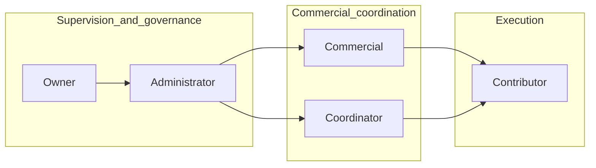

# Roles and business area responsibilities

This page is the **single place** to read how **internal roles** connect to **business areas**. It complements product permissions (see [Product permissions](#product-permissions) below).

## Legend

| Code | Meaning |
|------|---------|
| **S** | **Supervisory** accountability—direction, approval, escalation |
| **D** | **Do**—hands-on execution in that area |
| *(empty)* | Not a primary owner for that cell (may still contribute informally) |

**Investor** is an **external** stakeholder and does **not** appear in the matrix. See [Investor](#investor).

## Role hierarchy (summary)

## Responsibility matrix (template)

Cells are **examples only** until leadership assigns real **S** / **D** values. Replace dashes with `S` or `D` as you finalize ownership.

| Business area | Owner | Administrator | Commercial | Coordinator | Contributor |
|---------------|:-----:|:-------------:|:----------:|:-------------:|:-------------:|
| Strategy | S | S | — | D | D |
| Brand | S | D | D | D | D |
| Marketing | — | S | S | D | D |
| Sales | — | S | S | D | D |
| Product / Service | S | D | — | D | D |
| Operations | S | S | — | D | D |
| Customer | — | S | D | D | D |
| Management | S | S | D | D | — |

_Example pattern: **S** concentrates at Owner/Administrator for governance-heavy rows; **D** shows execution spread across Commercial, Coordinator, and Contributor depending on initiative._

## Investor

**Investor** represents **external capital** and strategic interest in the business. Investors are **not** part of day-to-day area ownership in this matrix. Engagement is governed by **board- or agreement-level** processes, not this ops repository.

## Product permissions

Failed jobs, audit logs, and **Owner-only** capabilities (for example migration-gated features) are defined in the **product application**, not in this Markdown repo. Link your internal **permissions specification** here when available:

- _(Stub)_ — add URL or path to the canonical product roles document.

---

## Related documents

- [Documentation home](../index.md)
- [Repository — roles stub](../repo/roles-and-areas.md)
- [Taxonomy](taxonomy.md)
